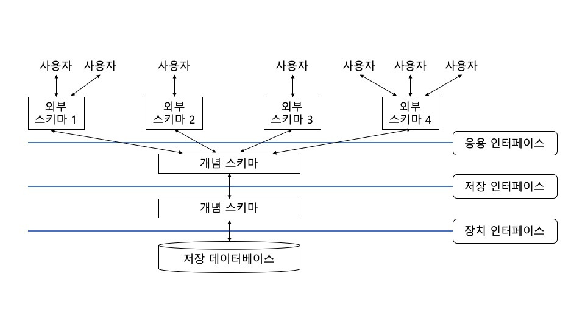
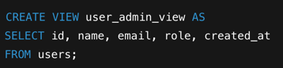
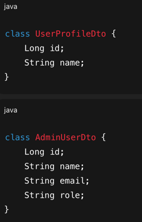
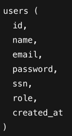

## 📌 트랜잭션

### DB-010
트랜잭션이 무엇이고, ACID 원칙에 대해 설명해 주세요.

### 트랜잭션
- DB의 상태를 변화시키는 하나의 논리적 작업 단위. 트랜잭션은 다음의 ACID 원칙을 만족해야 한다.

1. Atomicity(원자성)
- 트랜잭션 내 작업은 전부 성공하거나 전부 롤백되어야 함
- 일부만 반영되는 상태는 허용되지 않음
- Spring Boot 기준으로 @Transactional 미적용, 예외 처리 오류 시 발생 가능

2. Consistency(일관성)
- 트랜잭션 전후에 DB 제약 조건(무결성 규칙)은 항상 만족되어야 함
- ex)
    - 비즈니스 제약 조건 검증 로직 부재(포인트 차감 기능이 있을 경우 point 필드는 양수로 제한해야 함)
    - DB 제약 조건 위배(PK, FK 관련)

3. Isolation(격리성)
- 동시에 실행되는 트랜잭션은 서로 간섭하지 않아야 함
- 마치 순차적으로 실행된 것처럼 보이도록 보장
- ex)
    - 좌석 예약 서비스에서 동시에 두 요청이 같은 좌석 조회(동시성 문제) -> 두 요청 모두 commit 된다면 중복 예약 발생
    - 낙관적 락, 비관적 락, 격리 레벨 설정 등을 적절히 적용해야 함

4. Durability(지속성)
- 커밋된 트랜잭션의 결과는 시스템 장애가 발생해도 유지되어야 함

즉 트랜잭션은 데이터의 정확성과 신뢰성을 보장하기 위한 최소 작업 단위이며, ACID는 이를 보장하기 위한 속성이다.

---

### DB-011
ACID 원칙 중, Durability를 DBMS는 어떻게 보장하나요?

주로 Redo Log (Write-Ahead Logging)을 통해 보장한다.

메커니즘
1. 변경 내용을 메모리 버퍼에 먼저 반영
2. 동시에 변경 로그를 Redo Log에 기록
3. Redo Log가 디스크에 기록된 후에만 COMMIT 성공
4. 장애 발생 시 디스크에 남아 있는 Redo Log를 기반으로 변경 사항 재적용

-> 데이터보다 로그를 먼저 디스크에 기록한다(WAL, Write-Ahead Logging)
- 즉 데이터 파일은 깨져도 Redo Log만 있으면 복구 가능
- SSD, HDD 등 비휘발성 저장소에 로그를 기록

---

### DB-012
트랜잭션을 사용해 본 경험이 있나요? 어떤 경우에 사용할 수 있나요?

게임 타임라인 업데이트 관련 트랜잭션 흐름(게임 상태/점수/타임라인이 조금이라도 꼬이면 안 되는 핵심 도메인 로직)

1. 트랜잭션 시작
- @Transactional 이 붙은 타임라인 저장 로직 호출 시, 스프링이 트랜잭션 시작
2. 게임 로딩 + 잠금
- DB 에서 Game 조회하면서 비관적 잠금(SELECT ... FOR UPDATE) 걸림
- 같은 Game 을 만지는 다른 트랜잭션은 여기서 대기 또는 예외
3. 비즈니스 검증
- 게임 상태가 타임라인 등록 가능한지 확인, 아니면 예외 → 트랜잭션 롤백
4. 도메인 상태 변경 준비
- 게임/타임라인 관련 도메인 상태 변경 로직 실행 (점수, 시간, 상태 등)
5. 영속화
- save(timeline) → Timeline INSERT (또는 flush 시점에 반영)
- 여전히 같은 트랜잭션 안에서 처리됨
6. 정상 종료 시 커밋
- 메서드 끝까지 예외 없으면 스프링이 트랜잭션 커밋:
  - Timeline 저장, Game 등 변경된 엔티티 상태 flush, 잠금 해제
7. 예외 발생 시 롤백
- 위 과정 중 어느 단계에서든 예외 발생 → 스프링이 전체 트랜잭션 롤백:
  - Timeline 저장 취소, Game 상태 변경도 취소, DB는 호출 전 상태로 유지

---

### DB-013
읽기에는 트랜잭션을 걸지 않아도 될까요?

경우에 따라 다르지만, 정합성이 중요한 데이터의 경우 트랜잭션이 필요하다.

- 트랜잭션이 딱히 필요없는 경우
    - 단순 조회 로직
    - 정합성이 크게 중요하지 않은 통계성 조회
- 트랜잭션이 필요한 읽기
    - 읽은 값을 기반으로 비즈니스 로직을 수행하여 쓰기 연산이 들어가는 경우
    - 반복 읽기의 일관성이 중요한 경우
    - 동시성 이슈가 있는 경우

---

### DB-014
트랜잭션 격리 레벨에 대해 설명해 주세요.

### 격리 레벨(Isolation Level)
- 동시에 실행되는 트랜잭션 간 데이터 접근 허용 범위를 정의한다.

1. READ UNCOMMITTED
- 커밋되지 않은 데이터 읽기 가능
- Dirty Read 발생

2. READ COMMITTED
- 커밋된 데이터만 읽기 가능
- Non-repeatable Read 발생

3. REPEATABLE READ
- 같은 데이터를 여러 번 읽어도 동일
- Phantom Read 가능

4. SERIALIZABLE
- 가장 높은 격리 수준
- 트랜잭션을 순차 실행한 것처럼 동작
- 성능 저하 큼

---

### DB-015
모든 DBMS가 4개의 레벨을 모두 구현하고 있나요? 그렇지 않다면 그 이유는 무엇일까요?

보통 4가지 모두의 레벨을 모두 구현하고 있지는 않다.

이유
1. 성능과 구현 복잡도: SERIALIZABLE은 락 비용이 매우 큼
2. 스토리지 엔진 구조 차이
3. 실제 사용 패턴: 대부분의 서비스는 READ COMMITTED / REPEATABLE READ로 충분

---

### DB-016
만약 MySQL을 사용하고 있다면, (InnoDB 기준) Undo 영역과 Redo 영역에 대해 설명해 주세요.

1. Undo 영역
- 트랜잭션 수행 중, 변경되기 “이전 값”을 저장하는 공간
- Undo Log의 목적
  - 1) 트랜잭션 롤백(**Atomicity**)
    - 트랜잭션 실패 → Undo Log를 사용해 원래 값으로 되돌림
    - 일부 쿼리만 반영되는 상태 방지
  - 2) MVCC 기반 일관된 읽기(**Isolation**)
    - 다른 트랜잭션이 커밋하기 전의 데이터
    - 또는 과거 시점의 스냅샷 데이터를 제공
- 즉 Undo는 “과거의 데이터 버전”을 보관하는 역할

2. Redo 영역
- 트랜잭션에서 변경된 내용을 다시 적용하기 위한 로그 저장 공간
- Redo Log의 목적: Durability(지속성) 보장
  - 데이터 변경 발생 시 변경 내용을 Redo Log에 먼저 기록
  - 장애 발생 시 Redo Log를 기반으로 변경 내용을 재적용 가능
- 즉 Redo는 미래에 다시 복구할 변경 기록

| 구분   | Undo                 | Redo       |
| ---- | -------------------- | ---------- |
| 목적   | 롤백 / 읽기 일관성          | 장애 복구      |
| 기준   | 변경 전                 | 변경 후       |
| ACID | Atomicity, Isolation | Durability |

---

### DB-017
그런데, 스토리지 엔진이 정확히 무엇을 하는 건가요?

데이터를 실제로 어떻게 저장하고, 읽고, 락을 관리할지를 담당하는 DB 내부 모듈
-> DB의 “파일 시스템 + 동시성 제어 + 트랜잭션 구현체” 역할

주요 책임
- 데이터 저장 방식
- 인덱스 관리
- 트랜잭션 지원 여부
- 락/MVCC 처리
- 복구 로직

---

## 📌 View

### DB-035
View가 무엇이고, 언제 사용할 수 있나요?

View는 하나 이상의 테이블을 기반으로 정의된 **가상 테이블**이다.
 
실제 데이터를 저장하지 않고 미리 정의된 SELECT 쿼리의 결과를 테이블처럼 제공한다

`CREATE VIEW active_users AS
SELECT id, name
FROM users
WHERE status = 'ACTIVE';`
 
-> 이렇게 특정 조건으로 쿼리를 날리면 결과가 테이블의 형태로 뜨는데, 이게 'View'

언제 사용?
1. 복잡한 쿼리 단순화
- 자주 쓰는 JOIN / 조건을 View로 추상화
2. 보안 목적
- 특정 컬럼만 노출 (ex. 주민번호 제외)
3. 읽기 전용 데이터 제공
- 리포트, 통계용 조회
4. 논리적 계층 분리
- 애플리케이션은 View만 조회, 내부 테이블 구조 은닉

즉 View는 데이터를 저장하지 않고, 조회 로직을 재사용·추상화하기 위한 **가상 테이블**

---

### DB-036
그렇다면, View의 값을 수정해도 실제 테이블에는 반영되지 않나요?

경우에 따라 다름

1. 반영되는 경우
- 단일 테이블 기반
- 집계 함수 X
- DISTINCT, GROUP BY 없음
- 단순 컬럼 조회

`UPDATE active_users
SET name = 'Kim'
WHERE id = 1;`
 
-> 내부적으로 원본 테이블 UPDATE로 변환됨

2. 반영되지 않는 경우(수정 불가)
- JOIN 
- GROUP BY 
- COUNT, SUM 등 집계 함수 
- DISTINCT

이 경우에는 _ERROR: View is not updatable_ 발생

사실 대부분의 View는 읽기 전용이고, 수정 로직은 원본 테이블에서 처리하는 게 권장됨

---

## 📌 스키마 및 아키텍처

### DB-052
Schema가 무엇인가요?

Schema는 데이터베이스 구조에 대한 “논리적 정의”

스키마는 테이블 구조, 컬럼과 타입, 제약조건(PK, FK, UNIQUE 등), View/Index/Procedure 등을 가지고 있다

즉 스키마는 데이터가 어떤 구조와 규칙으로 저장되는지를 정의한 설계도

### DB-053
3계층에 대해 설명해 주세요.

DB의 3계층 구조(ANSI/SPARC 3-Level Architecture)는 데이터의 독립성을 보장하기 위한 구조

1. 외부 스키마(=역할별 View)

[일반 사용자용 View]

-> 일반 사용자는 email, password, ssn 등을 절대 볼 수 없음

[관리자용 View]

-> 관리자는 더 많은 정보 접근 가능

위 두 View는 서로 다른 외부 스키마

- 사용자나 응용 프로그래머가 각 개인의 입장에서 필요로 하는 데이터베이스의 논리적 구조를 정의한 것
- 전체 데이터베이스의 한 논리적인 부분으로 볼 수 있으므로 서브 스키마(Sub Schema)하고도 함
- 하나의 데이터베이스 관리 시스템에는 여러 개의 외부 스키마가 존재할 수 있으며, 하나의 외부 스키마는 여러 개의 응용 프로그램이나 사용자에 의해 공유될 수 있음
- 동일한 데이터베이스에 대해서 서로 다른 관점을 정의할 수 있도록 허용함
- ex) 관리자 View / 사용자 View

그러나 외부 스키마가 꼭 DB View만을 의미하지는 않음

- DB 구조는 동일하지만 애플리케이션 관점에서 보는 데이터의 모습은 다름
- 이것도 외부 스키마 개념에 해당한다고 볼 수 있음

2. 개념 스키마

- 개체 간의 관계와 제약 조건을 나타내고 데이터베이스의 접근 권한, 보안 정책 및 무결성 규정에 관한 명세를 정의한 것
- 데이터베이스의 전체적인 논리적 구조로서, 모든 응용 프로그램이나 사용자들이 필요로 하는 데이터를 통합한 조직 전체의 데이터베이스 명세로서 하나만 존재
- 단순히 스키마라고 하면 개념 스키마를 의미
- 기관이나 조직의 관점에서 데이터베이스를 정의한 것
- DB 당 하나만 존재

3. 내부 스키마
- 데이터베이스의 물리적 구조를 정의한 것
- 물리적 저장장치의 관점에서 본 전체 데이터베이스의 명세로서 하나만 존재
- 개념 스키마의 물리적 저장 구조에 대한 정의를 기술한 것
- 시스템 프로그래머나 시스템 설계자가 보는 관점의 스키마
- InnoDB가 MySQL에서 그 내부 스키마를 실제로 구현

이렇게 나누는 이유: 물리 구조가 변경될 때 애플리케이션 영향 최소화, View가 변경되어도 내부 테이블에 영향을 주지 않음
 
-> 즉 데이터의 독립성을 확보할 수 있는 것

---

## 📌 보안

### DB-059
SQL Injection에 대해 설명해 주세요.

SQL Injection은 사용자 입력값이 SQL 쿼리로 직접 실행되면서 발생하는 보안 취약점이다.

ex)
`SELECT * FROM users WHERE id = ' + userInput;`

`' OR 1=1 --`
-> 특정 조건을 넣어서 쿼리를 쏨

`SELECT * FROM users WHERE id = '' OR 1=1 --';`

-> 이런 식으로 날리면 데이터 전체 조회 가능
- 인증 우회
- 데이터 유출
- 데이터 삭제 가능

---

### DB-060
우리가 서버 개발 과정에서 사용하는 수많은 DB 라이브러리들은 이 문제를 어떻게 해결할까요?

대부분의 DB 라이브러리는 Prepared Statement를 사용해 입력값을 SQL이 아닌 데이터로 처리함으로써 SQL Injection을 방지

### Prepared Statement?
= SQL 문 구조와 사용자 입력값을 분리해서 실행하는 방식
= SQL은 미리 컴파일하고 값은 나중에 바인딩

`SELECT * FROM users WHERE id = ?`

`PreparedStatement ps = conn.prepareStatement(sql);
ps.setString(1, userInput);`

-> 입력값은 SQL 문법이 아닌 데이터로만 처리
-> 즉 입력값(`' OR 1=1 --`)이 조건이 아닌 단순 문자열 값으로 처리됨
-> `id = "' OR 1=1 --"` : 조건이 아닌 값 비교

 

성능적 장점
- SQL 파싱/컴파일 비용 절감 
- 동일 SQL 반복 실행 시 유리 
- DB 실행 계획 재사용 가능

 

실무에서 사용하는 방식
- JDBC: PreparedStatement
- JPA / Hibernate: JPQL, Criteria API, Named Parameter
  - `@Query("select u from User u where u.id = :id")`
