## 📌 정규화

### DB-031
Q. 정규화가 무엇인가요?

**정규화(Normalization)**는 데이터베이스 설계에서 중복을 최소화하고 데이터의 무결성을 보장하기 위해 테이블을 분해하는 과정.

**정의:**
- 관계형 데이터베이스 설계 기법
- 데이터 중복을 제거하고 일관성 유지
- 테이블을 논리적으로 분해하여 이상(Anomaly) 방지

**목적:**

1. **데이터 중복 제거**
   - 같은 정보를 여러 곳에 저장하지 않음
   - 저장 공간 절약
   - 데이터 일관성 유지

2. **데이터 무결성 보장**
   - 삽입, 수정, 삭제 시 발생하는 이상 현상 방지
   - 데이터의 정확성과 일관성 유지

3. **테이블 구조 최적화**
   - 논리적이고 체계적인 테이블 설계
   - 유지보수 용이

**정규화 단계:**

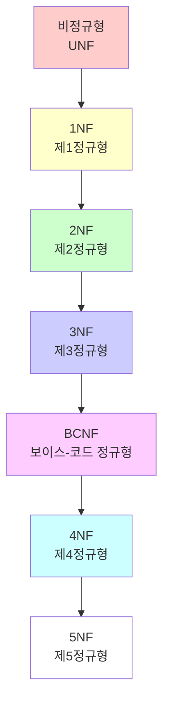

**정규화 원칙:**

1. **원자성 (Atomicity)**
   - 각 컬럼은 더 이상 나눌 수 없는 단위여야 함
   - 하나의 컬럼에 여러 값 저장 금지

2. **함수적 종속성 제거**
   - 부분 함수 종속성 제거 (2NF)
   - 이행 함수 종속성 제거 (3NF)

3. **다중 값 종속성 제거**
   - 하나의 속성에 여러 값이 종속되는 경우 분리 (4NF)

**정규화 예시:**

**비정규형 (UNF):**
```markdown
학생 테이블
| 학번 | 이름 | 과목1 | 과목2 | 과목3 |
|------|------|-------|-------|-------|
| 001  | 김철수 | 수학 | 영어 | 과학 |
```

**1NF (제1정규형):**
```markdown
학생 테이블
| 학번 | 이름 | 과목 |
|------|------|------|
| 001  | 김철수 | 수학 |
| 001  | 김철수 | 영어 |
| 001  | 김철수 | 과학 |
```

**정규화의 장점:**

1. **데이터 일관성**
   - 중복 제거로 데이터 불일치 방지
   - 수정 시 한 곳만 변경하면 됨

2. **저장 공간 절약**
   - 중복 데이터 제거
   - 효율적인 저장 공간 활용

3. **유지보수 용이**
   - 구조가 명확하고 체계적
   - 변경 사항 반영이 쉬움

**정규화의 단점:**

1. **성능 저하 가능성**
   - JOIN 연산이 많아질 수 있음
   - 쿼리 복잡도 증가

2. **과도한 정규화**
   - 너무 많은 테이블 분해
   - 실용성 저하

**결론:**
- **정규화**: 데이터 중복 제거와 무결성 보장을 위한 테이블 분해 과정
- **목적**: 데이터 일관성, 저장 공간 절약, 유지보수 용이
- **단계**: 1NF → 2NF → 3NF → BCNF → 4NF → 5NF
- **균형**: 정규화와 성능 사이의 균형 필요

### DB-032
Q. 정규화를 하지 않을 경우, 발생할 수 있는 이상현상에 대해 설명해 주세요.

**정규화를 하지 않으면 삽입 이상, 수정 이상, 삭제 이상이 발생할 수 있음.**

**이상 현상(Anomaly)의 정의:**
- 데이터베이스에서 데이터의 중복으로 인해 발생하는 문제
- 삽입, 수정, 삭제 시 예상치 못한 부작용 발생
- 데이터 무결성 훼손

**이상 현상의 종류:**

**1. 삽입 이상 (Insertion Anomaly)**

**의미:**
- 필요한 데이터를 삽입하기 위해 불필요한 데이터도 함께 삽입해야 하는 현상

**예시:**
```markdown
학생_과목 테이블 (비정규화)
| 학번 | 이름 | 학과 | 과목코드 | 과목명 | 성적 |
|------|------|------|----------|--------|------|
| 001  | 김철수 | 컴공 | CS101 | 데이터베이스 | A |
| 002  | 이영희 | 컴공 | CS101 | 데이터베이스 | B |
```

**문제 상황:**
- 새로운 학과(예: 전자공학과)를 추가하려면 학생 정보 없이는 불가능
- 학생이 없으면 학과 정보를 삽입할 수 없음

```sql
-- 삽입 이상: 학과만 추가하려면 학생 정보도 필요
INSERT INTO 학생_과목 (학번, 이름, 학과, 과목코드, 과목명, 성적)
VALUES (NULL, NULL, '전자공학과', NULL, NULL, NULL);  -- 불가능!
```

**2. 수정 이상 (Update Anomaly)**

**의미:**
- 데이터를 수정할 때 일부만 수정되어 데이터 불일치가 발생하는 현상

**예시:**
```
학생_과목 테이블
| 학번 | 이름 | 학과 | 과목코드 | 과목명 | 성적 |
|------|------|------|----------|--------|------|
| 001  | 김철수 | 컴공 | CS101 | 데이터베이스 | A |
| 001  | 김철수 | 컴공 | CS102 | 운영체제 | B |
| 002  | 이영희 | 컴공 | CS101 | 데이터베이스 | A |
```

**문제 상황:**
- 김철수의 학과를 "소프트웨어학과"로 변경하려면
- 모든 행을 수정해야 하며, 하나라도 빠지면 데이터 불일치 발생

```sql
-- 수정 이상: 모든 행을 수정해야 함
UPDATE 학생_과목 
SET 학과 = '소프트웨어학과' 
WHERE 학번 = '001';  -- 2개 행 모두 수정 필요

-- 만약 하나를 빠뜨리면?
-- | 001 | 김철수 | 컴공 | CS102 | 운영체제 | B |  ← 불일치!
```

**3. 삭제 이상 (Deletion Anomaly)**

**의미:**
- 데이터를 삭제할 때 의도하지 않은 다른 데이터도 함께 삭제되는 현상

**예시:**
```
학생_과목 테이블
| 학번 | 이름 | 학과 | 과목코드 | 과목명 | 성적 |
|------|------|------|----------|--------|------|
| 001  | 김철수 | 컴공 | CS101 | 데이터베이스 | A |
| 001  | 김철수 | 컴공 | CS102 | 운영체제 | B |
| 002  | 이영희 | 컴공 | CS101 | 데이터베이스 | A |
```

**문제 상황:**
- 김철수가 CS102 과목을 수강 취소하면
- 김철수의 다른 정보(학번, 이름, 학과)도 함께 삭제될 수 있음

```sql
-- 삭제 이상: 과목만 삭제하려 했지만 학생 정보도 삭제됨
DELETE FROM 학생_과목 
WHERE 학번 = '001' AND 과목코드 = 'CS102';

-- 결과: 김철수의 모든 정보가 삭제됨
-- 만약 CS101만 남아있다면 괜찮지만, 모든 과목을 취소하면?
-- 학생 정보 자체가 사라짐!
```

**실제 예시:**

**비정규화된 테이블:**
```sql
CREATE TABLE 주문_상세 (
    주문번호 INT,
    고객명 VARCHAR(50),
    고객주소 VARCHAR(100),
    상품코드 VARCHAR(20),
    상품명 VARCHAR(50),
    수량 INT,
    가격 INT
);
```

**삽입 이상:**
```sql
-- 새 고객을 등록하려면 주문 정보가 필요
-- 주문 없이는 고객 정보를 저장할 수 없음
```

**수정 이상:**
```sql
-- 고객 주소 변경 시 모든 주문 레코드 수정 필요
UPDATE 주문_상세 
SET 고객주소 = '서울시 강남구' 
WHERE 고객명 = '김철수';
-- 만약 일부만 수정하면 데이터 불일치
```

**삭제 이상:**
```sql
-- 마지막 주문을 삭제하면 고객 정보도 함께 삭제
DELETE FROM 주문_상세 
WHERE 주문번호 = 100;
-- 고객 정보가 사라질 수 있음
```

**정규화 후 해결:**

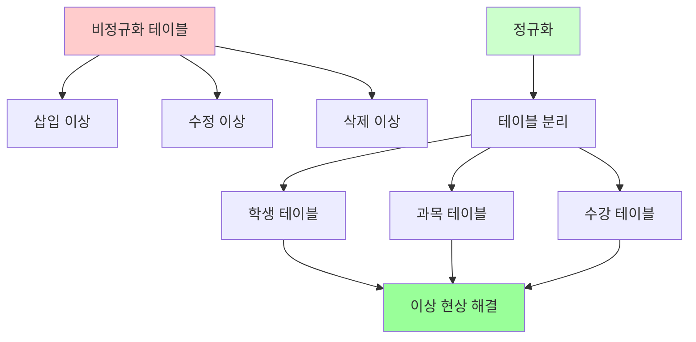

**정규화된 테이블:**
```
학생 테이블
| 학번 | 이름 | 학과 |
|------|------|------|
| 001  | 김철수 | 컴공 |
| 002  | 이영희 | 컴공 |

과목 테이블
| 과목코드 | 과목명 |
|----------|--------|
| CS101 | 데이터베이스 |
| CS102 | 운영체제 |

수강 테이블
| 학번 | 과목코드 | 성적 |
|------|----------|------|
| 001  | CS101 | A |
| 001  | CS102 | B |
| 002  | CS101 | A |
```

**이상 현상 해결:**

1. **삽입 이상 해결**
   - 학과만 추가: 과목 테이블에 독립적으로 추가 가능
   - 학생만 추가: 학생 테이블에 독립적으로 추가 가능

2. **수정 이상 해결**
   - 학생 정보 수정: 학생 테이블 한 곳만 수정
   - 과목 정보 수정: 과목 테이블 한 곳만 수정

3. **삭제 이상 해결**
   - 수강 취소: 수강 테이블에서만 삭제
   - 학생/과목 정보는 유지

**결론:**
- **삽입 이상**: 불필요한 데이터도 함께 삽입해야 하는 문제
- **수정 이상**: 일부만 수정되어 데이터 불일치 발생
- **삭제 이상**: 의도하지 않은 데이터도 함께 삭제
- **해결**: 정규화를 통해 테이블을 논리적으로 분리
- **목적**: 데이터 무결성 보장과 일관성 유지

### DB-033
Q. 각 정규화에 대해, 그 정규화가 진행되기 전/후의 테이블의 변화에 대해 설명해 주세요.

**각 정규화 단계마다 특정 종속성을 제거하여 테이블 구조를 개선.**

**정규화 단계별 변화:**

**1. 제1정규형 (1NF: First Normal Form)**

**조건:**
- 모든 속성의 값이 원자값(Atomic Value)이어야 함
- 하나의 컬럼에 여러 값이 저장되면 안 됨

**정규화 전:**
```
학생_과목 테이블
| 학번 | 이름 | 과목 |
|------|------|------|
| 001  | 김철수 | 수학, 영어, 과학 |
| 002  | 이영희 | 수학, 영어 |
```

**문제점:**
- 과목 컬럼에 여러 값이 저장됨
- 특정 과목만 조회하기 어려움
- 원자값이 아님

**정규화 후:**
```
학생_과목 테이블
| 학번 | 이름 | 과목 |
|------|------|------|
| 001  | 김철수 | 수학 |
| 001  | 김철수 | 영어 |
| 001  | 김철수 | 과학 |
| 002  | 이영희 | 수학 |
| 002  | 이영희 | 영어 |
```

**변화:**
- 하나의 행에 하나의 과목만 저장
- 모든 속성이 원자값
- 중복 행 발생 (정상)

**2. 제2정규형 (2NF: Second Normal Form)**

**조건:**
- 1NF를 만족
- 부분 함수 종속성 제거 (완전 함수 종속성만 허용)

**부분 함수 종속성:**
- 기본키의 일부에만 종속되는 속성

**정규화 전:**
```
수강 테이블
| 학번 | 과목코드 | 이름 | 학과 | 성적 |
|------|----------|------|------|------|
| 001  | CS101 | 김철수 | 컴공 | A |
| 001  | CS102 | 김철수 | 컴공 | B |
| 002  | CS101 | 이영희 | 컴공 | A |
```

**문제점:**
- 기본키: (학번, 과목코드)
- 이름, 학과는 학번에만 종속 (부분 종속)
- 성적은 (학번, 과목코드)에 종속 (완전 종속)

**정규화 후:**
```
학생 테이블
| 학번 | 이름 | 학과 |
|------|------|------|
| 001  | 김철수 | 컴공 |
| 002  | 이영희 | 컴공 |

수강 테이블
| 학번 | 과목코드 | 성적 |
|------|----------|------|
| 001  | CS101 | A |
| 001  | CS102 | B |
| 002  | CS101 | A |
```

**변화:**
- 학생 정보를 별도 테이블로 분리
- 부분 종속성 제거
- 완전 함수 종속성만 남음

**3. 제3정규형 (3NF: Third Normal Form)**

**조건:**
- 2NF를 만족
- 이행 함수 종속성 제거

**이행 함수 종속성:**
- A → B, B → C이면 A → C (이행 종속)
- 기본키가 아닌 속성에 종속되는 속성

**정규화 전:**
```
학생 테이블
| 학번 | 이름 | 학과코드 | 학과명 | 학과위치 |
|------|------|----------|--------|----------|
| 001  | 김철수 | CS | 컴공 | 공대 1호관 |
| 002  | 이영희 | CS | 컴공 | 공대 1호관 |
| 003  | 박민수 | EE | 전자공학 | 공대 2호관 |
```

**문제점:**
- 학번 → 학과코드 → 학과명, 학과위치 (이행 종속)
- 학과명, 학과위치는 학과코드에 종속
- 학과 정보 수정 시 여러 행 수정 필요

**정규화 후:**
```
학생 테이블
| 학번 | 이름 | 학과코드 |
|------|------|----------|
| 001  | 김철수 | CS |
| 002  | 이영희 | CS |
| 003  | 박민수 | EE |

학과 테이블
| 학과코드 | 학과명 | 학과위치 |
|----------|--------|----------|
| CS | 컴공 | 공대 1호관 |
| EE | 전자공학 | 공대 2호관 |
```

**변화:**
- 학과 정보를 별도 테이블로 분리
- 이행 종속성 제거
- 기본키가 아닌 속성 간 종속성 제거

**4. 보이스-코드 정규형 (BCNF: Boyce-Codd Normal Form)**

**조건:**
- 3NF를 만족
- 모든 결정자가 후보키여야 함

**결정자(Determinant):**
- 다른 속성의 값을 결정하는 속성

**정규화 전:**
```
수강 테이블
| 학번 | 과목코드 | 교수번호 | 성적 |
|------|----------|----------|------|
| 001  | CS101 | P001 | A |
| 002  | CS101 | P001 | B |
| 003  | CS102 | P002 | A |
```

**가정:**
- 한 교수는 한 과목만 담당
- 교수번호 → 과목코드 (결정자)
- 교수번호는 후보키가 아님

**문제점:**
- 교수번호가 결정자이지만 후보키가 아님
- 교수가 변경되면 여러 행 수정 필요

**정규화 후:**
```
수강 테이블
| 학번 | 교수번호 | 성적 |
|------|----------|------|
| 001  | P001 | A |
| 002  | P001 | B |
| 003  | P002 | A |

담당 테이블
| 교수번호 | 과목코드 |
|----------|----------|
| P001 | CS101 |
| P002 | CS102 |
```

**변화:**
- 교수-과목 관계를 별도 테이블로 분리
- 모든 결정자가 후보키가 되도록 구조 변경

**5. 제4정규형 (4NF: Fourth Normal Form)**

**조건:**
- BCNF를 만족
- 다중 값 종속성 제거

**다중 값 종속성:**
- 하나의 속성에 여러 독립적인 값이 종속

**정규화 전:**
```
학생_과목_취미 테이블
| 학번 | 과목코드 | 취미 |
|------|----------|------|
| 001  | CS101 | 독서 |
| 001  | CS101 | 영화 |
| 001  | CS102 | 독서 |
| 001  | CS102 | 영화 |
| 002  | CS101 | 음악 |
| 002  | CS101 | 운동 |
```

**문제점:**
- 과목과 취미는 독립적
- 과목코드와 취미 간 다중 값 종속
- 불필요한 조합 생성

**정규화 후:**
```
수강 테이블
| 학번 | 과목코드 |
|------|----------|
| 001  | CS101 |
| 001  | CS102 |
| 002  | CS101 |

취미 테이블
| 학번 | 취미 |
|------|------|
| 001  | 독서 |
| 001  | 영화 |
| 002  | 음악 |
| 002  | 운동 |
```

**변화:**
- 독립적인 다중 값 속성을 별도 테이블로 분리
- 불필요한 조합 제거
- 데이터 중복 감소

**정규화 과정 요약:**

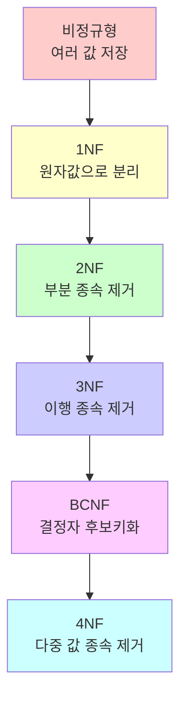

**정규화 전후 비교:**

| 정규화 단계 | 제거하는 종속성 | 테이블 변화 |
|------------|----------------|------------|
| **1NF** | 비원자값 | 행 분리 |
| **2NF** | 부분 함수 종속 | 기본키 일부 종속 속성 분리 |
| **3NF** | 이행 함수 종속 | 비기본키 종속 속성 분리 |
| **BCNF** | 결정자 비후보키 | 결정자-종속자 분리 |
| **4NF** | 다중 값 종속 | 독립적 다중 값 분리 |

**결론:**
- **1NF**: 비원자값을 원자값으로 분리 (행 분리)
- **2NF**: 부분 함수 종속성 제거 (기본키 일부 종속 분리)
- **3NF**: 이행 함수 종속성 제거 (비기본키 종속 분리)
- **BCNF**: 결정자가 후보키가 되도록 분리
- **4NF**: 다중 값 종속성 제거 (독립적 다중 값 분리)
- **목적**: 각 단계마다 특정 종속성 제거로 데이터 무결성 향상

### DB-034
Q. 정규화가 무조건 좋은가요? 그렇지 않다면, 어떤 상황에서 역정규화를 하는게 좋은지 설명해 주세요.

**정규화는 데이터 무결성에 좋지만, 성능 저하를 일으킬 수 있어 상황에 따라 역정규화가 필요.**

**정규화의 한계:**

1. **JOIN 연산 증가**
   - 테이블이 많아질수록 JOIN이 많아짐
   - 쿼리 복잡도 증가
   - 성능 저하 가능

2. **과도한 테이블 분해**
   - 너무 많은 테이블로 인한 복잡성
   - 실용성 저하

3. **읽기 성능 저하**
   - 자주 함께 조회되는 데이터가 분리됨
   - 여러 테이블 조인 필요

**역정규화(Denormalization)의 정의:**
- 정규화된 테이블을 의도적으로 비정규화하는 과정
- 성능 향상을 위해 데이터 중복을 허용
- 읽기 성능과 쓰기 성능의 트레이드오프

**역정규화를 고려하는 상황:**

**1. 읽기 성능이 중요한 경우**

**상황:**
- 읽기 작업이 쓰기 작업보다 훨씬 많음
- 자주 함께 조회되는 데이터

**예시:**
```
정규화된 구조:
주문 테이블 + 고객 테이블 + 상품 테이블

역정규화:
주문_상세 테이블 (고객명, 상품명 포함)
```

**장점:**
- JOIN 없이 한 번의 쿼리로 조회
- 읽기 성능 향상

**단점:**
- 고객명 변경 시 여러 행 수정 필요
- 데이터 중복

**2. 집계 쿼리가 많은 경우**

**상황:**
- SUM, COUNT, AVG 등의 집계 함수를 자주 사용
- 실시간 집계가 필요한 경우

**예시:**
```
정규화된 구조:
주문 테이블 (개별 주문)
→ 매번 SUM 계산 필요

역정규화:
주문_집계 테이블 (일별 총액 미리 계산)
```

**장점:**
- 집계 쿼리 성능 향상
- 실시간 집계 가능

**단점:**
- 집계 데이터 동기화 필요
- 추가 저장 공간

**3. 보고서 생성이 많은 경우**

**상황:**
- 복잡한 보고서를 자주 생성
- 여러 테이블을 조인하는 쿼리가 많음

**예시:**
```
정규화된 구조:
학생 + 과목 + 수강 + 성적 테이블
→ 4개 테이블 JOIN

역정규화:
성적표 테이블 (모든 정보 포함)
```

**장점:**
- 보고서 생성 속도 향상
- 쿼리 단순화

**단점:**
- 데이터 중복
- 업데이트 복잡도 증가

**4. 실시간 분석이 필요한 경우**

**상황:**
- OLAP (Online Analytical Processing)
- 데이터 웨어하우스
- 빅데이터 분석

**예시:**
```
정규화된 구조:
트랜잭션 테이블 (정규화)
→ 분석 쿼리 느림

역정규화:
분석용 스타 스키마 (비정규화)
→ 분석 쿼리 빠름
```

**5. 특정 컬럼 조회가 매우 빈번한 경우**

**상황:**
- 특정 컬럼을 자주 조회
- JOIN 비용이 큰 경우

**예시:**
```
정규화된 구조:
게시글 테이블 + 작성자 테이블
→ 작성자명 조회 시 JOIN 필요

역정규화:
게시글 테이블 (작성자명 포함)
→ JOIN 없이 조회
```

**역정규화 기법:**

**1. 컬럼 추가 (Column Addition)**
- 자주 조회되는 컬럼을 중복 저장

**예시:**
```
정규화:
주문 테이블 (고객ID만)
+ 고객 테이블 (고객명)

역정규화:
주문 테이블 (고객ID + 고객명)
```

**2. 테이블 통합 (Table Merging)**
- 자주 함께 조회되는 테이블 통합

**예시:**
```
정규화:
학생 테이블 + 학과 테이블

역정규화:
학생 테이블 (학과 정보 포함)
```

**3. 집계 테이블 생성 (Summary Table)**
- 집계 결과를 미리 계산하여 저장

**예시:**
```
정규화:
주문 테이블 (개별 주문)

역정규화:
일별_매출 테이블 (일별 집계)
월별_매출 테이블 (월별 집계)
```

**4. 중복 테이블 생성 (Duplicate Table)**
- 읽기 전용 복제본 생성

**예시:**
```
정규화:
주문 테이블 (쓰기용)

역정규화:
주문_읽기 테이블 (읽기용, 비정규화)
```

**역정규화 시 주의사항:**

**1. 데이터 일관성 유지**
- 중복 데이터 동기화 필요
- 트랜잭션으로 일관성 보장

**2. 업데이트 비용 증가**
- 여러 곳 수정 필요
- 성능 저하 가능

**3. 저장 공간 증가**
- 데이터 중복으로 인한 공간 사용

**4. 복잡도 증가**
- 애플리케이션 로직 복잡화
- 유지보수 어려움

**역정규화 결정 기준:**

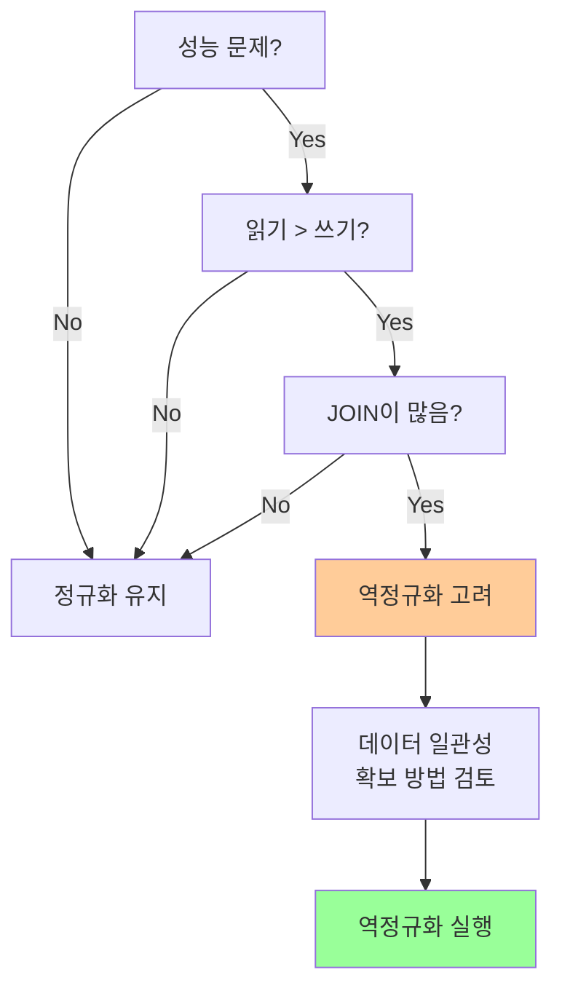

**실제 예시:**

**정규화된 구조:**
```sql
-- 주문 테이블
CREATE TABLE 주문 (
    주문번호 INT PRIMARY KEY,
    고객ID INT,
    주문일자 DATE
);

-- 고객 테이블
CREATE TABLE 고객 (
    고객ID INT PRIMARY KEY,
    고객명 VARCHAR(50),
    주소 VARCHAR(100)
);

-- 주문상세 테이블
CREATE TABLE 주문상세 (
    주문번호 INT,
    상품ID INT,
    수량 INT
);

-- 상품 테이블
CREATE TABLE 상품 (
    상품ID INT PRIMARY KEY,
    상품명 VARCHAR(50),
    가격 INT
);
```

**역정규화된 구조:**
```sql
-- 주문_통합 테이블 (읽기 성능 향상)
CREATE TABLE 주문_통합 (
    주문번호 INT PRIMARY KEY,
    고객ID INT,
    고객명 VARCHAR(50),  -- 역정규화
    주문일자 DATE,
    상품ID INT,
    상품명 VARCHAR(50),  -- 역정규화
    수량 INT,
    가격 INT  -- 역정규화
);

-- 일별_매출 테이블 (집계 성능 향상)
CREATE TABLE 일별_매출 (
    일자 DATE PRIMARY KEY,
    총주문수 INT,
    총매출액 INT
);
```

**결론:**
- **정규화 장점**: 데이터 무결성, 일관성, 저장 공간 효율
- **정규화 단점**: JOIN 증가, 읽기 성능 저하 가능
- **역정규화 적합 상황**: 읽기 성능 중요, 집계 쿼리 많음, 보고서 생성, 실시간 분석
- **역정규화 기법**: 컬럼 추가, 테이블 통합, 집계 테이블, 중복 테이블
- **주의사항**: 데이터 일관성 유지, 업데이트 비용, 저장 공간, 복잡도
- **원칙**: 성능과 데이터 무결성의 균형 고려

---

## 📌 B-Tree / B+Tree

### DB-042
Q. B-Tree와 B+Tree에 대해 설명해 주세요.

**B-Tree와 B+Tree는 데이터베이스 인덱스에서 널리 사용되는 균형 잡힌 트리 자료구조.**

**B-Tree (Balanced Tree)의 정의:**
- 균형 잡힌 다진 검색 트리
- 디스크 I/O를 최소화하기 위한 자료구조
- 모든 리프 노드가 같은 레벨에 위치

**B-Tree의 특징:**

1. **균형 트리**
   - 모든 리프 노드가 같은 깊이
   - 검색 시간이 일정 (O(log n))

2. **다수의 자식 노드**
   - 각 노드는 여러 개의 키와 자식 포인터를 가짐
   - 노드 크기 = 디스크 페이지 크기

3. **정렬된 키**
   - 각 노드의 키는 정렬되어 있음
   - 왼쪽 서브트리 < 키 < 오른쪽 서브트리

**B-Tree 구조:**

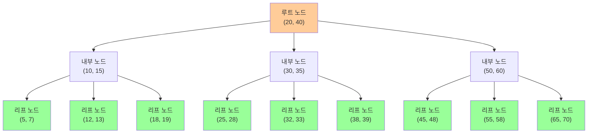

**B-Tree의 속성:**

1. **차수 (Order)**
   - 최대 자식 노드 수: m
   - 최소 자식 노드 수: ⌈m/2⌉ (루트 제외)

2. **키의 개수**
   - 최대 키 개수: m-1
   - 최소 키 개수: ⌈m/2⌉ - 1 (루트 제외)

3. **노드 구조**
   - 키 값들: K₁, K₂, ..., Kₙ
   - 자식 포인터들: P₀, P₁, ..., Pₙ
   - 데이터 포인터 (리프 노드에만)

**B+Tree의 정의:**
- B-Tree의 변형
- 모든 데이터가 리프 노드에만 저장
- 내부 노드는 인덱스 역할만 수행

**B+Tree의 특징:**

1. **리프 노드에만 데이터**
   - 모든 실제 데이터는 리프 노드에 저장
   - 내부 노드는 검색을 위한 키만 저장

2. **리프 노드 연결**
   - 리프 노드들이 연결 리스트로 연결
   - 순차 검색(범위 검색)에 유리

3. **더 많은 키 저장**
   - 내부 노드에 데이터 포인터가 없어 더 많은 키 저장 가능
   - 트리 높이 감소

**B+Tree 구조:**

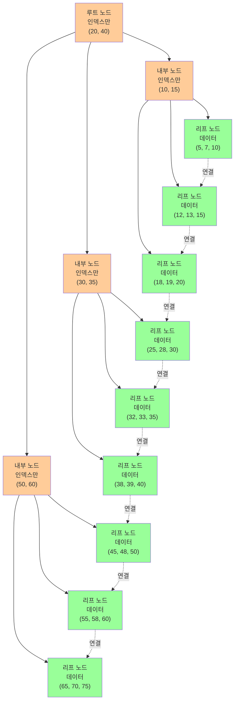

**B-Tree vs B+Tree 비교:**

| 특징 | B-Tree | B+Tree |
|------|--------|--------|
| **데이터 저장 위치** | 모든 노드 | 리프 노드만 |
| **내부 노드** | 키 + 데이터 포인터 | 키만 |
| **리프 노드 연결** | 없음 | 연결 리스트 |
| **트리 높이** | 상대적으로 높음 | 상대적으로 낮음 |
| **범위 검색** | 비효율적 | 효율적 |
| **순차 검색** | 비효율적 | 효율적 |
| **메모리 사용** | 상대적으로 많음 | 상대적으로 적음 |

**B-Tree의 장단점:**

**장점:**
- 모든 노드에서 데이터 접근 가능
- 특정 키 검색 시 빠름

**단점:**
- 범위 검색 비효율적
- 순차 검색 비효율적
- 내부 노드에도 데이터 포인터 필요

**B+Tree의 장단점:**

**장점:**
- 범위 검색 효율적 (리프 노드 연결)
- 순차 검색 효율적
- 트리 높이 낮음 (더 많은 키 저장)
- 디스크 I/O 감소

**단점:**
- 모든 검색이 리프 노드까지 도달해야 함
- 내부 노드에서 데이터 접근 불가

**데이터베이스에서의 사용:**

**B-Tree 사용:**
- 일부 데이터베이스 (예: MongoDB의 일부 인덱스)
- 특정 키 검색이 주된 경우

**B+Tree 사용:**
- 대부분의 RDBMS (MySQL, PostgreSQL, Oracle 등)
- 범위 검색이 많은 경우
- 순차 검색이 필요한 경우

**실제 사용 예시:**

**B-Tree 검색:**
```
키 25 검색:
1. 루트 노드: 25 < 40 → 왼쪽
2. 내부 노드: 25 > 20 → 오른쪽
3. 리프 노드: 25 발견 → 데이터 반환
```

**B+Tree 검색:**
```
키 25 검색:
1. 루트 노드: 25 < 40 → 왼쪽
2. 내부 노드: 25 > 20 → 오른쪽
3. 리프 노드: 25 발견 → 데이터 반환
```

**B+Tree 범위 검색:**
```
범위 25~35 검색:
1. 키 25 찾기 (리프 노드 도달)
2. 리프 노드 연결 리스트 따라가기
3. 25, 28, 30, 32, 33, 35 반환
→ 매우 효율적!
```

**결론:**
- **B-Tree**: 균형 잡힌 다진 검색 트리, 모든 노드에 데이터 저장
- **B+Tree**: B-Tree 변형, 리프 노드에만 데이터, 리프 노드 연결
- **B+Tree 장점**: 범위 검색 효율, 순차 검색 효율, 트리 높이 낮음
- **사용**: 대부분의 RDBMS에서 B+Tree 사용
- **목적**: 디스크 I/O 최소화, 검색 성능 향상

### DB-043
Q. 그렇다면, B+Tree가 B-Tree에 비해 반드시 좋다고 할 수 있을까요? 그렇지 않다면 어떤 단점이 있을까요?

**B+Tree가 항상 좋은 것은 아님. 상황에 따라 B-Tree가 더 적합할 수 있음.**

**B+Tree의 단점:**

**1. 모든 검색이 리프 노드까지 도달**

**문제점:**
- 내부 노드에서 데이터 접근 불가
- 항상 리프 노드까지 탐색해야 함
- 트리 높이만큼의 디스크 I/O 필요

**B-Tree와 비교:**
```
B-Tree: 키를 찾으면 바로 데이터 접근 가능
B+Tree: 키를 찾아도 리프 노드까지 가야 함
```

**예시:**
```
B-Tree에서 키 20 검색:
루트 노드 [20, 40] → 키 20 발견 → 바로 데이터 접근
→ 1번의 디스크 I/O

B+Tree에서 키 20 검색:
루트 노드 [20, 40] → 내부 노드 → 리프 노드 → 데이터 접근
→ 3번의 디스크 I/O (트리 높이에 따라)
```

**2. 메모리 사용량 증가 가능**

**문제점:**
- 리프 노드 연결을 위한 포인터 추가
- 많은 리프 노드가 있을 경우 메모리 사용 증가

**3. 삽입/삭제 시 오버헤드**

**문제점:**
- 리프 노드 연결 리스트 유지 필요
- 노드 분할/병합 시 연결 리스트 업데이트
- B-Tree보다 복잡한 연산

**4. 특정 키 검색 시 성능**

**상황:**
- 범위 검색이 거의 없는 경우
- 특정 키만 자주 검색하는 경우

**비교:**
```
B-Tree: 내부 노드에서 데이터 접근 가능 → 빠름
B+Tree: 리프 노드까지 가야 함 → 상대적으로 느림
```

**B-Tree가 더 적합한 경우:**

**1. 특정 키 검색이 주된 경우**

**상황:**
- 범위 검색이 거의 없음
- 특정 키만 자주 조회

**예시:**
```
사용자 ID로만 검색하는 경우
→ B-Tree가 더 빠를 수 있음
```

**2. 메모리 제약이 있는 경우**

**상황:**
- 메모리가 매우 제한적
- 리프 노드 연결 포인터가 부담

**3. 내부 노드에서 데이터 접근이 필요한 경우**

**상황:**
- 내부 노드의 데이터도 자주 접근
- B+Tree는 불가능

**B+Tree가 더 적합한 경우:**

**1. 범위 검색이 많은 경우**

**상황:**
- WHERE column BETWEEN A AND B
- WHERE column > A
- WHERE column < B

**예시:**
```
날짜 범위로 주문 조회
가격 범위로 상품 조회
→ B+Tree가 훨씬 효율적
```

**2. 순차 검색이 필요한 경우**

**상황:**
- ORDER BY
- 순차적으로 데이터 읽기

**예시:**
```
SELECT * FROM orders ORDER BY order_date
→ B+Tree 리프 노드 연결 리스트 활용
```

**3. 대용량 데이터**

**상황:**
- 데이터가 매우 많음
- 트리 높이를 낮추는 것이 중요

**이유:**
- B+Tree는 내부 노드에 더 많은 키 저장 가능
- 트리 높이 감소
- 디스크 I/O 감소

**성능 비교:**

**특정 키 검색:**
```
B-Tree: O(log n) - 내부 노드에서 종료 가능
B+Tree: O(log n) - 항상 리프 노드까지
→ B-Tree가 약간 빠를 수 있음
```

**범위 검색:**
```
B-Tree: O(log n + k) - 여러 노드 탐색 필요
B+Tree: O(log n + k) - 리프 노드 연결 리스트 활용
→ B+Tree가 훨씬 효율적
```

**순차 검색:**
```
B-Tree: 비효율적 - 랜덤 접근
B+Tree: 효율적 - 순차 접근
→ B+Tree가 압도적으로 빠름
```

**실제 데이터베이스에서의 선택:**

**MySQL (InnoDB):**
- B+Tree 사용
- 이유: 범위 검색, 순차 검색이 많음
- 클러스터 인덱스로 사용

**MongoDB:**
- B-Tree도 사용 (일부 인덱스)
- 상황에 따라 선택

**PostgreSQL:**
- B+Tree 사용
- 범위 검색 최적화

**트레이드오프:**

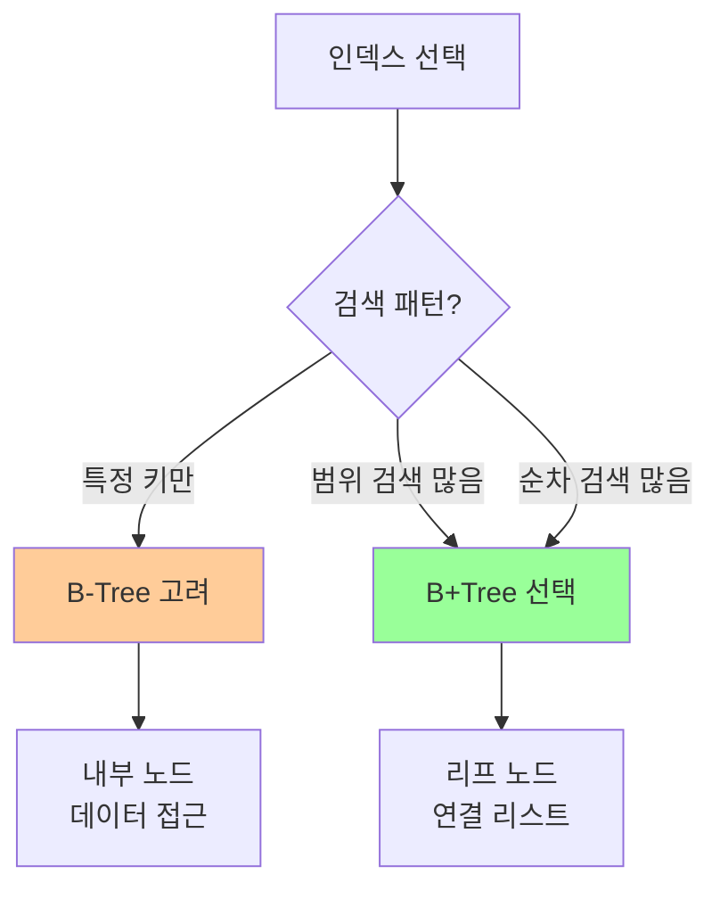

**결론:**
- **B+Tree 단점**: 모든 검색이 리프 노드까지, 메모리 사용 증가, 삽입/삭제 오버헤드
- **B-Tree 적합**: 특정 키 검색 주된 경우, 메모리 제약, 내부 노드 데이터 접근 필요
- **B+Tree 적합**: 범위 검색 많음, 순차 검색 필요, 대용량 데이터
- **선택 기준**: 검색 패턴, 데이터 크기, 메모리 제약 고려
- **일반적 선택**: 대부분의 RDBMS에서 B+Tree 사용 (범위 검색이 많기 때문)

### DB-044
Q. DB에서 RBT를 사용하지 않고, B-Tree/B+Tree를 사용하는 이유가 있을까요?

**RBT(Red-Black Tree)는 메모리 기반 자료구조이고, B-Tree/B+Tree는 디스크 기반 최적화 자료구조.**

**RBT (Red-Black Tree)의 특징:**

1. **이진 트리**
   - 각 노드가 최대 2개의 자식
   - 노드당 키 1개

2. **메모리 최적화**
   - 메모리에서 빠른 검색
   - 캐시 친화적

3. **균형 트리**
   - 높이: O(log n)
   - 자가 균형 트리

**B-Tree/B+Tree의 특징:**

1. **다진 트리**
   - 각 노드가 여러 개의 자식
   - 노드당 여러 키 저장

2. **디스크 최적화**
   - 디스크 페이지 크기에 맞춤
   - 디스크 I/O 최소화

3. **균형 트리**
   - 높이: O(log n) (밑이 큰 로그)
   - 더 낮은 높이

**주요 차이점:**

**1. 디스크 I/O 최적화**

**RBT의 문제:**
- 노드당 키 1개
- 트리 높이가 높음
- 많은 디스크 I/O 필요

**예시:**
```
100만 개 데이터:
RBT 높이: 약 20
→ 20번의 디스크 I/O 필요

B+Tree 높이: 약 3-4 (차수 100 가정)
→ 3-4번의 디스크 I/O
```

**B-Tree/B+Tree의 장점:**
- 노드당 여러 키 저장
- 디스크 페이지 크기(보통 4KB~16KB)에 맞춤
- 한 번의 디스크 I/O로 여러 키 처리

**2. 노드 크기와 디스크 페이지**

**디스크 접근 특성:**
- 디스크는 블록 단위로 읽음
- 한 번 읽을 때 전체 페이지 읽음
- 페이지 크기: 보통 4KB~16KB

**RBT:**
```
노드 크기: 작음 (키 + 포인터 2개)
디스크 페이지: 4KB
→ 페이지당 적은 수의 노드만 저장
→ 많은 페이지 읽기 필요
```

**B-Tree/B+Tree:**
```
노드 크기: 큼 (여러 키 + 여러 포인터)
디스크 페이지: 4KB
→ 페이지당 많은 키 저장
→ 적은 페이지 읽기
```

**예시:**
```
4KB 페이지, 키 8바이트, 포인터 8바이트:

RBT 노드: 8 + 8*2 = 24바이트
→ 페이지당 약 170개 노드
→ 100만 개 데이터: 높이 20

B+Tree 노드 (차수 100):
→ 페이지당 약 100개 키
→ 100만 개 데이터: 높이 3-4
```

**3. 순차 접근 패턴**

**디스크 접근 특성:**
- 순차 읽기가 랜덤 읽기보다 훨씬 빠름
- 연속된 페이지 읽기가 효율적

**RBT:**
- 이진 트리 구조
- 메모리 주소가 연속적이지 않음
- 랜덤 접근 패턴

**B+Tree:**
- 리프 노드가 연결 리스트
- 순차 접근에 유리
- 범위 검색 효율적

**4. 캐시 효율성**

**메모리 (RBT):**
- 캐시 라인 크기: 64바이트
- 작은 노드가 캐시 친화적
- 빠른 메모리 접근

**디스크 (B-Tree/B+Tree):**
- 페이지 크기: 4KB~16KB
- 큰 노드가 페이지 효율적
- 디스크 I/O 최소화

**성능 비교:**

**검색 성능 (100만 개 데이터):**

| 자료구조 | 높이 | 디스크 I/O | 메모리 I/O |
|---------|------|-----------|-----------|
| **RBT** | ~20 | 많음 | 적음 |
| **B+Tree** | ~3-4 | 적음 | 많음 |

**범위 검색:**

| 자료구조 | 접근 패턴 | 성능 |
|---------|----------|------|
| **RBT** | 랜덤 접근 | 느림 |
| **B+Tree** | 순차 접근 | 빠름 |

**실제 사용:**

**RBT 사용:**
- Java TreeMap, TreeSet
- C++ std::map, std::set
- 메모리 기반 자료구조

**B-Tree/B+Tree 사용:**
- MySQL, PostgreSQL, Oracle
- 대부분의 RDBMS
- 디스크 기반 데이터베이스

**시각적 비교:**

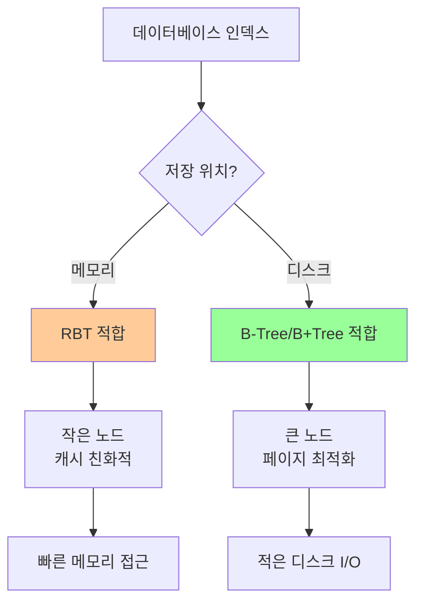

**수치 예시:**

**100만 개 데이터, 키 8바이트:**

**RBT:**
- 노드 크기: 24바이트
- 높이: 약 20
- 디스크 I/O: 20번
- 메모리 사용: 효율적

**B+Tree (차수 100):**
- 노드 크기: 약 800바이트
- 높이: 약 3-4
- 디스크 I/O: 3-4번
- 메모리 사용: 더 많음

**결론:**
- **RBT**: 메모리 최적화, 이진 트리, 캐시 친화적, 높은 트리
- **B-Tree/B+Tree**: 디스크 최적화, 다진 트리, 페이지 최적화, 낮은 트리
- **주요 차이**: 디스크 I/O 최소화, 노드 크기 최적화, 순차 접근
- **선택 기준**: 저장 위치 (메모리 vs 디스크)
- **데이터베이스**: 디스크 기반이므로 B-Tree/B+Tree 사용
- **이유**: 디스크 I/O가 병목이므로 이를 최소화하는 것이 중요

### DB-045
Q. 오름차순으로 정렬된 인덱스가 있다고 할 때, 내림차순 정렬을 시도할 경우 성능이 어떻게 될까요? B-Tree/B+Tree의 구조를 기반으로 설명해 주세요.

**오름차순 인덱스에서 내림차순 정렬은 추가 비용이 발생하지만, B+Tree의 리프 노드 연결을 활용하면 효율적으로 처리 가능.**

**B-Tree/B+Tree의 정렬 구조:**

**오름차순 인덱스:**
- 키가 작은 값부터 큰 값 순서로 저장
- 리프 노드: 왼쪽 → 오른쪽 순서

**B+Tree 구조 (오름차순):**
```
리프 노드 연결:
[5, 7, 10] → [12, 13, 15] → [18, 19, 20] → [25, 28, 30] → ...
  ↑ 작은 값                                    ↑ 큰 값
```

**내림차순 정렬 쿼리:**

**예시:**
```sql
-- 오름차순 인덱스 (id)
SELECT * FROM users ORDER BY id DESC;
```

**성능 분석:**

**1. B-Tree의 경우:**

**문제점:**
- 리프 노드가 연결되어 있지 않음
- 내림차순으로 가려면 역방향 탐색 필요
- 비효율적

**동작 과정:**
```
1. 가장 큰 키 찾기 (오른쪽 끝)
2. 역방향으로 순회
3. 각 노드에서 역방향 탐색
→ 비효율적
```

**2. B+Tree의 경우:**

**장점:**
- 리프 노드가 양방향 연결 리스트
- 역방향 순회 가능
- 상대적으로 효율적

**동작 과정:**
```
1. 가장 큰 키 찾기 (리프 노드 오른쪽 끝)
2. 리프 노드 연결 리스트를 역방향으로 순회
3. 각 리프 노드 내에서 역방향 읽기
→ 효율적
```

**성능 비교:**

**오름차순 정렬 (인덱스와 동일):**
```
B+Tree:
1. 가장 작은 키 찾기 (O(log n))
2. 리프 노드 연결 리스트 순차 읽기 (O(k))
→ 매우 효율적
```

**내림차순 정렬 (인덱스와 반대):**
```
B+Tree:
1. 가장 큰 키 찾기 (O(log n))
2. 리프 노드 연결 리스트 역방향 읽기 (O(k))
→ 효율적 (양방향 연결)
```

**B-Tree (리프 노드 연결 없음):**
```
1. 가장 큰 키 찾기 (O(log n))
2. 역방향 순회 (비효율적)
→ 상대적으로 비효율적
```

**실제 구현:**

**양방향 연결 리스트:**
```
리프 노드 구조:
[prev_ptr | keys | data | next_ptr]
   ↑                              ↑
이전 노드                    다음 노드
```

**역방향 순회:**
```
1. 루트 → 가장 큰 키 경로 탐색
2. 리프 노드 도달
3. prev_ptr 따라 역방향 이동
4. 각 노드 내에서 역방향 읽기
```

**성능 영향:**

**1. 인덱스 스캔 vs 정렬:**

**인덱스 스캔 (Index Scan):**
```
오름차순: 매우 빠름 (순차 읽기)
내림차순: 빠름 (역방향 순차 읽기)
```

**정렬 (Sort):**
```
인덱스 없이 ORDER BY: 느림 (전체 정렬 필요)
→ Filesort 사용
```

**2. 쿼리 실행 계획:**

**오름차순 정렬:**
```sql
EXPLAIN SELECT * FROM users ORDER BY id ASC;
-- Using index (인덱스 활용)
```

**내림차순 정렬:**
```sql
EXPLAIN SELECT * FROM users ORDER BY id DESC;
-- Using index; Backward index scan (역방향 인덱스 스캔)
```

**3. 성능 차이:**

**오름차순 vs 내림차순:**
- 오름차순: 약간 더 빠름 (정방향)
- 내림차순: 약간 느림 (역방향, 하지만 여전히 효율적)

**인덱스 없이 정렬:**
- 매우 느림 (전체 정렬 필요)
- Filesort 사용
- 메모리/디스크 정렬

**최적화 방법:**

**1. 내림차순 인덱스 생성:**
```sql
CREATE INDEX idx_id_desc ON users(id DESC);
```

**장점:**
- 내림차순 정렬 시 정방향 스캔
- 최적 성능

**단점:**
- 추가 인덱스 저장 공간
- 유지보수 비용

**2. 복합 인덱스 활용:**
```sql
-- (col1 ASC, col2 DESC)
CREATE INDEX idx_composite ON table(col1, col2 DESC);
```

**시각적 비교:**

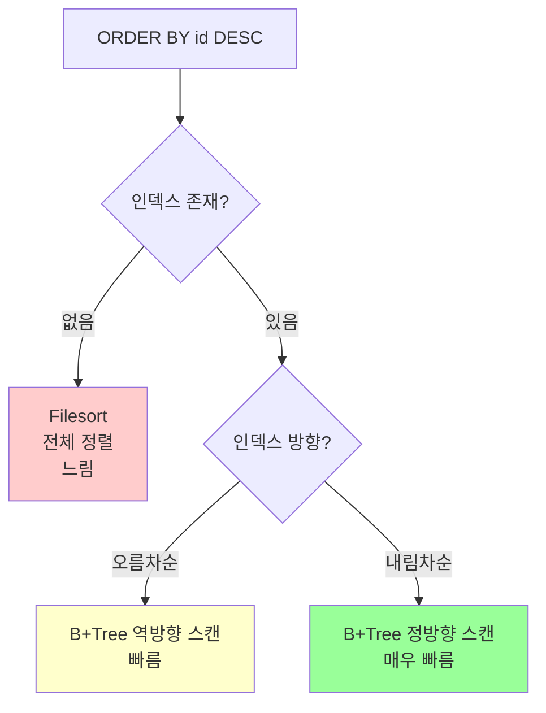

**실제 성능 측정:**

**테스트 환경:**
- 100만 개 레코드
- 오름차순 인덱스 (id)

**결과:**
```
ORDER BY id ASC:  ~0.1초 (인덱스 정방향 스캔)
ORDER BY id DESC: ~0.15초 (인덱스 역방향 스캔)
ORDER BY name DESC: ~5초 (인덱스 없음, Filesort)
```

**결론:**
- **오름차순 인덱스 + 내림차순 정렬**: B+Tree 역방향 스캔으로 효율적 처리
- **B+Tree 장점**: 양방향 연결 리스트로 역방향 순회 가능
- **성능**: 오름차순보다 약간 느리지만 여전히 효율적
- **인덱스 없이 정렬**: 매우 느림 (Filesort 필요)
- **최적화**: 내림차순 인덱스 생성 가능 (추가 공간 필요)
- **권장**: 대부분의 경우 오름차순 인덱스로도 충분 (역방향 스캔 지원)

---

## 📌 Lock 및 동시성 제어

### DB-046
Q. 트랜잭션 상황에서의 Deadlock 상황과, 이를 해결하기 위한 방법에 대해 설명해 주세요.

**Deadlock(교착 상태)은 두 개 이상의 트랜잭션이 서로의 Lock 해제를 기다리며 무한 대기하는 상황.**

**Deadlock의 정의:**
- 두 개 이상의 트랜잭션이 서로가 가진 리소스의 Lock 해제를 기다리는 상태
- 순환 대기(Circular Wait) 상태
- 외부 개입 없이는 해결 불가능

**Deadlock 발생 조건:**

1. **상호 배제 (Mutual Exclusion)**
   - 리소스가 한 번에 하나의 트랜잭션만 사용 가능

2. **점유 대기 (Hold and Wait)**
   - 트랜잭션이 리소스를 보유한 채 다른 리소스 대기

3. **비선점 (No Preemption)**
   - 다른 트랜잭션이 리소스를 강제로 빼앗을 수 없음

4. **순환 대기 (Circular Wait)**
   - 트랜잭션들이 순환적으로 서로의 리소스 대기

**Deadlock 발생 예시:**

**시나리오:**
```
트랜잭션 A: 계좌1 → 계좌2로 이체
트랜잭션 B: 계좌2 → 계좌1로 이체
```

**타임라인:**
```
시간 | 트랜잭션 A | 트랜잭션 B
-----|-----------|-----------
T1   | 계좌1 Lock | 
T2   |           | 계좌2 Lock
T3   | 계좌2 Lock 대기 | 
T4   |           | 계좌1 Lock 대기
T5   | Deadlock! | Deadlock!
```

**시각적 표현:**

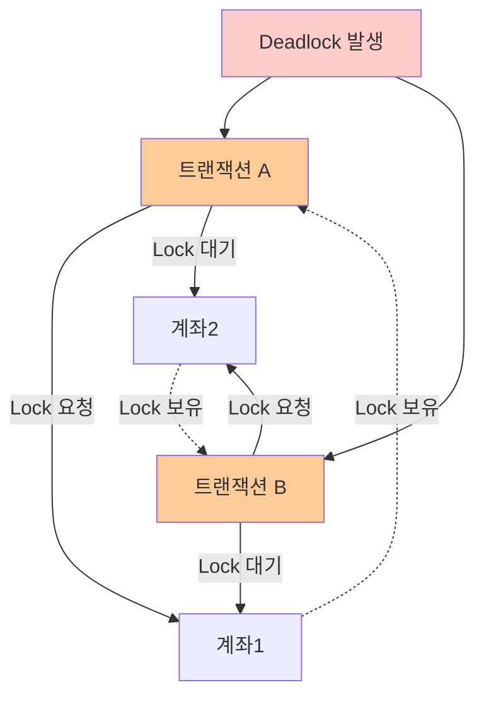

**Deadlock 감지:**

**1. 타임아웃 기반:**
- Lock 대기 시간이 임계값 초과 시 Deadlock으로 간주
- 간단하지만 오탐 가능

**2. 그래프 기반:**
- 대기 그래프(Waits-for Graph) 구성
- 순환이 있으면 Deadlock

**대기 그래프:**
```
트랜잭션 A → 계좌2 (트랜잭션 B가 보유)
트랜잭션 B → 계좌1 (트랜잭션 A가 보유)
→ 순환 발생 = Deadlock
```

**Deadlock 해결 방법:**

**1. 예방 (Prevention)**

**원칙:**
- Deadlock 발생 조건 중 하나를 제거

**방법:**

**a) 순환 대기 제거:**
- 리소스에 순서 부여
- 모든 트랜잭션이 같은 순서로 Lock 획득

**예시:**
```
계좌 ID 순서로 Lock:
트랜잭션 A: 계좌1 → 계좌2 (ID 작은 순)
트랜잭션 B: 계좌1 → 계좌2 (ID 작은 순)
→ 순환 대기 없음
```

**b) 점유 대기 제거:**
- 필요한 모든 리소스를 한 번에 Lock
- 일부만 Lock 불가

**단점:**
- 동시성 저하
- 리소스 낭비

**c) 비선점 제거:**
- 다른 트랜잭션이 리소스 선점 가능
- 복잡하고 데이터 무결성 문제

**2. 회피 (Avoidance)**

**원칙:**
- 리소스 할당 전에 Deadlock 가능성 검사
- 안전한 경우만 할당

**방법:**
- Banker's Algorithm
- 복잡하고 오버헤드 큼

**3. 감지 및 회복 (Detection and Recovery)**

**원칙:**
- 주기적으로 Deadlock 감지
- 발생 시 하나의 트랜잭션 롤백

**방법:**

**a) Deadlock 감지:**
- 대기 그래프 주기적 검사
- 순환 발견 시 Deadlock

**b) Victim 선택:**
- Deadlock에 연관된 트랜잭션 중 하나 선택
- 선택 기준: 롤백 비용이 적은 것

**선택 기준:**
- 가장 적은 작업 수행
- 가장 적은 리소스 보유
- 우선순위 낮은 트랜잭션

**c) 롤백 및 재시작:**
- 선택된 트랜잭션 롤백
- Lock 해제
- 나중에 재시작

**실제 데이터베이스에서의 처리:**

**MySQL (InnoDB):**
- Deadlock 감지 활성화 (기본값)
- 감지 시 자동으로 하나의 트랜잭션 롤백
- 에러 반환: `ERROR 1213 (40001): Deadlock found`

**PostgreSQL:**
- Deadlock 감지 활성화
- `deadlock_timeout` 설정
- 자동 롤백

**Oracle:**
- Deadlock 감지 활성화
- 자동으로 하나의 트랜잭션 롤백

**애플리케이션 레벨 해결:**

**1. Lock 순서 통일:**
```java
// 항상 ID 순서로 Lock
if (account1.getId() < account2.getId()) {
    lock(account1);
    lock(account2);
} else {
    lock(account2);
    lock(account1);
}
```

**2. 타임아웃 설정:**
```java
// Lock 대기 시간 제한
if (!lock.tryLock(5, TimeUnit.SECONDS)) {
    throw new TimeoutException();
}
```

**3. 재시도 로직:**
```java
int maxRetries = 3;
for (int i = 0; i < maxRetries; i++) {
    try {
        transfer(account1, account2, amount);
        break;
    } catch (DeadlockException e) {
        if (i == maxRetries - 1) throw e;
        Thread.sleep(100 * (i + 1)); // 백오프
    }
}
```

**4. 짧은 트랜잭션:**
- 트랜잭션 시간 최소화
- Lock 보유 시간 단축
- Deadlock 가능성 감소

**Deadlock 방지 전략:**

**1. 리소스 순서 통일:**
```
모든 트랜잭션이 같은 순서로 Lock:
계좌1 → 계좌2 → 계좌3
```

**2. 인덱스 활용:**
- 인덱스로 Lock 범위 최소화
- Lock 충돌 감소

**3. 낙관적 Lock:**
- 버전 번호 사용
- 물리적 Lock 최소화

**4. 분산 트랜잭션 최소화:**
- 단일 데이터베이스에서 처리
- 분산 Deadlock 방지

**Deadlock 모니터링:**

**MySQL:**
```sql
-- Deadlock 정보 확인
SHOW ENGINE INNODB STATUS;

-- 최근 Deadlock 로그
SELECT * FROM information_schema.innodb_locks;
```

**PostgreSQL:**
```sql
-- Deadlock 통계
SELECT * FROM pg_stat_database;
```

**결론:**
- **Deadlock**: 두 개 이상의 트랜잭션이 서로의 Lock 해제를 기다리는 상태
- **발생 조건**: 상호 배제, 점유 대기, 비선점, 순환 대기
- **해결 방법**: 예방(순서 통일), 회피, 감지 및 회복
- **실제 처리**: 대부분의 DBMS가 자동 감지 및 롤백
- **애플리케이션**: Lock 순서 통일, 타임아웃, 재시도 로직
- **방지 전략**: 리소스 순서 통일, 짧은 트랜잭션, 낙관적 Lock

### DB-047
Q. DB Locking에 대해 설명해 주세요.

**DB Locking은 동시성 제어를 위해 데이터에 대한 접근을 제한하는 메커니즘.**

**Locking의 정의:**
- 여러 트랜잭션이 동시에 같은 데이터에 접근할 때 충돌 방지
- 데이터 일관성과 무결성 보장
- 동시성과 일관성의 균형

**Locking의 목적:**

1. **데이터 일관성 보장**
   - 동시 수정으로 인한 데이터 손실 방지
   - Dirty Read, Non-Repeatable Read 방지

2. **동시성 제어**
   - 여러 트랜잭션이 안전하게 동시 실행
   - 성능과 안정성의 균형

3. **트랜잭션 격리**
   - 트랜잭션 간 간섭 방지
   - ACID 원칙 중 Isolation 보장

**Lock의 종류:**

**1. 공유 Lock (Shared Lock, S-Lock, Read Lock)**

**특징:**
- 읽기 전용 Lock
- 여러 트랜잭션이 동시에 획득 가능
- 다른 트랜잭션의 읽기는 허용
- 다른 트랜잭션의 쓰기는 차단

**사용 예시:**
```sql
SELECT * FROM users WHERE id = 1;
-- 공유 Lock 획득 (읽기)
```

**호환성:**
```
      | S-Lock | X-Lock
------|--------|--------
S-Lock|   ✓    |   ✗
X-Lock|   ✗    |   ✗
```

**2. 배타 Lock (Exclusive Lock, X-Lock, Write Lock)**

**특징:**
- 쓰기 전용 Lock
- 한 트랜잭션만 획득 가능
- 다른 트랜잭션의 읽기/쓰기 모두 차단

**사용 예시:**
```sql
UPDATE users SET name = 'John' WHERE id = 1;
-- 배타 Lock 획득 (쓰기)
```

**3. 의도 Lock (Intent Lock)**

**특징:**
- 테이블 레벨 Lock
- 행 레벨 Lock의 의도 표시
- 계층적 Lock 관리

**종류:**
- **IS (Intent Shared)**: 행에 공유 Lock 의도
- **IX (Intent Exclusive)**: 행에 배타 Lock 의도
- **SIX (Shared Intent Exclusive)**: 공유 + 배타 의도

**Lock의 범위 (Granularity):**

**1. 행 레벨 Lock (Row-Level Lock)**
- 가장 세밀한 Lock
- 동시성 최대
- Lock 오버헤드 큼

**예시:**
```sql
-- 행 단위 Lock
UPDATE users SET name = 'John' WHERE id = 1;
-- id=1 행만 Lock
```

**2. 페이지 레벨 Lock (Page-Level Lock)**
- 페이지 단위 Lock
- 행 레벨과 테이블 레벨의 중간

**3. 테이블 레벨 Lock (Table-Level Lock)**
- 전체 테이블 Lock
- 동시성 최소
- Lock 오버헤드 작음

**예시:**
```sql
-- 테이블 단위 Lock
LOCK TABLE users WRITE;
```

**Lock의 지속 시간:**

**1. 명시적 Lock:**
```sql
-- 사용자가 명시적으로 Lock
LOCK TABLE users WRITE;
-- 명시적으로 해제 필요
UNLOCK TABLES;
```

**2. 암시적 Lock:**
```sql
-- 트랜잭션 내에서 자동 Lock
BEGIN;
UPDATE users SET name = 'John' WHERE id = 1;
-- COMMIT 시 자동 해제
COMMIT;
```

**Lock의 획득 시점:**

**1. 즉시 Lock (Immediate Lock)**
- 쿼리 실행 시 즉시 Lock
- 대기 또는 실패

**2. 지연 Lock (Deferred Lock)**
- 트랜잭션 종료 시 Lock
- 데드락 방지에 유리

**Lock 충돌과 대기:**

**상황:**
```
트랜잭션 A: UPDATE users SET name = 'A' WHERE id = 1;
트랜잭션 B: UPDATE users SET name = 'B' WHERE id = 1;
```

**동작:**
```
T1: 트랜잭션 A가 id=1에 X-Lock 획득
T2: 트랜잭션 B가 id=1에 X-Lock 요청 → 대기
T3: 트랜잭션 A COMMIT → Lock 해제
T4: 트랜잭션 B가 X-Lock 획득 → 실행
```

**Lock 타임아웃:**
```sql
-- Lock 대기 시간 설정
SET innodb_lock_wait_timeout = 50; -- 초 단위
```

**Lock 에스컬레이션 (Lock Escalation):**

**의미:**
- 많은 행 레벨 Lock을 테이블 레벨 Lock으로 변환
- Lock 오버헤드 감소
- 동시성 저하

**발생 조건:**
- 행 레벨 Lock이 임계값 초과
- 메모리 부족

**예시:**
```
1000개 행 Lock → 테이블 Lock으로 에스컬레이션
```

**데이터베이스별 Lock 구현:**

**MySQL (InnoDB):**
- 행 레벨 Lock (기본)
- 다중 버전 동시성 제어 (MVCC)
- Next-Key Lock (갭 Lock 포함)

**PostgreSQL:**
- 행 레벨 Lock
- 다중 버전 동시성 제어 (MVCC)
- Advisory Lock

**Oracle:**
- 행 레벨 Lock
- 다중 버전 동시성 제어 (MVCC)
- 자동 Lock 관리

**Lock 모니터링:**

**MySQL:**
```sql
-- 현재 Lock 정보
SELECT * FROM information_schema.innodb_locks;
SELECT * FROM information_schema.innodb_lock_waits;

-- Lock 대기 중인 쿼리
SHOW PROCESSLIST;
```

**PostgreSQL:**
```sql
-- 현재 Lock 정보
SELECT * FROM pg_locks;

-- Lock 대기 정보
SELECT * FROM pg_stat_activity WHERE wait_event_type = 'Lock';
```

**Lock 최적화:**

**1. 인덱스 활용:**
- 인덱스로 Lock 범위 최소화
- Full Table Scan 방지

**2. 짧은 트랜잭션:**
- Lock 보유 시간 최소화
- 빠른 COMMIT/ROLLBACK

**3. 적절한 격리 수준:**
- 필요한 최소 격리 수준 사용
- 불필요한 Lock 방지

**4. Lock 순서 통일:**
- Deadlock 방지
- 일관된 Lock 순서

**시각적 표현:**

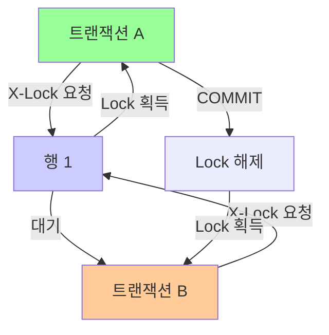

**결론:**
- **Locking**: 동시성 제어를 위한 데이터 접근 제한 메커니즘
- **Lock 종류**: 공유 Lock(읽기), 배타 Lock(쓰기), 의도 Lock
- **Lock 범위**: 행 레벨, 페이지 레벨, 테이블 레벨
- **목적**: 데이터 일관성 보장, 동시성 제어, 트랜잭션 격리
- **최적화**: 인덱스 활용, 짧은 트랜잭션, 적절한 격리 수준
- **모니터링**: Lock 정보 확인, 대기 쿼리 확인

### DB-048
Q. Optimistic Lock/Pessimistic Lock에 대해 설명해 주세요.

**Optimistic Lock과 Pessimistic Lock은 동시성 제어를 위한 두 가지 접근 방식.**

**Pessimistic Lock (비관적 Lock)의 정의:**
- 데이터를 수정하기 전에 미리 Lock을 획득
- 다른 트랜잭션의 접근을 차단
- 충돌이 자주 발생할 것으로 예상

**Pessimistic Lock의 특징:**

1. **사전 Lock 획득**
   - 데이터 읽기/수정 전에 Lock
   - 다른 트랜잭션 차단

2. **충돌 방지**
   - 동시 수정 방지
   - 데이터 일관성 보장

3. **성능 영향**
   - Lock 대기 시간 발생
   - 동시성 저하

**Pessimistic Lock 구현:**

**데이터베이스 레벨:**
```sql
-- SELECT FOR UPDATE
BEGIN;
SELECT * FROM users WHERE id = 1 FOR UPDATE;
-- X-Lock 획득, 다른 트랜잭션 차단
UPDATE users SET name = 'John' WHERE id = 1;
COMMIT;
```

**애플리케이션 레벨:**
```java
// Java synchronized
public synchronized void updateUser(int id) {
    User user = getUser(id);
    user.setName("John");
    saveUser(user);
}
```

**Optimistic Lock (낙관적 Lock)의 정의:**
- 데이터를 수정할 때 Lock을 걸지 않음
- 수정 시점에 충돌 검사
- 충돌이 드물 것으로 예상

**Optimistic Lock의 특징:**

1. **버전 관리**
   - 버전 번호 또는 타임스탬프 사용
   - 수정 시 버전 확인

2. **충돌 감지**
   - 수정 시점에 버전 비교
   - 충돌 시 롤백 또는 재시도

3. **성능 우수**
   - Lock 오버헤드 없음
   - 높은 동시성

**Optimistic Lock 구현:**

**버전 번호 방식:**
```sql
-- 테이블에 version 컬럼 추가
CREATE TABLE users (
    id INT PRIMARY KEY,
    name VARCHAR(50),
    version INT DEFAULT 0
);

-- 수정 시 버전 확인
UPDATE users 
SET name = 'John', version = version + 1
WHERE id = 1 AND version = 5;
-- 버전이 다르면 0개 행 업데이트 (충돌)
```

**타임스탬프 방식:**
```sql
-- 테이블에 updated_at 컬럼 추가
CREATE TABLE users (
    id INT PRIMARY KEY,
    name VARCHAR(50),
    updated_at TIMESTAMP
);

-- 수정 시 타임스탬프 확인
UPDATE users 
SET name = 'John', updated_at = NOW()
WHERE id = 1 AND updated_at = '2024-01-01 10:00:00';
```

**애플리케이션 레벨:**
```java
@Entity
public class User {
    @Id
    private Long id;
    private String name;
    
    @Version  // JPA Optimistic Lock
    private Long version;
}

// 사용
User user = userRepository.findById(1L);
user.setName("John");
userRepository.save(user);  // 버전 자동 확인
```

**비교:**

| 특징 | Pessimistic Lock | Optimistic Lock |
|------|-----------------|----------------|
| **Lock 시점** | 읽기/수정 전 | 수정 시점 |
| **충돌 처리** | 사전 방지 | 사후 감지 |
| **성능** | 낮음 (Lock 대기) | 높음 (Lock 없음) |
| **동시성** | 낮음 | 높음 |
| **충돌 빈도** | 높을 때 적합 | 낮을 때 적합 |
| **구현 복잡도** | 간단 | 복잡 (재시도 로직) |
| **데이터 손실** | 없음 | 가능 (재시도 필요) |

**충돌 처리:**

**Pessimistic Lock:**
```
트랜잭션 A: SELECT FOR UPDATE → Lock 획득
트랜잭션 B: SELECT FOR UPDATE → 대기
트랜잭션 A: UPDATE → COMMIT → Lock 해제
트랜잭션 B: Lock 획득 → UPDATE
→ 충돌 없음, 순차 실행
```

**Optimistic Lock:**
```
트랜잭션 A: SELECT (version=5)
트랜잭션 B: SELECT (version=5)
트랜잭션 A: UPDATE WHERE version=5 → 성공 (version=6)
트랜잭션 B: UPDATE WHERE version=5 → 실패 (0개 행)
→ 충돌 감지, 재시도 필요
```

**재시도 로직 (Optimistic Lock):**
```java
int maxRetries = 3;
for (int i = 0; i < maxRetries; i++) {
    try {
        User user = userRepository.findById(1L);
        user.setName("John");
        userRepository.save(user);
        break;  // 성공
    } catch (OptimisticLockingFailureException e) {
        if (i == maxRetries - 1) throw e;
        Thread.sleep(100);  // 재시도 전 대기
    }
}
```

**사용 시나리오:**

**Pessimistic Lock 적합:**
- 충돌이 자주 발생하는 경우
- 데이터 손실이 치명적인 경우
- 재시도 비용이 큰 경우

**예시:**
- 재고 관리 (재고가 0이 되면 안 됨)
- 계좌 이체 (잔액 확인 필수)
- 좌석 예매 (중복 예매 방지)

**Optimistic Lock 적합:**
- 충돌이 드문 경우
- 읽기가 많은 경우
- 높은 동시성이 필요한 경우

**예시:**
- 사용자 프로필 수정 (드물게 동시 수정)
- 댓글 작성 (충돌 거의 없음)
- 조회수 증가 (가끔 충돌)

**하이브리드 접근:**

**상황에 따라 선택:**
```java
// 중요한 작업: Pessimistic
@Transactional
public void transferMoney(int from, int to, int amount) {
    // SELECT FOR UPDATE
}

// 일반 작업: Optimistic
@Transactional
public void updateProfile(int userId, String name) {
    // 버전 기반 업데이트
}
```

**시각적 비교:**

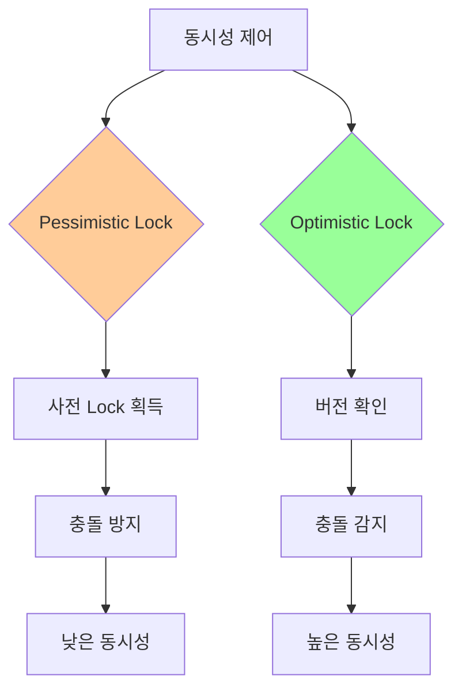

**성능 비교:**

**읽기가 많은 경우:**
```
Pessimistic: Lock 대기 시간 발생
Optimistic: Lock 없음, 빠름
→ Optimistic이 유리
```

**쓰기가 많은 경우:**
```
Pessimistic: 순차 실행, 안정적
Optimistic: 충돌 빈번, 재시도 오버헤드
→ 상황에 따라 다름
```

**결론:**
- **Pessimistic Lock**: 사전 Lock 획득, 충돌 방지, 낮은 동시성
- **Optimistic Lock**: 버전 기반, 충돌 감지, 높은 동시성
- **선택 기준**: 충돌 빈도, 데이터 중요도, 성능 요구사항
- **Pessimistic 적합**: 재고 관리, 계좌 이체 등 중요 작업
- **Optimistic 적합**: 프로필 수정, 댓글 작성 등 일반 작업
- **하이브리드**: 상황에 따라 적절히 선택

### DB-049
Q. 물리적인 Lock을 건다면, 만약 이를 수행중인 요청에 문제가 생겨 비정상 종료되면 Lock이 절대 해제되지 않는 문제가 생길 수도 있을 것 같습니다. DB는 이를 위한 해결책이 있나요? 없다면, 우리가 이 문제를 해결할 수 없을까요?

**DBMS는 Lock 타임아웃, 세션 타임아웃, 자동 롤백 등의 메커니즘으로 Lock이 영구히 유지되는 것을 방지.**

**문제 상황:**

**시나리오:**
```
1. 트랜잭션 A가 Lock 획득
2. 애플리케이션 크래시 또는 네트워크 단절
3. 트랜잭션이 비정상 종료
4. Lock이 해제되지 않음
5. 다른 트랜잭션이 무한 대기
```

**DBMS의 해결 방법:**

**1. Lock 타임아웃 (Lock Timeout)**

**의미:**
- Lock 대기 시간 제한
- 타임아웃 시 에러 반환

**MySQL:**
```sql
-- Lock 대기 시간 설정 (초)
SET innodb_lock_wait_timeout = 50;

-- 타임아웃 시 에러
ERROR 1205 (HY000): Lock wait timeout exceeded
```

**PostgreSQL:**
```sql
-- Lock 대기 시간 설정
SET lock_timeout = '5s';

-- 타임아웃 시 에러
ERROR: canceling statement due to lock timeout
```

**2. 세션 타임아웃 (Session Timeout)**

**의미:**
- 비활성 세션 자동 종료
- 연결이 끊어진 세션 감지

**MySQL:**
```sql
-- 세션 타임아웃 설정
SET wait_timeout = 28800;  -- 8시간
SET interactive_timeout = 28800;

-- 비활성 세션 자동 종료
```

**PostgreSQL:**
```sql
-- 세션 타임아웃 설정
SET idle_in_transaction_session_timeout = '10min';
```

**3. 자동 롤백 (Automatic Rollback)**

**의미:**
- 비정상 종료된 트랜잭션 자동 롤백
- Lock 자동 해제

**동작:**
```
1. 세션 연결 끊김 감지
2. 해당 세션의 트랜잭션 롤백
3. 모든 Lock 해제
```

**4. 연결 감지 (Connection Detection)**

**의미:**
- 주기적으로 연결 상태 확인
- 끊어진 연결 감지

**방법:**
- Keep-Alive 메커니즘
- 하트비트 (Heartbeat)
- TCP 연결 상태 확인

**5. Deadlock 감지**

**의미:**
- Deadlock 발생 시 자동 해결
- Victim 트랜잭션 롤백

**MySQL:**
```sql
-- Deadlock 자동 감지 및 롤백
ERROR 1213 (40001): Deadlock found when trying to get lock
```

**애플리케이션 레벨 해결:**

**1. 타임아웃 설정:**

**JDBC:**
```java
// Connection 타임아웃
connection.setNetworkTimeout(executor, 5000);  // 5초

// Statement 타임아웃
statement.setQueryTimeout(10);  // 10초
```

**2. 재시도 로직:**
```java
int maxRetries = 3;
for (int i = 0; i < maxRetries; i++) {
    try {
        executeTransaction();
        break;
    } catch (LockTimeoutException e) {
        if (i == maxRetries - 1) throw e;
        Thread.sleep(100 * (i + 1));
    }
}
```

**3. Connection Pool 설정:**
```java
// HikariCP 예시
HikariConfig config = new HikariConfig();
config.setConnectionTimeout(30000);  // 30초
config.setIdleTimeout(600000);  // 10분
config.setMaxLifetime(1800000);  // 30분
config.setLeakDetectionThreshold(60000);  // 1분
```

**4. 트랜잭션 모니터링:**
```java
// 장시간 실행 트랜잭션 감지
@Transactional(timeout = 30)  // 30초 타임아웃
public void longRunningOperation() {
    // 작업 수행
}
```

**5. Health Check:**
```java
// 주기적으로 연결 상태 확인
@Scheduled(fixedRate = 60000)  // 1분마다
public void checkConnections() {
    // 비활성 연결 정리
    connectionPool.evictIdleConnections();
}
```

**운영 체계적 해결:**

**1. 모니터링:**
```sql
-- MySQL: Lock 대기 중인 쿼리 확인
SELECT * FROM information_schema.innodb_lock_waits;

-- 장시간 실행 중인 트랜잭션 확인
SELECT * FROM information_schema.processlist 
WHERE TIME > 60;  -- 60초 이상
```

**2. 자동 Kill:**
```sql
-- 장시간 실행 중인 쿼리 자동 종료
-- 스케줄러로 주기적 실행
KILL QUERY <process_id>;
```

**3. Alert 설정:**
- Lock 대기 시간 임계값 초과 시 알림
- 장시간 실행 트랜잭션 알림

**4. Circuit Breaker:**
```java
// 연속 실패 시 일시 중단
CircuitBreaker circuitBreaker = CircuitBreaker.ofDefaults("db");
circuitBreaker.executeSupplier(() -> {
    return databaseOperation();
});
```

**시각적 표현:**

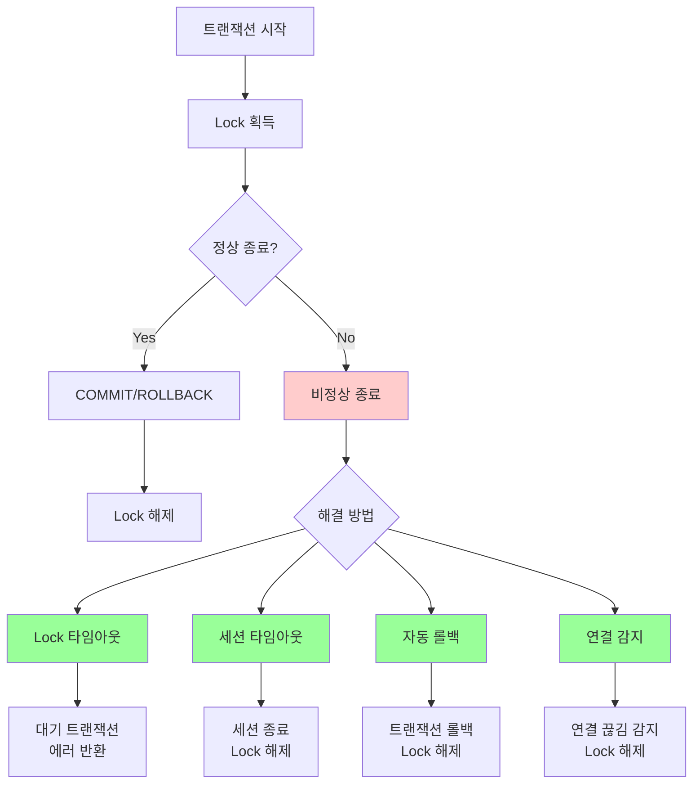

**실제 예시:**

**문제 상황:**
```sql
-- 트랜잭션 A
BEGIN;
UPDATE users SET name = 'A' WHERE id = 1;
-- 애플리케이션 크래시 또는 네트워크 단절
-- Lock이 해제되지 않음
```

**해결 과정:**
```
1. Lock 타임아웃 (50초 후)
   → 트랜잭션 B가 에러 받음
   
2. 세션 타임아웃 (8시간 후)
   → 트랜잭션 A 세션 종료
   → 자동 롤백
   → Lock 해제
   
3. 연결 감지 (즉시)
   → 연결 끊김 감지
   → 트랜잭션 롤백
   → Lock 해제
```

**모니터링 쿼리:**

**MySQL:**
```sql
-- Lock 대기 정보
SELECT 
    r.trx_id waiting_trx_id,
    r.trx_mysql_thread_id waiting_thread,
    r.trx_query waiting_query,
    b.trx_id blocking_trx_id,
    b.trx_mysql_thread_id blocking_thread,
    b.trx_query blocking_query
FROM information_schema.innodb_lock_waits w
INNER JOIN information_schema.innodb_trx b ON b.trx_id = w.blocking_trx_id
INNER JOIN information_schema.innodb_trx r ON r.trx_id = w.requesting_trx_id;

-- 장시간 실행 트랜잭션
SELECT * FROM information_schema.processlist
WHERE COMMAND != 'Sleep' AND TIME > 60;
```

**PostgreSQL:**
```sql
-- Lock 대기 정보
SELECT 
    blocked_locks.pid AS blocked_pid,
    blocking_locks.pid AS blocking_pid,
    blocked_activity.query AS blocked_query,
    blocking_activity.query AS blocking_query
FROM pg_catalog.pg_locks blocked_locks
JOIN pg_catalog.pg_stat_activity blocked_activity ON blocked_activity.pid = blocked_locks.pid
JOIN pg_catalog.pg_locks blocking_locks ON blocking_locks.locktype = blocked_locks.locktype
JOIN pg_catalog.pg_stat_activity blocking_activity ON blocking_activity.pid = blocking_locks.pid
WHERE NOT blocked_locks.granted;
```

**결론:**
- **문제**: 비정상 종료 시 Lock이 해제되지 않을 수 있음
- **DBMS 해결**: Lock 타임아웃, 세션 타임아웃, 자동 롤백, 연결 감지
- **애플리케이션 해결**: 타임아웃 설정, 재시도 로직, Connection Pool 설정
- **운영 해결**: 모니터링, 자동 Kill, Alert, Circuit Breaker
- **권장**: 다층 방어 체계 구축 (DBMS + 애플리케이션 + 운영)
- **모니터링**: 정기적으로 Lock 상태 확인 및 장시간 실행 트랜잭션 감지

---