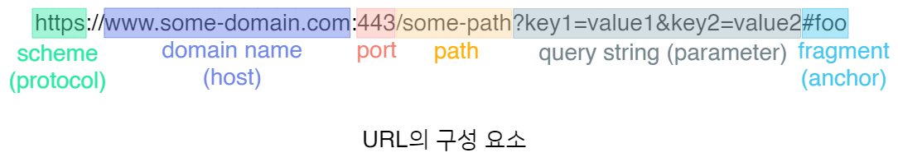
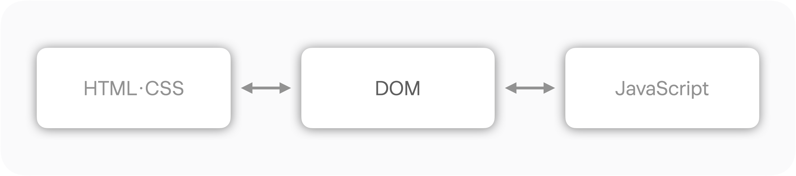
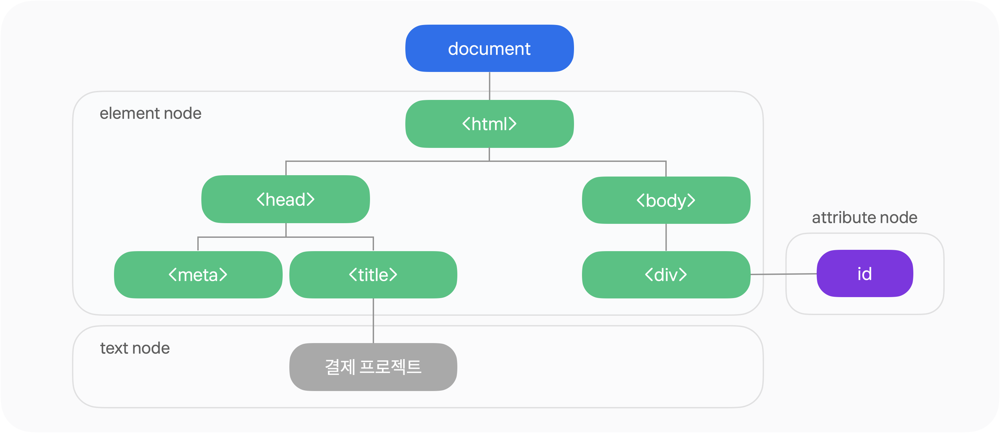
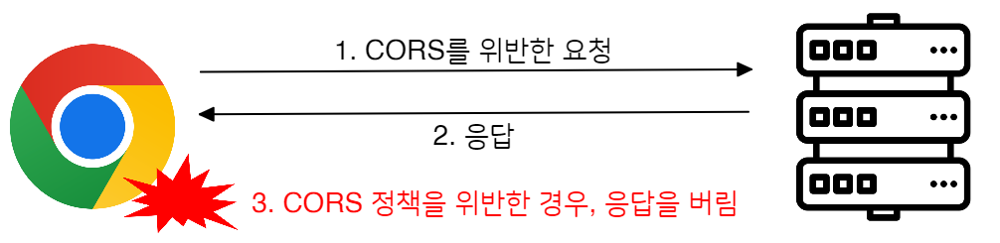
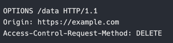
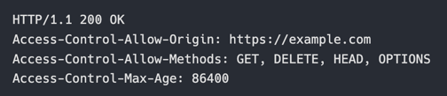

# Network (네트워크)

## 📌 CORS 및 보안 정책

### NET-032
SOP 정책에 대해 설명해 주세요.

### SOP(Same-Origin Policy) 정책

SOP는 브라우저에서 적용되는 기본 보안 정책이며 '동일 출처 정책'이라고도 부른다.
서로 다른 출처(origin)의 리소스에 대해 접근을 제한하는 것이 목적이다.

1. Origin이란?

[출처](https://jaehyeon48.github.io/web/sop-and-cors/)

Origin(출처)은 프로토콜(scheme) + 호스트(domain name) + 포트의 조합으로 정의된다.
이 중 하나라도 다르면 서로 다른 출처로 간주된다.
- 포트 번호가 생략되어 있는 경우 기본 포트를 기준으로 한다.(HTTP: 80, HTTPS: 443)
- 포트 번호가 명시되어 있다면 명시된 포트 번호가 기준

2. Same Origin Policy가 필요한 이유

대부분의 브라우저는 다른 누군가(remote party)를 대신하여 많은 동작들을 수행한다.
  대표적인 예로 서버에 의한 리디렉션 혹은 외부 서버로부터 다운받은 스크립트 파일에게 DOM을 제공하여 조작할 수 있게 한다.
  이때 만약 어떠한 보안 메커니즘도 없다면 브라우저에서 돌아가는 웹 애플리케이션들은 악의적인 공격에 무방비한 상태로 노출되게 된다.
  누구나 손쉽게 개발자 도구를 열어 DOM을 살펴볼 수 있고, 네트워크 탭을 통해 어떤 서버와 통신하는지 알 수 있고, 또 소스 코드를 살펴볼 수도 있으니 무방비로 노출된 브라우저 환경은 위험하다고 볼 수 있다.

3. DOM(Document Object Model)

[출처](https://docs.tosspayments.com/resources/glossary/dom)

브라우저가 HTML 문서를 메모리 위에 객체 구조로 표현한 것. 즉, 웹 페이지의 모든 요소를 자바스크립트가 접근·조작할 수 있도록 만든 인터페이스

쉽게 말해 DOM은 HTML로 구성된 웹 페이지와 스크립트 및 프로그래밍 언어를 연결시켜주는 역할

[출처](https://docs.tosspayments.com/resources/glossary/dom)

  HTML 문서는 브라우저에 로드되면 단순한 문자열이 아니라 트리 구조의 객체로 변환된다.
  - < html >, < head >, < body >는 노드가 된다.
  -  각 태그는 객체(Node, Element)로 표현된다.
  - 부모–자식 관계를 가지는 트리 구조다.

이 구조 전체를 DOM이라고 부른다.
- 그러므로 DOM에는 단순한 화면 정보만 있는 것이 아닌 사용자 입력값, 인증 상태에 따른 화면 변화, CSRF 토큰, 숨겨진 필드, 세션 기반 UI 로직 등의 민감한 정보가 있다.

#### “DOM을 제공한다”는 말의 의미

외부에서 내려받은 자바스크립트 파일이 실행될 때 브라우저는 그 스크립트에 DOM에 접근할 수 있는 권한을 준다.

즉, 스크립트는 다음과 같은 작업을 할 수 있다.
- 화면의 요소를 읽는다 
- 요소를 수정하거나 삭제한다 
- 이벤트를 등록한다 
- 사용자 입력 값을 가져온다

예를 들어 `document.getElementById("password").value` 이 한 줄로 사용자가 입력한 비밀번호에 접근할 수 있다.

=> 그래서 SOP는 **어떤 스크립트가 어떤 DOM에 접근할 수 있는가**를  출처 단위로 강하게 제한한다.

4. SOP 정책 구성

SOP는 서로 다른 출처(origin) 사이에서 발생하는 모든 동작을 막는 정책이 아니다.
“리소스를 로드하는 것”과 “리소스의 내용을 읽거나 조작하는 것”을 명확히 구분한다.

핵심 원칙: 다른 출처의 리소스는 로드(load)할 수 있지만 그 내부 데이터에 대한 접근(read/write)은 제한된다.
=> 즉, SOP는 요청 자체가 아니라 응답 접근을 제한하는 정책이다.

**SOP가 제한하는 대상**

SOP는 브라우저에서 실행되는 자바스크립트를 대상으로 한다.
사용자나 서버를 직접 제한하는 정책이 아니다.
- 제한 주체: 브라우저
- 제한 대상: 자바스크립트의 리소스 접근 권한
- 기준: 출처(origin)

**리소스별 SOP 동작 정리**

| 리소스 유형      | 다른 출처 리소스 로드 | JS로 내용 접근     |
| ----------- | ------------ | ------------- |
| script      | 가능           | 제한됨           |
| css         | 가능           | 제한됨           |
| iframe      | 가능           | 제한됨           |
| form        | 가능 (전송 가능)   | 응답 접근 불가      |
| image       | 가능           | 픽셀 데이터 접근 불가  |
| audio/video | 가능           | 미디어 데이터 접근 제한 |

SOP에 따라 한 출처에서 실행된 스크립트는
- 다른 출처의 응답 데이터 
- 쿠키, 세션 정보 
- DOM 내부 정보

에 직접 접근할 수 없다.

이를 통해 XSS, CSRF 기반 공격 / 인증 정보 탈취 / 사용자 데이터 노출을 방지한다.

### NET-033
CORS 정책이 무엇인가요?

SOP 정책은 다른 출처의 자원을 사용할 수 없도록 한다. 즉 다른 사이트의 정보를 읽을 수 없게 된다는 장점이 있다.
  그러나 유효한 요청 또한 막아버린다는 단점 -> 출처가 서로 다른 곳에서 리소스를 가져와서 사용해야 하는 경우는 빈번하다.

EX1) 프론트엔드와 백엔드가 분리된 구조
- 프론트엔드: https://frontend.example.com
- 백엔드: https://api.example.com
- Origin이 다름, 호스트가 다르므로 cross-origin
- 그러나 프론트엔드 서버에서 내려온 자바스크립트가 백엔드 서버의 API 응답(JSON)을 읽어야 한다.
- SOP만 있으면 응답 접근 차단!!

EX2) 로컬 개발 환경 <-> 운영 서버
- 로컬 개발 서버: http://localhost:3000
- 개발/운영 API 서버: https://api.example.com
- 이 경우에는 프로토콜, 호스트, 포트 모두 다를 수 있다.
- 개발 환경에서 API 테스트가 불가능해짐, 보통 개발자들이 CORS 에러를 처음 마주치는 지점

EX3) 각 서비스가 역학별로 분리되어 있는 경우
- 웹 클라이언트: https://service.example.com
- 인증 서버: https://auth.example.com
- 결제 서버: https://pay.example.com
- 모두 다른 출처의 API 응답을 읽어야 하는데 SOP만 있으면 불가능
- 즉 CORS가 없으면 마이크로서비스 아키텍처 자체가 성립하지 않는다

따라서 출처가 다른 리소스를 사용할 수 있도록 하는 몇 가지 예외 조항을 두어야 한다.

즉 SOP에서 기본적으로 제한하고 있는 행위들의 적용을 받지 않도록 해야 한다.
=> 이게 CORS(Cross-Origin Resource Sharing) 정책

### CORS 동작 방식

[출처](https://jaehyeon48.github.io/web/sop-and-cors/)

웹 애플리케이션은 기본적으로 출처가 다른 곳에 특정 요청을 할 때 요청 헤더에 **Origin** 이라는 필드를 함께 보낸다.
`Origin: https://www.google.com`

이후 서버가 응답할 때 `Access-Control-Allow-Origin`이라는 응답 헤더 필드에 허용할 출처를 명시한다.

그리고 응답을 받은 브라우저는 자신이 보냈던 요청의 Origin과 서버 응답의 Access-Control-Allow-Origin 값이 일치하는 것을 확인하고,
일치하면 출처가 다른 요청이라도 유효한 요청으로 보고, 받아온 리소스를 사용할 수 있게 한다.

### CORS 설정 관련 헤더들
CORS 정책은 `Origin` 및 `Access-Control-` 헤더들을 통해 제어할 수 있다.

- Origin 헤더
  - 출처가 다른 요청 혹은 preflight 요청의 출처를 나타낸다.
  - 값이 null 일 수도 있으며, 출처가 다른 요청의 경우 항상 Origin 헤더가 전송된다.

- Access-Control-Request-Method 헤더
  - preflight 요청을 보낼 때, 서버에게 실제 요청의 HTTP 메서드 정보를 알려주는 역할을 한다.

- Access-Control-Request-Headers 헤더
  - preflight 요청을 보낼 때, 서버에게 실제 요청의 HTTP 헤더 정보를 알려주는 역할을 한다.

- Access-Control-Max-Age
  - preflight 요청이 얼마 동안 캐시 될지를 나타낼 때 사용. 단위는 초
  - 파이어폭스의 경우 최대값은 86,400초(24시간), 크롬(Chromium)의 경우 버전 76 이전에는 최대 600초(10분), 버전 76 부터는 최대 7,200초(2시간)로 제한 중이라고 함

등등...

### CORS의 상세 동작 흐름 세 가지

1. 간단한 요청일 경우, Simple Request
- HTTP 메서드가 GET, HEAD, POST 중 하나일 경우
- 브라우저에 의해 자동으로 설정되는 헤더(e.g. Connection, User-Agent)등을 제외하고, 요청 헤더가 아래 목록에 나와있는 것만 설정된 경우:
  - Accept, Accept-Language, Content-Language, Content-Type의 경우, 헤더값이 셋 중 하나이어야 함 - application/x-www-form-urlencoded, multipart/form-data, text/plain

- 위 조건을 만족하는 요청은 별다른 절차 없이 다른 출처에 HTTP 요청을 보낼 수 있다. 일단 요청을 보내고 응답을 받은 뒤 해당 요청이 CORS를 만족하는지를 체크한다.

2. 복잡한 요청일 경우, Complex Request
- 간단한 요청 이외의 요청
- 본 요청을 보내기 전에 **preflight** 요청을 보내서 다른 출처에 해당 요청을 보낼 수 있는지 점검한 뒤에 보낼 수 있다고 확인을 받으면 그제야 본 요청을 서버에 보낸다.
- preflight 요청은 **OPTION HTTP 메서드**를 사용한다.

- 이를 받은 서버에선 아래와 같이 허용하는 출처와 허용하는 메서드, preflight 요청을 얼마 동안 캐시 할 것인지 등에 관한 정보를 응답한다.

흐름

[출처](https://jaehyeon48.github.io/web/sop-and-cors/)

이때 브라우저가 CORS 정책 위반 여부를 판단하는 시점이 preflight 응답을 받은 이후가 된다.

Origin 값과 Access-Control-Allow-Origin의 값이 같냐 다르냐를 토대로 CORS 정책 위반 여부를 판별, CORS 정책을 위반했다면 이후 실제 요청은 전송 Xs

3. Credential을 포함한 요청일 경우
- HTTP 쿠키와 같이 인증 정보를 포함하는 요청을 보내는 경우
- 기본적으로 fetch 등의 요청 API는 다른 출처에 요청하는 경우엔 쿠키 정보나 인증과 관련된 헤더를 요청에 포함하지 않는다.
- 만약 요청에 포함하고자 한다면 credentials 옵션을 사용하면 되는데, 이 옵션에는 3개의 값이 존재
  - same-origin: 기본값으로, 같은 출처 간 요청에만 인증 정보를 포함
  - include: 다른 출처에 요청하는 경우에도 항상 인증 정보를 포함하도록 한다.
  - omit: 인증 정보를 절대 포함하지 않도록 한다.

다른 출처에 인증 정보를 포함하여 요청을 보내는 경우, 서버 측에선 반드시 `Access-Control-Allow-Credentials` 응답 헤더 값을 true로 설정해야 하고
`Access-Control-Allow-Origin` 헤더 값에 * (모든 출처를 허용) 대신 반드시 하나의 출처를 명시해야 한다.

### NET-034
Preflight에 대해 설명해 주세요.

Preflight 요청은 **브라우저가 실제 요청을 보내기 전에** 해당 요청이 서버에서 허용되는지 사전에 확인하는 **OPTIONS 요청**이다.
=> 불필요한 보안 위반 요청을 사전에 차단하여 브라우저와 서버 모두를 보호하는 역할을 하는 것

Preflight가 발생하는 경우
- GET, POST 외의 HTTP 메서드 사용 (PUT, DELETE 등)
- Content-Type: application/json 등 Simple Request가 아닌 헤더 사용
- 커스텀 헤더 사용

Preflight 요청에 포함되는 정보
- Access-Control-Request-Method 
- Access-Control-Request-Headers

서버는 이에 대해 허용 여부를 CORS 응답 헤더로 명시하고,
브라우저는 이를 확인한 후에만 실제 요청을 전송한다.

---

## 정리

SOP: 기본 보안 정책, 다른 출처의 응답 데이터 접근 차단

CORS: 서버가 SOP를 예외적으로 허용하는 방식

Preflight: 실제 요청 전, 허용 여부를 묻는 사전 검증 요청

---

## 📌 IP 주소

### NET-059
IP 주소는 무엇이며, 어떤 기능을 하고 있나요?

IP 주소는 네트워크 상에서 장비를 식별하기 위한 논리적 주소다.
인터넷에 연결된 모든 장비는 IP 주소를 통해 서로를 구분한다.

IP 주소의 주요 기능은 다음과 같다.
- 송신자와 수신자를 식별한다 
- 패킷이 목적지까지 전달될 수 있도록 라우팅 기준을 제공한다 
- 네트워크 계층에서 통신 대상을 지정한다

IP 주소는 위치 기반 주소로,
네트워크 구조가 바뀌면 변경될 수 있다.

### NET-060
IPv6는 IPv4의 주소 고갈 문제를 해결하기 위해 만들어졌지만, 아직도 수많은 기기가 IPv4를 사용하고 있습니다. 고갈 문제를 어떻게 해결할 수 있을까요?

IPv4 고갈이란, 전 세계적으로 유일해야 하는 공인 IPv4 주소를
더 이상 새로 할당할 수 없게 된 상태를 의미한다.

IPv4 주소 고갈 문제는 단일한 방법이 아니라 여러 기술의 조합으로 해결되고 있다.

대표적인 방법은 다음과 같다.

1. NAT(Network Address Translation)
- 하나의 공인 IP를 여러 사설 IP가 공유하도록 한다.
- 공유기가 내부에서 주소를 변환해준다.
  - 공인 IPv4 소모 속도를 늦출 수 있도록 해줌
  - 그래서 근본 해결책은 아님

2. CIDR(Classless Inter-Domain Routing)
- 주소를 더 유연하게 할당하여 낭비를 줄인다.

3. IPv6 도입
- 주소 공간을 획기적으로 확장한다.

현재 실무에서는 NAT + IPv4 유지 + 점진적 IPv6 전환 방식이 가장 널리 사용되고 있다고 한다.

### NET-061
IPv4와 IPv6의 차이에 대해 설명해 주세요.

| 구분     | IPv4      | IPv6       |
|--------| --------- | ---------- | 
| 주소 길이  | 32비트      | 128비트      |
| 주소 예시  | 10.0.0.1      | 2001:0db8:85a3:0000:0000:8a2e:0370:7334|
| 주소 표현  | 10진수 점 표기 | 16진수 콜론 표기 |
| 주소 개수  | 약 43억 개   | 사실상 무한     |
| NAT 필요성 | 필수적       | 불필요        |
| 브로드캐스트 | 지원        | 미지원        |
| 헤더 구조  | 복잡        | 단순화        |

IPv6는 주소 확장뿐 아니라 라우팅 효율성과 헤더 처리 성능도 개선

IPv4는 사람이 읽기 쉬운 짧은 주소 체계이고,
IPv6는 주소 고갈 문제를 해결하기 위해 설계된 대규모 주소 체계다.

### 공인 IP vs 사설 IP
공인 IP
- 전 세계적으로 유니크해야 한다.
- ISP가 할당한다.
- 개수 제한이 있다.
- 고갈 대상

사설 IP
- 내부 네트워크에서만 유니크하면 된다.
- 여러 네트워크에서 중복 가능
- 개수 제한은 사실한 없다
- 고갈 대상이 아니다

### NET-062
수많은 사람들이 유동 IP를 사용하고 있지만, 수많은 공유기에서는 고정 주소를 제공하는 기능이 이미 존재합니다. 어떻게 가능한 걸까요?

유동 IP 환경에서 공유기가 고정 주소를 제공할 수 있는 이유

ISP로부터 할당받는 IP는 공인 IP이며, 이는 대부분 유동 IP다.
반면 공유기는 내부 네트워크에 사설 IP를 할당한다.

공유기는 다음 구조를 사용한다.
- 외부: 유동 공인 IP 1개
- 내부: 고정 사설 IP 여러 개 (예: 192.168.x.x)

공유기는 NAT을 사용해 내부 사설 IP와 외부 공인 IP를 매핑한다.

따라서 외부에서는 IP가 바뀌어도 내부 네트워크에서는 고정 IP처럼 동작할 수 있다.

### NET-063
IPv4를 사용하는 장비와 IPv6를 사용하는 같은 네트워크 내에서 통신이 가능한가요? 가능하다면 어떤 방법을 사용하나요?

직접 통신은 불가능하다. IPv4와 IPv6는 서로 다른 프로토콜이기 때문이다.

이를 해결하기 위해 다음과 같은 방법을 사용한다.
1. Dual Stack
- 장비가 IPv4와 IPv6를 동시에 사용한다.

2. Tunneling
- IPv6 패킷을 IPv4 네트워크 위에 캡슐화한다.

3. Translation (NAT64 등)
- IPv4와 IPv6 간 주소 변환을 수행한다.

실무에서는 Dual Stack 방식이 가장 일반적이다.

### NET-064
IP가 송신자와 수신자를 정확하게 전송되는 것을 보장해 주나요?

보장하지 않는다.

IP는 Best-Effort 방식으로 동작하는 프로토콜이다.

즉,
- 패킷 손실 가능
- 순서 보장 없음
- 중복 전송 가능

IP는 전달 시도만 할 뿐,
정확한 전달 보장은 상위 계층(**TCP**)의 역할이다.

### NET-065
IPv4에서 수행하는 Checksum과 TCP에서 수행하는 Checksum은 어떤 차이가 있나요?

### Checksum
- 체크섬은 데이터가 전송 중에 손상되었는지 확인하기 위한 값이다.
- 송신자가 데이터를 보낼 때
  - 데이터 내용을 기반으로 계산한 값(체크섬)을 함께 보낸다
  - 수신자는 받은 데이터로 다시 체크섬을 계산한다
  - 두 값이 다르면 전송 중 오류가 발생했다고 판단한다

즉 체크섬은 데이터 무결성(integrity)을 검사하는 간단한 오류 검출 메커니즘이다.

필요한 이유: 네트워크 전송 중에 문제 발생 가능성
- 전기적 노이즈
- 하드웨어 오류
- 라우터/스위치의 버그
- 메모리 오류

=> 이로 인해 데이터의 일부 비트가 바뀔 수 있다 - 체크섬은 이 데이터가 원래와 같은지를 확인하는 최소한의 안전장치(오류 검출만, 수정은 X)
=> 발견 후의 처리(재전송 등)는 TCP 등의 상위 계층의 역할

| 구분     | IPv4 Checksum  | TCP Checksum |
| ------ | -------------- | ------------ |
| 검사 대상  | IP 헤더          | TCP 헤더 + 데이터 |
| 목적     | 라우팅 중 헤더 오류 검출 | 종단 간 데이터 무결성 |
| 계층     | 네트워크 계층        | 전송 계층        |
| 데이터 보호 | X              | O            |

IPv4 Checksum은 헤더만 검사하고, TCP Checksum은 전체 데이터의 무결성을 보장한다.

### NET-066
TTL(Hop Limit)이란 무엇인가요?

TTL(Time To Live)은 패킷이 네트워크를 무한히 순환하는 것을 방지하기 위한 값이다.
- 패킷이 네트워크를 무한히 순환하는 경우: 라우팅 루프가 발생했을 때
  - 라우팅 루프는 여러 라우터가 잘못된 라우팅 정보를 가지고 있어서 패킷을 서로에게 계속 떠넘기는 상태
  - `A → B → C → A → B → C → ...` 영원히 순환

라우터를 하나 거칠 때마다 1씩 감소한다 0이 되면 패킷은 폐기된다.

IPv4에서는 TTL, IPv6에서는 Hop Limit라는 이름을 사용한다.
- IPv6에서는 라우터를 몇 번 거칠 수 있는지(Hop)를 기준으로 폐기 결정

즉 패킷이 네트워크를 무한히 순환하는 경우는 라우팅 루프가 발생했을 때이며,
TTL은 이런 루프 상황에서도 패킷이 무한히 떠돌지 않도록 강제 종료하는 장치다.

### NET-067
IP 주소와 MAC 주소의 차이에 대해 설명해 주세요.

| 구분     | IP 주소     | MAC 주소       |
| ------ | --------- | ------------ |
| 역할     | 논리적 주소    | 물리적 주소       |
| 계층     | 네트워크 계층   | 데이터 링크 계층    |
| 변경 가능성 | 변경 가능     | 일반적으로 고정     |
| 사용 목적  | 네트워크 간 통신 | 같은 네트워크 내 통신 |

IP 주소는 어디에 있는지를 나타내고, MAC 주소는 누구인지를 나타낸다.
