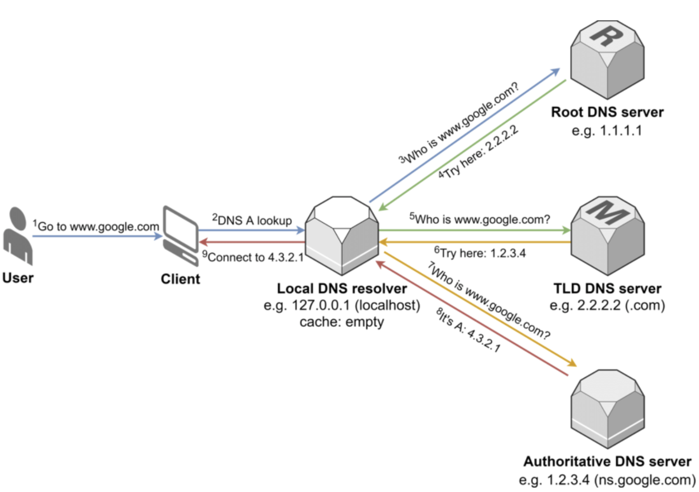

# 📌 DNS

### [NET-074] DNS에 대해 설명해 주세요.

Domain Name System     
도메인 이름을 IP 주소로 변환해주는 시스템      

DNS를 사용하는 이유: 인간이 IP주소를 모두 기억하기는 어렵기 때문에    

DNS 쿼리 과정: 도메인 입력 → 로컬 확인 → Local DNS 재귀 질의 → Root → TLD → Authoritative → IP 응답 → 서버 접속

1. **사용자가 브라우저에 도메인 주소 입력**
    - 브라우저는 “이 이름에 대응하는 IP가 필요하다”는 상태가 됨
    - ex) www.example.com
2. **브라우저/OS가 로컬 캐시 확인**
    - 이미 알고 있는 IP가 있다면 → DNS 질의 자체를 하지 않고 바로 사용
    - 없다면 → 다음 단계로 진행
    - 로컬 캐시: 브라우저 캐시, OS DNS 캐시, hosts 파일
3. **Local DNS Resolver(ISP 또는 Public DNS)로 DNS 쿼리 전송**
    - 질의 내용: “www.example.com의 IP(A/AAAA 레코드)를 알려줘”
    - 클라이언트 → Local DNS : Recursive Query (“끝까지 책임지고 결과를 가져와라”는 요청)
4. **Local DNS 서버가 Root DNS 서버에 질의**
    - Root DNS의 역할: “.com을 관리하는 DNS 서버는 여기야”
    - 이 단계부터는 Iterative Query: Root DNS는 IP를 주지 않음, 다음에 물어볼 서버의 위치만 알려줌
5. **TLD DNS 서버(.com)에 질의**
    - 질문: “example.com 알아?”
    - 응답: “이 도메인의 최종 정보는 Authoritative DNS가 가지고 있어”
6. **Authoritative DNS 서버에 질의**
    - 질문: “www.example.com의 IP 주소는 뭐야?”
    - 응답: 실제 IP 주소 (예: 93.184.216.34)
    - 이 지점에서 ‘이름 → IP’ 변환 완료
7. **Local DNS 서버가 결과를 캐싱 후, 클라이언트에 응답**
    - TTL(Time To Live) 기준으로 캐시 저장
    - 클라이언트(브라우저/OS)에 IP 주소 전달
8. **브라우저가 IP 주소로 실제 서버에 접속**
    - 이제 DNS 역할 종료
    - 이후 과정: TCP 3-way handshake, HTTPS라면 TLS handshake, HTTP 요청/응답

    

실습1: `dig +trace cloudclub.kr`      
실습2: https://whatsmydns.me/ko      

### [NET-075] DNS는 몇 계층 프로토콜인가요?

> 참고: DNS는 시스템이고, 해당 시스템 안에서 서버-서버, 서버-클라이언트가 통신하는 규칙을 DNS 프로토콜이라고 한다.   

7계층 Application Layer이다.
도메인 이름과 IP 주소의 매핑이라는 ‘응용 수준의 의미’를 정의하는 프로토콜이기 때문이다.    

이유: DNS는 전송을 “어떻게” 할지가 아니라,
전송된 데이터가 “무엇을 의미하는지(이름 → IP)”를 정의하기 때문에 7계층에 해당    

ex: DNS에는 도메인 이름 구조, A/AAAA/CNAME 같은 레코드 의미, Query/Response 메시지 의미, 캐시, TTL 개념과 같이 “**이 데이터가 무엇을 뜻하는지**”가 정의돼 있음.   

1. 사용자는 IP 대신 이름을 쓰고 싶다
2. 이름을 IP로 바꿔주는 의미 있는 서비스가 필요해졌다
3. 이 서비스는 애플리케이션(브라우저, 메일 서버)이 직접 사용한다
4. 전송은 UDP/TCP에게 맡긴다
5. DNS는 “이름 해석이라는 규칙과 의미”만 정의한다

### [NET-076] UDP와 TCP 중 어떤 것을 사용하나요?

DNS는 기본적으로 UDP(53번 포트)를 사용하지만,
특정 상황(512바이트 초과/Zone Transfer)에서는 TCP(53번 포트)를 사용   

UDP 사용 이유   
1. DNS 쿼리는 데이터 크기가 작고(보통 512바이트 이하)
2. 연결 설정 과정(Handshake) 없이 빠른 응답이 중요하기 때문

> 참고링크: https://www.geeksforgeeks.org/computer-networks/why-does-dns-use-udp-and-not-tcp/

TCP 사용 이유    
1. 응답 데이터가 512바이트를 초과하는 경우: RFC 1035
    - “UDP로 512바이트보다 큰 메시지는 잘려서 보내고 TC(Truncated) 플래그를 설정한다”   
    - 그러면 클라이언트가 같은 쿼리를 TCP로 다시 시도함   
2. DNS 서버 간의 정보를 동기화하는 Zone Transfer(영역 데이터 복제)를 수행할 때는 전체 존 데이터를 누락 없이 전달해야 하기 때문    
3. 추가: RFC 7766   
    - “DNS는 UDP뿐 아니라 반드시 TCP도 지원해야 한다"고 명시되어 있음 (즉, TCP 지원은 선택 아닌 필수)    

> RFC 1035: https://datatracker.ietf.org/doc/html/rfc1035    
> RFC 7765: https://datatracker.ietf.org/doc/html/rfc7766    

### [NET-077] DNS Recursive Query, Iterative Query가 무엇인가요?

Recursive Query(재귀적 질의)    
- 클라이언트 -> Local DNS한테 요청하는 질의 방식    
- 서버가 최종 결과를 책임지고 찾는 질의    

Iterative Query(반복적 질의)     
- Local DNS -> Root, TLD, 권한 있는 서버들에게 차례로 묻는 질의 방식    
- 각 서버가 다음 서버의 위치를 알려주는 방식      

정리: Recursive Query는 서버가 클라이언트 대신 최종 이름 해석을 완료해서 답을 내려주는 방식이고, Iterative Query는 단계별로 각 서버가 다음에 물어볼 서버 위치만 알려주며 리졸버가 순차적으로 따라가는 방식입니다.    

추가 질문: 왜 클라이언트는 Recursive고, 서버 간은 Iterative인가요?
답변: 클라이언트는 단순해야 하고, DNS 서버는 분산되어야 하기 때문
- 클라이언트가 Recursive인 이유: 클라이언트가 Root → TLD → Authoritative까지 직접 다니게 하면, 복잡도 + 부하 폭증하기 때문
- 서버가 Iterative인 이유: Root 서버가 모든 도메인 IP를 알고 있으면, 중앙 집중 구조라서 확장성·안정성이 붕괴되기 때문

### [NET-078] DNS 쿼리 과정에서 손실이 발생한다면, 어떻게 처리하나요?

DNS는 전송 계층에서 UDP를 사용하기 때문에 **재전송을 보장하지 않아** DNS 쿼리 과정에서 손실이 발생할 수 있습니다. 
하지만 이를 응용 계층에서 제어해주기 때문에 **타임아웃을 활용하여** 신뢰성을 확보할 수 있습니다. (동일한 쿼리를 다시 보내거나, 설정된 다른 DNS 서버로 요청을 시도)

추가질문: 그렇다면 TCP를 사용해서 손실을 줄이면 되지 않나요?
답변: DNS가 TCP를 사용하면 전송 신뢰성은 보장되지만, DNS는 요청이 작고 빈도가 매우 높기 때문에 TCP의 연결 오버헤드가 더 큰 비용이 됩니다. 그래서 DNS는 기본적으로 UDP를 사용하고, 손실은 응용 계층에서 재시도로 처리하도록 설계되었습니다.

### [NET-079] 캐싱된 DNS 쿼리가 잘못 될 수도 있습니다. 이 경우, 어떻게 에러를 보정할 수 있나요?

도메인의 IP가 변경되었는데 클라이언트나 중간 서버에 옛날 IP가 캐싱되어 있다면 접속 오류가 발생합니다.   

이러한 DNS 캐시 오류는 TTL 만료를 통해 자동으로 해소되며, 긴급한 경우 로컬 DNS 캐시를 수동으로 플러시하여 해결할 수 있습니다. 혹은 운영자라면 미리 IP 변경 전에 TTL을 낮추는 방식으로 전파 지연을 최소화할 수 있습니다. 이는 DNS가 TTL 기반 캐싱을 전제로 설계되었기 때문에 가능한 해결 방법입니다.   

| 방법        | 성격    | 근거 핵심                      |
| --------- | ----- | -------------------------- |
| TTL 관리    | 자동/표준 | - TTL은 RFC에 정의된 DNS 캐시 수명 메커니즘   - DNS 레코드에 설정된 유효 기간이 지나면 자동으로 폐기되도록 기다림    |
| 수동 플러시    | 즉각/로컬 | - OS 수준 DNS 캐시 관리 기능   - 운영체제 명령(예: Windows의 ipconfig /flushdns)을 통해 강제로 로컬 캐시를 삭제함         |
| TTL 사전 조정 | 예방/운영 | - 관리자가 DNS TTL을 제어할 수 있다는 설계 가정   - 서버 측에서 TTL 값을 일시적으로 낮추어 변경 사항이 빨리 전파되도록 미리 준비함 |

### [NET-080] DNS 레코드 타입 중 A, CNAME, AAAA의 차이에 대해서 설명해주세요.

| 타입  | 명칭           | 설명                                   | 비고                                   |
|------|----------------|----------------------------------------|----------------------------------------|
| A    | Address        | 도메인 이름을 IPv4 주소에 매핑         | 가장 기본적인 형태                     |
| AAAA | IPv6 Address   | 도메인 이름을 IPv6 주소에 매핑         | IPv4 주소 부족 문제 해결용             |
| CNAME | Canonical Name | 도메인 이름을 다른 도메인 이름에 매핑 | 별칭(Alias) 역할 (예: www를 root로 연결) |

### [NET-081] hosts 파일은 어떤 역할을 하나요? DNS와 비교하였을 때 어떤 것이 우선순위가 더 높나요?

hosts 파일은 로컬 컴퓨터에 저장된 텍스트 파일로, 특정 도메인과 IP 주소의 쌍을 직접 기록해 둔 장부입니다.

- 역할: 외부 DNS 서버에 물어보지 않고도 내 컴퓨터 내에서 즉시 주소를 찾을 수 있게 합니다. 개발 환경에서 특정 도메인을 로컬 서버로 돌릴 때 유용합니다.

- 우선순위: hosts 파일이 DNS 서버보다 우선순위가 높습니다.

- 이유: 네트워크 자원을 소모하여 외부 서버에 묻기 전에, 내 시스템 내에 정의된 정보가 있는지 먼저 확인하는 것이 성능과 제어 측면에서 효율적이기 때문입니다.

- 조회 명령어: `cat /etc/hosts`

