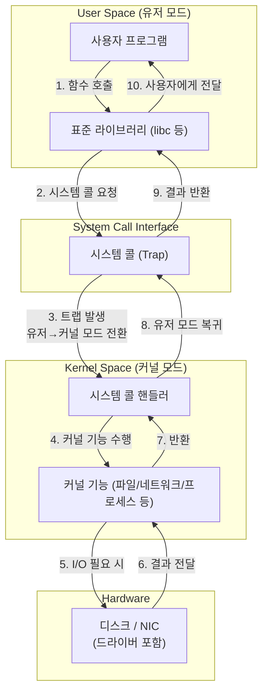
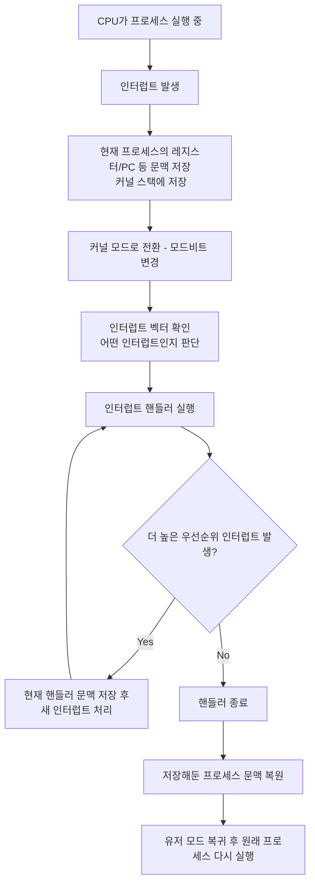

# Operating System (운영체제)

## 📌 시스템 콜

### OS-001
시스템 콜이 무엇인지 설명해 주세요.

- 시스템 콜은 사용자 프로그램(유저 모드)이 운영체제의 기능(커널 모드의 기능)을 사용하기 위해 공식적으로 요청을 보내는 인터페이스이다
- 즉 유저 모드로는 직접 하드웨어에 접근할 수 없기 때문에 OS에게 대신 요청하는 통로인 것
- 모든 시스템 콜은 커널 내부에 존재하는 `시스템 콜 핸들러`가 처리한다

### 꼬리질문 1: 시스템 콜은 커널에서 어떻게 처리되는가?

---

### OS-002
우리가 사용하는 시스템 콜의 예시를 들어주세요.

- 파일 읽기/쓰기: read(), write()
- 파일 열기/닫기: open(), close()
- 프로세스 생성: fork(), exec()
- 메모리 관리: mmap()
- 네트워크: socket(), connect()
- **ex) 자바에서 new FileInputStream()을 사용하면 내부에서 open() 시스템 콜이 호출되어 커널이 파일을 열어주는 것!!**

### 꼬리질문 1: 프로그래밍 시에 시스템 콜의 구체적인 예시를 들자면?

---

### OS-003
시스템 콜이, 운영체제에서 어떤 과정으로 실행되는지 설명해 주세요.

#### 📞 시스템 콜이 호출되는 과정
1. 사용자 프로그램이 시스템 콜을 호출 ex. read(fd, buffer, size)
2. CPU가 유저 모드 -> 커널 모드로 전환(모드 비트 변경)
   - 모드(mode) 비트💡
     - CPU 내부에 있는 1비트짜리 **플래그**: 현재 CPU가 유저모드인지 커널모드인지 구분해줌(커널이 어떤 모드인지!!)
     - 0: 커널모드
     - 1: 유저모드 - 제한됨
3. 커널이 요청을 검사하고 실제 작업 수행
   - 권한 확인: 프로세스 소유자(UID) 비교 + capability 체크로 수행
   - 디스크에서 데이터 읽기
   - 네트워크 패킷 전달 등
     - OS(커널)이 TCP/UDP 헤더 생성 -> 라우팅 정보 붙이기 -> 체크섬 계산 -> 네트워크로 뿌림
4. 다시 커널 모드 -> 유저 모드로 전환
5. 사용자 프로그램에게 결과 반환
#### => 위 과정은 트랩(trap), 즉 소프트웨어 인터럽트를 통해 이루어진다
- 트랩 💡
  - **트랩 == 소프트웨어 인터럽트**
  - 유저모드에서 커널모드로 넘어가기 위해 발생시키는 인터럽트
  - 하드웨어 인터럽트는 키보드, 마우스처럼 밖에서 발생 <-> 트랩은 프로그램이 CPU에게 직접 커널을 호출해달라는 신호
  - 즉 시스템 콜은 트랩을 통해 커널로 진입




### 한줄 답변
- 시스템 콜은 사용자 프로그램이 운영체제의 커널 기능을 사용하기 위해 요청을 보내는 인터페이스이며, 이 과정에서 CPU는 유저 모드에서 커널 모드로 전환된다.

### 꼬리질문 1: 트랩이란 무엇인가? HW 인터럽트와의 차이점은 무엇인가?

---

### OS-004
시스템 콜의 유형에 대해 설명해 주세요.

| 유형 | 설명 | 예시                                              |
|------|------|-------------------------------------------------|
| **1. 프로세스 관리** | 프로세스 생성·종료·대기 | 프로세스 생성 - fork(), 프로세스 종료 - exit() 등            |
| **2. 파일 I/O** | 파일 읽기·쓰기 | open(), read(), write(), close() 등              |
| **3. 디렉터리 / 파일 시스템** | 디렉터리 작업, 파일 권한 관리 | mkdir(), rmdir(), rename(), 파일 권한 변경 - chmod() 등 | 
| **4. 메모리 관리** | `mmap`, `brk` 등 메모리 매핑 및 힙 확장 | 메모리 매핑 - mmap(), 힙 확장 - brk() 등                 |
| **5. 디바이스 제어** | 하드웨어 및 디바이스 파일 제어 | I/O제어 - ioctl() 등                               |
| **6. 네트워크** | 소켓 기반 TCP/UDP 통신 | 소켓 생성 - socket(), 주소 바인딩 - bind() 등             |
| **7. IPC** | 프로세스 간 데이터 교환 (파이프, 메시지 큐 등) | 파이프 생성 - pipe(), 세마포어 - semget() 등              |
| **8. 보안 / 권한** | 인증, 접근 제어, UID/GID 관리 | 사용자ID 조회/변경 - getuid(), 권한 검사 - access() 등      |

### 한줄 답변
- 시스템 콜은 OS 기능을 요청하는 인터페이스로 종류는 크게 프로세스 관리, 파일 I/O, 메모리, 디바이스, 네트워크, IPC, 권한 관리로 나뉜다.

### 꼬리질문 1: 각 유형의 대표적인 시스템 콜을 하나씩 말해본다면?

---

### OS-005
운영체제의 Dual Mode 에 대해 설명해 주세요.

- 운영체제는 '유저모드'와 '커널모드' 두 가지의 모드로 CPU를 나누어서 실행한다.
- User Mode: 일반 프로그램 - ex. Java, 워드, 게임 등
  - 직접 파일 열기, 네트워크 패킷 전송, 메모리 직접 할당, 디바이스(디스크, 키보드 등) 조작 불가
  - => 허용 시, 아무 프로그램이나 하드웨어를 망가뜨릴 수 있기 때문에!
- Kernel Mode: OS의 핵심 기능 - ex. 파일 시스템, 메모리 관리, 프로세스 관리, 네트워크 등
  - 유저 모드에서 할 수 없는 동작을 커널 모드는 할 수 있다
  - '직접 하지 말고 커널 모드인 나한테 요청, **System Call** 해! 내가 대신 해줄게'

---

### OS-006
왜 유저모드와 커널모드를 구분해야 하나요?

1. 보안/안전한 하드웨어 접근: 아무 프로그램이나 하드웨어를 건드려서는 안 된다
- 유저 프로그램이 디스크 직접 쓰기, 메모리 주소 임의 조작, I/O 장치에 직접 접근이 가능하다면 악성 코드가 있을 때 시스템 전체를 망가뜨릴 수 있다.

2. 안정성: 하나의 프로그램이 OS 전체를 죽이면 안 된다
- 유저모드 프로그램은 버그가 많다. 만약 프로그램이 커널처럼 모든 권한이 있다면 잘못된 메모리 접근으로 OS 전체 crash, 다른 프로세스 메모리 덮어쓰기, 파일 구조 깨짐 등의 문제가 발생할 수 있다.
- 그래서 OS는 유저모드를 격리시키고 커널만 시스템 전체를 다룰 수 있도록 한다.

3. 멀티태스킹 환경에서의 공정한 자원의 분배
- 커널은 CPU 스케줄러, 메모리 관리, I/O 스케줄링을 기능별로 관리한다.
- 유저 프로그램이 직접 자원에 접근할 수 있다면 CPU 독점, 메모리 과다 점유, 무한 루프 락 등의 문제가 발생할 수 있으니 커널이 중앙에서 관리해야 공정한 자원의 분배가 가능해진다.

### 한줄 답변
- 유저모드와 커널모드를 나누는 이유는 보안과 안정성을 확보하고 하드웨어를 보호하며, 시스템 자원을 일관되고 공정하게 관리하기 위해서다.
- 유저 프로그램은 손님, 커널은 주방장이다. 손님이 직접 주방에 난입하면 위험하므로 주방장이 요리를 관리해야 식당 전체가 안전하게 돌아간다.

---

### OS-007
서로 다른 시스템 콜을 어떻게 구분할 수 있을까요?

- 시스템 콜은 read(), exit() 등의 함수 이름으로 구분되지 않는다.
- OS는 `번호`로 구분한다(번호는 시스템 콜 테이블에 저장되어 있다)
- 즉 프로그램이 read()를 호출해도 실제로는 커널에 '0번 시스템 콜'로 요청되는 것
- 이러한 시스템 콜 번호는 CPU 레지스터를 통해 전달된다.

[시스템 콜 테이블]
```
sys_call_table = [
  sys_read,      // 0번,
  sys_write,     // 1번
  sys_open,      // 2번
...
]
```
즉 **인덱스**로 접근하는 구조인 것 - 속도 빠름
- read() → sys_call_table[0]
- write() → sys_call_table[1]
- open() → sys_call_table[2]

### 한줄 답변
- OS는 시스템 콜을 함수명이 아니라 시스템 콜 번호로 구분한다. 이 번호는 CPU 레지스터에 담겨 syscall(트랩) 명령을 통해 커널로 전달되고, 커널은 시스템 콜 테이블에서 해당 번호의 함수를 찾아 실행한다.

### 꼬리질문 1: 시스템 콜 번호는 어떻게 전달될까?

---

## 📌 인터럽트

### OS-008
인터럽트가 무엇인지 설명해 주세요.

- 예상치 못한 이벤트가 발생했을 때 CPU의 흐름을 강제로 전환하는 신호
  - 이벤트 ex. 키보드 입력, 마우스 이동, 타이머 알람 발생, 네트워크 패킷 도착 등등 모든 변경사항
- CPU에게 '지금 하던 일을 멈추고 이것부터 처리해'라고 알리는 신호

### 한줄 답변
- 인터럽트는 CPU가 하던 일을 잠깐 멈추고 긴급하거나 중요한 이벤트를 처리하도록 만드는 신호이다. 키보드 입력, 디스크 완료, 네트워크 패킷 등 외부 이벤트를 처리하기 위해 필요하다.

### 꼬리 질문 1: 외부에서 발생하는 이벤트의 예시는 어떤 것들이 있는지?

---

### OS-009
인터럽트는 어떻게 처리하나요?

1. 지금 수행 중인 명령(문맥, 레지스터)을 저장
2. 인터럽트 번호 확인
3. 인터럽트 벡터 테이블(IVT)에서 해당 핸들러 주소 조회
4. 커널 모드로 전환
5. 인터럽트 핸들러 실행
6. 기존 작업으로 복귀(문맥 복원)
- 그래서 유저 프로세스는 방금 인터럽트를 처리하느라 멈췄다는 사실을 인지하지 못한다.

---

### OS-010
Polling 방식에 대해 설명해 주세요.

- 장치가 CPU를 깨우는 것이 아니라 **CPU가** 계속 가서 직접 확인하는 방식`(CPU -> )`
- 인터럽트`(-> CPU 깨움)`와는 방향이 정반대.
- 예시
  - 디스크 I/O에서 디스크에게 '이 파일 읽어줘'라는 요청을 보냈다고 가정하자.
  - 폴링 방식에서 CPU는
    - 완료됨?
    - 완료됨?
    - 완료됨?
  - 처럼 디스크 작업이 완료됐는지 일정 주기마다 체크한다.
- 배달 왔는지 5분마다 나가서 확인하는 것. **그래서 CPU 입장에서 비효율적이긴 하지만 단순하다.**

- 그럼 OS 관점에서 언제 폴링을 사용할까?
  - 일단 일반 OS에서는 대부분 인터럽트 기반으로 동작한다. 그러나 다음 상황은 폴링이 더 유리할 수 있다.
  - 1) 하이퍼로우 지연 시스템: 네트워크 패킷 고속 처리
  - 2) 주기적으로 상태가 바뀌는 장치: 센서 감지, 게임 엔진의 입력 루프
  - 3) 인터럽트 오버헤드가 큰 경우: 대량의 패킷 -> 인터럽트 스톰 -> 시스템 다운


### 한줄 답변
- 폴링은 인터럽트와 정반대 개념으로, CPU가 반복적으로 장치 상태를 확인하며 기다리는 방식이다.

### 꼬리 질문 1: 폴링은 어떤 경우에 사용하는가?
### 꼬리 질문 2: 폴링 방식의 장단점은?
### 꼬리 질문 3: 폴링과 인터럽트의 차이점은?

---

### OS-011
HW / SW 인터럽트에 대해 설명해 주세요.

1. HW 인터럽트 == 보통 그냥 '인터럽트'라고 하면 HW 인터럽트를 말함
- 키보드, 마우스, 디스크, NIC 등 물리적인 장치가 CPU에게 보내는 신호
  - Keyboard Interrupt, Disk I/O Interrupt, NIC Interrupt ...
- "외부"에서 CPU를 깨우는 신호

2. SW 인터럽트(==트랩)
- 프로그램이 의도적으로 발생시키는 인터럽트
- 시스템 콜(syscall): 커널로 진입
- 0으로 나누기 오류(divide-by-zero)
- 페이지 폴트

- 🚨 보통 인터럽트라 하면 하드웨어 인터럽트를 지칭하는 경우가 많고 sw 인터럽트는 시스템 콜로 칭함

  | 구분 | 인터럽트 | 시스템 콜         |
  |------|-----------|---------------|
  | **발생 주체** | 하드웨어가 CPU에 요청 | 프로그램이 OS에 요청  |
  | **발생 시점** | 예상 불가능(비동기) | 동기 호출         |
  | **목적** | 외부 이벤트 처리 | OS 기능 사용      |
  | **커널 진입 방법** | 인터럽트 벡터 | 트랩(syscall 명령) |

### 인터럽트와 시스템 콜의 발생 시점
  - `인터럽트`: **비동기 호출**
    - **프로그램**이 예상치 못한 순간에 발생한다. 프로그램이 '지금 시스템 콜 호출'한다고 의도하고 발생시키는 게 아니다.
    - 키보드 입력, 디스크 읽기 완료, 타이머 인터럽트 ...
    - 즉 인터럽트는 프로그램의 흐름 밖에서 발생하는 외부 이벤트다.
  - `시스템 콜`: **동기 호출**
    - 프로그램 코드 안에서 **의도적으로** 호출된다. 즉 프로그램의 실행 흐름이 특정 지점에서 OS 기능을 요청한다는 의도를 가진다. == **예상된 지점**
    - ex. 라인 10 실행 → read() 호출 → 시스템 콜 발생 → 커널 → 다시 복귀 → 라인 11 실행
    - 의도된 시점 == 동기적 호출
- 시스템 콜은 프로그램의 흐름 속에서 의도된 시점에 호출되는 동기적 호출 방식이고, 인터럽트는 외부 장치가 예측 불가한 시점에 발생시키는 비동기적 호출 방식이다.

### 한줄 답변
- 인터럽트는 CPU가 하던 일을 잠깐 멈추고 긴급하거나 중요한 이벤트를 처리하도록 만드는 신호이다.
- HW 인터럽트는 외부의 물리적인 장치가 CPU에게 보내는 신호이고 SW 인터럽트는 내부 프로그램이 의도적으로 발생시키는 인터럽트이다.

### 꼬리질문 1⭐️: 인터럽트와 시스템 콜의 차이는?
### 꼬리질문 2: 시스템 콜은 어떤 경우에 발생하는지?
### 꼬리질문 3⭐️: 인터럽트와 시스템 콜의 발생 시점은 어떤 차이가 있을까?

---

### OS-012
동시에 두 개 이상의 인터럽트가 발생하면, 어떻게 처리해야 하나요?

1. 인터럽트는 우선순위를 가지므로 우선순위가 높은 것부터 실행한다.
- 인터럽트는 대부분 큐에 저장되어 큐잉 가능한 방식으로 처리된다.
2. 중첩 인터럽트(Interrupt Nesting)
- 인터럽트 A를 처리하고 있는데, 더 높은 우선순위의 인터럽트 B가 들어오면 CPU는
  - A의 상태를 저장
  - B의 인터럽트 핸들러 실행
  - B 처리가 끝나면 A로 복귀
- 즉 인터럽트 핸들러도 중간에 끼어들 수 있다(Preemption)
3. 인터럽트 마스킹(Interrupt Masking)
- 핸들러가 실행되는 동안 특정 인터럽트는 일시적으로 금지(mask)될 수 있다.
- CPU는 특정 인터럽트 레벨 이하의 인터럽트를 무시 + 임계 구역 보호 + 하드웨어 레지스터에 설정됨
- 위처럼 하면 중요한 작업 중 방해받지 않도록 할 수 있다.
4. PIC/APIC가 실제로 인터럽트를 중재한다
- 커널 아래에서 PIC가 우선순위 판별, 마스킹 여부 검토 등 인터럽트의 교통 정리를 담당하는 하드웨어가 존재한다.
5. 한 인터럽트를 처리 중일 때, 똑같은 인터럽트가 오게 되면?
- 일반적으로 합쳐서 처리하거나 이후로 미룬다.


- 여러 인터럽트가 동시에 발생하면 APIC(**인터럽트 컨트롤러**)가 우선순위에 따라 Pending Queue 형태로 보관하고, CPU는 높은 우선순위부터 순서대로 처리한다.
- NIC나 디스크 같은 장치는 자체 큐를 사용하고, 많은 인터럽트는 coalescing 또는 NAPI 폴링으로 해결한다.

| 상황 | CPU 행동 |
|------|-----------|
| **인터럽트 여러 개 동시에 발생** | 우선순위 높은 인터럽트부터 처리 |
| **처리 중 더 높은 우선순위 인터럽트 발생** | 현재 인터럽트 중단 → 높은 우선순위 처리 → 종료 후 원래 작업으로 복귀 |
| **낮은 우선순위 인터럽트** | 큐에 저장하거나, 나중으로 미룸 |
| **마스킹된 인터럽트** | 일시적으로 무시 (비활성화된 상태) |
| **너무 많은 인터럽트 발생** | 인터럽트 폭주 방지 위해 NAPI 등 폴링 방식으로 전환 |

[흐름도]


### 인터럽트 임계구역이란? 💡
- 인터럽트 핸들러가 실행되는 중에 또다른 인터럽트나 커널 코드가 끼어들 수 없는 코드 영역이다.
- 즉 이 구간에서는 인터럽트를 잠시 금지(masking)해서 '중단되면 절대 안 되는' 작업을 안전하게 처리할 수 있다.
- 인터럽트를 일시적으로 disable해서 race condition을 막고 인터럽트 컨트롤러가 pending 처리로 나머지 인터럽트를 큐잉한다.
- 필요성
  - 공유 자원 보호 - 데이터 정합성 보장, race condition 방지
  - 인터럽트 중첩 방지 - 무한 루프 방지
- 🚨스레드 임계구역과는 다름🚨

### 한줄 답변
- 인터럽트는 우선순위가 있기 때문에 여러 개가 동시에 발생하면 높은 우선순위부터 처리한다.
- 필요하면 중첩하여 처리 중에도 더 중요한 인터럽트가 끼어들 수 있고, 하드웨어(APIC)가 큐잉과 마스킹을 조절해 충돌 없이 정교하게 처리한다.

### 꼬리 질문 1: 중첩 인터럽트의 개념과 처리 방법은?
### 꼬리 질문 2: 한 인터럽트를 처리 중일 때 그와 똑같은 인터럽트가 왔을 때의 처리 방법은?
### 꼬리 질문 3⭐️: 인터럽트는 어떤 자료구조에 저장되는지?
### 꼬리 질문 4⭐️: 임계구역이란 무엇이고 왜 필요한지?

---

## 📌 프로세스

### OS-013
프로세스가 무엇인가요?

- 프로세스는 `실행 중인 프로그램`이며 코드, 메모리, 레지스터 상태, OS 리소스 등 실행에 필요한 모든 자원을 가진 독립된 실행 단위
- 즉 프로세스는 자체 메모리 공간(가상 메모리 공간 VM)이 있다.
- 각 프로세스는 별도의 주소 공간에서 실행되며 한 프로세스는 다른 프로세스의 변수나 자료구조에 접근할 수 없다
- 한 프로세스가 다른 프로세스의 자원에 접근하려면 프로세스 간의 통신(IPC, Inter-Process Communication)을 사용해야 한다.

### 프로세스의 자원 구조(구성 요소)
[레퍼런스](https://inpa.tistory.com/entry/%F0%9F%91%A9%E2%80%8D%F0%9F%92%BB-%ED%94%84%EB%A1%9C%EC%84%B8%EC%8A%A4-%E2%9A%94%EF%B8%8F-%EC%93%B0%EB%A0%88%EB%93%9C-%EC%B0%A8%EC%9D%B4)


- 프로그램이 실행되어 프로세스가 만들어지면 4가지의 메모리 영역으로 구성되어 할당받게 됨
1. 코드(text) 영역
   - 실행할 **기계어 코드**
2. 데이터 영역
   - 코드가 실행 시 필요한 전역 변수, static 변수
3. 스택 영역
   - 함수 호출, 지역변수, 리턴 주소 등의 저장공간
   - 스레드마다 스택을 변도로 가진다.
   - 스택은 함수의 호출과 함께 할당되며, 함수의 호출이 완료되면 소멸. 만약 스택 영역을 초과하면 stack overflow 에러가 발생
4. 힙 영역
   - `new`, `malloc`으로 동적 메모리가 할당되는 영역
   - 즉 생성자, 인스턴스와 같은 **동적으로 할당되는 데이터**들을 위해 존재하는 공간이다.

이외에도
5. 레지스터 상태(문맥, context): 프로세스 중단 시 레지스터에 값 저장
6. OS 리소스: 소켓, 메모리 공간, 우선순위, 스케줄링 정보 등


- 코드 영역, 데이터 영역은 선언할 때 그 크기가 결정되는 정적 영역
- 스택 영역, 힙 영역은 프로세스가 실행되는 동안 크기가 늘어났다 줄어들었다 하는 동적 영역

### 한줄 답변
- 프로세스는 `실행 중인 프로그램`이며 코드, 메모리, 레지스터 상태, OS 리소스 등 실행에 필요한 모든 자원을 가진 독립된 실행 단위다.

### 꼬리질문 1: 프로세스의 자원 구조를 4가지로 설명한다면?
### 꼬리질문 2: 한 프로세스가 다른 프로세스의 자원에 접근하기 위한 방법은?

---

### OS-014
프로그램과 프로세스, 스레드의 차이에 대해 설명해 주세요.
[레퍼런스](https://inpa.tistory.com/entry/%F0%9F%91%A9%E2%80%8D%F0%9F%92%BB-%ED%94%84%EB%A1%9C%EC%84%B8%EC%8A%A4-%E2%9A%94%EF%B8%8F-%EC%93%B0%EB%A0%88%EB%93%9C-%EC%B0%A8%EC%9D%B4)

1. 프로그램: 단순히 디스크에 저장된 **정적 실행 파일**, 코드 덩어리
2. 프로세스: 프로그램(파일)이 **메모리에** 적재되어 **실제로 실행 중인 동적 상태**, 코드 덩어리를 실행한 것
   - 즉 파일은 프로그램이고 실행되는 순간 프로세스가 된다.
3. 스레드: 프로세스 내에서 실행 흐름을 나누는 가장 작은 실행 단위(흐름)
   - 프로세스의 특정한 수행 경로, 프로세스가 할당받은 자원을 이용하는 실행의 단위
   - 프로세스와는 달리 공유 메모리 공간에서 실행된다
   - **스레드는 프로세스 내에서 각각 스택만 따로 할당받고 code, data, heap 영역은 공유한다.**
     - 
   - 각각의 스레드는 별도의 레지스터와 스택을 가지고 있지만, 힙 메모리는 서로 읽고 쓸 수 있다.
   - 한 스레드가 프로세스 자원을 변경하면, 다른 이웃 스레드도 그 변경 결과를 즉시 볼 수 있다.

`멀티 태스킹`
- 하나의 OS에서 **여러 프로세스를 동시에 실행**되는 것처럼 보이도록 CPU 시간을 분할해 실행하는 것
- 즉 여러 작업을 번갈아 빠르게 실행 -> 동시 실행처럼

`멀티 프로세싱`
- 하나의 프로그램에 대해 여러 개의 CPU 코어나 프로세서를 사용해서 여러 프로세스를 실제로 동시에 실행하는 방식
- 물리적으로 동시에 실행
- Context Switching 오버헤드 발생 가능성 O
- 멀티 프로세스는 멀티 스레드 환경보다 훨씬 더 안전하다
  - 프로세스는 메모리를 완전히 독립적으로 가진다.
  - 하나의 프로세스가 죽어도 다른 프로세스의 메모리, 실행 흐름에는 전혀 영향을 주지 않는다.
  - ex) 크롬 탭 하나가 죽어도 전체 브라우저는 살아있음
  - 스레드는 메모리 공유 -> 한 오류가 전체에 영향

`멀티 스레딩`
- 하나의 프로세스 내부에서 여러 스레드가 동시에 작업하도록 하는 방식
- 같은 메모리를 공유하며 병렬/동시 실행
- 멀티 프로세스와 달리 자원을 공유하기 때문에 통신 부담이 적고 Context Switching 오버헤드가 적음, IPC 없이 통신 가능
- 문제점
  - But 하나의 스레드에 문제가 발생하면 전체 프로세스가 영향을 받는다
  - 여러 스레드가 같은 데이터를 동시에 수정하면 데이터 손상(정합성 문제)이 발생할 수 있으므로 동기화(Lock)이 반드시 필요하다
  - 교착상태: 두 스레드가 서로 락을 기다리며 무한 대기에 빠지는 문제
  - 한줄 답변: 멀티스레딩 환경에서는 메모리를 공유하므로 하나의 스레드 오류가 전체 프로세스를 중단시킬 위험이 있고, 공유 자원 접근 시 race condition, deadlock 같은 동기화 문제가 발생할 수 있으므로 적절한 락 설계가 필요하다.
- 즉 멀티 프로세스는 안정성이 높지만 성능이 좋지 않고, 멀티 스레드는 성능은 좋지만 위험도가 높다.
- 스위칭이 훨씬 빠르고 통신의 용이성 등의 이유로 멀티 스레드를 더 많이 사용하긴 함

`락 최소화 기법`
- Lock 범위를 최소화: 필요한 구역에서만 잠깐 잠그고 나머지는 락 없이 처리, Critical Section을 짧게 만들기
- 읽기 작업은 동시에 허용하고 쓰기만 단독으로 수행: 읽기 연산이 많은 시스템에서는 성능 크게 향상
- 데이터 분할(샤딩, 파티셔닝)⭐️: 하나의 큰 공유 데이터 대신 데이터를 조각내서 스레드 경쟁을 줄이는 방식
- 불변(Immutable) 객체 사용: 불변 객체는 락이 필요없다. 공유하더라도 race condition 발생 X
  - ex. 읽기 전용 캐시 스냅샷, Immutable DTO 등
- Thread-Local Storage(TLS) 활용: 스레드마다 독립된 변수를 가지게 해서 공유 자원을 없애기 - 공유 자원을 안 쓰므로 락도 필요 X


### 한줄 답변
- 프로그램은 디스크에 저장된 실행 파일이고, 프로세스는 그 프로그램이 메모리에 올라와 실행되는 독립된 실행 단위이며, 스레드는 프로세스 안에서 실행 흐름을 나누는 가장 작은 실행 단위이다.

### 꼬리 질문 1: 멀티 프로세스와 멀티 스레드의 차이는?
### 꼬리 질문 2: 멀티 태스킹과 멀티 프로세싱, 멀티 스레딩의 차이는?
### 꼬리 질문 3: 멀티 스레딩 환경에서 주의해야 할 점은?
### 꼬리 질문 4: 멀티 스레딩 환경에서 데이터 정합성을 보장하기 위한 기법은?
### 꼬리 질문 5: 적절한 Lock 설계란 무엇이라 생각하는가? 그리고 그 설계를 위한 기법은?
### 꼬리 질문 6: 멀티 프로세스와 멀티 스레드 중 어느 환경이 더 안전하다고 생각하는가?
### 꼬리 질문 7: 멀티 프로세스와 멀티 스레드 중 어느 환경을 더 자주 사용한다고 생각하는가? 그 이유는?

---

### OS-015
PCB가 무엇인가요?

- 운영체제가 프로세스를 중단했다가 나중에 정확히 다시 이어서 실행하기 위해 해당 프로세스의 모든 실행 정보를 저장하는 공간이 필요한데, 그걸 저장하는 자료구조가 PCB
- PCB에 들어있는 정보들
  - 프로세스 상태: Running/Ready/Waiting/Blocked
  - PID(Process ID): 프로세스 식별자
  - 레지스터 값(Context, 문맥 정보): CPU 레지스터 값들 -> Context Switching 시 반드시 저장
  - 프로세스 메모리 정보: 코드/데이터/스택/힙 메모리 위치, 페이지 테이블 정보
  - 스케줄링 정보: 우선순위, CPU 사용 시간, 타임 슬라이스 정보(Mac OS의 프로세스 활성 상태)
  - I/O 상태 정보: I/O 요청 목록, 입출력 대기 큐 위치
  - ...

- 그리고 이 PCB는 `커널 공간`에 저장된다.
  - 그러므로 유저 프로그램은 PCB를 절대 직접 수정할 수 없다.

### 한줄 답변
- PCB는 프로세스 제어블록으로, 운영체제가 프로세스를 관리하기 위해 그 실행 상태, 관리 정보를 저장해두는 자료구조이다. 프로세스를 관리하는 데 필요한 모든 정보를 담고 있어 프로세스의 주민등록증 역할을 한다.

### 꼬리 질문 1: PCB에는 어떤 정보들이 들어있는지?
### 꼬리 질문 2: PCB는 어디에 저장되는지?

---

### OS-016
그렇다면, 스레드는 PCB를 갖고 있을까요?

- 스레드는 PCB 전체를 갖지 않고 프로세스의 PCB를 공유하면서 자기만의 실행 정보(TCB)만 별도로 가진다.
- 스레드는 프로세스의 자원을 공유하기 때문에 PCB 전체가 필요하지 않으며, 대신 스레드 고유 정보만 저장한 TCB가 필요하다. + TCB 문맥 교환 비용이 PCB보다 적다
- 물론 TCB도 커널 공간 안에 저장되고, 스레드별로 저장된다.
 
```
프로세스 (PCB)
├─ 코드 영역
├─ 데이터/힙
├─ 파일 디스크립터
├─ 스케줄링 정보
├─ 보안 정보
└─ 스레드들
    ├─ 스레드 1 (TCB: PC, 레지스터, 스택)
    ├─ 스레드 2 (TCB: PC, 레지스터, 스택)
    └─ 스레드 3 (TCB: PC, 레지스터, 스택)
```

### 꼬리 질문 1: 스레드가 별도의 TCB를 갖는 이유?

---

### OS-017
리눅스에서, 프로세스와 스레드는 각각 어떻게 생성될까요?

[리눅스에서의 프로세스 생성 단계]
1. fork(): 프로세스를 복사해서 새 프로세스 만들기
- 해당 시스템 콜을 호출하면 현재 프로세스를 거의 그대로 복제해서 새로운 프로세스(자식 프로세스)를 만든다
- 그러므로 자식은 부모의 코드, 힙/데이터, 환경 변수 등을 그대로 가진 상태에서 실행을 시작한다.
- 그러나 주소 공간은 Copy-on-Write로 '공유 -> 수정 시 복사' 방식이므로 비용을 최소화한다.

2. exec(): 새로운 프로그램으로 덮어쓰기
- fork()로 만든 자식 프로세스는 대부분 곧바로 exec()을 호출해서 새로운 프로그램을 메모리에 적재한다.

- 즉 `fork()로 프로세스 복사 -> exec()로 새로운 프로그램으로 덮어쓰기`가 리눅스/UNIX의 기본 프로세스 생성 표준 패턴

### 한줄 답변
- 리눅스에서 프로세스는 fork() 시스템 콜로 복제되고 exec()로 새로운 프로그램을 로드하여 생성된다.


[리눅스에서의 스레드 생성 단계]
- 스레드도 사실상 프로세스처럼 생성된다. 즉 완전히 같은 구조로 만들지만 자원을 공유하도록 `flag만 다르게 설정`하는 방식이다.
- 그러므로 리눅스에서 스레드는 별도의 '스레드 전용 시스템 콜'이 있는 것이 아니라 `clone() 시스템 콜`이 내부에서 호출되어 생성된다.
- `pthread_create(...) → 내부적으로 clone(CLONE_VM | CLONE_FS | CLONE_FILES | CLONE_SIGHAND | ...)`
  - 위 flag 들이 자원을 공유하는 스레드를 만들어준다
- pthread_create(): 라이브러리 함수 (glibc)

```
  사용자 코드
  ↓
  pthread_create()     ← 라이브러리 함수 (glibc)
  ↓
  clone()              ← 실제 스레드를 만드는 시스템 콜
  ↓
  커널 내부에서 TCB 생성 + 스택 생성 + 스케줄링 등록
```

- 즉 나는 pthread_create() 라이브러리 함수만 사용하면 OS가 clone() 시스템 콜을 통해 스레드를 생성한다.
- 스레드는 오직 clone()으로만 생성할 수 있고 fork()로는 생성 불가(플래그가 없기 때문)

`pthread_create()는 언제 호출하게 되는가?`
- 멀티 스레딩이 필요할 때!!
- 즉 프로세스 안에서 동시에 여러 일을 처리하고 싶을 때 개발자가 직접 이 라이브러리 함수를 호출한다.
- 1. 병렬 처리가 필요할 때
- 2. 비동기 작업이 필요할 때
  - `@Async`를 붙인 메서드 실행 -> 내부적으로 pthread_create() 호출
  - 예를 들어 이메일 전송을 별도 스레드에서 실행하고 싶을 때
- 3. 서버에서 요청을 스레드로 처리할 때
- 4. 직접 스레드 풀을 구성할 때
- Thread/@Async/Executor 등을 사용할 때 JVM은 내부적으로 OS 스레드를 생성하고 실제 스레드는 clone() 시스템 콜로 만들어진다.(자바는 스레드 API만 제공)


### 한줄 답변
- 리눅스에서 스레드는 프로세스처럼 별도의 시스템 콜을 가지지는 않고, pthread_create()를 호출하면 내부적으로 clone() 시스템 콜을 호출해 메모리를 공유하는 흐름으로 생성된다.

### 꼬리 질문 1: 왜 스레드는 fork()로 생성할 수 없는가?
### 꼬리 질문 2: 유저가 pthread_create()를 호출하게 되는 경우는?

---

### OS-018
자식 프로세스가 상태를 알리지 않고 죽거나, 부모 프로세스가 먼저 죽게 되면 어떻게 처리하나요?

1. 자식 프로세스가 상태를 알리지 않고 죽는 경우(좀비 프로세스)
- 자식 프로세스가 exit()로 종료 -> 그러나 부모가 wait()을 호출하지 않음 -> 부모의 자식의 종료 상태를 회수하지 않음
- 결과적으로 좀비 프로세스가 발생 - 즉 이미 프로세스는 죽었지만, PCB만 커널에 남아있는 상태
- 이때는 init 프로세스(PID 1번)가 대신 wait()을 호출하여 회수한다.
- 즉 `메모리 누수`만 잠깐 발생할 뿐, 좀비 프로세스는 반드시 수거된다(reaped)

### 한줄 답변
- 자식이 먼저 죽으면 좀비 상태가 되지만, 결국 init 프로세스가 대신 정리한다.

2. 부모 프로세스가 먼저 죽는 경우(고아 프로세스)
- 부모 프로세스가 exit() -> 고아 프로세스 발생
- 고아 프로세스는 부모가 죽는 순간 자동으로 init(PID 1) 프로세스를 새로운 부모로 삼는다 -> init 프로세스가 대신 관리해줌
- 그리고 자식이 종료될 때 init이 wait()로 수거해준다.
- 발생하는 문제 X


### 한줄 답변
- 자식이 먼저 죽고 부모가 wait을 호출하지 않으면 좀비가 되지만, init이 입양하여 수거한다. 부모가 먼저 죽으면 자식은 고아가 되고 init이 부모 역할을 맡아 정상 관리된다.
- 그러므로 리눅스에서는 프로세스가 방치되는 일은 없다.

---

### OS-019
리눅스에서, 데몬프로세스에 대해 설명해 주세요.

`데몬 프로세스`
- 리눅스에서 백그라운드에서 지속적으로 실행되며 시스템 서비스를 제공하는 특별한 프로세스
- 사용자의 로그인 여부와 관계없이 계속 실행 - **OS의 기본 기능 담당!!**
- 예시
  - sshd: SSH 접속 담당
  - nginx: 웹서버
  - systemd: 부팅, 서비스 관리
- 데몬은 터미널과 분리된 상태로 동작하며 OS 서비스 핵심 역할을 수행

`데몬 프로세스의 특징`
1. 부모 프로세스가 init(PID=1)
  - 데몬은 보통 자신의 부모를 종료시키고 init이 입양하도록 만들어 고아 프로세스가 되는 방식으로 실행된다
  - 즉 데몬의 부모는 무조건 init
  - WHY? **데몬은 시스템이 종료되기 전까지 절대 죽지 않는 프로세스이므로 데몬이 안정적으로 유지될 수 있다.**

2. 터미널과 분리
   - 데몬은 shell과 연결되어서는 안 된다

3. 백그라운드에서 지속 실행
- 유저 로그아웃과 무관, 시스템 부팅할 때 자동 실행되기도 함
- 서비스 형태로 동작 `systemctl start xxx.service`

`데몬 프로세스의 생성 방식`
- fork() 후 부모 종료 -> 고아 상태, init이 부모 -> setsid()로 새로운 세션 생성, 터미널과 완전 분리 -> 현재 작업 디렉토리 변경(/로) -> umask(0)로 파일 모드 마스크 설정 -> 표준 입출력 리다이렉션 -> 무한 루프 또는 서비스 루프 실행
- 위 절차 덕에 데몬은 부팅 이후 계속 돌고 + 터미널과 연결도 없으며 + OS 서비스 역할을 안정적으로 수행할 수 있음

### 한줄 답변
- 데몬 프로세스는 터미널과 분리된 채 백그라운드에서 계속 실행되며 시스템 서비스를 제공하는 프로세스이다.
- 보통 fork로 부모를 종료해 init이 부모가 되도록 하여 안정성을 확보하며 세션 분리·입출력 리다이렉트 등을 수행해 독립적으로 실행된다.

---

### OS-020
리눅스는 프로세스가 일종의 트리를 형성하고 있습니다. 이 트리의 루트 노드에 위치하는 프로세스에 대해 설명해 주세요.

- 리눅스 프로세스 트리의 루트 노드는 PID 1번 프로세스, 즉 init(systemd) 프로세스다.
- 리눅스 커널이 부팅되면 가장 먼저 하는 일은
  - 커널 초기화, PID 1 프로세스 실행, PID 1이 다른 프로세스들을 시작(로그인 서비스, 데몬, 네트워크, 스케줄러 등)
- 즉 PID 1은 모든 프로세스의 조상이다.
- 그러므로 PID 1이 죽으면 시스템이 멈춘다.

### 한줄 답변
- 리눅스 프로세스 트리의 루트는 PID 1(systemd)이며 부팅 후 가장 먼저 실행되는 유저 공간 프로세스이다.
- 모든 프로세스의 조상이며, 고아/좀비 프로세스 관리, 서비스 관리, signal 전달 등 시스템 안정성을 책임진다.

### 꼬리 질문 1: 왜 PID 1이 루트인지?
### 꼬리 질문 2: Docker 컨테이너에서 PID 1의 의미는?
### 꼬리 질문 3: systemd가 init과 어떤 점이 다른지?

---

## 📌 프로세스 주소공간

### OS-021
프로세스 주소공간에 대해 설명해 주세요.

`프로세스 주소공간`
- 운영체제가 각 프로세스에게 부여하는 독립적인 **가상 메모리 공간**이다.
- 왜 VM을 사용할까?
  - **실제 메모리(RAM)는 프로그램이 직접 접근하면 충돌이 일어나거나 시스템 안정성이 깨질 수 있다.**
  - 그래서 OS는 MMU(메모리 관리 장치)를 사용해서 '각 프로세스가 자신만의 메모리를 갖고 있는 것처럼' 보이게 한다.
  - 이제 각 프로세스는 논리적 구조의 주소 공간을 갖는다.
  
  <br>

`프로세스 주소공간의 구조(리눅스 기준 64비트 프로세스) = 메모리 레이아웃`

```
+-------------------------+  높은 주소
|       커널 영역           |   (프로세스가 접근 불가)
+-------------------------+
|        스택(Stack)       |  ← 아래쪽으로 자람
+-------------------------+
|        힙(Heap)         |  ← 위쪽으로 자람
+-------------------------+
|   BSS (초기화 X 전역변수)  |
+-------------------------+
|   Data (초기화된 전역변수)  |
+-------------------------+
|   Text (코드 영역)        |
+-------------------------+  낮은 주소
```


`프로세스 주소공간의 중요성`
1. 프로세스 간 격리 보장
2. 다른 프로세스나 커널 메모리 보호
3. 효율적인 메모리 관리: Copy-on-Write / Lazy allocation 등
4. 문맥 교환 시에도 주소 공간이 기준: PCB 정보에 페이지 테이블 포인터 존재 -> 프로세스 스위칭 시 OS는 주소 공간을 통째로 전환하게 됨


### 한줄 답변
- 프로세스 주소 공간은 프로세스가 사용하는 모든 코드·데이터·스택·힙 등을 포함하는 독립적인 가상 메모리 구조이다.

### 꼬리 질문 1: 왜 가상 메모리를 쓰는가?
### 꼬리 질문 2: 프로세스 주소 공간의 중요성은 무엇인가?

---

### OS-022
초기화 하지 않은 변수들은 어디에 저장될까요?

- 초기화 하지 않은 전역 변수와 static 변수들은 BSS 영역(Block Started by Symbol, BSS Segment)에 저장된다.
- ex) int counter; static int cache; 등의 초기값이 없는 전역/static 변수

- Code (Text) 영역: 실행할 코드가 저장됨
- Data 영역: 초기화된 전역/정적 변수가 저장됨
- BSS 영역: 초기화되지 않은 전역/정적 변수가 저장됨 
- Heap 영역: 동적 할당(malloc 등)된 메모리 
- Stack 영역: 지역 변수, 매개 변수 등이 저장됨

`BSS 영역의 특징`
- 실제 실행 파일에는 공간 차지 X: 초기값이 없는 변수 목록만 기록, 실행 시 OS가 0으로 초기화
- 런타임에 RAM 공간이 할당
- 초기값 있는 전역/static 변수인 Data 영역과 반대


### 꼬리 질문 1: BSS 영역의 특징은 무엇인가?

---

### OS-023
일반적인 주소공간 그림처럼, Stack과 Heap의 크기는 매우 크다고 할 수 있을까요? 그렇지 않다면, 그 크기는 언제 결정될까요?

1. 스택의 크기: 동적이지만 최대 크기 제한 O
- 스택은 함수 호출 시 자동으로 증가한다
- 즉 `함수 호출 -> 지역변수 -> 리턴 주소 저장` 과정에서 스택 프레임이 쌓이면서 그 크기가 증가하고 함수가 끝나면 감소
- 그러나 최대 크기 제한이 있다 -> Stack Overflow 위험
  - 리눅스 기준으로 기본 스택 크기 8MB, 자바 스레드 기본 1MB 등 환경마다 다름

2. 힙의 크기: 거의 완전히 동적, 제한 X
- 프로그램에서 malloc, new를 호출하면 메모리를 요청하고 힙은 이러한 요청을 받으면 계속 커질 수 있다.
- 실제 힙 확장은 OS 시스템 콜(brk, mmap)으로 이루어짐

### 한줄 답변
- 스택은 스레드 생성 시 **최대 크기**가 정해지고 그 안에서만 동적으로 변한다. 
- 힙은 런타임 동안 new/malloc 요청에 따라 필요할 때마다 OS가 확장하며, 사실상 제한은 시스템 메모리뿐이다.

### 꼬리 질문 1: 스택은 왜 최대 크기 제한이 있는가?
### 꼬리 질문 2: 힙은 왜 최대 크기 제한이 없는가?

---

### OS-024
Stack과 Heap 공간에 대해, 접근 속도가 더 빠른 공간은 어디일까요?

`스택이 힙보다 훨씬 빠른 이유`
- 스택은 LIFO로 단순한 구조 -> CPU가 포인터 하나만 증가/감소시키면 된다 => O(1)
- 스택은 CPU 레지스터로 바로 접근이 가능하다
  - 스택 포인터는 CPU 레지스터로 관리된다.
  - CPU가 스택 데이터에 직접 접근 가능 -> `캐시 히트율 높음` -> 매우 빠름

- 힙은 malloc/new 때 메모리 관리자가 복잡한 연산을 수행해야 하므로 느리다
  - ex. 빈 메모리 블록 탐색, 블록 분할/병합, free 리스트 관리, 내부/외부 단편화 처리
- 메모리 힙은 연결리스트로 관리된다
  - 스택은 차곡차곡 위로 쌓이기 때문에 복잡한 관리가 필요 없고 포인터로 위아래만 움직이면 된다.
  - 반면 힙은 사용자가 언제 얼마만큼의 크기를 요청하고 반납할지 알 수 없기 때문에 메모리가 구멍 난 치즈처럼 흩어지게 된다
  - 그리고 이 흩어진 메모리를 관리하기 위해 운영체제는 free list라는 자료구조를 사용한다.
    - malloc(할당): 연결 리스트 순회 -> 요청한 크기만큼 들어갈 수 있는 빈 공간 찾아 할당
    - free(해제): 사용이 끝난 메모리 블록을 다시 연결 리스트에 사용 가능 상태로 등록

- 스택은 연속된 메모리 구조, 힙은 흩어진 메모리 구조
- 그래서 스택은 CPU 캐시 친화적이고, 힙은 캐시 미스가 자주 발생한다.
- 스택 접근 -> L1/L2 캐시에 잘 올라와서 빠름
- 힙 접근 -> 메모리 랜덤 위치 -> 느림

### 한줄 답변
- 스택이 힙보다 훨씬 빠르다.
- 스택은 단순한 포인터 이동만 필요하고 CPU 레지스터로 직접 관리되지만, 힙은 동적 메모리 관리(alloc/free)가 필요해 비용이 크다.

### 꼬리 질문 1: 빠른 이유는?

---

### OS-025
다음과 같이 공간을 분할하는 이유가 있을까요?

- 프로세스의 주소 공간을 Text, Data/BSS, Heap, Stack으로 분리하는 이유
- 메모리의 용도와 성질이 다르기 때문.
- 코드 영역은 쓰기 금지, 데이터 영역은 읽기·쓰기 가능, 스택은 빠른 접근, 힙은 동적 확장 등 서로 보호 방식과 운영 방식이 다르기 때문에 영역을 분리해야 OS가 관리·보안·성능을 최적화할 수 있다.

### 한줄 답변
- 프로세스 주소공간은 관리·보안·성능 최적화를 위해 용도별로 분리된다.

### 꼬리 질문 1: Text 영역과 Data 영역에 서로 다른 보호 비트를 적용하는 이유는 무엇인가?
### 꼬리 질문 2: 스택과 힙의 성장 방향을 분리하는 것이 왜 필요한가?

---

### OS-026
스레드의 주소공간은 어떻게 구성되어 있을까요?

- 스레드는 프로세스 내부에서 실행되므로 코드(Text), 전역 변수(Data/BSS), 힙은 공유
- 하지만 스레드마다 독립적인 스택, 레지스터 상태, 스케줄링 정보(TCB), TLS(Thread Local Storage)를 가진다.
- 이 구조 덕분에 스레드는 프로세스보다 빠르게 생성되고 전환되며, 데이터 공유도 자연스럽게 이뤄진다.

### 한줄 답변
- 스레드는 프로세스 주소공간을 공유하지만 스택과 TCB는 스레드마다 별도로 갖는다.

### 꼬리 질문 1: 스레드마다 스택이 필요한 이유는 무엇인가?
### 꼬리 질문 1: 전역변수를 공유하면 왜 동기화가 필요한가?

---

### OS-027
프로세스 메모리 차원에서 "스택"영역과 "힙"영역은 정말 자료구조의 스택/힙과 연관이 있는 걸까요? 만약 그렇다면, 각 주소공간의 동작과정과 연계해서 설명해 주세요.

`스택 영역`
- 스택 영역은 자료구조의 스택(LIFO)과 완전히 동일한 동작을 한다.
- → 함수 호출 시 push, 리턴 시 pop

`힙 영역`
- 힙은 자료구조의 힙(heap tree)과 직접적 연관은 없다.
- → 단지 `동적 메모리 풀`을 의미하며, 메모리 관리자(malloc)가 임의 위치에 할당한다.

### 한줄 답변
- 스택은 자료구조 스택과 동일하게 동작하지만 힙은 자료구조 힙이 아니라 동적 메모리 영역을 의미한다.

### 꼬리 질문 1: 스택 기반 버퍼 오버플로는 어떤 원리로 발생하는가?
### 꼬리 질문 2: 힙에서 malloc/free는 어떤 방식으로 메모리를 관리하는가?

---

### OS-028
IPC(Inter-Process Communication)의 Shared Memory 기법은 프로세스 주소공간의 어디에 들어가나요? 그런 이유가 있을까요?

- Shared Memory는 여러 프로세스가 동일한 물리 메모리를 매핑해야 하므로 mmap 기반 “메모리 매핑 영역”에 위치
- Data/BSS처럼 프로세스마다 독립된 공간에는 둘 수 없고, 스택처럼 스레드 전용 영역에도 둘 수 없다.
- mmap 영역이 가장 유연하게 페이지를 공유할 수 있는 구조다.
- 스택과 힙 사이에 존재!
  - 힙/스택의 성장을 방해하지 않고 효율적으로 큰 메모리를 할당하기 위함

---
Stack (위에서 아래로 자람): 높은 주소 → 낮은 주소

⬇ (빈 공간) ⬇

Memory Mapping Segment (mmap 영역): 여기에 Shared Memory, 공유 라이브러리(.so 파일) 등이 들어온다

⬆ (빈 공간) ⬆

Heap (아래에서 위로 자람): 낮은 주소 → 높은 주소

BSS / Data / Text

---

### 한줄 답변
- Shared Memory는 스택과 힙 사이에 mmap 기반 메모리 매핑 영역(Memory Mapping Segment)에 위치한다.

### 꼬리 질문
- Shared Memory가 가장 빠른 IPC 방식인 이유는 무엇인가?
- Shared Memory 사용 시 동기화가 필요한 이유는?

---

### OS-029
스택과 힙영역의 크기는 언제 결정되나요? 프로그램 개발자가 아닌, 사용자가 이 공간의 크기를 수정할 수 있나요?

- 스택은 프로세스 시작 또는 스레드 생성 시 최대 크기가 결정되고 그 범위 내에서만 증감한다.
- 힙은 실행 중 malloc/new 요청에 따라 brk 또는 mmap을 통해 확장된다.
- 사용자는 ulimit, JVM 옵션(-Xss, -Xmx) 등으로 각각의 크기를 조정할 수 있다.

### 한줄 답변
- 스택은 스레드 생성 시 최대 크기가 정해지고 힙은 실행 중 확장되며 둘 다 사용자 설정으로 조정 가능하다.

### 꼬리 질문
- 스택 오버플로는 어떤 상황에서 발생하는가?
- 힙 부족(OOM)은 어떤 상황에서 발생하는가?

---

## 📌 CPU 스케줄링

### OS-030
단기, 중기, 장기 스케쥴러에 대해 설명해 주세요.

- 장기 스케줄러는 어떤 작업을 메모리에 올릴지 결정한다(job → ready) -> 현대 OS에 거의 존재 X
  - 과거는 일괄 처리 시스템이었지만 **현재는 시분할 시스템이기 때문**
  - 즉 사용자가 아이콘을 더블 클릭하면 "즉시" 실행되어야 함
  - 운영체제가 "지금 프로세스가 너무 많으니 당신의 카카오톡 실행을 10분 미루겠습니다"라고 하면 아무도 쓰지 않을 것
  - 따라서 현대 OS에서는 프로그램을 실행하면 무조건 메모리에 올린다.
  - 대신 메모리가 부족하면 가상 메모리(Swap) 기술로 해결
- 중기 스케줄러(Swapper)는 **메모리 부족 시** **프로세스를 swap-out**하여 **suspended 상태로** 만든다.
  - 메모리가 부족할 때, 당장 안 쓰는 프로세스를 쫓아내서 디스크(Swap Area)로 보내버리고(Swap-out), 나중에 다시 가져오는(Swap-in) 역할
- 단기 스케줄러는 ready 상태의 프로세스 중 누구를 running으로 보낼지 결정하는 실제 CPU 스케줄러이다.

### 한줄 답변
- 장기·중기·단기 스케줄러는 각각 작업 선택, 메모리 관리, CPU 배분을 담당한다.

### 꼬리 질문
- 현대 데스크탑 OS에서 왜 장기 스케줄러가 거의 사용되지 않을까?
- 중기 스케줄러가 없는 시스템에서는 메모리 부족 시 어떤 방식으로 처리할까?

---

### OS-031
현대 OS에는 단기, 중기, 장기 스케쥴러를 모두 사용하고 있나요?

- 현대 일반 OS는 장기 스케줄러를 거의 사용하지 않는다.
- 프로세스는 사용자가 즉시 실행하는 구조라 job queue가 없다.
- 중기 스케줄러도 메모리 과부하가 있지 않으면 거의 동작하지 않는다. 실질적으로 항상 동작하는 것은 단기 스케줄러이다.

### 한줄 답변
- 현대 OS는 주로 단기 스케줄러 중심으로 동작하고 장기·중기 스케줄러는 제한적으로만 사용된다.

### 꼬리 질문
- 현대 시스템에서 job queue가 사라진 이유는?
- 중기 스케줄러가 활발히 사용되는 환경은 어떤 곳일까?

---

### OS-032
프로세스의 스케쥴링 상태에 대해 설명해 주세요.

- new, ready, running, waiting(blocked), terminated 상태가 있으며 I/O 요청 시 waiting으로 이동한다
- New 상태에서 프로세스가 생성 승인을 받으면 Ready 큐에 들어간다.
- Waiting 상태에서 기다리던 I/O 작업이 끝나면(I/O Completion), 다시 Ready 큐로 들어간다.
- running에서 타임 슬라이스가 끝나면 다시 ready로 전환된다.(혼자 CPU를 독점하지 못하도록)

| 상태 전이 | 원인 (이벤트) | 설명 |
| :--- | :--- | :--- |
| **Dispatch** | Ready → Running | 스케줄러가 "너 나와서 일해"라고 선택함 |
| **Timeout** | Running → Ready | "시간 다 됐다, 다시 줄 서" (타임 슬라이스 만료) |
| **Block** | Running → Waiting | "데이터 올 때까지 기다릴게" (I/O 요청) |
| **Wakeup** | Waiting → Ready | "데이터 왔다! 다시 줄 설게" (I/O 완료) |


- Terminated 상태는 프로세스 실행이 끝나 메모리 등 자원은 모두 반납했지만 부모 프로세스에게 보고할 '종료 코드'만 들고 잠시 대기하는 상태
  - 좀비 프로세스: 부모 프로세스가 wait() 시스템 콜을 호출해야 사라짐

### 한줄 답변
- 프로세스는 New에서 시작해 Ready ↔ Running ↔ Waiting의 순환을 반복하다가 Terminated(종료) 된다.

### 꼬리 질문
- running에서 waiting 상태가 되는 대표적인 이유는?
- ready와 running의 차이는 무엇인가?

---

### OS-033
preemptive/non-preemptive 에서 존재할 수 없는 프로세스 스케줄링 상태가 있을까요?

- 상태 종류는 동일하며 차이는 상태 간 전이 가능 여부다. preemptive에서는 running → ready가 가능하지만 non-preemptive에서는 불가능하다.

### 한줄 답변
- 존재하지 않는 상태는 없고 두 방식의 차이는 상태 간 전이(running→ready)의 존재 여부이다.
- 두 방식 모두 프로세스 상태 종류는 동일하지만 **비선점형(Non-preemptive) 방식에는 '타임아웃'에 의한 Running → Ready 강제 전이가 존재하지 않는다**

### 꼬리 질문
- non-preemptive 방식은 어떤 문제를 유발할 수 있는가?
- preemptive 방식에서 context switching 빈도는 어떤 기준에 영향을 받는가?

---

### OS-034
Memory가 부족할 경우, Process는 어떠한 상태로 변화할까요?

- 중기 스케줄러가 있는 경우 해당 프로세스는 **suspended ready 또는 suspended waiting 상태**로 바뀌어 메모리(RAM)에서 **디스크로 swap-out**된다.
  - 프로세스 실행 -> RAM에 올라온 상태인 것
- 중기 스케줄러가 없다면 OOM 킬러가 프로세스를 종료할 수도 있다.

### 한줄 답변
- 메모리가 부족하면 프로세스는 중기 스케줄러에 의해 suspended 상태로 이동하거나, 중기 스케줄러가 없다면 OOM에 의해 종료된다.

### 꼬리 질문
- swap-out된 프로세스가 다시 실행되려면 어떤 절차가 필요할까?
- OOM Killer는 어떤 기준으로 프로세스를 선택할까?

---

## 📌 컨텍스트 스위칭

### OS-035
컨텍스트 스위칭 시에는 어떤 일들이 일어나나요?

- 현재 실행 중인 프로세스의 레지스터, PC, 스택 포인터 등 CPU 상태를 저장하고 다음 실행할 프로세스의 저장된 상태를 복구한다.
- 또한 MMU의 페이지 테이블도 교체된다(프로세스 간 전환 시).
  - 컨텍스트 스위칭이 일어날 때, 운영체제는 PCB(Process Control Block)에 저장되어 있던 다음 프로세스의 페이지 테이블 주소를 가져온다

### 한줄 답변
- 컨텍스트 스위칭은 실행 중인 프로세스의 상태를 저장하고 다음 프로세스의 상태를 복구하는 과정이다.

### 꼬리 질문
- context switching이 비싼 이유는 무엇인가?
- 스레드 전환이 프로세스 전환보다 가벼운 이유는?

---

### OS-036
프로세스와 스레드는 컨텍스트 스위칭이 발생했을 때 어떤 차이가 있을까요?

- 프로세스 스위칭은 주소공간까지 교체해야 하므로 비용이 크다.
- 스레드 스위칭은 같은 주소공간을 공유하므로 레지스터와 스택 정보만 교체하면 되어 훨씬 가볍다.

- 사실 레지스터 값 하나 바꾸는 건 순식간이다. 그런데 왜 프로세스 컨텍스트 스위칭이 "비싸다(무겁다)"라고 할까?
    - TLB (Translation Lookaside Buffer) 때문
    - TLB: 매번 메모리에 있는 지도를 보면 느리니까 CPU가 최근에 찾은 주소 변환 결과를 저장해두는 **캐시(Cache)**
    - 문제점: 페이지 테이블(지도)이 바뀌면, 캐시(TLB)에 저장된 정보는 전임자의 정보이므로 모두 쓰레기가 된다.
    - 따라서 PTBR(Page Table Base Register)을 바꾸는 순간, CPU는 TLB를 싹 다 비워버린다(Flush).
    - 새로 실행된 프로세스는 처음에는 캐시(TLB)가 텅 비어 있으므로, 일일이 메모리 지도를 다시 읽어와야 해서 초반 실행 속도가 느려진다.

- 스레드 스위칭과의 차이점
    - 프로세스 스위칭: "다른 회사 사람"으로 바뀌는 것. → 페이지 테이블 교체 필요 (O) → TLB 초기화 (O) → 느림
    - 스레드 스위칭: "같은 회사 옆 자리 동료"로 바뀌는 것. → **같은 메모리 공간(지도)을 공유**함. → 페이지 테이블 교체 불필요 (X) → TLB 유지 가능 → 빠름


### 한줄 답변
- 프로세스 스위칭은 주소공간 교체가 필요하지만 스레드는 레지스터·스택만 교체하면 된다.

### 꼬리 질문
- 주소공간 교체는 구체적으로 어떤 비용을 유발하는가?
- 스레드 기반 서버가 성능상 유리한 이유는?

---

### OS-037
컨텍스트 스위칭이 발생할 때, 기존의 프로세스 정보는 커널스택에 어떠한 형식으로 저장되나요?

- 인터럽트 또는 시스템 콜로 커널 모드에 진입할 때 trap frame(레지스터 묶음)과 PCB에 포함되는 프로세스 컨텍스트 구조체 형태로 저장된다.

### 한줄 답변
- 컨텍스트는 trap frame과 **PCB 형태**로 커널 스택에 저장된다.

### 꼬리 질문
- trap frame은 어떤 시점에 저장되는가?
- PCB에 포함되는 정보는 무엇인가?

---

### OS-038
컨텍스트 스위칭은 언제 일어날까요?

- **타임 슬라이스 만료**, **I/O 요청으로 waiting 상태로 전환**될 때, **더 높은 우선순위 프로세스 도착**, **sleep/wait 호출**, **인터럽트 처리 시** 발생한다.

### 한줄 답변
- 타임아웃, I/O 대기, 우선순위 변화, 인터럽트 등으로 인해 컨텍스트 스위칭이 발생한다.

### 꼬리 질문
- 우선순위 높은 프로세스가 도착하면 즉시 스위칭이 일어나는 이유는?
- blocking I/O 수행 시 스위칭이 필요한 이유는?

---

## 📌 스케줄링 알고리즘

### OS-039
프로세스 스케줄링 알고리즘에는 어떤 것들이 있나요?

- FCFS, SJF, SRTF, Round Robin(RR), Priority Scheduling, Multi-Level Queue, Multi-Level Feedback Queue(MLFQ) 등이 있다.

- FCFS(First-Come, First-Served)
  - 먼저 온 손님 먼저
  - 큐에 도착한 순서대로 CPU 할당
  - 비선점형: 한번 할당되면 놓지 않음
  - 줄서기
  - 단점: 앞에 CPU를 오래 쓰는 작업이 있다면 평균 대기 시간이 크게 늘어날 수 있다

- SJF (Shortest Job First)
  - 실행 시간(CPU Burst Time)이 가장 짧은 프로세스를 먼저 실행
  - **비선점형**이 기본이지만, 선점형 버전인 SRTF(Shortest Remaining Time First)도 존재
  - 평균 대기 시간을 최소화하는 데 있어서 수학적으로 최적(Optimal)인 알고리즘
  - 단점: **짧은 작업이 계속 들어오면 긴 작업은 영원히 CPU를 못 받을 수 있다** + **현실적으로 프로세스가 CPU를 얼마나 쓸지(Burst Time) 미리 정확히 알 방법이 없고 추측만 가능하다.**

- RR (Round Robin)
  - 모두에게 공평하게, 돌아가면서
  - 정해진 시간 할당량(Time Quantum, 타임 슬라이스)만큼만 쓰고, 시간이 다 되면 강제로 쫓겨나서 줄의 맨 뒤로 간다. -> 선점형
  - FCFS의 호위 효과를 해결하기 위함 -> 모든 프로세스가 규칙적으로 CPU를 얻으므로 응답 시간(Response Time)이 빠르다
  - 핵심 변수: 타임 퀀텀의 크기 
    - 너무 크면: FCFS와 똑같아진다.
    - 너무 작으면: 자리를 바꾸는 비용(컨텍스트 스위칭 오버헤드)이 너무 커져서 실제 일하는 시간보다 자리 바꾸는 데 시간을 다 쓴다.

- 현실의 운영체제(Windows, Linux 등)는 어떻게 할까?
  - 실제로는 이들을 섞어서 쓴다.
  - 가장 대표적인 것이 **MLFQ** (Multi-Level Feedback Queue)
    - 기본적으로는 RR(라운드 로빈)을 사용하면서 너무 CPU를 오래 쓰는 프로세스는 **우선순위**를 낮추는 방식을 사용


### 한줄 답변
- 주요 스케줄링 알고리즘은 **FCFS**, **SJF**, SRTF, **RR**, Priority, MLFQ 등이 있다.

### 꼬리 질문
- SJF가 가장 최적이지만 실제로 거의 사용되지 않는 이유는?
- RR의 장점은 어떤 상황에서 극대화될까?

---

### OS-040
RR을 사용할 때, Time Slice에 따른 trade-off를 설명해 주세요.

- 핵심 변수: 타임 퀀텀의 크기
    - 너무 크면: FCFS와 똑같아진다.
    - 너무 작으면: 자리를 바꾸는 비용(컨텍스트 스위칭 오버헤드)이 너무 커져서 실제 일하는 시간보다 자리 바꾸는 데 시간을 다 쓴다.

- 타임 슬라이스가 너무 짧으면 문맥 교환이 과도하게 증가하고, 너무 길면 응답성이 떨어져 대화형 작업이 느리게 느껴진다.

### 한줄 답변
- 타임 슬라이스가 짧으면 오버헤드 증가, 길면 응답성 저하가 발생한다.

### 꼬리 질문
- 웹 서버에서 RR의 타임 슬라이스는 대체로 길어야 할까 짧아야 할까?
- 실시간 시스템에서는 RR이 적합할까?

---

### OS-041
싱글 스레드 CPU 에서 상시로 돌아가야 하는 프로세스가 있다면, 어떤 스케쥴링 알고리즘을 사용하는 것이 좋을까요? 또 왜 그럴까요?

- **Priority 기반 Preemptive 스케줄링**이 적합하다. 중요한 프로세스가 즉시 CPU를 받을 수 있기 때문이다.

### 한줄 답변
- 상시 실행이 필요한 프로세스는 Priority 기반 Preemptive 방식이 적합하다.

### 꼬리 질문
- priority inversion 문제는 어떻게 발생하는가?
- 이를 해결하는 priority inheritance는 어떻게 동작하는가?

---

### OS-042
동시성과 병렬성의 차이에 대해 설명해 주세요.

- **동시성(Concurrency)**: 단일 CPU(혹은 하나의 코어)가 여러 작업을 아주 짧은 간격으로 번갈아 실행해, 사용자에게 동시에 실행되는 것처럼 보이게 만드는 기법이다. 시분할과 컨텍스트 스위칭을 통해 구현된다.
- **병렬성(Parallelism)**: 여러 개의 CPU 코어나 물리적 프로세서가 실제로 서로 다른 작업을 동일 시간대에 수행하는 것이다. 하드웨어적으로 진짜 동시에 실행된다.
- 결국 동시성은 `겉보기 동시 실행`, 병렬성은 `실제 물리적 동시 실행`이라는 점에서 차이가 있다.

### 한줄 답변
- 동시성은 ‘겉보기’의 동시 실행이고 병렬성은 실제 물리적 동시 실행이다.

### 꼬리 질문
- 단일 코어에서 병렬성이 불가능한 이유는?
- 동시성이 병렬성을 완전히 대체할 수 있을까?

---

### OS-043
타 스케쥴러와 비교하여, Multi-level Feedback Queue는 어떤 문제점들을 해결한다고 볼 수 있을까요?

- Multi-level Feedback Queue
  - 여러 개의 큐(Multi-Level)를 두고, 프로세스의 행동에 따라 피드백(Feedback)을 받아 큐 사이를 이동시키는 방식
  - FCFS, RR, SJF의 단점을 모두 보완하여, 현대 운영체제 스케줄링의 근간이 되는 가장 똑똑한 알고리즘
  - 짧게 쓰는 놈은 우대하고, 오래 쓰는 놈은 밑으로 내린다

- MLFQ가 작동하는 4가지 규칙
1. 규칙 1: 새로 들어온 프로세스는 일단 VIP 대접 (초기화)
- 새로운 프로세스가 들어오면 무조건 가장 높은 우선순위 큐(Queue 1)에 넣는다. (일단 "짧은 작업"일 것이라고 가정)

2. 규칙 2: 시간 다 쓰면 강등 (Penalty)
- Queue 1에서 8ms를 다 쓰고도 작업이 안 끝났다? → "너 CPU 많이 쓰는 애구나?" -> 즉시 한 단계 아래 큐(Queue 2)로 강등 
- Queue 2에서도 시간(16ms)을 다 쓰면? → 맨 아래 큐(Queue 3)로 더 강등

3. 규칙 3: 스스로 양보하면 유지 (Reward)
- 만약 8ms를 다 쓰기 전에 **I/O 요청(키보드 입력 대기 등)을 하러** 스스로 CPU를 내놓으면?
- "너는 대화형(Interactive) 프로세스구나!" 라고 판단하여 같은 우선순위를 유지시켜 준다.
- 덕분에 키보드 입력, 마우스 반응 같은 작업은 항상 최상위 큐에 머물러 반응 속도가 빠르다.

4. 규칙 4: 너무 오래 기다리면 승급 (Aging - 기아 현상 방지)
- 계속 강등당해 맨 아래 큐(Queue 3)에 있는 프로세스들은 상위 큐에 작업이 계속 들어오면 영원히 실행되지 못할 수 있다(Starvation).
- 이를 막기 위해 일정 주기(예: 1초)마다 모든 프로세스를 최상위 큐로 다시 올려준다(Reset).

- 고정 우선순위 스케줄러에서 낮은 우선순위 작업이 굶주리는 `starvation` 문제를 해결한다. (시간이 지나면 상위 큐로 승격)
- SJF처럼 CPU burst 시간을 정확히 예측해야 하는 알고리즘의 한계를 완화한다. 실행 패턴을 관찰해 우선순위를 동적으로 조정하기 때문이다.
- 대화형·입출력 중심 작업의 응답성이 나빠지는 문제를 개선한다. 짧은 작업은 높은 큐에서 빠르게 처리하고, CPU 집약 작업은 점진적으로 낮은 큐로 이동시킨다.

### 한줄 답변
- MLFQ는 starvation, burst 예측 실패, 대화형 응답성 저하 문제를 해결한다.

### 꼬리 질문
- MLFQ는 왜 작업의 행동에 따라 우선순위를 동적으로 변경할까?
- MLFQ가 SJF를 근사한다고 말하는 이유는?

---

### OS-044
FIFO 스케쥴러는 정말 쓸모가 없는 친구일까요? 어떤 시나리오에 사용하면 좋을까요?

- FIFO(FCFS)는 도착 순서대로 작업을 실행하며, 한 작업이 끝날 때까지 CPU를 독점한다.
- 긴 작업이 먼저 오면 뒤의 짧은 작업이 전체적으로 오래 대기하게 되어 대화형 시스템에는 부적합하다.
- 하지만 배치 작업, 프린터 스풀러, 로그/백업 등 **순차 처리가 중요한 환경에서는 구현이 단순하고 예측 가능해 여전히 유효**하다.

### 한줄 답변
- FIFO는 대화형 시스템엔 부적합하지만 배치·순차 처리 환경에서는 적합하다.

### 꼬리 질문
- FIFO가 대기시간을 길게 만드는 원인은?
- FIFO가 starvation을 유발하지 않는 이유는?

---

### OS-045
우리는 스케줄링 알고리즘을 "프로세스" 스케줄링 알고리즘이라고 부릅니다. 스레드는 다른 방식으로 스케줄링을 하나요?

- 현대 OS에서 CPU가 실제로 다루는 실행 단위는 커널 스레드(Lightweight Process)이다.
- **프로세스는 주소공간과 자원을 묶는 컨테이너일 뿐이며, 그 안의 스레드들이 Ready 큐에 올라가 스케줄링된다.**
- 따라서 스케줄러는 프로세스가 아니라 스레드를 대상으로 우선순위·타임 슬라이스를 적용한다.

- 참고: 리눅스는 아예 프로세스와 스레드를 구분하지 않고 둘 다 Task(태스크)라고 부른다
  - 프로세스: 자원을 혼자 쓰는 Task 
  - 스레드: 자원을 다른 놈과 공유하는 Task
  - 그래서 리눅스 스케줄러(CFS) 코드를 보면 schedule(process)가 아니라 schedule(task)

### 한줄 답변
- 스케줄링 알고리즘(RR, MLFQ 등) 자체는 동일하지만, 현대 OS에서 그 알고리즘이 적용되는 실제 대상(Unit)은 프로세스가 아니라 커널 스레드(LWP)이다

### 꼬리 질문
- 커널은 왜 스레드를 실행 단위로 삼을까?
- 프로세스 기반 스케줄링이 유지된다면 어떤 문제가 생길까?

---

### OS-046
유저 스레드와 커널 스레드의 스케쥴링 알고리즘은 똑같을까요?

- **커널 스레드(1:1 모델)**: OS 커널이 직접 우선순위·타임 슬라이스 등을 적용해 스케줄링한다.
- **유저 스레드(N:1 또는 M:N 모델)**: 사용자 수준 라이브러리(green thread)가 자체 스케줄러를 구현해 관리하며, 커널은 이를 하나의(혹은 소수의) 커널 스레드로만 인식한다.
- 따라서 두 스레드 모델은 서로 다른 레벨에서 스케줄링되고, 알고리즘과 정책도 다르다.

### 한줄 답변
- 커널 스레드는 OS가 스케줄링하지만 유저 스레드는 사용자 라이브러리가 직접 스케줄링한다.

### 꼬리 질문
- N:1 모델에서 한 스레드가 blocking되면 전체가 멈추는 이유는?
- 1:1 모델이 현대 OS의 기본이 된 이유는?

---

## 📌 프로세스 동기화 문제

### OS-047
뮤텍스와 세마포어의 차이점은 무엇인가요?

`
프로세스 간 메시지를 전송하거나 공유메모리를 통해 공유된 자원에 여러 개의 프로세스가 동시에 접근하면 
Critical Section(여러 프로세스가 데이터를 공유하며 수행될 때, 각 프로세스에서 공유 데이터를 접근하는 프로그램 코드 블록) 동시성 문제가 발생할 수 있다.
이를 해결하기 위해 데이터를 한 번에 하나의 프로세스만 접근할 수 있도록 제한을 두는 동기화 방식을 취해야 한다.
동기화 도구에는 대표적으로 뮤텍스(Mutex)와 세마포어(Semaphore)가 있다. 이들은 모두 공유된 자원의 데이터를 여러 스레드/프로세스가 접근하는 것을 막는 역할을 한다.
`

[뮤텍스와 세마포어의 차이](https://heeonii.tistory.com/14)

- **뮤텍스(Mutex)**: 하나의 자원을 보호하기 위한 상호배제 락으로, lock/unlock 연산과 소유권 개념을 갖는다.
  - 상황: 가게에 화장실이 딱 하나 있고, 열쇠가 있어야 들어갈 수 있다
  - 동작 방식:
    - Lock: 손님 A가 열쇠를 가져가서 문을 잠그고 들어간다.
    - Wait: 뒤늦게 온 손님 B는 열쇠가 없어서 밖에서 기다려야 한다.
    - Unlock: 손님 A가 볼일을 다 보고 나와서 직접 열쇠를 반납한다.
    - 이제 손님 B가 열쇠를 받아 들어간다.
  - 핵심 (소유권):
    - 열쇠를 가진 사람 **(Lock 건 스레드)만이 문을 열 수 있다(Unlock)**
    - 지나가던 사람(다른 스레드)이 억지로 문을 열어줄 수 없다. (소유권 O)

- **세마포어(Semaphore)**: 카운터 기반 동기화 도구로 여러 개의 자원(n개)을 관리하거나 생산자-소비자 패턴에 사용된다.
  - 상황: 주차장에 주차 공간이 3개 있다. 전광판에 [3]이라고 써 있다.
  - 동작 방식:
    - Wait (P연산): 차가 들어올 때마다 전광판 숫자를 1씩 줄인다. (3 → 2 → 1 → 0)
    - Full: 숫자가 0이 되면, 다음 차는 차단기 앞에서 기다려야 한다.
    - Signal (V연산): 먼저 온 차가 볼일을 마치고 나가면 숫자를 1 늘려준다. (0 → 1)
    - 기다리던 차가 들어온다.
  - 핵심 (비소유권):
    - 어떤 차가 나갔는지 중요하지 않다. 그냥 **숫자(빈칸)** 만 관리한다.
    - 내가 주차하지 않았어도(Lock을 안 걸었어도), 시스템이나 다른 스레드가 강제로 숫자를 올려줄 수 있다. (소유권 X)


- 세마포어 값이 1이면 뮤텍스처럼 사용 가능하지만, 일반적으로는 n개의 자원 수를 표현한다.

### 한줄 답변
- 뮤텍스(Mutex): 1개의 자원을 보호하며, 락을 건 스레드만이 락을 해제할 수 있는 소유권이 있다.
- 세마포어(Semaphore): n개의 자원을 공유할 때 사용하며, 소유권이 없어 다른 스레드가 신호(Signal)를 보내 잠금을 해제할 수 있다.

### 꼬리 질문
- 뮤텍스는 왜 소유권 개념이 필요할까?
- 세마포어는 어떤 상황에서 더 유리할까?

---

### OS-048
이진 세마포어와 뮤텍스의 차이에 대해 설명해 주세요.

- 이진 세마포어는 카운터가 0/1뿐이며, 어떤 스레드든 signal(V)을 호출해 잠금을 해제할 수 있다.
- 뮤텍스는 lock을 획득한 스레드만 unlock을 호출할 수 있도록 소유권을 강제한다.
- 따라서 둘 다 자원 1개를 보호할 수 있지만, 소유권 유무와 API 의미론이 다르다.

### 한줄 답변
- 이진 세마포어는 소유권이 없고, 뮤텍스는 소유한 스레드만 해제할 수 있다.
- **이진 세마포어는 값이 0과 1만 가능하여 뮤텍스와 동작이 유사해 보이지만, 소유권이 없어 누가 잠금을 해제(Signal)해도 상관없다는 점이 다르다**
- 반면 뮤텍스는 반드시 락을 건 스레드만이 해제할 수 있다.

### 꼬리 질문
- 소유권이 없는 경우 어떤 문제가 생길 수 있는가?
- 뮤텍스를 잘못 사용하면 어떤 deadlock이 발생하나?

---

### OS-049
Lock을 얻기 위해 대기하는 프로세스들은 Spin Lock 기법을 사용할 수 있습니다. 이 방법의 장단점은 무엇인가요? 단점을 해결할 방법은 없을까요?

- 스핀락
  - 스핀락은 이름 그대로 **"빙글빙글 돌면서(Spin) 락을 기다리는 것"**
  - 전문 용어로는 **바쁜 대기 (Busy Waiting)**
  - 스핀락의 실체는 그냥 while 루프인 것 -> polling??
  - 일반락:
    - sleep 되어있다가 누가 깨운다

- **장점**: 문맥 교환 없이 busy-wait 하다가 즉시 lock을 획득할 수 있어, 임계구역이 매우 짧다면 가장 빠르다.
  - 문맥 교환 비용이 없다
  - 즉 내가 기다려야 하는 시간이 아주 짧다면 cpu를 조금 낭비하고 기다리는 게 이득
  - 스레드를 재우지 않고 대기하므로 비싼 문맥 교환(Context Switching) 비용을 지불하지 않아, 임계 구역이 짧은 경우 뮤텍스보다 훨씬 빠르다.
- **단점**: 기다리는 동안 CPU를 계속 소모하므로, 대기 시간이 길면 낭비가 심하다.
- **대안**: 하이브리드 락(일정 시간 스핀 후 슬립), mutex/futex, 어댑티브 스핀락 등으로 CPU 낭비를 줄인다.

### 한줄 답변
- 스핀락은 빠르지만 CPU를 낭비하고, 이를 줄이려면 하이브리드 방식 등을 사용한다.

### 꼬리 질문
- 스핀락은 어떤 상황에서 가장 효과적인가?
- 왜 커널 내부에서는 스핀락을 자주 사용할까?

---

### OS-050
뮤텍스와 세마포어 모두 커널이 관리하기 때문에, Lock을 얻고 방출하는 과정에서 시스템 콜을 호출해야 합니다. 이 방법의 장단점이 있을까요? 단점을 해결할 수 있는 방법은 없을까요?

- **장점**: 커널이 대기열을 관리해 안정적이며, 대기 스레드를 sleep 상태로 보내 CPU 낭비를 막는다.
- 
- **단점**: 시스템 콜로 인한 모드 전환 비용이 발생한다. 락 경쟁이 잦으면 성능이 떨어진다.
- 
- **대안**: futex처럼 사용자 모드에서 먼저 시도하고 실패 시에만 커널에 진입하거나, lock-free 알고리즘을 사용한다.
  - 기존 뮤텍스 (무조건 커널 호출)
  - 사용자 모드 (User Space): **원자적 연산(Atomic Operation, CAS)** 을 이용해 락 획득을 시도. 성공하면 커널에 가지 않고 끝낸다. (Spin Lock처럼 빠름, 시스템 콜 X)
    - 프로세스는 실행 중에 대부분의 시간을 커널과 대화하지 않고, CPU와 직접 소통하며 일한다
    - 커널(OS)의 역할: 프로세스를 CPU라는 '책상'에 앉혀주는 것(스케줄링)까지만
    - 프로세스의 역할: 일단 책상에 앉으면(CPU를 점유하면), 그때부터는 커널을 거치지 않고 CPU 하드웨어와 직접 1:1로 일한다. (더하기, 빼기, 메모리에 값 쓰기 등)
    - 원자적 연산 == 커널 무시하고 CPU에게 직접 명령 -> 빠름
  - Futex는 이 점을 이용해 **"운 좋을 때는 커널 몰래 처리하자"** 는 전략을 쓰는 것, 락 경쟁이 발생했을 때는 어쩔 수 없이 커널 호출해서 sleep
  - 커널 모드 (Kernel Space): 만약 이미 누가 쓰고 있다면, 그때만 **시스템 콜(futex_wait)**을 호출해 스레드를 재운다. (Mutex처럼 CPU 절약)


- 문제점: "왜 시스템 콜이 비쌀까?"
  - 하던 일을 멈추고, ID 카드를 찍고, 검색대를 통과하고, 다시 자리로 돌아오는 과정(모드 전환, Context Switch)이 포함되므로, 단순히 변수 하나 바꾸는 것보다 수십~수백 배 느리다.
  - 락(Lock)을 걸 때마다 시스템콜이 호출되면 성능이 떨어진다.

### 한줄 답변
- 시스템 콜 기반 락은 안정적이지만 모드 전환 비용이 있고, 이를 보완하기 위해 futex 등이 사용된다.

### 꼬리 질문
- futex는 어떤 방식으로 시스템 콜 횟수를 줄일까?
- lock-free 구조의 단점은 무엇일까?

---

### OS-051
Deadlock 에 대해 설명해 주세요.

- 여러 프로세스나 스레드가 서로가 보유한 자원을 기다리며 영원히 대기 상태에 빠지는 상황이다.
- 외부 개입이 없으면 진행이 재개되지 않는다.

### 한줄 답변
- Deadlock 은 서로의 자원을 기다리며 진행이 멈춘 상태이다.

### 꼬리 질문
- 교착 상태는 어떤 상황에서 가장 자주 발생할까?
- 파일 락에서도 교착이 발생할 수 있을까?

---

### OS-052
Deadlock 이 동작하기 위한 4가지 조건에 대해 설명해 주세요.

[상점비환]
- **Mutual Exclusion(상호배제)**: 자원은 한 번에 하나의 프로세스만 사용할 수 있다.
- **Hold and Wait(점유와 대기)**: 자원을 보유한 채 다른 자원을 추가로 기다린다.
- **No Preemption(비선점)**: 보유한 자원을 강제로 빼앗을 수 없다.
- **Circular Wait(순환/환형 대기)**: 자원 요청이 원형으로 이어져 각 프로세스가 다음 프로세스의 자원을 기다린다.

### 한줄 답변
- 상호배제·점유대기·비선점·순환대기의 네 조건이 모두 충족되면 데드락이 발생한다.

### 꼬리 질문
- 네 조건 중 어떤 한 가지라도 깨뜨리면 왜 데드락이 예방되는가?
- 실제 시스템에서 어떤 조건을 깨는 방식이 가장 흔한가?

---

### OS-053
그렇다면 3가지만 충족하면 왜 Deadlock 이 발생하지 않을까요?

- 데드락 발생 조건이 논리 AND로 묶여 있기 때문이다. 넷 중 하나라도 만족하지 않으면 순환 대기가 완성되지 않는다.
- 예를 들어 비선점을 허용하면 보유 자원을 빼앗을 수 있고, 순환 대기를 없애면 대기 고리가 사라진다.

### 한줄 답변
- 데드락은 4조건이 모두 필요하므로 하나라도 성립하지 않으면 발생하지 않는다.

### 꼬리 질문
- 비선점 조건을 깨뜨리는 대표적 방법은?
- 점유·대기를 깨뜨리려면 어떤 정책이 필요할까?

---

### OS-054
데드락을 어떤 방식으로 예방할 수 있을까요?

- 자원에 고정된 순서를 부여하여 순환 대기를 원천 차단한다.
- 자원을 요청하기 전에 모두 확보하도록 강제해 점유·대기 조건을 깨뜨린다.
- 타임아웃, 강제 선점, 은행가 알고리즘 등으로 위험 상태를 감지하거나 회피한다.

### 한줄 답변
- 순환대기·점유대기·비선점 조건을 깨뜨리는 방식으로 예방할 수 있다.

### 꼬리 질문
- 은행가 알고리즘은 예방일까 회피일까?
- 타임아웃 기반 해결은 어떤 단점이 있나?

---

### OS-055
왜 현대 OS는 Deadlock을 처리하지 않을까요?

- 자원 그래프를 추적해 데드락을 감지·복구하는 비용이 매우 크다.
- 실제 발생 빈도는 낮고, **타임아웃/재시작** 같은 단순 대안이 더 효율적이다.
- 그래서 대부분의 범용 OS는 적극적인 데드락 관리 기능을 제공하지 않는다.

### 한줄 답변
- 감지·복구 비용이 너무 크고 희귀하기 때문에 현대 OS는 데드락을 적극 처리하지 않는다.

### 꼬리 질문
- 데드락 감지는 왜 비용이 큰가?
- 애플리케이션 레벨에서는 어떻게 데드락을 다룰까?

---

### OS-056
Wait Free와 Lock Free를 비교해 주세요.

- 우선 Wait Free와 Lock Free는 **락을 쓰지 않고도 멀티 스레드 환경에서 안정성을 보장**하는 논블로킹(Non-blocking) 알고리즘 전략이자 서로 계층 관계다.
  - Lock이나 Mutex 대신 CPU가 지원하는 **CAS(Compare-And-Swap)** 라는 원자적 명령어를 사용한다. -> 시스템 콜 호출 X
  - 성능이 매우 중요한 자바의 ConcurrentHashMap, 고성능 큐, 운영체제 커널 내부 등 **멈추면 안 되는 곳에 이 전략으로 만들어진 자료구조를 사용**
  - Lock-Free: "락을 쓰지 않는 알고리즘"의 큰 범주, 락을 걸지 않고 일단 시도 -> 기아현상 발생 가능
  - Wait-Free: Lock-Free 중에서도 "기아 현상(Starvation)까지 해결한" 가장 강력한 부분집합(Subset)
    - 즉 모든 Wait-Free 알고리즘은 Lock-Free이지만, 모든 Lock-Free가 Wait-Free인 것은 아니다.

- **Lock-Free**: 시스템 전체가 계속 진전한다는 것만 보장한다. 일부 스레드는 반복 실패로 굶을 수 있다.
- **Wait-Free**: 모든 스레드가 유한한 단계 안에 작업을 완료하도록 보장한다. 가장 강력한 진행 보장(progress guarantee)이다.
  - Wait-Free 구현은 복잡하며, 더 많은 메모리·CAS 루프·버전 관리 등 높은 오버헤드를 요구한다.

### 한줄 답변
- Lock-Free는 시스템 전체의 진행을 보장하지만 기아 현상이 발생할 수 있고, Wait-Free는 이를 보완하여 모든 개별 스레드의 실행 완료를 보장한다.

### 꼬리 질문
- Lock-Free가 starvation에서 완전히 자유롭지 못한 이유는?
- Wait-Free는 어떤 비용을 지불해야 구현 가능한가?
- 자바의 AtomicInteger (Lock-Free)와 고성능 큐 알고리즘은 무엇인지?

---

## 📌 컴파일

### OS-057
프로그램이 컴파일 되어, 실행되는 과정을 간략하게 설명해 주세요.

- 소스 코드는 전처리 → 컴파일 → 어셈블 단계를 거쳐 오브젝트 파일로 변환된다.
- 링커가 여러 오브젝트와 라이브러리를 묶어 실행 파일을 만든다.
- 실행 시 로더가 실행 파일과 동적 라이브러리를 메모리에 매핑하고, 초기화 후 엔트리 포인트(main 등)로 점프한다.

| 단계 | 수행 주체 | 입력 (Input) | 출력 (Output) |
| :--- | :--- | :--- | :--- |
| **1. 전처리** | Preprocessor | 소스 코드 (`.c`) | 전처리된 소스 (`.i`) |
| **2. 컴파일** | Compiler | 전처리된 소스 (`.i`) | 어셈블리 코드 (`.s`) |
| **3. 어셈블** | Assembler | 어셈블리 코드 (`.s`) | **오브젝트 파일 (`.o`)** (기계어) |
| **4. 링크** | Linker | 오브젝트 파일들 (`.o`) | **실행 파일 (`.exe`, `a.out`)** |
| **5. 로드** | Loader | 실행 파일 | **프로세스** (메모리 상의 실행 흐름) |

- 어셈블리(Assembly)**는 한마디로 **"기계어(0과 1)를 사람이 알아볼 수 있게 문자로 1:1 번역해 놓은 언어

### 한줄 답변
- 프로그램은 전처리 → 컴파일 → 어셈블 → 링크 과정을 거쳐 실행 파일이 되며, 실행 시 로더에 의해 메모리에 로드되어 수행된다

### 꼬리 질문
- 링크 단계에서 심볼을 해결한다는 의미는?
- 동적 링크와 정적 링크의 차이는?

---

### OS-058
링커와, 로더의 차이에 대해 설명해 주세요.

- **링커**: **빌드 시 여러 오브젝트 파일을 결합**하고, 심볼 해석·재배치·주소 할당을 수행해 실행 파일/공유 라이브러리를 만든다.
- **로더**: **실행 시 실행 파일을 메모리에 적재**하고, 동적 라이브러리를 연결한 뒤 프로그램을 시작한다.
- 시점과 역할이 완전히 다르다.(링커 -> 로더)

### 한줄 답변
- 링커는 실행 파일 생성, 로더는 실행 파일을 메모리에 적재한다.

### 꼬리 질문
- 동적 라이브러리는 로딩 시점에 어떻게 연결될까?
- 로더가 페이지를 실제로 언제 메모리에 로드할까?

---

### OS-059
컴파일 언어와 인터프리터 언어의 차이에 대해 설명해 주세요.

- 컴파일 언어는 전체 소스를 미리 기계어(또는 중간 코드)로 변환해 실행하므로 런타임 해석 비용이 거의 없다.
  - 영문 소설책 한 권을 통째로 한글로 번역해서 출판해 둠.
  - 책을 다 번역할 때까지(컴파일 시간) 기다려야 함. 오타가 있으면 다시 인쇄해야 함.
  - CPU가 바로 알아듣고 실행하므로 속도가 엄청 빠르다. (게임 엔진, OS 등 성능이 중요한 곳에 쓰임)
- 인터프리터 언어는 런타임에 소스를 한 줄씩 해석하며 실행하므로 즉석 실행이 가능하지만 속도는 느릴 수 있다.
  - 외국인이 말하는 것을 옆에서 한 문장씩 듣고 바로 통역해 줌.
  - 통역하는 시간이 걸리므로 전체적인 대화 속도는 느림.

| 구분 | 컴파일 언어 | 인터프리터 언어 |
| :--- | :--- | :--- |
| **대표 언어** | C, C++, Go, Rust | Python, JavaScript, Ruby |
| **변환 시점** | 실행 전 (미리 번역) | 실행 중 (실시간 번역) |
| **실행 속도** | **빠름** (최적화된 기계어) | **느림** (매번 해석 필요) |
| **수정 용이성** | 수정하면 다시 컴파일해야 함 (번거로움) | 수정 후 즉시 실행 가능 (편리함) |

- 💡 심화: 하이브리드 언어 (Java)
  - Java는 이 두 가지를 섞은 독특한 방식을 쓴다. 
  - 1차로 컴파일하여 **바이트코드(.class)** 라는 중간 형태를 만들고, 실행할 때 **JVM(가상 머신)** 이 기계어로 통역하며 실행한다. 
  - 그래서 "반은 컴파일, 반은 인터프리터"라고 보기도 한다.

### 한줄 답변
- 컴파일 언어는 사전 변환, 인터프리터 언어는 실행 중 해석 방식이다.

### 꼬리 질문
- 인터프리터 방식은 왜 실행 속도가 느릴까?
- 컴파일 언어가 디버깅에 불리한 이유는?

---

### OS-060
JIT에 대해 설명해 주세요.

- JIT(Just-In-Time) 컴파일러는 현대 언어(Java, JavaScript, Python의 일부 구현체 등)가 "인터프리터의 느린 속도"를 극복하기 위해 만든 천재적인 기술이다.
- 이 기술의 핵심은 **"눈치껏, 자주 쓰는 것만 기계어로 바꿔두기"**

- Java
  - 컴파일 언어의 특징과 인터프리터 언어의 특징을 모두 가진다.
  - 1차 번역 (컴파일): 소스 코드(.java)를 기계어가 아닌 **바이트코드(.class)** 라는 중간 언어로 바꾼다. (아직 CPU가 못 읽음)
  - 2차 실행 (런타임): 실행할 때 **JVM(자바 가상 머신)** 이 이 바이트코드를 읽어서 실행
  - 이때 JVM 안에는 두 명의 일꾼이 있다.
    - 인터프리터: 바이트코드를 한 줄씩 읽어서 통역함. (시작은 빠르지만 반복 작업에 느림)
    - JIT 컴파일러: 뒤에서 대기하고 있는 비밀 병기.

- JIT 컴파일러의 핵심: "파파고 통역 vs 외워서 말하기"
  - 일반 인터프리터 (순수 통역):
    - 1번째: "안녕"이라고 번역함.
    - ...
    - 10,000번째: 또 사전을 찾아서 "안녕"이라고 번역함. (비효율적)
  - JIT 컴파일러 (지능형 통역):
    - 처음에는 인터프리터가 통역하게 둔다
    - 그런데 **"Hello"** 가 자꾸 나옴. (카운팅을 함)
    - "어? 이거 자주 쓰네?" (Hotspot 감지)
    - JIT가 개입해서 **"Hello" = "**기계어** 1010"**으로 아예 번역해서 캐시(Cache)에 저장해둔다.
    - 이제부터는 통역 안 하고, 저장해둔 기계어 1010을 바로 던진다. (엄청나게 빠름)
  - 즉 작동 원리: Hotspot (핫스팟)
    - JIT는 **"모든 코드를 컴파일하지 않는다"** 는 것이 핵심.
    - 프로그램 실행 시간의 80%는 단 20%의 코드에서 발생한다는 법칙(**파레토 법칙**)을 따른다.
    - 초반 실행: 프로그램이 켜지자마자는 인터프리터가 바로 실행한다. (기다릴 필요 없음)
    - 프로파일링 (감시): JVM은 실행 중에 어떤 함수나 루프가 많이 실행되는지 감시한다.
    - JIT 개입: 자주 실행되는 부분(Hotspot)이 발견되면, JIT 컴파일러가 그 부분만 쏙 뽑아서 **네이티브 기계어(Native Code)** 로 바꿔버린다.
    - 최적화: 이후 해당 코드를 만날 때마다 기계어를 바로 실행하므로 C/C++ 같은 컴파일 언어만큼 속도가 빨라진다.

- JIT(Just-In-Time) 컴파일러는 실행 중 자주 실행되는 코드(핫스팟)를 감지해 즉시 기계어로 컴파일하고 캐시한다.
- 인터프리터의 유연성과 컴파일 언어의 속도를 절충하며, 동적 최적화(인라이닝, 루프 언롤링 등)를 적용할 수 있다.

### 한줄 답변
- JIT 컴파일러는 "실행 중에 자주 쓰이는 코드(Hotspot)를 식별해서 기계어로 미리 번역해 두는 기술"이다.
- 덕분에 인터프리터의 유연성(바로 실행)과 컴파일러의 성능(고속 실행)을 둘 다 잡을 수 있습니다.

### 꼬리 질문
- JIT은 어떤 기준으로 “핫스팟 코드를” 판단할까?
- 인터프리터+JIT 조합이 JVM 성능을 보장하는 방식은?

---

### OS-061
본인이 사용하는 언어는, 어떤식으로 컴파일 및 실행되는지 설명해 주세요.

`Java`
- `.java` 파일을 javac가 `.class` 바이트코드로 컴파일한다.
- JVM이 바이트코드를 인터프리트하며, 핫스팟은 JIT가 기계어로 변환해 실행한다.
- GC는 힙을 관리하고, 스택은 메서드 호출 시마다 프레임이 생성·소멸한다.

| 단계 | 설명 |
| :--- | :--- |
| **1. 컴파일** | 자바 컴파일러(`javac`)가 소스 코드(`.java`)를 바이트코드(`.class`)로 변환합니다. |
| **2. 실행 (JVM)** | JVM의 인터프리터가 바이트코드를 기계어로 해석하여 실행합니다. |
| **3. 최적화 (JIT)** | 반복되는 코드(Hotspot)는 JIT 컴파일러가 네이티브 기계어로 변환해 캐싱하여 성능을 높입니다. |
| **4. 메모리** | 힙(Heap) 영역은 GC가 관리하고, 스택(Stack) 영역은 메서드 호출에 따라 프레임 단위로 관리됩니다. |

> **한 줄 요약:** Java는 바이트코드로 컴파일된 후, JVM 위에서 인터프리터와 JIT 컴파일러의 혼합 방식을 통해 실행됩니다.

### 한줄 답변
- Java는 바이트코드로 컴파일 후 JVM 인터프리트·JIT 과정을 거쳐 실행된다.

### 꼬리 질문
- JVM이 OS와 CPU 독립적으로 동작하는 이유는?
- Java의 가비지 컬렉션은 어느 영역(힙·스택)에서 동작하는가?

---

### OS-062
Python 같은 언어는 CPython, Jython, PyPy등의 다양한 구현체가 있습니다. 각각은 어떤 차이가 있을까요? 또한, 실행되는 과정 또한 다를까요?

- **CPython**: C로 작성된 표준 구현체로, 바이트코드 인터프리터와 레퍼런스 카운팅 기반 GC를 사용한다.
- **Jython**: Python 코드를 JVM 바이트코드로 변환해 JVM 위에서 실행하며, Java 생태계와의 호환성이 장점이다.
- **PyPy**: 자체 JIT 컴파일러를 갖춘 구현체로 실행 중 코드 프로파일링을 통해 CPython보다 빠른 성능을 목표로 한다.
- 구현체마다 바이트코드 포맷, GC 방식, 최적화 전략이 달라 실행 과정도 다르다.

### 한줄 답변
- CPython은 표준, Jython은 JVM 기반, PyPy는 JIT 기반이다.

### 꼬리 질문
- PyPy가 CPython보다 빠를 수 있는 이유는?
- Jython이 JVM을 활용해 얻는 장점은?

---

### OS-063
우리는 흔히 fork(), exec() 시스템 콜을 사용하여 프로세스를 적재할 수 있다고 배웠습니다. 로더의 역할은 이 시스템 콜과 상관있는 걸까요? 아니면 다른 방식으로 프로세스를 적재할 수 있는 건가요?

- `fork()`로 부모 프로세스를 복제한 뒤 `exec()이그젝`를 호출하면 기존 주소 공간을 새로운 프로그램으로 덮어쓴다.
- 이때 커널 로더가 ELF/PE 실행 파일을 읽어 코드/데이터 세그먼트를 매핑하고 초기화 후 엔트리 포인트로 점프한다.
- 따라서 exec()은 로더를 호출하는 사용자 공간 인터페이스이며, 별도의 방법으로 직접 로더를 호출하는 일은 거의 없다.

### 한줄 답변
- exec() 호출 시 로더가 실행 파일을 메모리에 적재한다.

### 꼬리 질문
- fork 이후 exec을 분리한 이유는?
- exec 호출 후 기존 프로세스의 메모리는 어떻게 되는가?

