# Operating System (운영체제)

## 📌 시스템 콜

### OS-001
Q. 시스템 콜이 무엇인지 설명해 주세요.

운영체제의, 다시말해 커널의 기능을 사용하기 위한 공식적인 요청. 하드웨어 자원을 직접 관리하는 커널과 독립되어, 필요한 기능이 있을때마다 호출이 되어 커널에게 요청하는 인터페이스를 시스템 콜이라고 함.

### OS-002
Q. 우리가 사용하는 시스템 콜의 예시를 들어주세요.

- File Management
    - `open()`: 파일을 열거나, 파일이 없으면 생성
    - `read()`: 파일에서 데이터를 읽음
    - `write()`: 파일에서 데이터를 씀
    - `close()`: 사용이 끝난 파일을 종료
    - `unlink()`: 파일을 삭제

- Process Management
    - `fork()`: 현재 프로세스와 동일한 프로세스를 생성
    - `exec()`: 현재 프로세스에 새로운 프로그램을 덮어씌워 실행
    - `exit()`: 프로세스를 종료
    - `wait()`: 자식 프로세스가 끝날때까지 기다림

### OS-003
Q. 시스템 콜이, 운영체제에서 어떤 과정으로 실행되는지 설명해 주세요.

1. [유저모드] 함수호출: 유저프로그램이 함수를 호출.
2. [유저모드] 시스템콜 번호 준비: ex) `read()`함수는 "파일 읽기"에 해당하는 시스템 콜 번호를 CPU의 특정 저장 공간(레지스터)에 저장. (전달할 데이터 (버퍼 주소)도 레지스터에 저장)
3. [유저모드] SYSCALL 실행: SYSCALL 실행 -> 소프트웨어 인터럽트 발생
4. [커널모드] 
    - SYSCALL을 받은 커널은 즉시 유저모드를 멈추고, 커널모드로 전환
    - 커널은 약속된 시스템 콜 테이블을 확인하여 시스템 콜 핸들러를 찾아냄
5. [커널모드]
    - 실제로 커널 코드를 실행
6. [커널모드] 결과 반환 (유저프로그램이 확인가능한 공간에 결과 저장) 및 유저모드로 모드를 복귀
7. [유저모드] 작업 복귀


### OS-004
Q. 시스템 콜의 유형에 대해 설명해 주세요.

1. Process Control
2. File Management
3. Device Management
4. Communication
    - 프로세스간 통신 (ipc)를 위한 연결(pipe, socket)
    - 공유메모리 (shmget)을 생성하여 프로세스가 데이터를 공유

### OS-005
Q. 운영체제의 Dual Mode 에 대해 설명해 주세요.

CPU가 명령어를 실행할 때, 커널이 실행하는지, 사용자 프로그램이 실행하는지 구분하는 하드웨어 보호기법. 
- ModeBit를 통해 구분:
    - 0 (커널모드): Priviliged Instruction 실행 가능.
    - 1 (유저모드)

### OS-006
Q. 왜 유저모드와 커널모드를 구분해야 하나요?

시스템의 안정성과 보호를 위해서 구분해야함.

### OS-007
Q. 서로 다른 시스템 콜을 어떻게 구분할 수 있을까요?

커널은 System Call Number를 사용하여 여러 개의 서로 다른 시스템 콜을 구분

---

## 📌 인터럽트

### OS-008
Q. 인터럽트가 무엇인지 설명해 주세요.

CPU가 프로그램을 실행하고 있을때, 예외 상황이나 입출력 장치의 이벤트가 발생하여 현재 작업을 즉시 멈추고 해당 처리를 먼저 하도록 보내는 신호

### OS-009
Q. 인터럽트는 어떻게 처리하나요?

'중단' -> '처리' -> '저장' -> '복구'

1. 요청 대기 및 중단: CPU는 매 명령어 실행이 끝날때마다 인터럽트 신호를 확인. 신호를 받게 되면 실행중인 프로세스나 쓰레드를 중지
2. Context 저장: 나중에 다시 돌아오기 위해 PC와 Register 값 등의 메타 데이터를 스택이나 PCB에 저장.
3. 핸들러 탐색: Interrupt Descriptor Table을 탐색 -> 해당 표에는 각 Interrupt Number 마다 Interrupt Service Routine이 저장 되어 있음.
4. ISR 실행: 알아낸 주소로 점프하여 실제 처리코드를 커널모드에서 실행.
5. Context 복구: `IRET`명령어를 사용하여 저장해둔 PC와 레지스터 값을 복구.

### OS-010
Q. Polling 방식에 대해 설명해 주세요.

Active Checking을 통해, CPU가 입출력 장치의 상태를 주기적으로 검사. 이로인해 CPU가 의미 없는 코드를 실해앟여 리소스를 낭비하는 busy waiting이 발생

### OS-011
Q. HW / SW 인터럽트에 대해 설명해 주세요.

HW Interrupt: CPU 외부의 장치가 발생 -> 비동기적으로 발생
SW Interrupt: 실행중인 프로그램이 코드를 실행하던 도중 발생 -> 동기적으로 발생 / ex) Exception, Systemcall

### OS-012
Q. 동시에 두 개 이상의 인터럽트가 발생하면, 어떻게 처리해야 하나요?

1. Priority에 따른 Nested Interrupt: 우선순위에 따라 처리. 현재 처리중인 interrupt 보다 우선순위가 높은 interrupt가 발생한 경우, 현재 처리중인 interrupt를 중단하고 상위 interrupt를 처리.
2. 순차처리: interrupt 발생 순서에 따라 처리. 한 interrupt를 처리하는 동안 다른 interrupt가 발생하더라도 다른 interrupt를 무시하거나 대기시킴.

---

## 📌 프로세스

### OS-013
Q. 프로세스가 무엇인가요?

메모리에 적재되어 실행중인 프로그램 (Program in Execution). Static한 상태의 Program이 메모리에 로드되어 CPU를 할당 받아 명령을 수행하는, Active한 상태. 자원의 할당 단위이며, 총 4개의, `Code, Data, Heap, Stack`의 독립적인 메모리 영역을 가짐.

### OS-014
Q. 프로그램과 프로세스, 스레드의 차이에 대해 설명해 주세요.

프로세스는 운영체제로부터 자원을 할당 받는 최소의 단위이며, 스레드는 프로세스의 자원 (`Code, Data, Heap`)을 공유하면서, 별도의 `Stack`과 Program Counter만 가지고 CPU를 점유하는, 실질적인 실행의 단위

### OS-015
Q. PCB가 무엇인가요?

커널이 프로세스를 제어하고 관리하기 위해 프로세스에 대한 정보를 저장해 두는 자료구조.
** 주요 저장 자료구조:
- PID
- 프로세스 상태
- Program Counter
- CPU Register 값
- 메모리 관리 정보

### OS-016
Q. 그렇다면, 스레드는 PCB를 갖고 있을까요?

PCB와 유사한 TCB를 가지고 있음
** 주요 저장 정보:
- Stack Pointer
- Program Counter
- 레지스터 값

### OS-017
Q. 리눅스에서, 프로세스와 스레드는 각각 어떻게 생성될까요?

프로세스: `fork()`
- 부모 프로세스를 그대로 복제하여 새로운 프로세스를 만듦.
- 메모리 공간을 별도로 Copy-on-Write하여 독립적인 공간을 가짐

스레드: `clone` or `pthred_create()`
- `clone()`에 `CLONE_VM`, `CLONE_FS`와 같은 플래그를 포함시켜 부모와 자원을 공유하도록 함.

### OS-018
Q. 자식 프로세스가 상태를 알리지 않고 죽거나, 부모 프로세스가 먼저 죽게 되면 어떻게 처리하나요?

1. Zombie Process
- 자식 프로세스가 exit() 되었지만, 부모프로세스가 아직 wait() 시스템콜을 호출하여 자식의 종료상태를 회수하지 않은 상태
- 자식은 이미 kill되어 메모리는 해제 되었지만, 프로세스 테이블에는 PID와 종료상태가 남아있음.

2. Orphan Process
- 자식은 아직 실행 중인데, 부모 프로세스가 먼저 종료된 상황
- 새로운 init Process가 새로운 부모(PID=1)가 되어줌.

### OS-019
Q. 리눅스에서, 데몬프로세스에 대해 설명해 주세요.

사용자와 직접 상호작용하지 않고, 백그라운드에서 실행되며 특정 서비스를 제공하는 프로세스

### OS-020
Q. 리눅스는 프로세스가 일종의 트리를 형성하고 있습니다. 이 트리의 루트 노드에 위치하는 프로세스에 대해 설명해 주세요.

`init` or `systemd` 프로세스; PID가 1번

---

## 📌 프로세스 주소공간

### OS-021
Q. 프로세스 주소공간에 대해 설명해 주세요.

총 4가지 영역으로 구분됨, 
1) Code: 실행할 프로그램의 명령어 집합
2) Data: 전역변수와 지역변수가 저장. 프로그램 시작시 할당되고 소멸
3) Heap: 프로그래머가 필요에 의해 동적으로 할당. 낮은 주소 -> 높은 주소
4) Stack: 함수 호출시 생성되는 지역변수, 매개변수, 리턴주소가 저장. 높은 주소 -> 낮은 주소

### OS-022
Q. 초기화 하지 않은 변수들은 어디에 저장될까요?

BSS (Block Started by Symbol)영역에 저장

### OS-023
Q. 일반적인 주소공간 그림처럼, Stack과 Heap의 크기는 매우 크다고 할 수 있을까요? 그렇지 않다면, 그 크기는 언제 결정될까요?

프로그램 실행시, runtime상에 결정.

### OS-024
Q. Stack과 Heap 공간에 대해, 접근 속도가 더 빠른 공간은 어디일까요?

Stack. Allocation mechanism 상, stack pointer를 단순히 이동시키기만 하면 됨. 또한, 연속된 공간 상에 저장이 되므로 Spatial Locality가 높아 CPU 캐시 Hitrate가 높음.

### OS-025
Q. 다음과 같이 공간을 분할하는 이유가 있을까요?

1. 데이터의 성격에 따른 공간 효율성:
    - 같은 프로그램을 여러 개 실행할 경우, `Code`영역은 모두 동일하므로 모든 프로세스가 이를 공유하면 자원을 효율적으로 사용할 수 있음.
2. 보호 및 안정성:
    - 각 영역마다 권한 설정이 다름
        - `Code` -> Read Only
        - `Stack/Data` -> Read-Write

### OS-026
Q. 스레드의 주소공간은 어떻게 구성되어 있을까요?

상기 작성한 답변 참고.

### OS-027
Q. "스택"영역과 "힙"영역은 정말 자료구조의 스택/힙과 연관이 있는 걸까요? 만약 그렇다면, 각 주소공간의 동작과정과 연계해서 설명해 주세요.

- 스택의 경우, 자료구조 상의 스택과 유사하게 프레임이 LIFO 대로 처리됨.
- But, 힙의 경우는 ,자료구조 상의 힙과는 무관하게, 빈 메모리 공간으로서 작용. 최댓값이나 최솟값을 빠르게 찾기 위한 트리기반의 구조가 아님.

### OS-028
Q. IPC의 Shared Memory 기법은 프로세스 주소공간의 어디에 들어가나요? 그런 이유가 있을까요?

Heap과 Stack사이에 존재하는 Memory Mapping Segment. 주로 mmap()이라는 시스템 콜을 통해 별도의 공간에 매핑

### OS-029
Q. 스택과 힙영역의 크기는 언제 결정되나요? 프로그램 개발자가 아닌, 사용자가 이 공간의 크기를 수정할 수 있나요?

Heap -> 런타임 상에 결정. Stack -> 프로세스가 생성될 때 최대 limit이 결정. 리눅스 상에서 ulimit이라는 시스템 콜을 통해 결정 가능
---

## 📌 CPU 스케줄링

### OS-030
Q. 단기, 중기, 장기 스케쥴러에 대해 설명해 주세요.

1. 장기 (Long-term Scheduler / Job Scheduler)
- 하드디스크에 있는 프로그램을 메모리 (Ready Queue)로 적재할지 결정
- 시스템 전체의 프로그램 수 (Degree of Multiprogramming)을 결정

2. 중기 (Medium-term Scheduler / Swapper)
- 메모리가 부족하면 프로세스를 통째로 디스크로 쫓아내고, 공간이 생기면 다시 불러들임.

3. 단기 (Short-tem Scheduler / CPU Scheduler)
- 메모리에 있는 ready 상태의 process중 하나를 불러와 CPU를 할당.

### OS-031
Q. 현대 OS에는 단기, 중기, 장기 스케쥴러를 모두 사용하고 있나요?

아니다. 장기 스케줄러는 거의 사용하지 않음. 메모리 공간이 여유로워졌기에 대부분의 프로그램을 메모리에 올림. 프로세스의 수를 사용자가 결정하게 됨.

### OS-032
Q. 프로세스의 스케쥴링 상태에 대해 설명해 주세요.

1) New: 프로세스가 막 생성되어 메모리에 로드되기 전 또는 막 로드 된 상태.
2) Ready: CPU를 얻기 위해 메모리에서 대기하는 상태
3) Running: CPU를 할당받아 실제 명령어를 수행중인 상태
4) Waiting/Blocked: I/O작업 등으로 인해 인터럽트가 발생하여 대기중인 상태
5) Terminated: 실행이 끝나고 종료된 상태

### OS-033
Q. preemptive/non-preemptive 에서 존재할 수 없는 상태가 있을까요?

non-preemptive 방식에서는 running -> ready로 가는 상태변화가 존재하지 않음.

### OS-034
Q. Memory가 부족할 경우, Process는 어떠한 상태로 변화할까요?

Swapper에 의해 Swap Out되어 Suspended 처리됨.
- Suspended Ready: ready 상태에서 swap out
- Suspended Wait: waiting/blocked 상태에서 swap out

---

## 📌 컨텍스트 스위칭

### OS-035
Q. 컨텍스트 스위칭 시에는 어떤 일들이 일어나나요?

1. program counter 및 stack pointer 등의 현재 프로세스의 값들을 PCB 상에 저장.
2. PCB의 상태를 ready 또는 waiting/blocked로 변경
3. 다음 프로세스 선택
4. 다음 프로세스 복구

### OS-036
Q. 프로세스와 스레드는 컨텍스트 스위칭이 발생했을 때 어떤 차이가 있을까요?

1. Save/Restore시 필요한 정보의 양 차이
- 프로세스; PCB, 레지스터 메모리 맵 등을 저장해야함.
- 스레드; TCB내 Stack Pointer와 PC, 레지스터만 교체하면 됨.

2. 캐시 적중률
- 프로세스: 주소공간이 아예 바뀌므로, CPU 내의 TLB(주소변환캐시)를 초기화 해야함. -> 속도가 현격히 느림.
- 스레드: 메모리 공간을 공유하기에 TLB와 캐시를 비울 필요가 없음. 스위칭 후에도 캐시히트율이 유지됨.

### OS-037
Q. 컨텍스트 스위칭이 발생할 때, 기존의 프로세스 정보는 커널스택에 어떠한 형식으로 저장되나요?

트랩 프레임의 형태로 저장.

### OS-038
Q. 컨텍스트 스위칭은 언제 일어날까요?

- I/O 요청
- Time Quantum 만료
- 인터럽트 처리
- 프로세스 종료
---

## 📌 스케줄링 알고리즘

### OS-039
Q. 프로세스 스케줄링 알고리즘에는 어떤 것들이 있나요?

1. Preemptive
    - First Come First Served
    - Shortest Job First
2. Non-preemptive
    - Round Robin
    - Shortest Remaining Job First
    - Priority Scheduling
    - Multi-Level Feedback Queue

### OS-040
Q. RR을 사용할 때, Time Slice에 따른 trade-off를 설명해 주세요.

타임슬라이스가 작다면, 컨텍스트 스위칭이 불필요하게 빈번하게 발생. 만약 타임 슬라이스가 크다면, FCFS와 동일

### OS-041
Q.  스레드 CPU 에서 상시로 돌아가야 하는 프로세스가 있다면, 어떤 스케쥴링 알고리즘을 사용하는 것이 좋을까요? 또 왜 그럴까요?

Priority Scheduling을 선택. 다른 프로세스에 비해 높은 우선순위를 부여하여, CPU를 계속 점유할 수 있도록 장려. 상시 가동되기에 context switching이 적게 발생하도록 함이 경제적.

### OS-042
Q. 동시성과 병렬성의 차이에 대해 설명해 주세요.

동시성: 싱글 CPU가 작업을 여러개로 쪼개어 번갈아 가며 시행. 실제로는 동시에 실행되는 것은 아니지만 동시에 실행되는 것처럼 보임.
병렬성: 멀티코어 CPU 상에서 실제로 2개 이상의 코어가 각자 다른 작업을 같은 시각에 수행.

### OS-043
Q. 타 스케쥴러와 비교하여, Multi-level Feedback Queue는 어떤 문제점들을 해결한다고 볼 수 있을까요?

이론상 Shortest Job First 알고리즘이 평균 대기시간이 가장 짧으나 실제적으로는 해당 작업이 얼마나 소요될지 알 수 없음. => 우선적으로 높은 우선순위를 부여하여 실행하되, 낮은 큐에 대기하고 있는 프로세스를 주기적으로 최상위 큐로 올려주는 부스팅을 통해 모든 프로세스가 균형있게 실행이 이루어지도록 장려.

### OS-044
Q. FIFO 스케쥴러는 정말 쓸모가 없는 친구일까요? 어떤 시나리오에 사용하면 좋을까요?

1) 배치시스템: 사용자와 상호작용이 없는 백그라운드 작업
2) 작업시간이 균일할 때; Convoy Effect
3) 임베디드 시스템

### OS-045
Q. 우리는 스케줄링 알고리즘을 "프로세스" 스케줄링 알고리즘이라고 부릅니다. 스레드는 다른 방식으로 스케줄링을 하나요?

동일하게 처리함. 현대 CPU의 스케줄링 기본단위는 스레드.

### OS-046
Q. 유저 스레드와 커널 스레드의 스케쥴링 알고리즘은 똑같을까요?

다름. 커널 스레드 -> Preemptive / 유저 스레드 -> Non-preemptive

---

## 📌 프로세스 동기화 문제

### OS-047
Q. 뮤텍스와 세마포어의 차이점은 무엇인가요?

| 구분 | 뮤텍스 (Mutex) | 세마포어 (Semaphore) |
|---|---|---|
| 동시 접근 | 오직 1개의 스레드만 가능 | N개 (설정된 개수만큼) 가능 |
| 소유권 | 있음 (Ownership) | 없음 (Signaling) |
| 작동 방식 | Lock / Unlock | Wait (P) / Signal (V) |

### OS-048
Q. 이진 세마포어와 뮤텍스의 차이에 대해 설명해 주세요.

소유권의 유무. Mutex만이 소유권을 부여함.

### OS-049
Q. Lock을 얻기 위해 대기하는 프로세스들은 Spin Lock 기법을 사용할 수 있습니다. 이 방법의 장단점은 무엇인가요? 단점을 해결할 방법은 없을까요?

Busy waiting 방식으로, 스케줄러를 호출하지 않고 루프만 돌기 때문에 락을 얻는 속도가 매우 빠름. 하지만 lock을 기다리는 동안 CPU 낭비를 유발하고, 경쟁이 심할 경우 기아 현상이 발생할 수 있음. Sleep 방식으로, 잠금 해제 확인시 잠금 해제가 되지 않을 경우 wait상태로 fallback하는 hybrid 알고리즘을 통해 해결 가능.

### OS-050
Q. 뮤텍스와 세마포어 모두 커널이 관리하기 때문에, Lock을 얻고 방출하는 과정에서 시스템 콜을 호출해야 합니다. 이 방법의 장단점이 있을까요? 단점을 해결할 수 있는 방법은 없을까요?

- 문제점: 락의 획득/해제마다 무조건 시스템 콜을 사용하면, 불필요한 컨텍스트 스위칭이 발생하여 성능이 크게 저하됨.

- Futex: 시스템 콜의 오버헤드를 줄이기 위해 유저모드에서 플래그(변수)를 먼저 확인


### OS-051
Q. Deadlock 에 대해 설명해 주세요.

두 개 이상의 프로세스가 서로 가진 자원의 lock을 획득하기 위해 기다리며 무한 대기 하는 상태

### OS-052
Q. Deadlock 이 동작하기 위한 4가지 조건에 대해 설명해 주세요.

1) 상호배제
2) 점유 대기
3) 비선점
4) 순환대기

-> 두 프로세스가 상호 배제적 자원을 사용, 요구하며 점유 대기 상태에 있으며 비선점 알고리즘에 의해 자원을 할당 받기에 자원할당을 받기 위해서 순환대기상태에 놓여야함.

### OS-053
Q. 그렇다면 3가지만 충족하면 왜 Deadlock 이 발생하지 않을까요?

4가지 모두 AND 조건임. 하나라도 충족되지 않는다면 하나의 프로세스는 실행이 되어 자연스럽게 다른 프로세스 또한 요구하는 자원을 점유할 수 있게 되어 실행이 완료 됨.

### OS-054
Q. 어떤 방식으로 예방할 수 있을까요?

4가지 속성을 동시에 만족시키지 않도록 강제함.

### OS-055
Q. 왜 현대 OS는 Deadlock을 처리하지 않을까요?

가용가능한 자원의 크기가 늘었기에 데드락은 드물게 발생하므로, 이를 방지하기 위해 cost가 낭비될 가능성이 높음.

### OS-056
Q. Wait Free와 Lock Free를 비교해 주세요.

1. Lock-Free의 경우, 제한조건을 두지 않기에 최소 한 개의 프로세스 성공을 보장함.
2. Wait-Free의 경우, 개별 스레드의 Starvation이 발생하지 않음.

---

## 📌 컴파일

### OS-057
Q. 프로그램이 컴파일 되어, 실행되는 과정을 간략하게 설명해 주세요.

1. Preprocessing
- 헤더 파일 병합 및 매크로 구문 등을 처리

2. Compilation
- 전처리된 코드를 어셈플리어로 번역
- Syntax Error 분석

3. Assembly
- 0과 1로 된, 기계가 이해할 수 있는 object file로 변환

4. Linking
- 여러 개의 object file들과 라이브러리 함수를 하나로 합쳐 최종 실행 파일을 만듦.

### OS-058
Q. 링커와, 로더의 차이에 대해 설명해 주세요.
- 링커: 컴파일 타임 실행 전에 실행되며, 흩어져 있는 여러 개의 object file과 library file을 묶어서 하나의 실행 exe를 만듦.
- 로더: 런타임 시 실행되며, 하드디스크에 있는 실행파일을 RAM에 load하고, CPU가 실행할 수 있도록 주소를 배치함.

### OS-059
Q. 컴파일 언어와 인터프리터 언어의 차이에 대해 설명해 주세요.

- 컴파일 언어: 소스 코드 전체를 미리 기계어로 번역해서 실행파일을 만듦.
- 인터프리터 언어: 실행할 때마다 소스코드를 한줄씩 읽어서 즉시 번역하며 실행

### OS-060
Q. JIT에 대해 설명해 주세요.

- 컴파일 언어와 인터프리터 언어의 장점을 섞은 하이브리드 방식. 프로그램 런타임에 기계어로 번역하는 기술. 처음에는 인터프리터방식을 사용하여 실행하되, 자주 쓰이는 코드에 대해서는 컴파일하여 메모리에 저장하는 캐싱 적용.

### OS-061
Q. 본인이 사용하는 언어는, 어떤식으로 컴파일 및 실행되는지 설명해 주세요.

- 파이썬. 인터프리터 방식으로 실행. 하지만 바이트코드로 컴파일 후 PVM이 인터프리팅하는 방식.

### OS-062
Q. Python 같은 언어는 CPython, Jython, PyPy등의 다양한 구현체가 있습니다. 각각은 어떤 차이가 있을까요? 또한, 실행되는 과정 또한 다를까요?

1. CPython (표준)

구현 언어: C언어

실행 방식: 소스 코드를 바이트코드로 변환 후, C로 작성된 가상머신이 한 줄씩 실행.

특징: JIT 컴파일러가 없음. 가장 널리 쓰이며 C 라이브러리 호환성이 좋음.

2. Jython

구현 언어: Java

실행 방식: 파이썬 코드를 **Java 바이트코드(.class)**로 컴파일하여 JVM 위에서 실행.

특징: JVM의 JIT 성능을 누릴 수 있고, Java 라이브러리를 그대로 가져다 쓸 수 있음.

3. PyPy

구현 언어: Python (RPython)

실행 방식: Tracing JIT 기술을 사용하여 실행 중에 자주 쓰이는 코드를 기계어로 최적화.

특징: CPython보다 평균 5~10배 빠릅니다. 순수 파이썬 코드 실행에 최적화되어 있음.

### OS-063
Q. 우리는 흔히 fork(), exec() 시스템 콜을 사용하여 프로세스를 적재할 수 있다고 배웠습니다. 로더의 역할은 이 시스템 콜과 상관있는 걸까요? 아니면 다른 방식으로 프로세스를 적재할 수 있는 건가요?

시스템 콜을 통해 트리거.

---

## 📌 IPC 및 스레드 안전성

### OS-064
IPC가 무엇이고, 어떤 종류가 있는지 설명해 주세요.

| IPC (Inter-Process-Communication)는 독립된 프로세스들 간에 서로 데이터를 주고받고 동작을 동기화하는 매커니즘

1. 공유 메모리 (Shared Memory): 특정 메모리 영역을 여러 프로세스가 함께 쓰도록 만듦. (가장 빠름)

2. 파이프 (Pipe): 
- 익명 파이프: 부모-자식 프로세스 간의 단방향 통신
- Named 파이프: 서로 관련 없는 프로세스 간의 통신

3. 메시지 큐:
- 입출력 방식이 큐 형태로, 메시지 단위로 데이터를 주고 받음.

4. 소켓:
- 네트워크 소켓을 이용해 로컬뿐만 아니라 원격 프로세스와도 통신

5. 세마포어
- 데이터 전송보다는 주로 프로세스 간 동기화를 위해 사용

### OS-065
Shared Memory가 무엇이며, 사용할 때 유의해야 할 점에 대해 설명해 주세요.

1. Shared Memory란, 운영체제가 커널 영역에 메모리 공간을 할당하고, 여러 프로세스가 이 공간을 자신의 주소 공간인 것처럼 Mapping하여 사용하는 기법. 데이터 복사 (User <-> Kernel)가 발생하지 않아 가장 속도가 빠른 IPC

2. 유의할 점 (동기화 문제):
- 커널이 데이터 접근을 중재해주지 않기 때문에, 두 프로세스가 동시에 데이터를 쓰게 될 경우, 값이 덮어씌워지거나 깨지는 race condition 발생.
- 따라서 반드시 Mutex 또는 Semaphore 같은 동기화 기법을 구현하여 접근순서를 제한해야함.

### OS-066
메시지 큐는 단방향이라고 할 수 있나요?

양방향 통신이 가능함.
1. 동작 원리: 메시지 큐는 커널에 있는 '우편함'과 같음. 구너한만 있다면 누구든지 메시지를 넣고, 가져갈 수 있음.
2. 구분 방법: 메시지를 보낼때 '메시지 타입' 번호를 붙일 수 있음.
- 타입 설정에 따라 하나의 큐에서 서로 데이터를 주고 받을 수 있는 양방향 통신 설정이 가능함.

### OS-067
Thread Safe 하다는 것은 어떤 의미인가요?

| 멀티 스레드 환경에서 여러 스레드가 동시에 하나의 함수나 변수 (공유자원)에 접근하더라도, 프로그램의 실행결과가 올바르게 유지됨을 의미

### OS-068
Thread Safe 를 보장하기 위해 어떤 방법을 사용할 수 있나요?

1. 상호 배제 (Mutual Exclusion) - Locking

방법: 공유 자원에 접근할 때 **뮤텍스(Mutex)**나 세마포어(Semaphore) 같은 Lock을 걸어, 한 번에 하나의 스레드만 접근하도록 통제.

특징: 가장 확실하지만, 성능 저하(Context Switching)와 데드락(Deadlock) 발생 위험이 있음.

예시: Java의 synchronized, Python의 threading.Lock

2. Atomic Operation - Non-Blocking

방법: 락을 사용하지 않고, 하드웨어(CPU)가 제공하는 **원자적 명령어(CAS: Compare-And-Swap)**를 사용하여 더 이상 쪼개질 수 없는 단위로 데이터를 변경.

특징: 락보다 가볍고 빠르지만, 복잡한 로직을 구현하기엔 어려움.

예시: AtomicInteger, AtomicBoolean (주로 카운터나 플래그 변수에 사용)

3. 스레드 로컬 저장소 (Thread Local Storage, TLS) - No Sharing

방법: 애초에 자원을 공유하지 않는 방식. 각 스레드마다 **'개인 전용 메모리 공간'**을 할당하여, 자신의 자원만 쓰게 함.

특징: 동기화가 전혀 필요 없어 빠르지만, 메모리 사용량이 늘어남.

예시: 웹 서버에서 사용자 요청별로 세션 정보를 따로 관리할 때 사용.

4. 불변 객체 (Immutable Object) - Read-Only

방법: 공유 자원을 변경 불가능한 '읽기 전용(Read-only)' 상태로 만듦.

특징: 값을 바꿀 수 없으므로 여러 스레드가 동시에 읽어도 안전함. 변경이 필요하면 아예 새로운 객체를 만듦.

예시: Java의 String, 함수형 프로그래밍의 데이터 불변성.

5. 재진입성 (Reentrancy)

방법: 함수가 실행될 때 전역 변수(Global Variable)나 정적 변수(Static) 같은 공유 메모리를 건드리지 않고, 오직 **지역 변수(Local Variable, 스택 영역)**만 사용하도록 코드를 작성함.

특징: 언제 실행해도, 누가 실행해도 항상 같은 결과를 보장.

### OS-069
Peterson's Algorithm 이 무엇이며, 한계점에 대해 설명해 주세요.

1. 피터슨 알고리즘(Peterson's Algorithm)이란?

개념: 두 개의 프로세스가 자원을 공유할 때, **소프트웨어적인 방법(코드 로직)**만으로 상호 배제(Mutual Exclusion)를 구현한 알고리즘.

원리: **flag (의사 표시)**와 **turn (순서 양보)**이라는 두 가지 변수를 사용.

"나 들어갈래! (flag = true)" 라고 깃발을 들고,

"근데 너 먼저 해 (turn = 너)" 라고 양보.

상대방도 깃발을 들었고(flag == true), 순서도 상대방 차례(turn == 너)라면 나는 기다림.

2. 한계점:

Busy Waiting: 락을 얻을 때까지 while 루프를 계속 돌면서 CPU를 낭비합니다. (Spin Lock의 단점과 동일)

프로세스 수 제한: 기본적으로 2개의 프로세스 사이에서만 동작하도록 설계되어, 여러 프로세스로 확장하기 어려움.

현대 CPU 문제 (가장 중요): 현대 CPU는 성능 최적화를 위해 명령어 순서를 바꿔서 실행(Out-of-order Execution)하기도 합니다. 이때 피터슨 알고리즘의 실행 순서가 뒤집히면 락이 깨질 수 있어, 별도의 메모리 장벽(Memory Fence) 없이는 현대 컴퓨터에서 정상 작동을 보장하지 못함.

### OS-070
Race Condition 이 무엇인가요?

Race Condition(경쟁 상태)이란, 둘 이상의 스레드나 프로세스가 동시에 동일한 자원(변수, 파일 등)에 접근하여 값을 읽거나 쓰는 과정에서, 실행 순서에 따라 결과가 달라질 수 있는 상황을 의미.

예를 들어, 두 스레드가 동시에 같은 변수에 값을 저장하려고 할 때, 어느 스레드가 먼저 실행되는지에 따라 최종 결과가 달라질 수 있음.
이러한 현상은 동기화가 제대로 이루어지지 않을 때 발생하며, 프로그램의 예측 불가능한 버그나 오류의 원인으로 작용.

### OS-071
Thread Safe를 구현하기 위해 반드시 락을 사용해야 할까요? 그렇지 않다면, 어떤 다른 방법이 있을까요?

락은 가장 직관적이고 확실한 방법이지만, 성능 저하나 데드락 위험이 있음.

- Atomic Operation: CPU가 제공하는 원자적 연산(CAS 등)을 활용하여 락 없이 안전하게 값을 변경할 수 있음.

- Thread Local Storage: 각 스레드가 자신만의 데이터를 사용하도록 설계하면 동기화가 필요 없음.

- Immutable Object: 변경 불가능한 객체를 사용하면 여러 스레드가 동시에 읽어도 안전함.

- Reentrancy: 함수가 공유 자원을 사용하지 않고, 지역 변수만 사용하도록 설계하면 안전함.

> Atomic Operation
- 불가분성(Indivisibility)
    - 연산이 시작되면 끝날 때까지 다른 스레드가 해당 자원에 접근할 수 없음.
    - 예: x = x + 1 연산이 여러 단계(읽기, 계산, 쓰기)로 나뉘지만, Atomic Operation에서는 이 전체가 하나의 단위로 처리.

- 하드웨어 지원
    - CPU는 특별한 명령어(예: x86의 LOCK, ARM의 LDREX/STREX)를 제공하여, 메모리 접근을 원자적으로 보장.
    - 대표적인 명령어:
        CAS(Compare-And-Swap):
        1. 메모리의 값을 읽어옴
        2. 예상 값과 비교
        3. 같으면 새 값으로 교체
        4. 다르면 아무것도 하지 않음
        이 과정 전체가 중간에 끼어들 수 없이 한 번에 실행됨

- Atomic 변수/클래스
    - Java의 AtomicInteger, C++의 std::atomic 등은 내부적으로 CAS 등 원자적 명령어를 사용하여 동기화 없이 안전하게 값을 변경.

- Lock-Free/Wait-Free 구조
    - Atomic Operation을 활용하면 락 없이도 여러 스레드가 안전하게 데이터를 변경할 수 있어, 성능 저하와 데드락 위험을 줄일 수 있습니다.

### OS-072
Thread Pool, Monitor, Fork-Join에 대해 설명해 주세요.

- Thread Pool: 미리 여러 개의 스레드를 만들어 두고, 작업이 들어올 때마다 스레드를 할당하여 실행하는 방식. 스레드 생성/소멸 비용을 줄이고, 자원 낭비를 방지할 수 있음.

- Monitor: 동기화와 상호배제를 위해 사용되는 고수준의 추상화 객체. Monitor 내부의 메서드는 한 번에 하나의 스레드만 접근할 수 있으며, 조건 변수(Condition Variable)를 통해 대기/알림 기능을 제공합니다. Java의 synchronized 블록이 대표적.

- Fork-Join: 큰 작업을 여러 개의 작은 작업으로 분할(fork)하여 병렬로 처리한 뒤, 결과를 합치는(join) 병렬 처리 모델. 주로 병렬 알고리즘(예: 병렬 정렬, 병렬 탐색)에 사용되며, Java의 ForkJoinPool이 대표적.

### OS-073
Thread Pool을 사용한다고 가정하면, 어떤 기준으로 스레드의 수를 결정할 것인가요?

Thread Pool의 스레드 수는 주로 작업의 성격에 따라 결정.

1. CPU 바운드 작업: CPU를 많이 사용하는 경우, 스레드 수는 CPU 코어 수와 같거나 약간 더 많게 설정. (예: 코어 수 + 1)

2. I/O 바운드 작업: 네트워크, 파일 입출력 등 대기 시간이 많은 경우, 스레드 수를 더 많이 설정할 수 있음. (예: 코어 수 × 2~4)

3. 실험적 조정: 실제 시스템에서 부하 테스트를 통해 최적의 스레드 수를 찾는 것이 가장 좋음.

### OS-074
어떤 데이터를 정렬 하려고 합니다. 어떤 방식의 전략을 사용하는 것이 가장 안전하면서도 좋은 성능을 낼 수 있을까요?

1. 불변 데이터(Immutable Data) 사용: 정렬 중 데이터가 변경되지 않도록 불변 객체를 사용하면 Thread Safe를 보장할 수 있음.

2. 병렬 정렬 알고리즘: 데이터가 크고 멀티코어 환경이라면, 병렬 정렬(예: 병렬 Merge Sort, Fork-Join 기반 정렬)을 사용하면 성능을 높일 수 있음.

3. 동기화 최소화: 공유 자원에 대한 동기화(락 등)를 최소화하고, 각 스레드가 독립적으로 작업하도록 설계하면 성능 저하를 방지할 수 있음.

4. 정렬 라이브러리 활용: Java의 Arrays.parallelSort, Python의 sorted 등 검증된 라이브러리를 활용하면 안전성과 성능을 모두 확보할 수 있음.

---

## 📌 캐시

### OS-075
캐시 메모리 및 메모리 계층성에 대해 설명해 주세요.

**메모리 계층성(Memory Hierarchy)**은 컴퓨터 시스템에서 속도와 용량, 비용의 트레이드오프를 고려하여 메모리를 여러 단계로 구성한 구조.

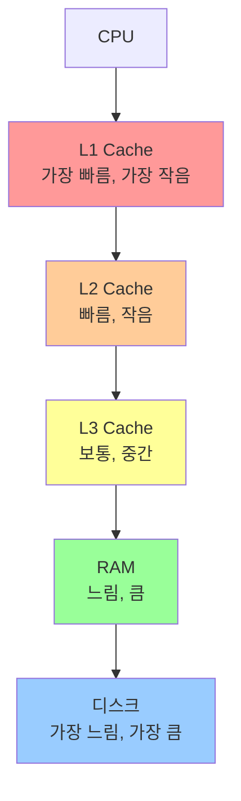
```mermaid
graph TD
    A[CPU] --> B[L1 Cache<br/>가장 빠름, 가장 작음]
    B --> C[L2 Cache<br/>빠름, 작음]
    C --> D[L3 Cache<br/>보통, 중간]
    D --> E[RAM<br/>느림, 큼]
    E --> F[디스크<br/>가장 느림, 가장 큼]
    
    style B fill:#ff9999
    style C fill:#ffcc99
    style D fill:#ffff99
    style E fill:#99ff99
    style F fill:#99ccff
```

**캐시 메모리(Cache Memory)**는 CPU와 메인 메모리(RAM) 사이에 위치한 고속 버퍼 메모리로, 자주 사용되는 데이터를 임시 저장하여 메모리 접근 속도를 향상시킴.

**메모리 계층의 특징:**
- **속도**: 상위 계층일수록 빠름 (L1 > L2 > L3 > RAM > 디스크)
- **용량**: 상위 계층일수록 작음
- **비용**: 상위 계층일수록 비쌈
- **지역성 원리**: 시간 지역성과 공간 지역성을 활용하여 자주 사용되는 데이터를 상위 계층에 저장

### OS-076
캐시 메모리는 어디에 위치해 있나요?

캐시 메모리는 **CPU 내부**에 위치함.

- **L1 캐시**: CPU 코어 내부에 가장 가까이 위치 (코어당 독립적으로 존재)
- **L2 캐시**: CPU 내부, L1과 메인 메모리 사이
- **L3 캐시**: CPU 내부, 여러 코어가 공유 (최신 CPU 아키텍처)

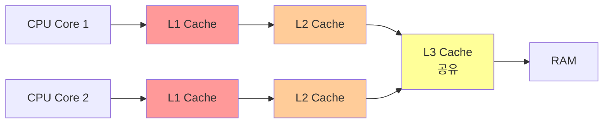
```mermaid
graph LR
    A[CPU Core 1] --> B[L1 Cache]
    C[CPU Core 2] --> D[L1 Cache]
    B --> E[L2 Cache]
    D --> F[L2 Cache]
    E --> G[L3 Cache<br/>공유]
    F --> G
    G --> H[RAM]
    
    style B fill:#ff9999
    style D fill:#ff9999
    style E fill:#ffcc99
    style F fill:#ffcc99
    style G fill:#ffff99
```

**위치의 이유:**
- CPU와의 거리가 가까울수록 데이터 전송 지연이 줄어듦
- 하드웨어적으로 직접 연결되어 있어 매우 빠른 접근 속도 보장
- 물리적 거리 감소로 인한 전기 신호 지연 최소화

### OS-077
L1, L2 캐시에 대해 설명해 주세요.

**L1 캐시 (Level 1 Cache):**
- **위치**: CPU 코어 내부, 가장 가까운 위치
- **구조**: 명령어 캐시(I-Cache)와 데이터 캐시(D-Cache)로 분리
- **크기**: 보통 32KB ~ 64KB (코어당)
- **속도**: 가장 빠름 (1~3 사이클)
- **특징**: 각 CPU 코어마다 독립적으로 존재

**L2 캐시 (Level 2 Cache):**
- **위치**: CPU 내부, L1과 L3 사이
- **구조**: 통합 캐시 (명령어와 데이터 혼합)
- **크기**: 보통 256KB ~ 1MB (코어당 또는 공유)
- **속도**: L1보다 느리지만 여전히 빠름 (10~20 사이클)
- **특징**: L1에서 캐시 미스 발생 시 참조

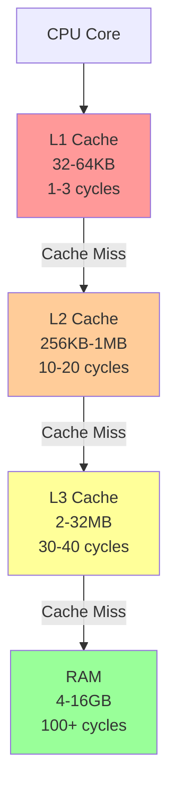
```mermaid
graph TD
    A[CPU Core] --> B[L1 Cache<br/>32-64KB<br/>1-3 cycles]
    B -->|Cache Miss| C[L2 Cache<br/>256KB-1MB<br/>10-20 cycles]
    C -->|Cache Miss| D[L3 Cache<br/>2-32MB<br/>30-40 cycles]
    D -->|Cache Miss| E[RAM<br/>4-16GB<br/>100+ cycles]
    
    style B fill:#ff9999
    style C fill:#ffcc99
    style D fill:#ffff99
    style E fill:#99ff99
```

**캐시 미스 처리:**
1. L1에서 데이터를 찾지 못하면 L2로 요청
2. L2에서도 없으면 L3 또는 메인 메모리로 요청
3. 찾은 데이터는 상위 캐시로 복사 (캐시 라인 단위)

### OS-078
캐시에 올라오는 데이터는 어떻게 관리되나요?

캐시는 **캐시 라인(Cache Line)** 단위로 데이터를 관리.

**캐시 라인 구조:**
- **태그(Tag)**: 메인 메모리 주소의 상위 비트
- **인덱스(Index)**: 캐시 내 위치를 나타내는 주소
- **오프셋(Offset)**: 캐시 라인 내 바이트 위치
- **데이터(Data)**: 실제 데이터 (보통 64바이트)
- **유효 비트(Valid Bit)**: 데이터가 유효한지 표시
- **더티 비트(Dirty Bit)**: 수정되었는지 표시 (쓰기 정책에 사용)

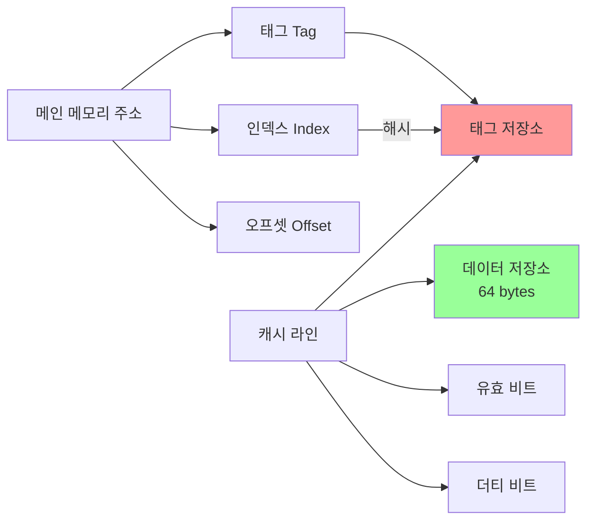
```mermaid
graph LR
    A[메인 메모리 주소] --> B[태그 Tag]
    A --> C[인덱스 Index]
    A --> D[오프셋 Offset]
    
    E[캐시 라인] --> F[태그 저장소]
    E --> G[데이터 저장소<br/>64 bytes]
    E --> H[유효 비트]
    E --> I[더티 비트]
    
    B --> F
    C -->|해시| F
    
    style F fill:#ff9999
    style G fill:#99ff99
```

**캐시 관리 정책:**

1. **캐시 교체 정책 (Replacement Policy)**
   - LRU (Least Recently Used): 가장 오래 사용되지 않은 라인 교체
   - FIFO (First In First Out): 먼저 들어온 라인 교체
   - Random: 무작위 선택

2. **쓰기 정책 (Write Policy)**
   - **Write-through**: 캐시와 메모리에 동시에 쓰기
   - **Write-back**: 캐시에만 쓰고, 나중에 메모리에 반영 (더티 비트 사용)

3. **할당 정책 (Allocation Policy)**
   - **Write-allocate**: 쓰기 미스 시 캐시 라인 할당
   - **No-write-allocate**: 쓰기 미스 시 메모리에만 쓰기

### OS-079
캐시간의 동기화는 어떻게 이루어지나요?

멀티코어 환경에서 각 코어는 독립적인 L1 캐시를 가지므로, **캐시 일관성(Cache Coherence)** 문제가 발생할 수 있음.

**문제 상황:**
- 코어 A가 메모리 주소 X를 수정 (L1 캐시에만 반영)
- 코어 B가 같은 주소 X를 읽음 (오래된 값 읽음)

**해결 방법:**

1. **MESI 프로토콜** (가장 널리 사용)
   - **Modified (M)**: 수정됨, 다른 캐시에는 없음
   - **Exclusive (E)**: 독점적으로 소유, 아직 수정 안 됨
   - **Shared (S)**: 여러 캐시가 공유 중
   - **Invalid (I)**: 무효한 데이터

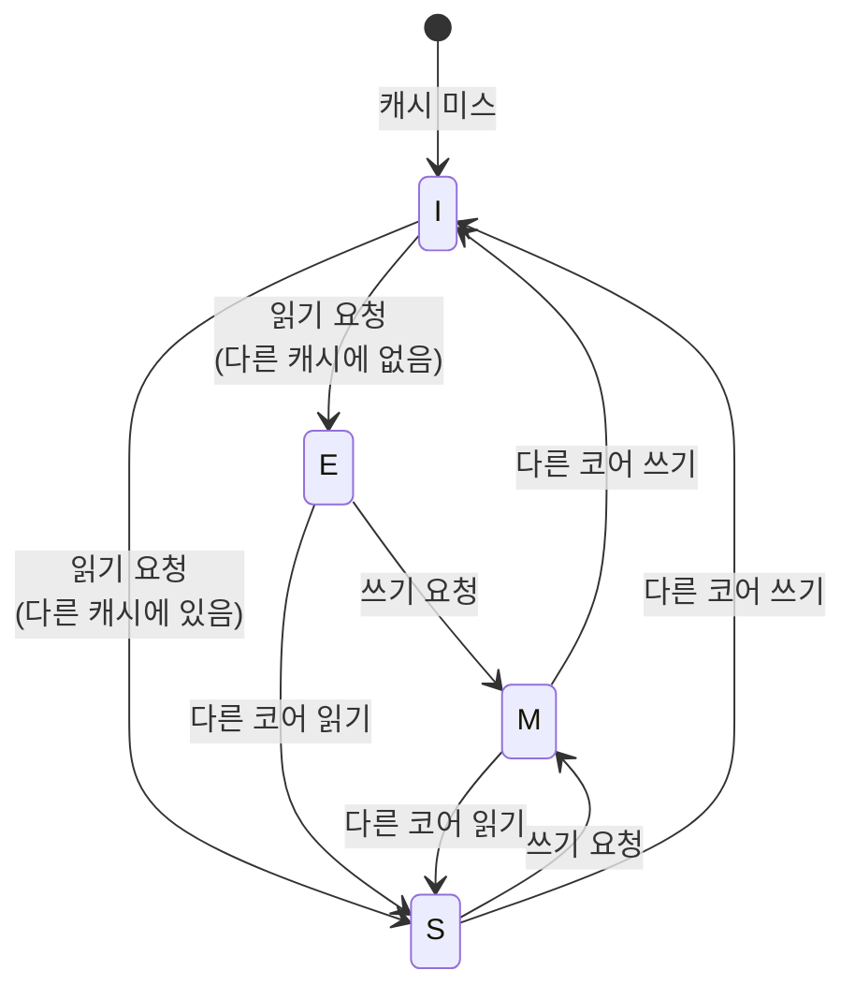
```mermaid
stateDiagram-v2
    [*] --> I: 캐시 미스
    I --> E: 읽기 요청<br/>(다른 캐시에 없음)
    I --> S: 읽기 요청<br/>(다른 캐시에 있음)
    E --> M: 쓰기 요청
    E --> S: 다른 코어 읽기
    S --> M: 쓰기 요청
    S --> I: 다른 코어 쓰기
    M --> S: 다른 코어 읽기
    M --> I: 다른 코어 쓰기
```

2. **캐시 일관성 버스 (Cache Coherence Bus)**
   - 모든 캐시가 버스를 통해 상태 변화를 감지
   - 스누핑(Snooping): 다른 캐시의 요청을 관찰

3. **디렉터리 기반 프로토콜**
   - 중앙 디렉터리가 어떤 캐시에 데이터가 있는지 추적
   - 대규모 시스템에 적합

### OS-080
캐시 메모리의 Mapping 방식에 대해 설명해 주세요.

캐시 매핑 방식은 메인 메모리의 블록을 캐시의 어느 위치에 저장할지 결정하는 방법.

**1. 직접 매핑 (Direct Mapping)**
- 메모리 블록이 캐시의 **고정된 위치**에만 저장됨
- 충돌이 자주 발생하지만 하드웨어가 단순함

```
메모리 주소 → 캐시 인덱스 = (메모리 주소 / 캐시 라인 크기) % 캐시 라인 수
```

**2. 완전 연관 매핑 (Fully Associative Mapping)**
- 메모리 블록이 캐시의 **어느 위치든** 저장 가능
- 충돌이 적지만 모든 태그를 비교해야 해서 느림

**3. 집합 연관 매핑 (Set-Associative Mapping)**
- 직접 매핑과 완전 연관 매핑의 절충안
- 캐시를 여러 집합(Set)으로 나누고, 각 집합 내에서는 완전 연관
- 보통 2-way, 4-way, 8-way 등으로 구성

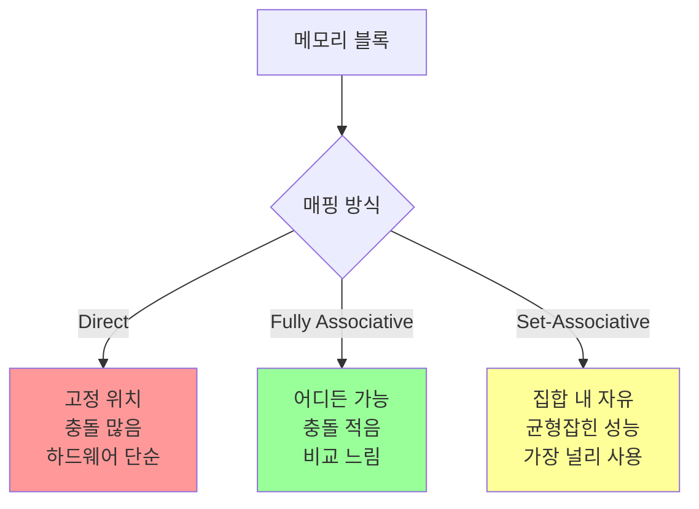
```mermaid
graph TD
    A[메모리 블록] --> B{매핑 방식}
    B -->|Direct| C[고정 위치<br/>충돌 많음<br/>하드웨어 단순]
    B -->|Fully Associative| D[어디든 가능<br/>충돌 적음<br/>비교 느림]
    B -->|Set-Associative| E[집합 내 자유<br/>균형잡힌 성능<br/>가장 널리 사용]
    
    style C fill:#ff9999
    style D fill:#99ff99
    style E fill:#ffff99
```

**예시: 4-way Set-Associative**
- 캐시를 4개씩 묶은 집합으로 구성
- 각 메모리 블록은 특정 집합에만 들어갈 수 있지만, 집합 내 4개 위치 중 어디든 가능
- 태그 비교는 4번만 하면 됨 (완전 연관보다 빠름)

### OS-081
캐시의 지역성에 대해 설명해 주세요.

**지역성(Locality)**은 프로그램이 특정 시간과 공간에 집중적으로 접근하는 특성으로, 캐시의 효율성을 보장.

**1. 시간 지역성 (Temporal Locality)**
- **정의**: 최근에 접근한 데이터가 가까운 미래에 다시 접근될 가능성이 높음
- **예시**: 
  ```c
  for (int i = 0; i < 1000; i++) {
      sum += arr[i];  // 변수 sum이 반복적으로 접근됨
  }
  ```
- **활용**: 캐시에 저장된 데이터를 유지하여 재접근 시 빠르게 제공

**2. 공간 지역성 (Spatial Locality)**
- **정의**: 접근한 데이터의 주변 데이터도 곧 접근될 가능성이 높음
- **예시**:
  ```c
  for (int i = 0; i < 1000; i++) {
      sum += arr[i];  // arr[i] 다음에 arr[i+1]이 접근됨
  }
  ```
- **활용**: 캐시 라인 단위로 주변 데이터까지 함께 가져옴 (Prefetching)

**3. 순차 지역성 (Sequential Locality)**
- 공간 지역성의 특수한 경우
- 순차적으로 저장된 데이터를 순차적으로 접근하는 패턴

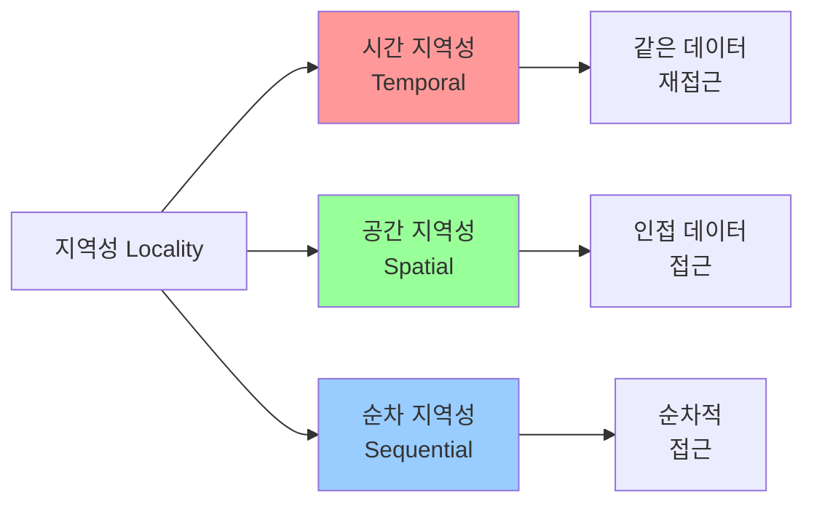
```mermaid
graph LR
    A[지역성 Locality] --> B[시간 지역성<br/>Temporal]
    A --> C[공간 지역성<br/>Spatial]
    A --> D[순차 지역성<br/>Sequential]
    
    B --> E[같은 데이터<br/>재접근]
    C --> F[인접 데이터<br/>접근]
    D --> G[순차적<br/>접근]
    
    style B fill:#ff9999
    style C fill:#99ff99
    style D fill:#99ccff
```

**캐시 히트율 향상:**
- 지역성이 높을수록 캐시 히트율이 높아짐
- 지역성이 낮은 코드는 캐시 미스가 자주 발생하여 성능 저하

### OS-082
캐시의 지역성을 기반으로, 이차원 배열을 가로/세로로 탐색했을 때의 성능 차이에 대해 설명해 주세요.

**메모리 저장 방식:**
- C/C++에서 2차원 배열은 **행 우선(Row-major)** 순서로 저장됨
- `arr[i][j]` 다음에는 `arr[i][j+1]`이 메모리상 인접

**가로 탐색 (Row-wise, 빠름):**
```c
for (int i = 0; i < N; i++) {
    for (int j = 0; j < M; j++) {
        sum += arr[i][j];  // 공간 지역성 활용
    }
}
```
- **특징**: 인접한 메모리 주소를 순차적으로 접근
- **캐시 동작**: 캐시 라인(64바이트)에 여러 요소가 함께 로드됨
- **성능**: 캐시 히트율이 높아 매우 빠름

**세로 탐색 (Column-wise, 느림):**
```c
for (int j = 0; j < M; j++) {
    for (int i = 0; i < N; i++) {
        sum += arr[i][j];  // 공간 지역성 위반
    }
}
```
- **특징**: 메모리상 멀리 떨어진 주소를 접근 (행 크기만큼 건너뜀)
- **캐시 동작**: 각 접근마다 캐시 미스 발생 가능성 높음
- **성능**: 캐시 미스가 빈번하여 느림

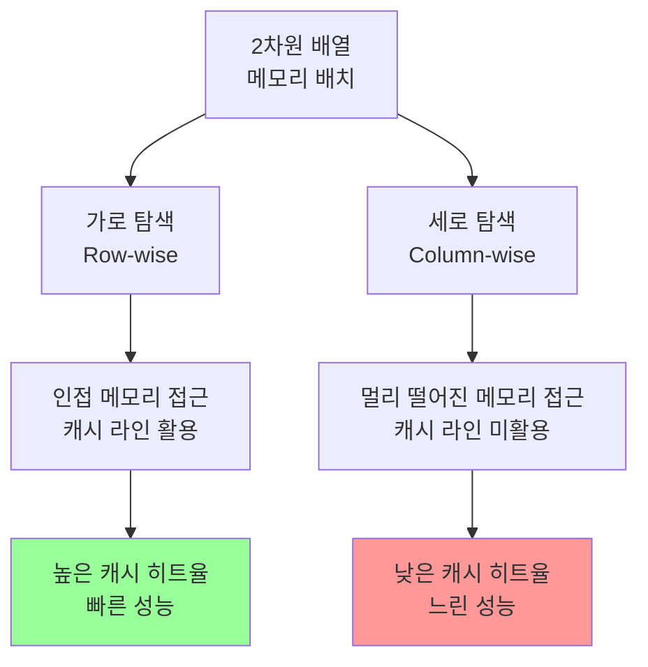
```mermaid
graph TD
    A[2차원 배열<br/>메모리 배치] --> B[가로 탐색<br/>Row-wise]
    A --> C[세로 탐색<br/>Column-wise]
    
    B --> D[인접 메모리 접근<br/>캐시 라인 활용]
    D --> E[높은 캐시 히트율<br/>빠른 성능]
    
    C --> F[멀리 떨어진 메모리 접근<br/>캐시 라인 미활용]
    F --> G[낮은 캐시 히트율<br/>느린 성능]
    
    style E fill:#99ff99
    style G fill:#ff9999
```

**성능 차이 예시:**
- 1000×1000 배열에서 가로 탐색: ~1ms
- 같은 배열 세로 탐색: ~10-50ms (시스템에 따라 다름)
- **차이의 원인**: 캐시 미스율의 차이

**최적화 팁:**
- 가능하면 행 우선 순서로 접근
- 큰 배열의 경우 블록 단위로 처리 (Tiling 기법)

### OS-083
캐시의 공간 지역성은 어떻게 구현될 수 있을까요? (힌트: 캐시는 어떤 단위로 저장되고 관리될까요?)

캐시의 공간 지역성은 **캐시 라인(Cache Line)** 단위 저장을 통해 구현.

**캐시 라인:**
- 캐시는 개별 바이트가 아닌 **블록 단위(보통 64바이트)**로 데이터를 가져옴
- 메모리에서 한 번에 여러 바이트를 함께 로드

**동작 원리:**

1. **캐시 미스 발생 시:**
   ```
   CPU가 메모리 주소 0x1000을 요청
   → 캐시는 0x1000뿐만 아니라 0x1000~0x103F (64바이트) 전체를 가져옴
   ```

2. **인접 데이터 접근 시:**
   ```
   다음에 0x1001, 0x1002 등을 접근하면
   → 이미 캐시에 있으므로 매우 빠름 (캐시 히트)
   ```

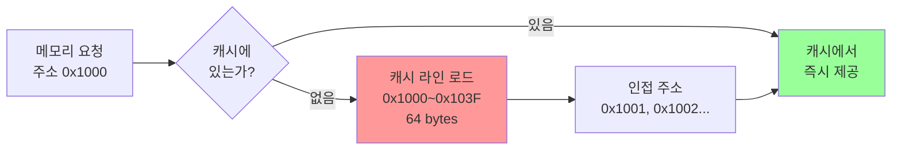
```mermaid
graph LR
    A[메모리 요청<br/>주소 0x1000] --> B{캐시에<br/>있는가?}
    B -->|없음| C[캐시 라인 로드<br/>0x1000~0x103F<br/>64 bytes]
    B -->|있음| D[캐시에서<br/>즉시 제공]
    C --> E[인접 주소<br/>0x1001, 0x1002...]
    E --> D
    
    style C fill:#ff9999
    style D fill:#99ff99
```

**Prefetching (프리페칭):**
- 하드웨어가 자동으로 다음에 사용될 데이터를 미리 가져옴
- 순차적 접근 패턴을 감지하여 예측적으로 캐시 라인 로드

**효과:**
- 공간 지역성을 활용하여 한 번의 메모리 접근으로 여러 데이터를 캐시에 저장
- 인접 데이터 접근 시 메모리 접근 없이 캐시에서 제공
- 캐시 미스율 감소 및 전체 성능 향상

---

## 📌 메모리 할당

### OS-084
연속할당 방식 세 가지를 설명해주세요. (first-fit, best-fit, worst-fit)

연속할당(Contiguous Allocation)은 프로세스가 물리 메모리의 연속된 공간에 할당되는 방식. 빈 공간을 찾는 알고리즘은 다음과 같음:

**1. First-Fit (최초 적합)**
- **방법**: 메모리를 순차적으로 탐색하여 **처음으로 발견되는 충분한 크기의 빈 공간**에 할당
- **장점**: 탐색 시간이 짧음, 구현이 간단
- **단점**: 앞부분에 작은 조각들이 많이 생김 (외부 단편화)

**2. Best-Fit (최적 적합)**
- **방법**: 요청 크기와 **가장 비슷한 크기의 빈 공간**을 찾아 할당
- **장점**: 메모리 낭비가 적음
- **단점**: 모든 빈 공간을 탐색해야 하므로 시간이 오래 걸림, 작은 조각들이 많이 생김

**3. Worst-Fit (최악 적합)**
- **방법**: **가장 큰 빈 공간**에 할당
- **장점**: 큰 조각을 남겨서 이후 큰 요청에 대비
- **단점**: 모든 빈 공간을 탐색해야 함, 큰 공간을 작은 요청에 사용하여 낭비

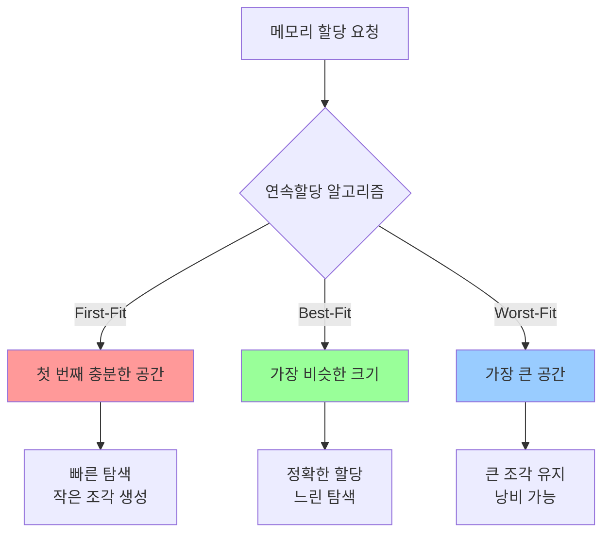
```mermaid
graph TD
    A[메모리 할당 요청] --> B{연속할당 알고리즘}
    B -->|First-Fit| C[첫 번째 충분한 공간]
    B -->|Best-Fit| D[가장 비슷한 크기]
    B -->|Worst-Fit| E[가장 큰 공간]
    
    C --> F[빠른 탐색<br/>작은 조각 생성]
    D --> G[정확한 할당<br/>느린 탐색]
    E --> H[큰 조각 유지<br/>낭비 가능]
    
    style C fill:#ff9999
    style D fill:#99ff99
    style E fill:#99ccff
```

**예시:**
```
메모리 상태: [사용중 100KB] [빈공간 50KB] [사용중 200KB] [빈공간 30KB] [빈공간 80KB]

요청: 40KB 할당

First-Fit: 50KB 공간에 할당 (첫 번째로 발견)
Best-Fit: 50KB 공간에 할당 (40KB와 가장 가까움)
Worst-Fit: 80KB 공간에 할당 (가장 큰 공간)
```

### OS-085
worst-fit 은 언제 사용할 수 있을까요?

**Worst-Fit의 사용 시나리오:**

1. **큰 메모리 요청이 예상되는 경우**
   - 큰 프로세스들이 주로 실행되는 시스템
   - 큰 조각을 유지하여 향후 큰 요청에 대비

2. **메모리 단편화 완화 목적**
   - 작은 조각 대신 큰 조각을 남겨서 외부 단편화를 줄이는 전략
   - 하지만 실제로는 큰 공간을 작은 요청에 사용하여 낭비 발생

3. **특수한 워크로드**
   - 프로세스 크기가 다양하고 큰 프로세스가 중요한 경우
   - 예: 데이터베이스 서버, 대용량 처리 시스템

**하지만 일반적으로는 비추천:**
- 대부분의 경우 First-Fit이나 Best-Fit이 더 효율적
- Worst-Fit은 탐색 시간이 오래 걸리고 메모리 낭비가 발생할 수 있음

### OS-086
성능이 가장 좋은 알고리즘은 무엇일까요?

**일반적으로 First-Fit이 가장 좋은 성능을 보입니다.**

**이유:**

1. **탐색 시간**
   - First-Fit: 평균적으로 빠른 탐색 (처음 발견하면 종료)
   - Best-Fit/Worst-Fit: 모든 빈 공간을 탐색해야 함

2. **실제 성능 측정**
   - First-Fit: O(n) 시간 복잡도 (최악의 경우)
   - Best-Fit: O(n) 시간 복잡도이지만 상수 계수가 큼
   - Worst-Fit: O(n) 시간 복잡도이지만 상수 계수가 가장 큼

3. **외부 단편화**
   - First-Fit: 앞부분에 작은 조각이 생기지만, 뒤쪽에는 큰 조각 유지
   - Best-Fit: 작은 조각이 많이 생김
   - Worst-Fit: 큰 공간 낭비

**최적화된 First-Fit:**
- **Next-Fit**: 마지막 할당 위치부터 탐색 시작 (순환 탐색)
- **Quick-Fit**: 크기별로 빈 공간 리스트를 관리하여 빠른 탐색

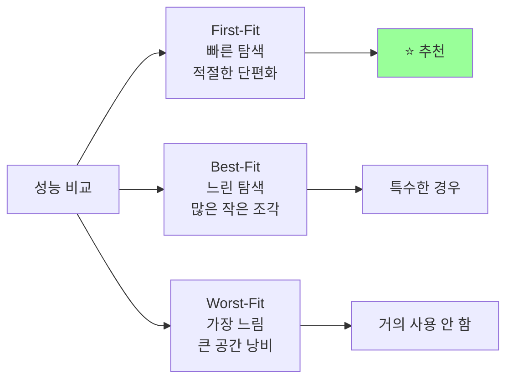
```mermaid
graph LR
    A[성능 비교] --> B[First-Fit<br/>빠른 탐색<br/>적절한 단편화]
    A --> C[Best-Fit<br/>느린 탐색<br/>많은 작은 조각]
    A --> D[Worst-Fit<br/>가장 느림<br/>큰 공간 낭비]
    
    B --> E[⭐ 추천]
    C --> F[특수한 경우]
    D --> G[거의 사용 안 함]
    
    style E fill:#99ff99
```

**결론:**
- **일반적인 경우**: First-Fit 또는 Next-Fit
- **메모리 효율이 중요한 경우**: Best-Fit (하지만 성능 저하)
- **특수한 워크로드**: Worst-Fit (드물게 사용)

### OS-087
Thrashing 이란 무엇인가요?

**Thrashing(스레싱)**은 시스템이 페이지 교체에만 시간을 소비하고 실제 작업을 거의 수행하지 못하는 현상.

**발생 원인:**
1. **과도한 멀티프로그래밍**
   - 너무 많은 프로세스가 동시에 실행되어 각 프로세스에 할당된 프레임 수가 부족
   - 각 프로세스가 필요한 페이지를 메모리에 유지하지 못함

2. **낮은 페이지 히트율**
   - 프로세스가 참조하는 페이지가 메모리에 없어서 페이지 폴트가 빈번히 발생
   - 페이지 폴트 처리 시간이 실제 작업 시간보다 많아짐

**Thrashing의 악순환:**
```
프로세스 증가 
→ 각 프로세스의 프레임 감소 
→ 페이지 폴트 증가 
→ 디스크 I/O 증가 
→ CPU 이용률 감소 
→ 스케줄러가 더 많은 프로세스 추가 (CPU가 놀고 있다고 판단)
→ 더 많은 프로세스 → 더 심한 Thrashing
```

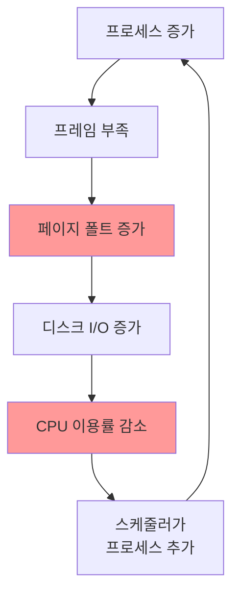
```mermaid
graph TD
    A[프로세스 증가] --> B[프레임 부족]
    B --> C[페이지 폴트 증가]
    C --> D[디스크 I/O 증가]
    D --> E[CPU 이용률 감소]
    E --> F[스케줄러가<br/>프로세스 추가]
    F --> A
    
    style C fill:#ff9999
    style E fill:#ff9999
```

**증상:**
- CPU 이용률이 급격히 떨어짐
- 디스크 활동이 매우 활발함 (페이지 교체)
- 시스템 응답 시간이 매우 느려짐
- 사용자가 체감하는 성능 저하

### OS-088
Thrashing 발생 시, 어떻게 완화할 수 있을까요?

**Thrashing 완화 방법:**

**1. Working Set 모델**
- **개념**: 프로세스가 일정 시간 동안 참조한 페이지 집합을 Working Set으로 정의
- **방법**: Working Set 크기만큼 프레임을 할당하여 페이지 폴트 최소화
- **효과**: 각 프로세스가 필요한 최소한의 페이지를 메모리에 유지

**2. 페이지 폴트 빈도 (Page Fault Frequency, PFF)**
- **개념**: 페이지 폴트 발생 빈도를 모니터링
- **방법**: 
  - 폴트 빈도가 높으면 → 프레임 추가 할당
  - 폴트 빈도가 낮으면 → 프레임 회수
- **효과**: 동적으로 프레임 수를 조절하여 최적 상태 유지

**3. 프로세스 중단 (Process Suspension)**
- **개념**: 일부 프로세스를 일시 중단하여 메모리 해제
- **방법**: 중기 스케줄러(Swapper)가 프로세스를 디스크로 Swap Out
- **효과**: 남은 프로세스에 충분한 프레임 제공

**4. 우선순위 기반 프레임 할당**
- **개념**: 중요한 프로세스에 더 많은 프레임 할당
- **방법**: 우선순위가 높은 프로세스의 프레임 수 증가
- **효과**: 중요한 작업의 성능 보장

**5. 지역성 활용**
- **개념**: 프로세스의 지역성을 고려한 스케줄링
- **방법**: 지역성이 높은 프로세스들을 함께 실행
- **효과**: 페이지 교체 감소

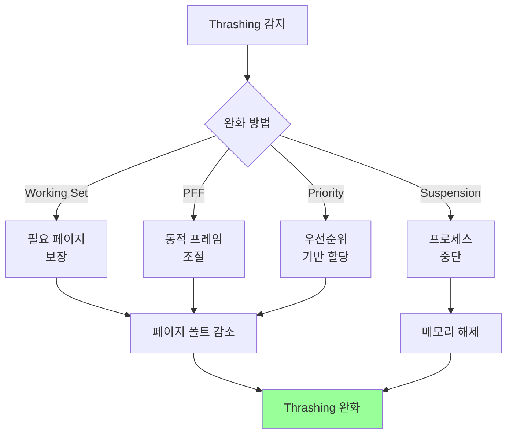
```mermaid
graph TD
    A[Thrashing 감지] --> B{완화 방법}
    B -->|Working Set| C[필요 페이지<br/>보장]
    B -->|PFF| D[동적 프레임<br/>조절]
    B -->|Suspension| E[프로세스<br/>중단]
    B -->|Priority| F[우선순위<br/>기반 할당]
    
    C --> G[페이지 폴트 감소]
    D --> G
    E --> H[메모리 해제]
    F --> G
    
    G --> I[Thrashing 완화]
    H --> I
    
    style I fill:#99ff99
```

**예방 방법:**
- 적절한 멀티프로그래밍 정도 유지
- 충분한 물리 메모리 확보
- 효율적인 페이지 교체 알고리즘 사용 (LRU 등)
- 지역성을 고려한 프로세스 스케줄링

---

## 📌 가상 메모리

### OS-089
가상 메모리란 무엇인가요?

**가상 메모리(Virtual Memory)**는 프로세스가 실제 물리 메모리보다 큰 주소 공간을 사용할 수 있게 해주는 메모리 관리 기법.

**핵심 개념:**
- 각 프로세스는 독립적인 **가상 주소 공간**을 가짐
- 가상 주소는 **물리 주소로 변환**되어 실제 메모리에 접근
- 프로세스의 모든 페이지가 항상 메모리에 있을 필요 없음
- 필요하지 않은 페이지는 **디스크(스왑 공간)**에 저장

**장점:**
1. **메모리 확장**: 실제 물리 메모리보다 큰 프로그램 실행 가능
2. **프로세스 격리**: 각 프로세스가 독립적인 주소 공간 사용
3. **메모리 보호**: 다른 프로세스의 메모리 접근 방지
4. **효율적인 메모리 사용**: 필요한 페이지만 메모리에 로드

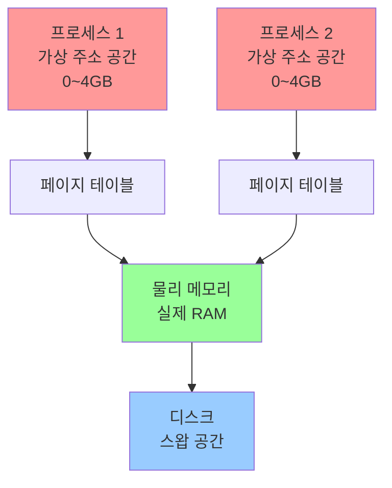
```mermaid
graph TD
    A[프로세스 1<br/>가상 주소 공간<br/>0~4GB] --> B[페이지 테이블]
    C[프로세스 2<br/>가상 주소 공간<br/>0~4GB] --> D[페이지 테이블]
    
    B --> E[물리 메모리<br/>실제 RAM]
    D --> E
    E --> F[디스크<br/>스왑 공간]
    
    style A fill:#ff9999
    style C fill:#ff9999
    style E fill:#99ff99
    style F fill:#99ccff
```

**동작 원리:**
- 프로세스는 가상 주소를 사용하여 메모리에 접근
- MMU(Memory Management Unit)가 가상 주소를 물리 주소로 변환
- 페이지가 메모리에 없으면 페이지 폴트 발생 → 디스크에서 로드

### OS-090
가상 메모리가 가능한 이유가 무엇일까요?

가상 메모리가 가능한 이유는 **지역성(Locality) 원리**와 **디스크의 존재** 때문.

**1. 지역성 원리 (Locality Principle)**
- **시간 지역성**: 최근에 사용한 메모리는 곧 다시 사용될 가능성이 높음
- **공간 지역성**: 인접한 메모리 주소가 곧 사용될 가능성이 높음
- **결과**: 프로세스가 실행 중에 실제로 사용하는 메모리는 전체 중 일부에 불과

**2. 디스크의 존재**
- 디스크는 메모리보다 느리지만 용량이 크고 비용이 저렴
- 사용하지 않는 페이지를 디스크에 저장 가능
- 필요할 때만 메모리로 로드 (Demand Paging)

**3. 하드웨어 지원**
- **MMU (Memory Management Unit)**: 가상 주소를 물리 주소로 변환
- **페이지 테이블**: 가상 주소와 물리 주소의 매핑 정보 저장
- **페이지 폴트 처리**: 하드웨어와 OS가 협력하여 페이지 로드

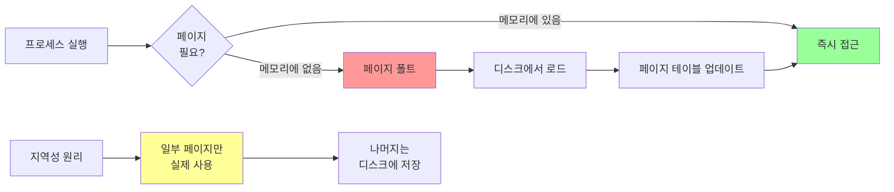
```mermaid
graph LR
    A[프로세스 실행] --> B{페이지<br/>필요?}
    B -->|메모리에 있음| C[즉시 접근]
    B -->|메모리에 없음| D[페이지 폴트]
    D --> E[디스크에서 로드]
    E --> F[페이지 테이블 업데이트]
    F --> C
    
    G[지역성 원리] --> H[일부 페이지만<br/>실제 사용]
    H --> I[나머지는<br/>디스크에 저장]
    
    style C fill:#99ff99
    style D fill:#ff9999
    style H fill:#ffff99
```

**효과:**
- 프로세스 전체를 메모리에 올리지 않아도 실행 가능
- 여러 프로세스가 동시에 실행되어도 물리 메모리보다 큰 총 메모리 사용 가능
- 실제 사용하는 페이지만 메모리에 유지하여 효율적인 메모리 관리

### OS-091
Page Fault가 발생했을 때, 어떻게 처리하는지 설명해 주세요.

**Page Fault(페이지 폴트)**는 프로세스가 접근하려는 페이지가 물리 메모리에 없을 때 발생하는 인터럽트.

**처리 과정:**

1. **페이지 폴트 발생**
   - CPU가 가상 주소를 물리 주소로 변환 시도
   - 페이지 테이블에서 해당 페이지가 메모리에 없음 (Invalid bit)
   - 하드웨어가 페이지 폴트 인터럽트 발생

2. **커널 모드 전환**
   - CPU가 자동으로 커널 모드로 전환
   - 현재 프로세스의 컨텍스트 저장 (레지스터, PC 등)

3. **페이지 폴트 핸들러 실행**
   - OS의 페이지 폴트 핸들러가 호출됨
   - 페이지 테이블에서 페이지 정보 확인

4. **유효성 검사**
   - **유효한 접근**: 페이지가 디스크에 있음 → 계속 진행
   - **무효한 접근**: 잘못된 주소 접근 → Segmentation Fault 발생

5. **빈 프레임 찾기**
   - 물리 메모리에서 빈 프레임 탐색
   - 없으면 페이지 교체 알고리즘으로 희생 페이지 선택

6. **디스크에서 페이지 로드**
   - 선택된 프레임에 디스크의 페이지 데이터 읽기
   - 디스크 I/O 완료 대기 (비동기 또는 동기)

7. **페이지 테이블 업데이트**
   - 페이지 테이블에 물리 주소 매핑 정보 저장
   - Valid bit를 1로 설정

8. **프로세스 재개**
   - 페이지 폴트가 발생한 명령어부터 다시 실행
   - 이번에는 페이지가 메모리에 있으므로 정상 실행

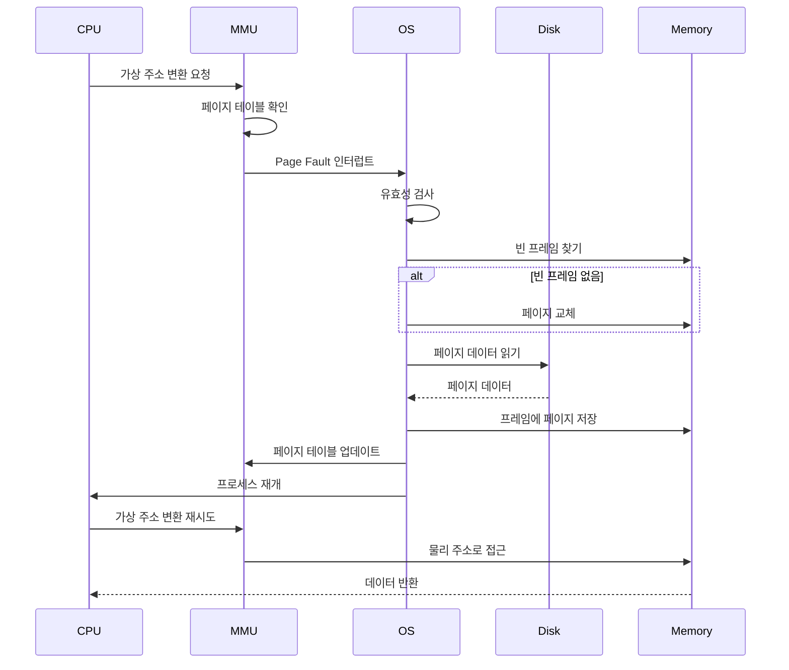
```mermaid
sequenceDiagram
    participant CPU
    participant MMU
    participant OS
    participant Disk
    participant Memory
    
    CPU->>MMU: 가상 주소 변환 요청
    MMU->>MMU: 페이지 테이블 확인
    MMU->>OS: Page Fault 인터럽트
    OS->>OS: 유효성 검사
    OS->>Memory: 빈 프레임 찾기
    alt 빈 프레임 없음
        OS->>Memory: 페이지 교체
    end
    OS->>Disk: 페이지 데이터 읽기
    Disk-->>OS: 페이지 데이터
    OS->>Memory: 프레임에 페이지 저장
    OS->>MMU: 페이지 테이블 업데이트
    OS->>CPU: 프로세스 재개
    CPU->>MMU: 가상 주소 변환 재시도
    MMU->>Memory: 물리 주소로 접근
    Memory-->>CPU: 데이터 반환
```

**성능 영향:**
- 페이지 폴트는 디스크 I/O를 포함하므로 매우 느림 (수 밀리초)
- 페이지 폴트가 빈번하면 Thrashing 발생
- 효율적인 페이지 교체 알고리즘과 Working Set 관리가 중요

### OS-092
페이지 크기에 대한 Trade-Off를 설명해 주세요.

페이지 크기는 시스템 성능에 큰 영향을 미치며, 다음과 같은 트레이드오프가 발생:

**큰 페이지 크기의 장점:**
1. **페이지 테이블 크기 감소**
   - 같은 가상 주소 공간에서 페이지 수가 적어짐
   - 페이지 테이블 엔트리 수 감소 → 메모리 절약

2. **TLB 효율성 증가**
   - TLB에 더 많은 가상 주소 공간 커버
   - TLB 미스 감소

3. **디스크 I/O 효율성**
   - 한 번의 디스크 읽기로 더 많은 데이터 로드
   - 순차 접근 시 유리

**큰 페이지 크기의 단점:**
1. **내부 단편화 증가**
   - 프로세스가 작은 메모리만 사용해도 전체 페이지 할당
   - 메모리 낭비

2. **페이지 교체 비용 증가**
   - 한 번에 많은 데이터를 디스크와 교환
   - 페이지 폴트 처리 시간 증가

3. **지역성 활용 저하**
   - 필요한 데이터만큼만 로드하지 못함
   - 불필요한 데이터도 함께 로드

**작은 페이지 크기의 장점:**
1. **내부 단편화 감소**
   - 필요한 만큼만 할당
   - 메모리 효율성 증가

2. **페이지 교체 비용 감소**
   - 필요한 페이지만 교체
   - 페이지 폴트 처리 시간 단축

3. **지역성 활용 향상**
   - 필요한 데이터만 정확히 로드

**작은 페이지 크기의 단점:**
1. **페이지 테이블 크기 증가**
   - 페이지 수가 많아져 테이블이 커짐
   - 메모리 사용량 증가

2. **TLB 효율성 감소**
   - TLB가 커버하는 가상 주소 공간이 작아짐
   - TLB 미스 증가

3. **디스크 I/O 오버헤드**
   - 작은 단위로 여러 번 접근
   - 순차 접근 시 비효율적

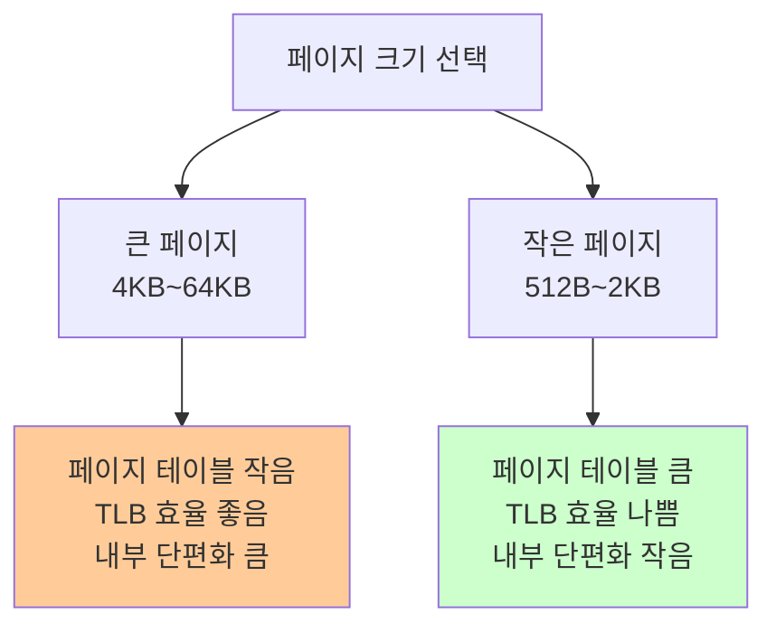
```mermaid
graph TD
    A[페이지 크기 선택] --> B[큰 페이지<br/>4KB~64KB]
    A --> C[작은 페이지<br/>512B~2KB]
    
    B --> D[페이지 테이블 작음<br/>TLB 효율 좋음<br/>내부 단편화 큼]
    C --> E[페이지 테이블 큼<br/>TLB 효율 나쁨<br/>내부 단편화 작음]
    
    style D fill:#ffcc99
    style E fill:#ccffcc
```

**일반적인 선택:**
- **대부분의 시스템**: 4KB (x86, ARM 등)
- **대용량 시스템**: 2MB 또는 1GB (Huge Page)
- **임베디드 시스템**: 1KB 또는 2KB

**최적화:**
- **Huge Page**: 큰 페이지를 지원하여 TLB 효율 향상
- **다양한 페이지 크기 지원**: 용도에 따라 선택

### OS-093
페이지 크기가 커지면, 페이지 폴트가 더 많이 발생한다고 할 수 있나요?

**아니다. 페이지 크기가 커짐에 따라 반드시시 페이지 폴트가 더 많이 발생하는 것은 아님.**

**실제로는 음의 상관관계일 수도 있음:**

1. **페이지 수 감소**
   - 같은 가상 주소 공간에서 페이지 수가 적어짐
   - 페이지 폴트가 발생할 수 있는 페이지 수 자체가 감소

2. **공간 지역성 활용**
   - 큰 페이지는 인접한 데이터를 함께 포함
   - 한 번의 페이지 폴트로 더 많은 데이터를 로드
   - 인접 데이터 접근 시 추가 페이지 폴트 없음

3. **TLB 효율성**
   - TLB가 더 많은 가상 주소 공간을 커버
   - TLB 미스 감소 → 페이지 테이블 접근 감소

**하지만 다음과 같은 경우에는 페이지 폴트가 증가할 수 있습니다:**

1. **내부 단편화로 인한 메모리 부족**
   - 큰 페이지로 인해 메모리 낭비가 심해짐
   - 실제 사용 가능한 프레임 수 감소
   - 메모리 부족으로 페이지 교체 빈번 → 페이지 폴트 증가

2. **페이지 교체 비용**
   - 큰 페이지를 교체할 때 더 많은 시간 소요
   - 교체 중 다른 페이지 폴트 발생 가능

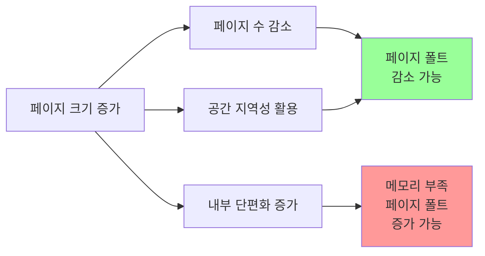
```mermaid
graph LR
    A[페이지 크기 증가] --> B[페이지 수 감소]
    A --> C[공간 지역성 활용]
    A --> D[내부 단편화 증가]
    
    B --> E[페이지 폴트<br/>감소 가능]
    C --> E
    D --> F[메모리 부족<br/>페이지 폴트<br/>증가 가능]
    
    style E fill:#99ff99
    style F fill:#ff9999
```

**결론:**
- 페이지 크기 자체가 페이지 폴트 빈도를 직접적으로 증가시키지는 않음
- 오히려 페이지 수 감소와 지역성 활용으로 페이지 폴트가 감소할 수 있음
- 하지만 내부 단편화로 인한 간접적 영향은 있을 수 있음
- **실제로는 워크로드와 지역성에 따라 다름**

### OS-094
세그멘테이션 방식을 사용하고 있다면, 가상 메모리를 사용할 수 없을까요?

**아니다. 세그멘테이션 방식에서도 가상 메모리를 사용할 수 있음.**

**세그멘테이션 + 가상 메모리:**
- 세그멘테이션은 논리적 단위(코드, 데이터, 스택 등)로 메모리를 나누는 방식
- 각 세그먼트를 페이지로 나누어 가상 메모리 구현 가능
- **세그멘테이션 + 페이징** 조합 사용

**구현 방식:**

1. **세그먼트 테이블 + 페이지 테이블**
   - 가상 주소 = 세그먼트 번호 + 세그먼트 내 오프셋
   - 세그먼트 테이블에서 세그먼트 정보 확인
   - 세그먼트 내 오프셋을 페이지 번호와 페이지 내 오프셋으로 변환
   - 페이지 테이블에서 물리 주소 변환

2. **세그먼트별 페이지 테이블**
   - 각 세그먼트마다 독립적인 페이지 테이블
   - 세그먼트의 크기와 특성에 맞게 페이지 관리

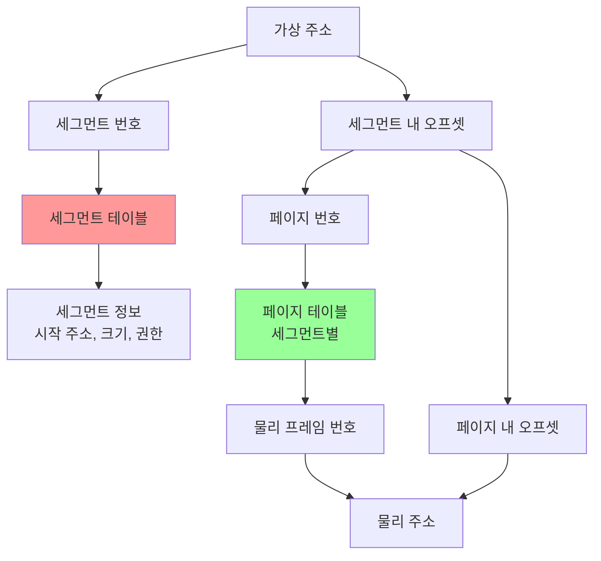
```mermaid
graph TD
    A[가상 주소] --> B[세그먼트 번호]
    A --> C[세그먼트 내 오프셋]
    
    B --> D[세그먼트 테이블]
    D --> E[세그먼트 정보<br/>시작 주소, 크기, 권한]
    
    C --> F[페이지 번호]
    C --> G[페이지 내 오프셋]
    
    F --> H[페이지 테이블<br/>세그먼트별]
    H --> I[물리 프레임 번호]
    
    I --> J[물리 주소]
    G --> J
    
    style D fill:#ff9999
    style H fill:#99ff99
```

**장점:**
- 세그먼트의 논리적 의미 유지 (코드, 데이터, 스택 구분)
- 세그먼트별 보호 및 권한 관리
- 페이징의 가상 메모리 기능 활용

**예시: x86 아키텍처**
- x86은 세그멘테이션과 페이징을 모두 지원
- 실제로는 페이징만 사용하는 경우가 많지만, 세그멘테이션도 가능

**결론:**
- 세그멘테이션과 가상 메모리는 상호 배타적이지 않음
- 두 방식을 조합하여 사용 가능
- 현대 시스템은 주로 페이징만 사용하지만, 세그멘테이션도 지원 가능

### OS-095
세그멘테이션과 페이징의 차이점은 무엇인가요?

**세그멘테이션(Segmentation)**과 **페이징(Paging)**은 가상 메모리를 구현하는 두 가지 다른 방식.

| 구분 | 세그멘테이션 | 페이징 |
|------|------------|--------|
| **단위** | 논리적 단위 (코드, 데이터, 스택 등) | 고정 크기 페이지 |
| **크기** | 가변 크기 | 고정 크기 |
| **주소 변환** | 세그먼트 번호 + 오프셋 | 페이지 번호 + 페이지 내 오프셋 |
| **단편화** | 외부 단편화 발생 | 내부 단편화 발생 |
| **보호** | 세그먼트별 보호 (읽기/쓰기/실행) | 페이지별 보호 |
| **공유** | 세그먼트 단위 공유 | 페이지 단위 공유 |
| **구현** | 복잡 (크기 관리 필요) | 간단 (고정 크기) |

**세그멘테이션:**
- **논리적 의미**: 코드, 데이터, 스택 등 프로그램의 논리적 구조 반영
- **가변 크기**: 세그먼트마다 크기가 다름
- **외부 단편화**: 메모리에 작은 빈 공간들이 생김
- **보호**: 세그먼트별로 읽기/쓰기/실행 권한 설정 가능

**페이징:**
- **물리적 의미**: 고정 크기의 페이지로 나눔
- **고정 크기**: 모든 페이지가 동일한 크기
- **내부 단편화**: 페이지 내부의 사용하지 않는 공간
- **구현 단순**: 고정 크기로 관리가 쉬움

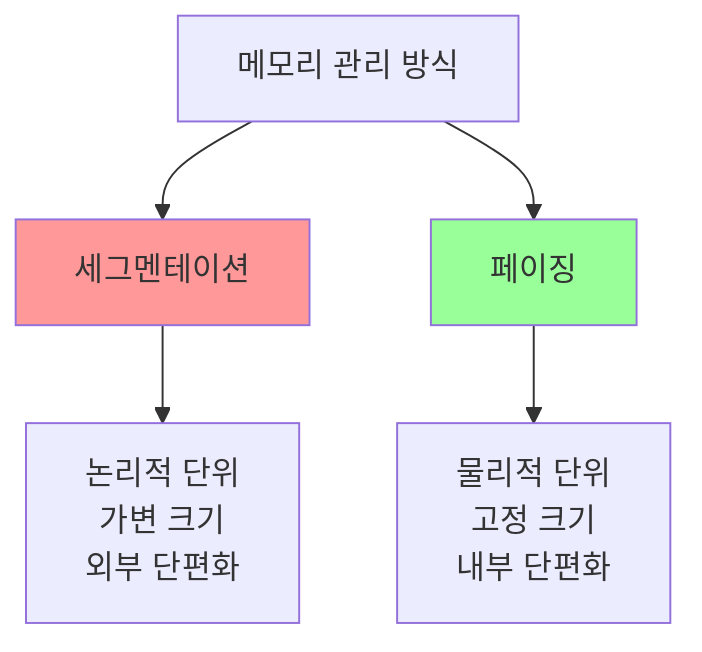
```mermaid
graph TD
    A[메모리 관리 방식] --> B[세그멘테이션]
    A --> C[페이징]
    
    B --> D[논리적 단위<br/>가변 크기<br/>외부 단편화]
    C --> E[물리적 단위<br/>고정 크기<br/>내부 단편화]
    
    style B fill:#ff9999
    style C fill:#99ff99
```

**현대 시스템:**
- **대부분 페이징 사용**: 구현이 단순하고 효율적
- **세그멘테이션은 거의 사용 안 함**: 외부 단편화 문제
- **조합 사용**: x86처럼 둘 다 지원하지만 페이징 중심

**선택 기준:**
- **페이징**: 일반적인 경우, 구현 단순성 중요
- **세그멘테이션**: 논리적 구조가 중요한 특수한 경우 (거의 사용 안 함)

### OS-096
페이지와 프레임의 차이에 대해 설명해 주세요.

**페이지(Page)**와 **프레임(Frame)**은 가상 메모리 시스템에서 서로 대응되는 개념입니다.

**페이지 (Page):**
- **정의**: 가상 주소 공간을 나눈 **고정 크기 블록**
- **위치**: 가상 메모리(논리적 주소 공간)
- **특징**: 프로세스마다 독립적인 가상 주소 공간에 존재
- **크기**: 보통 4KB (시스템에 따라 다름)

**프레임 (Frame):**
- **정의**: 물리 메모리(RAM)를 나눈 **고정 크기 블록**
- **위치**: 물리 메모리(실제 하드웨어)
- **특징**: 모든 프로세스가 공유하는 물리 메모리 공간
- **크기**: 페이지와 동일한 크기 (보통 4KB)

**관계:**
- 페이지는 프레임에 매핑되어 실제 물리 메모리에 저장됨
- 하나의 페이지는 하나의 프레임에 매핑됨
- 페이지 테이블이 페이지 번호를 프레임 번호로 변환

```mermaid
graph LR
    A[가상 주소 공간] --> B[페이지 0<br/>페이지 1<br/>페이지 2<br/>...]
    C[물리 메모리] --> D[프레임 0<br/>프레임 1<br/>프레임 2<br/>...]
    
    B -->|매핑| E[페이지 테이블]
    E -->|변환| D
    
    style B fill:#ff9999
    style D fill:#99ff99
    style E fill:#ffff99
```

**예시:**
```
가상 주소 공간 (프로세스 A):
페이지 0 (0x0000-0x0FFF) → 프레임 5 (물리 주소 0x5000-0x5FFF)
페이지 1 (0x1000-0x1FFF) → 프레임 2 (물리 주소 0x2000-0x2FFF)
페이지 2 (0x2000-0x2FFF) → 디스크 (스왑 공간)

물리 메모리:
프레임 0: 프로세스 B의 페이지
프레임 1: 프로세스 C의 페이지
프레임 2: 프로세스 A의 페이지 1
...
프레임 5: 프로세스 A의 페이지 0
```

**비유:**
- **페이지**: 책의 페이지 (논리적 순서)
- **프레임**: 책장의 칸 (물리적 위치)
- **페이지 테이블**: 책의 목차 (어느 페이지가 어느 칸에 있는지)

**요약:**
- **페이지**: 가상 메모리의 논리적 단위
- **프레임**: 물리 메모리의 물리적 단위
- **크기**: 동일 (보통 4KB)
- **매핑**: 페이지 테이블을 통해 연결

### OS-097
내부 단편화와, 외부 단편화에 대해 설명해 주세요.

**단편화(Fragmentation)**는 메모리가 작은 조각으로 나뉘어 사용되지 못하는 공간이 생기는 현상.

**1. 내부 단편화 (Internal Fragmentation)**

**정의**: 할당된 메모리 블록 내부에서 사용되지 않는 공간

**원인:**
- 고정 크기로 메모리를 할당하는 경우
- 요청 크기보다 큰 단위로 할당

**예시:**
```
프로세스가 100바이트를 요청
→ 시스템이 4KB 페이지를 할당
→ 4KB - 100B = 3.9KB가 사용되지 않음 (내부 단편화)
```

**발생 상황:**
- 페이징 시스템에서 페이지 크기가 고정되어 있을 때
- 세그멘테이션에서 세그먼트를 페이지 크기의 배수로 할당할 때

**2. 외부 단편화 (External Fragmentation)**

**정의**: 메모리 전체에 걸쳐 작은 빈 공간들이 산재하여 큰 연속 공간을 할당하지 못하는 현상

**원인:**
- 가변 크기로 메모리를 할당하는 경우
- 프로세스가 종료되면서 중간에 빈 공간이 생김

**예시:**
```
메모리 상태: [프로세스A 100KB] [빈공간 50KB] [프로세스B 200KB] [빈공간 30KB] [프로세스C 150KB]

150KB 요청이 들어옴
→ 총 빈 공간은 80KB이지만 연속된 공간이 없어 할당 불가 (외부 단편화)
```

**발생 상황:**
- 연속 할당 방식 (First-Fit, Best-Fit 등)
- 세그멘테이션 시스템

```mermaid
graph TD
    A[단편화] --> B[내부 단편화<br/>Internal]
    A --> C[외부 단편화<br/>External]
    
    B --> D[할당된 블록 내부<br/>사용 안 되는 공간<br/>페이징에서 발생]
    C --> E[메모리 전체에<br/>작은 빈 공간 산재<br/>연속 할당에서 발생]
    
    style B fill:#ff9999
    style C fill:#99ccff
```

**비교:**

| 구분 | 내부 단편화 | 외부 단편화 |
|------|------------|------------|
| **위치** | 할당된 블록 내부 | 할당되지 않은 빈 공간 |
| **원인** | 고정 크기 할당 | 가변 크기 할당 |
| **발생 시스템** | 페이징 | 연속 할당, 세그멘테이션 |
| **해결 방법** | 작은 페이지 크기 | 압축(Compaction), 페이징 |

**해결 방법:**

**내부 단편화:**
- 작은 페이지 크기 사용 (하지만 페이지 테이블 증가)
- 다양한 페이지 크기 지원 (Huge Page와 일반 페이지)

**외부 단편화:**
- **압축(Compaction)**: 빈 공간을 한 곳으로 모음 (비용 큼)
- **페이징**: 고정 크기로 나누어 내부 단편화로 전환
- **세그멘테이션 + 페이징**: 세그멘테이션의 외부 단편화를 페이징으로 해결

**현대 시스템:**
- 대부분 페이징 사용 → 외부 단편화 없음
- 내부 단편화는 감수하고 사용 (페이지 크기가 작아서 영향 적음)

### OS-098
페이지에서 실제 주소를 어떻게 가져올 수 있는지 설명해 주세요.

가상 주소에서 물리 주소로 변환하는 과정은 다음과 같음:

**주소 변환 과정:**

1. **가상 주소 분해**
   ```
   가상 주소 = 페이지 번호 + 페이지 내 오프셋
   
   예: 32비트 주소, 4KB 페이지
   - 페이지 번호: 상위 20비트
   - 페이지 내 오프셋: 하위 12비트 (4KB = 2^12)
   ```

2. **페이지 테이블 접근**
   - 페이지 번호를 인덱스로 사용하여 페이지 테이블 접근
   - 페이지 테이블 엔트리(PTE)에서 프레임 번호와 플래그 확인

3. **유효성 검사**
   - Valid bit 확인: 페이지가 메모리에 있는지 확인
   - 권한 확인: 읽기/쓰기/실행 권한 확인

4. **물리 주소 생성**
   ```
   물리 주소 = 프레임 번호 × 페이지 크기 + 페이지 내 오프셋
   ```

```mermaid
graph LR
    A[가상 주소<br/>32비트] --> B[페이지 번호<br/>20비트]
    A --> C[페이지 내 오프셋<br/>12비트]
    
    B --> D[페이지 테이블<br/>인덱스]
    D --> E[페이지 테이블 엔트리<br/>PTE]
    E --> F[프레임 번호<br/>20비트]
    E --> G[플래그<br/>Valid, Dirty 등]
    
    F --> H[물리 주소<br/>32비트]
    C --> H
    
    style A fill:#ff9999
    style H fill:#99ff99
    style E fill:#ffff99
```

**상세 예시:**

```
가상 주소: 0x12345678
페이지 크기: 4KB (0x1000)

1. 주소 분해:
   페이지 번호 = 0x12345
   페이지 내 오프셋 = 0x678

2. 페이지 테이블 접근:
   PTE[0x12345] = {프레임 번호: 0x5678, Valid: 1, ...}

3. 물리 주소 계산:
   물리 주소 = 0x5678 × 0x1000 + 0x678
            = 0x5678000 + 0x678
            = 0x5678678
```

**페이지 테이블 엔트리 구조:**
```
| 프레임 번호 (20비트) | 플래그 (12비트) |
|---------------------|----------------|
| Valid, Dirty, Read, Write, Execute 등 |
```

**TLB 활용:**
- 최근 사용한 페이지 변환 정보를 TLB에 캐시
- TLB 히트 시 페이지 테이블 접근 없이 즉시 물리 주소 획득
- TLB 미스 시에만 페이지 테이블 접근

**페이지 폴트 처리:**
- Valid bit가 0이면 페이지 폴트 발생
- OS가 디스크에서 페이지를 로드
- 페이지 테이블 업데이트 후 재시도

### OS-099
어떤 주소공간이 있을 때, 이 공간이 수정 가능한지 확인할 수 있는 방법이 있나요?

페이지 테이블의 **권한 비트(Permission Bits)**를 통해 확인할 수 있음.

**페이지 테이블 엔트리의 플래그:**

1. **Read (R) 비트**: 읽기 권한
2. **Write (W) 비트**: 쓰기 권한
3. **Execute (X) 비트**: 실행 권한
4. **Valid (V) 비트**: 페이지가 메모리에 있는지
5. **User/Supervisor (U/S) 비트**: 사용자 모드 접근 가능 여부

**확인 과정:**

1. **MMU가 주소 변환 시 자동 확인**
   - CPU가 메모리에 쓰기 시도
   - MMU가 페이지 테이블에서 Write 비트 확인
   - Write 비트가 0이면 → 페이지 폴트 발생 (권한 위반)

2. **OS가 소프트웨어적으로 확인**
   - 시스템 콜을 통해 페이지 권한 확인
   - 예: `mprotect()` 시스템 콜로 권한 변경

**예시:**
```c
// 코드 세그먼트 (Read-Only, Execute)
페이지 테이블: {Read: 1, Write: 0, Execute: 1}
→ 읽기와 실행만 가능, 쓰기 시도 시 페이지 폴트

// 데이터 세그먼트 (Read-Write)
페이지 테이블: {Read: 1, Write: 1, Execute: 0}
→ 읽기와 쓰기 가능, 실행 시도 시 페이지 폴트

// 스택 세그먼트 (Read-Write, No-Execute)
페이지 테이블: {Read: 1, Write: 1, Execute: 0}
→ 읽기와 쓰기만 가능 (보안: 스택 실행 방지)
```

```mermaid
graph TD
    A[메모리 접근 시도] --> B{접근 유형}
    B -->|읽기| C[Read 비트 확인]
    B -->|쓰기| D[Write 비트 확인]
    B -->|실행| E[Execute 비트 확인]
    
    C -->|1| F[허용]
    C -->|0| G[페이지 폴트]
    D -->|1| F
    D -->|0| G
    E -->|1| F
    E -->|0| G
    
    style F fill:#99ff99
    style G fill:#ff9999
```

**보안 기능:**
- **NX bit (No-Execute)**: 데이터 영역 실행 방지 (버퍼 오버플로우 공격 방어)
- **Write-Protect**: 코드 영역 수정 방지
- **User/Supervisor**: 커널 영역 보호

**리눅스 예시:**
```bash
# 프로세스의 메모리 맵 확인
cat /proc/[pid]/maps

# 출력 예시:
# 00400000-00401000 r-xp  # 읽기/실행 가능, 쓰기 불가
# 00600000-00601000 rw-p   # 읽기/쓰기 가능, 실행 불가
```

**결론:**
- 페이지 테이블의 권한 비트로 각 페이지의 수정 가능 여부 확인
- 하드웨어(MMU)가 자동으로 검사하여 보호
- 권한 위반 시 페이지 폴트 발생하여 OS에 알림

### OS-100
32비트에서, 페이지의 크기가 1KB 이라면 페이지 테이블의 최대 크기는 몇 개일까요?

**계산 과정:**

1. **가상 주소 공간 크기**
   - 32비트 = 2^32 = 4GB (가상 주소 공간)

2. **페이지 크기**
   - 1KB = 2^10 = 1024바이트

3. **페이지 수 계산**
   ```
   페이지 수 = 가상 주소 공간 크기 / 페이지 크기
            = 2^32 / 2^10
            = 2^22
            = 4,194,304개
   ```

4. **페이지 테이블 크기**
   - 각 페이지마다 하나의 페이지 테이블 엔트리 필요
   - 따라서 페이지 테이블의 최대 크기 = **4,194,304개 엔트리**

**일반화:**
```
페이지 테이블 엔트리 수 = 2^(가상 주소 비트 수 - 페이지 오프셋 비트 수)
                        = 2^(32 - 10)
                        = 2^22
```

**실제 메모리 사용량:**
- 각 페이지 테이블 엔트리는 보통 4바이트 (32비트)
- 총 메모리: 4,194,304 × 4바이트 = 16MB

**비교 (4KB 페이지인 경우):**
- 페이지 크기: 4KB = 2^12
- 페이지 테이블 엔트리 수: 2^(32-12) = 2^20 = 1,048,576개
- 메모리 사용량: 1,048,576 × 4바이트 = 4MB

```mermaid
graph TD
    A[32비트 가상 주소] --> B[페이지 크기 1KB]
    B --> C[페이지 오프셋: 10비트]
    A --> D[페이지 번호: 22비트]
    D --> E[2^22 = 4,194,304개]
    E --> F[페이지 테이블<br/>최대 크기]
    
    style F fill:#99ff99
```

**결론:**
- **페이지 테이블의 최대 크기: 4,194,304개 엔트리**
- 페이지 크기가 작을수록 페이지 테이블이 커짐
- 실제로는 모든 페이지가 사용되지 않으므로 더 작을 수 있음

### OS-101
32비트 운영체제는 램을 최대 4G 까지 사용할 수 있습니다. 이 이유를 페이징과 연관 지어서 설명해 주세요.

**32비트 주소 공간의 한계:**

1. **물리 주소 공간**
   - 32비트로 표현 가능한 주소: 0 ~ 2^32 - 1
   - 최대 물리 주소: 2^32 = 4GB
   - 따라서 물리 메모리(RAM)는 최대 4GB까지 인식 가능

2. **페이지 테이블의 제약**
   - 32비트 시스템에서 페이지 테이블 엔트리는 보통 32비트 (4바이트)
   - 물리 프레임 번호를 저장하는 필드가 제한적
   - 물리 주소를 완전히 표현할 수 있는 범위가 32비트로 제한

**페이징과의 관계:**

```mermaid
graph TD
    A[32비트 시스템] --> B[물리 주소: 32비트]
    B --> C[최대 2^32 = 4GB]
    C --> D[페이지 테이블 엔트리<br/>프레임 번호 저장]
    D --> E[32비트로 표현 가능한<br/>최대 프레임 수]
    E --> F[4GB 물리 메모리]
    
    style C fill:#ff9999
    style F fill:#99ff99
```

**상세 설명:**

1. **물리 주소 표현**
   ```
   물리 주소 = 프레임 번호 × 페이지 크기 + 오프셋
   
   32비트 물리 주소:
   - 최대 값: 0xFFFFFFFF = 4GB - 1
   - 따라서 최대 4GB까지 접근 가능
   ```

2. **페이지 테이블 엔트리 구조**
   ```
   | 프레임 번호 (20비트) | 플래그 (12비트) |
   ```
   - 프레임 번호가 20비트면 최대 2^20 = 1M개 프레임
   - 페이지 크기가 4KB면: 1M × 4KB = 4GB

3. **PAE (Physical Address Extension)**
   - 32비트 시스템에서 4GB 이상 메모리 사용을 위한 확장
   - 페이지 테이블 엔트리를 64비트로 확장
   - 하지만 여전히 프로세스당 가상 주소 공간은 4GB

**64비트 시스템과 비교:**
- 64비트: 최대 2^64 바이트 이론적 한계 (실제로는 일부만 사용)
- 32비트: 최대 2^32 = 4GB 물리 메모리

**결론:**
- 32비트 주소 공간으로 인해 물리 주소를 최대 4GB까지만 표현 가능
- 페이지 테이블이 물리 프레임 번호를 저장할 때 32비트 제한
- 따라서 32비트 OS는 페이징 시스템을 통해 최대 4GB RAM만 사용 가능

### OS-102
C/C++ 개발을 하게 되면 Segmentation Fault 라는 에러를 접할 수 있을텐데, 이 에러는 세그멘테이션/페이징과 어떤 관계가 있을까요?

**Segmentation Fault(세그멘테이션 폴트)**는 잘못된 메모리 접근 시 발생하는 오류로, 이름은 세그멘테이션에서 유래했지만 실제로는 **페이징 시스템에서도 발생**.

**발생 원인:**

1. **무효한 주소 접근**
   - 할당되지 않은 가상 주소 공간 접근
   - 페이지 테이블에 해당 페이지가 없음

2. **권한 위반**
   - 읽기 전용 페이지에 쓰기 시도
   - 실행 불가 페이지에서 실행 시도
   - 커널 영역에 사용자 모드에서 접근

3. **널 포인터 역참조**
   - NULL 포인터 접근 (보통 0번 주소)

**페이징 시스템에서의 처리:**

```mermaid
graph TD
    A[메모리 접근 시도] --> B{페이지 테이블 확인}
    B -->|페이지 없음| C[페이지 폴트]
    B -->|권한 위반| D[페이지 폴트]
    B -->|유효한 접근| E[정상 처리]
    
    C --> F[Segmentation Fault]
    D --> F
    F --> G[프로세스 종료<br/>SIGSEGV 시그널]
    
    style F fill:#ff9999
    style G fill:#ff9999
```

**실제 동작:**

1. **페이지 테이블 확인**
   - MMU가 가상 주소를 물리 주소로 변환 시도
   - 페이지 테이블에서 해당 페이지 찾기

2. **오류 감지**
   - 페이지가 없거나 (Invalid bit = 0)
   - 권한이 없으면 (Write 비트 = 0인데 쓰기 시도)

3. **페이지 폴트 발생**
   - 하드웨어가 페이지 폴트 인터럽트 발생
   - OS의 페이지 폴트 핸들러 호출

4. **오류 처리**
   - **유효한 접근**: 디스크에서 페이지 로드 (정상)
   - **무효한 접근**: Segmentation Fault 발생
   - 프로세스에 SIGSEGV 시그널 전송
   - 프로세스 종료 또는 핸들러 실행

**예시 코드:**
```c
int *ptr = NULL;
*ptr = 10;  // Segmentation Fault: NULL 포인터 역참조

int arr[10];
arr[100] = 5;  // Segmentation Fault: 배열 범위 초과

char *str = "Hello";
str[0] = 'h';  // Segmentation Fault: 읽기 전용 메모리 수정
```

**세그멘테이션과의 관계:**
- **역사적 배경**: 초기에는 세그멘테이션 시스템에서 세그먼트 범위를 벗어난 접근 시 발생
- **현대 시스템**: 페이징 시스템에서도 같은 이름 사용 (하위 호환성)
- **실제 동작**: 페이징 시스템에서는 페이지 폴트의 특수한 경우

**리눅스에서의 처리:**
- 커널이 페이지 폴트를 받아서 분석
- 유효하지 않은 접근으로 판단되면 SIGSEGV 시그널 전송
- 프로세스는 기본적으로 종료되지만, 시그널 핸들러로 처리 가능

**결론:**
- Segmentation Fault는 세그멘테이션에서 유래한 이름이지만, 페이징 시스템에서도 발생
- 페이징 시스템에서는 페이지 폴트의 일종으로 처리
- 무효한 메모리 접근이나 권한 위반 시 발생하여 프로세스를 보호

---

## 📌 TLB

### OS-103
TLB는 무엇인가요?

**TLB (Translation Lookaside Buffer)**는 페이지 테이블의 캐시로, 최근 사용한 가상 주소와 물리 주소의 매핑 정보를 저장하는 고속 메모리.

**목적:**
- 페이지 테이블 접근을 줄여 주소 변환 속도 향상
- 메인 메모리의 페이지 테이블 접근은 느리므로, 자주 사용하는 변환 정보를 캐시

**구조:**
- **태그 (Tag)**: 가상 페이지 번호
- **데이터 (Data)**: 물리 프레임 번호와 플래그
- **유효 비트 (Valid Bit)**: 엔트리가 유효한지
- **ASID (Address Space Identifier)**: 프로세스 식별자

**동작:**
1. CPU가 가상 주소 변환 요청
2. TLB에서 먼저 검색 (TLB Lookup)
3. **TLB 히트**: TLB에서 바로 물리 주소 획득 (매우 빠름)
4. **TLB 미스**: 페이지 테이블 접근 → TLB에 업데이트

```mermaid
graph TD
    A[가상 주소 변환 요청] --> B{TLB 검색}
    B -->|히트| C[TLB에서 물리 주소 획득<br/>1 사이클]
    B -->|미스| D[페이지 테이블 접근<br/>메인 메모리]
    D --> E[물리 주소 획득<br/>100+ 사이클]
    E --> F[TLB 업데이트]
    F --> C
    
    style C fill:#99ff99
    style E fill:#ff9999
```

**특징:**
- **크기**: 보통 64~512 엔트리 (매우 작음)
- **속도**: CPU 내부에 있어서 1~2 사이클에 접근 가능
- **연관성**: Fully Associative 또는 Set-Associative
- **자동 관리**: 하드웨어가 자동으로 관리

**효과:**
- 페이지 테이블 접근을 대부분 생략
- 주소 변환 속도 향상으로 전체 성능 개선
- TLB 히트율이 높을수록 성능 향상

### OS-104
TLB를 쓰면 왜 빨라지나요?

TLB가 빠른 이유는 **물리적 위치**와 **크기** 때문.

**1. 물리적 위치**
- **TLB**: CPU 내부에 위치 (L1 캐시 근처)
- **페이지 테이블**: 메인 메모리(RAM)에 위치
- **거리**: TLB는 CPU와 매우 가까워서 전기 신호 지연이 거의 없음

**2. 접근 속도 비교**
```
TLB 접근: 1~2 CPU 사이클 (나노초 단위)
페이지 테이블 접근: 100+ 사이클 (마이크로초 단위)
```

**3. 크기**
- TLB는 매우 작아서 (64~512 엔트리) 빠르게 검색 가능
- 페이지 테이블은 크기 때문에 느림

**4. 하드웨어 최적화**
- TLB는 하드웨어로 구현되어 병렬 검색 가능
- 페이지 테이블은 소프트웨어로 접근하여 느림

```mermaid
graph LR
    A[가상 주소 변환] --> B{TLB 사용}
    B -->|TLB 히트<br/>99%| C[1-2 사이클<br/>매우 빠름]
    B -->|TLB 미스<br/>1%| D[페이지 테이블<br/>100+ 사이클<br/>느림]
    
    E[TLB 없이] --> F[항상 페이지 테이블<br/>100+ 사이클]
    
    style C fill:#99ff99
    style D fill:#ff9999
    style F fill:#ff9999
```

**성능 향상:**
- **TLB 히트율**: 보통 95~99%
- **평균 접근 시간**:
  ```
  TLB 사용: 0.99 × 2사이클 + 0.01 × 100사이클 ≈ 3사이클
  TLB 없이: 100사이클
  ```
- **성능 향상**: 약 30배 이상 빠름

**지역성 활용:**
- 프로그램은 지역성을 가지므로 같은 페이지를 반복 접근
- TLB에 캐시된 변환 정보를 재사용
- 페이지 테이블 접근을 대부분 생략

**결론:**
- CPU 내부 위치로 인한 빠른 접근
- 작은 크기로 인한 빠른 검색
- 지역성으로 인한 높은 히트율
- 결과적으로 주소 변환 속도가 크게 향상

### OS-105
MMU가 무엇인가요?

**MMU (Memory Management Unit)**는 가상 주소를 물리 주소로 변환하는 하드웨어 장치.

**주요 기능:**

1. **주소 변환 (Address Translation)**
   - 가상 주소를 물리 주소로 변환
   - 페이지 테이블을 참조하여 변환 수행

2. **메모리 보호 (Memory Protection)**
   - 페이지 권한 확인 (읽기/쓰기/실행)
   - 권한 위반 시 페이지 폴트 발생

3. **캐시 관리**
   - TLB 관리 및 업데이트
   - TLB 미스 시 페이지 테이블 접근

**구성 요소:**
- **TLB**: 주소 변환 캐시
- **페이지 테이블 베이스 레지스터**: 페이지 테이블의 시작 주소 저장
- **주소 변환 로직**: 가상 주소를 물리 주소로 변환하는 하드웨어

**동작 과정:**

```mermaid
graph TD
    A[CPU: 가상 주소 요청] --> B[MMU: 주소 변환 시작]
    B --> C{TLB 검색}
    C -->|히트| D[TLB에서 물리 주소 획득]
    C -->|미스| E[페이지 테이블 접근]
    E --> F{페이지 존재?}
    F -->|있음| G[물리 주소 생성]
    F -->|없음| H[페이지 폴트 발생]
    G --> I{권한 확인}
    I -->|통과| J[물리 주소 반환]
    I -->|위반| H
    H --> K[OS 페이지 폴트 핸들러]
    
    style D fill:#99ff99
    style J fill:#99ff99
    style H fill:#ff9999
```

**MMU의 역할:**
- **투명성**: 프로세스는 가상 주소만 사용, 물리 주소는 몰라도 됨
- **보호**: 프로세스 간 메모리 격리 및 권한 관리
- **성능**: TLB를 통한 빠른 주소 변환

**위치:**
- CPU 내부에 통합되어 있음
- CPU와 메모리 사이에 위치

**MMU 없이:**
- 프로세스가 물리 주소를 직접 사용해야 함
- 메모리 보호 불가능
- 멀티프로그래밍 어려움

**결론:**
- MMU는 가상 메모리 시스템의 핵심 하드웨어
- 주소 변환과 메모리 보호를 담당
- 현대 운영체제의 필수 구성 요소

### OS-106
TLB와 MMU는 어디에 위치해 있나요?

**TLB와 MMU는 모두 CPU 내부에 위치.**

**위치 관계:**

```mermaid
graph TD
    A[CPU] --> B[CPU Core]
    B --> C[MMU<br/>Memory Management Unit]
    C --> D[TLB<br/>Translation Lookaside Buffer]
    C --> E[주소 변환 로직]
    C --> F[페이지 테이블<br/>베이스 레지스터]
    
    D --> G[L1 캐시]
    G --> H[L2 캐시]
    H --> I[메인 메모리<br/>페이지 테이블]
    
    style C fill:#ff9999
    style D fill:#ffcc99
    style I fill:#99ff99
```

**상세 위치:**

1. **MMU (Memory Management Unit)**
   - **위치**: CPU 내부, CPU Core와 L1 캐시 사이
   - **역할**: 모든 메모리 접근이 MMU를 거침
   - **구현**: 하드웨어로 구현된 전용 회로

2. **TLB (Translation Lookaside Buffer)**
   - **위치**: MMU 내부 또는 MMU와 매우 가까운 위치
   - **역할**: MMU의 주소 변환을 가속화하는 캐시
   - **구조**: CPU 내부의 고속 메모리 (SRAM)

**물리적 계층:**
```
CPU Core
  ↓
MMU (주소 변환)
  ├─ TLB (변환 캐시)
  └─ 페이지 테이블 베이스 레지스터
  ↓
L1 캐시
  ↓
L2 캐시
  ↓
메인 메모리 (페이지 테이블 저장)
```

**왜 CPU 내부에 있는가?**

1. **성능**: CPU와의 거리가 가까울수록 빠른 접근
2. **모든 메모리 접근 경유**: 모든 메모리 접근이 MMU를 거쳐야 함
3. **하드웨어 구현**: 소프트웨어로는 너무 느림
4. **병렬 처리**: 하드웨어로 병렬 검색 가능

**멀티코어 시스템:**
- 각 CPU 코어마다 독립적인 MMU와 TLB를 가짐
- 코어 간 TLB 동기화 필요 (캐시 일관성 프로토콜 사용)

**결론:**
- **MMU**: CPU 내부, 모든 메모리 접근 경로에 위치
- **TLB**: MMU 내부 또는 MMU와 매우 가까운 위치
- CPU 내부 위치로 인해 매우 빠른 주소 변환 가능

### OS-107
코어가 여러개라면, TLB는 어떻게 동기화 할 수 있을까요?

멀티코어 시스템에서 각 코어는 독립적인 TLB를 가지므로, **TLB 일관성(TLB Coherence)** 문제가 발생할 수 있음.

**문제 상황:**
- 코어 A가 페이지 테이블을 수정 (예: 페이지 교체)
- 코어 B의 TLB에는 오래된 매핑 정보가 남아있음
- 코어 B가 잘못된 물리 주소로 접근 가능

**해결 방법:**

**1. TLB Shootdown (TLB 무효화)**
- 한 코어가 페이지 테이블을 수정하면
- 다른 모든 코어의 TLB에서 해당 엔트리를 무효화
- 다음 접근 시 TLB 미스 발생 → 페이지 테이블에서 최신 정보 로드

**2. Inter-Processor Interrupt (IPI)**
- 페이지 테이블 수정 시 다른 코어에 인터럽트 전송
- 각 코어가 자신의 TLB를 무효화
- 동기화 보장

**3. ASID (Address Space Identifier)**
- 각 프로세스에 고유한 ASID 할당
- TLB 엔트리에 ASID 저장
- Context Switch 시 ASID만 변경하면 TLB 플러시 불필요

```mermaid
sequenceDiagram
    participant Core1
    participant Core2
    participant Memory
    
    Core1->>Memory: 페이지 테이블 수정
    Core1->>Core2: IPI 전송 (TLB 무효화 요청)
    Core2->>Core2: TLB 엔트리 무효화
    Core2->>Memory: 다음 접근 시 페이지 테이블에서 로드
```

**구현 방식:**

**1. 소프트웨어 TLB 관리**
- OS가 TLB 무효화를 명시적으로 처리
- `flush_tlb()` 같은 함수 호출
- 모든 코어에 IPI 전송

**2. 하드웨어 TLB 관리**
- 하드웨어가 자동으로 TLB 일관성 유지
- 페이지 테이블 수정 시 자동으로 다른 TLB 무효화
- 더 효율적이지만 하드웨어 복잡도 증가

**3. ASID 활용**
- Context Switch 시 TLB를 완전히 플러시하지 않음
- ASID만 변경하여 다른 프로세스의 TLB 엔트리와 구분
- TLB 히트율 향상

**비용:**
- TLB Shootdown은 비용이 큼 (모든 코어에 인터럽트)
- 하지만 페이지 테이블 수정이 드물어서 전체 비용은 낮음
- ASID 사용 시 비용 감소

**최적화:**
- **Lazy TLB Flushing**: 필요할 때만 무효화
- **Range-based Invalidation**: 특정 범위만 무효화
- **ASID**: Context Switch 비용 감소

**결론:**
- **TLB Shootdown**: 페이지 테이블 수정 시 다른 코어의 TLB 무효화
- **IPI**: 코어 간 인터럽트로 동기화
- **ASID**: Context Switch 비용 감소
- 하드웨어 또는 소프트웨어로 구현

### OS-108
TLB 관점에서, Context Switching 발생 시 어떤 변화가 발생하는지 설명해 주세요.

**Context Switch 발생 시 TLB 처리:**

**1. ASID (Address Space Identifier)를 사용하지 않는 경우:**

- **TLB 완전 플러시 (Flush)**
  - 프로세스가 바뀌면 가상 주소 공간이 완전히 달라짐
  - 이전 프로세스의 TLB 엔트리는 모두 무효화
  - 새로운 프로세스는 빈 TLB에서 시작

- **성능 영향:**
  - Context Switch 직후 TLB 미스가 빈번히 발생
  - 페이지 테이블 접근이 많아져 성능 저하
  - "Cold Start" 문제

```mermaid
graph TD
    A[Context Switch] --> B[TLB 플러시<br/>모든 엔트리 무효화]
    B --> C[새 프로세스 실행]
    C --> D[TLB 미스 빈번 발생]
    D --> E[페이지 테이블 접근]
    E --> F[TLB 점진적 채움]
    F --> G[성능 회복]
    
    style B fill:#ff9999
    style D fill:#ffcc99
    style G fill:#99ff99
```

**2. ASID를 사용하는 경우:**

- **TLB 유지**
  - 각 프로세스에 고유한 ASID 할당
  - TLB 엔트리에 ASID 저장
  - Context Switch 시 ASID만 변경

- **장점:**
  - TLB를 플러시하지 않아도 됨
  - 다른 프로세스의 TLB 엔트리와 구분 가능
  - TLB 히트율 유지

- **동작:**
  ```
  프로세스 A (ASID=1): TLB에 엔트리 저장
  → Context Switch
  → 프로세스 B (ASID=2): ASID만 변경
  → 프로세스 B의 페이지 접근 시 ASID=2로 검색
  → 프로세스 A의 엔트리(ASID=1)는 무시됨
  ```

**비교:**

| 구분 | ASID 없음 | ASID 있음 |
|------|----------|----------|
| **TLB 처리** | 완전 플러시 | ASID만 변경 |
| **TLB 히트율** | 초기 매우 낮음 | 유지됨 |
| **성능** | Context Switch 후 저하 | 안정적 |
| **TLB 용량** | 프로세스당 독립적 | 공유 가능 |

**실제 동작:**

**ASID 없이:**
```c
// Context Switch
flush_tlb_all();  // 모든 TLB 엔트리 무효화
switch_to(new_process);
// 새 프로세스는 빈 TLB에서 시작
```

**ASID 사용:**
```c
// Context Switch
set_asid(new_process->asid);  // ASID만 변경
switch_to(new_process);
// TLB는 그대로 유지, ASID로 구분
```

**성능 영향:**

- **ASID 없이**: Context Switch 후 수백~수천 사이클의 TLB 미스
- **ASID 사용**: Context Switch 비용 거의 없음, TLB 히트율 유지

**현대 시스템:**
- 대부분의 현대 CPU는 ASID를 지원
- Context Switch 성능 향상
- 멀티태스킹 환경에서 중요

**결론:**
- **ASID 없이**: TLB 완전 플러시 → 초기 성능 저하
- **ASID 사용**: ASID만 변경 → 성능 유지
- 현대 시스템은 ASID를 사용하여 Context Switch 비용 감소

### OS-109
동기화를 구현하기 위한 하드웨어적인 해결 방법에 대해 설명해 주세요.

| 하드웨어적 동기화 방법은 CPU가 제공하는 **원자적 연산(Atomic Operations)**을 활용.

**1. Test-and-Set (TAS)**
- **동작**: 메모리의 값을 읽고, 동시에 특정 값으로 설정하는 원자적 연산
- **용도**: 락 구현
- **특징**: 하드웨어가 보장하는 원자성

```c
// 의사 코드
bool test_and_set(bool *lock) {
    bool old = *lock;
    *lock = true;  // 원자적으로 수행
    return old;
}
```

**2. Compare-and-Swap (CAS)**
- **동작**: 메모리 값과 예상 값을 비교하고, 같으면 새 값으로 교체
- **용도**: Lock-free 자료구조 구현
- **특징**: 조건부 원자적 업데이트

```c
// 의사 코드
bool compare_and_swap(int *ptr, int expected, int new_val) {
    if (*ptr == expected) {
        *ptr = new_val;  // 원자적으로 수행
        return true;
    }
    return false;
}
```

**3. Fetch-and-Add**
- **동작**: 메모리 값을 읽고, 동시에 특정 값을 더함
- **용도**: 카운터 증가 등
- **특징**: 읽기와 쓰기를 원자적으로 수행

**4. Load-Linked / Store-Conditional (LL/SC)**
- **동작**: 
  - Load-Linked: 메모리 읽기 및 모니터링 시작
  - Store-Conditional: 모니터링 중 변경 없으면 쓰기 성공
- **용도**: CAS와 유사한 기능
- **특징**: ARM 아키텍처에서 사용

```mermaid
graph TD
    A[하드웨어 동기화] --> B[Test-and-Set<br/>락 구현]
    A --> C[Compare-and-Swap<br/>Lock-free]
    A --> D[Fetch-and-Add<br/>카운터]
    A --> E[LL/SC<br/>ARM 아키텍처]
    
    B --> F[뮤텍스<br/>세마포어]
    C --> G[Lock-free 큐<br/>스택]
    D --> H[원자적 카운터]
    
    style B fill:#ff9999
    style C fill:#99ff99
```

**하드웨어 지원:**

**1. 메모리 장벽 (Memory Barrier)**
- **목적**: 명령어 재정렬 방지
- **종류**:
  - Load Barrier: 로드 명령어 순서 보장
  - Store Barrier: 스토어 명령어 순서 보장
  - Full Barrier: 모든 메모리 연산 순서 보장

**2. 원자적 명령어**
- CPU가 제공하는 특수 명령어
- 중간에 인터럽트되지 않음
- 멀티코어 환경에서도 원자성 보장

**3. 캐시 일관성 프로토콜**
- MESI 프로토콜 등
- 멀티코어 간 메모리 일관성 보장
- 원자적 연산의 기반

**예시: Spin Lock 구현**

```c
typedef struct {
    volatile int lock;
} spinlock_t;

void spin_lock(spinlock_t *lock) {
    while (test_and_set(&lock->lock)) {
        // Busy waiting
    }
}

void spin_unlock(spinlock_t *lock) {
    lock->lock = 0;  // 또는 atomic_store
}
```

**장점:**
- **성능**: 소프트웨어 락보다 빠름
- **확장성**: 멀티코어에서 효율적
- **신뢰성**: 하드웨어가 보장

**단점:**
- **하드웨어 의존성**: CPU 아키텍처에 따라 다름
- **Busy Waiting**: 일부 경우 CPU 낭비

**결론:**
- 하드웨어가 제공하는 원자적 연산 활용
- Test-and-Set, CAS, Fetch-and-Add 등
- 메모리 장벽으로 순서 보장
- 멀티코어 환경에서 효율적인 동기화

### OS-110
volatile 키워드는 어떤 의미가 있나요?

**volatile** 키워드는 컴파일러에게 "이 변수는 예상치 못한 방식으로 변경될 수 있다"고 알려주는 지시어.

**주요 의미:**

1. **컴파일러 최적화 방지**
   - 컴파일러가 변수를 레지스터에 캐시하지 않음
   - 매번 메모리에서 값을 읽음

2. **예상치 못한 변경**
   - 하드웨어에 의해 변경 (메모리 매핑 I/O)
   - 인터럽트 핸들러에 의해 변경
   - 다른 스레드에 의해 변경 (하지만 동기화는 별도 필요)

**예시:**

**volatile 없이:**
```c
int flag = 0;

// 스레드 1
while (flag == 0) {
    // 컴파일러가 flag를 레지스터에 캐시
    // 메모리의 flag 변경을 감지하지 못함
}

// 스레드 2
flag = 1;  // 스레드 1이 이 변경을 못 봄
```

**volatile 사용:**
```c
volatile int flag = 0;

// 스레드 1
while (flag == 0) {
    // 매번 메모리에서 flag를 읽음
}

// 스레드 2
flag = 1;  // 스레드 1이 변경을 감지
```

**사용 사례:**

1. **메모리 매핑 I/O**
   ```c
   volatile int *device_register = (volatile int*)0x1234;
   *device_register = 1;  // 하드웨어 장치 제어
   ```

2. **인터럽트 핸들러**
   ```c
   volatile int interrupt_flag = 0;
   
   void interrupt_handler() {
       interrupt_flag = 1;  // 인터럽트에서 변경
   }
   ```

3. **멀티스레드 (제한적)**
   - volatile은 동기화를 보장하지 않음
   - 단순 플래그 변수에만 사용
   - 복잡한 동기화는 락이나 atomic 연산 사용

**주의사항:**

**volatile ≠ 동기화**
```c
volatile int counter = 0;

// 스레드 1
counter++;  // 원자적이지 않음! Race condition 발생 가능

// 스레드 2
counter++;  // 동시에 실행되면 문제 발생
```

**올바른 사용:**
```c
// 단순 플래그
volatile bool done = false;

// 복잡한 동기화는 atomic 사용
atomic_int counter = 0;
counter++;  // 원자적 연산
```

```mermaid
graph TD
    A[volatile 키워드] --> B[컴파일러 최적화 방지]
    A --> C[메모리 접근 강제]
    
    B --> D[레지스터 캐싱 방지]
    B --> E[루프 최적화 방지]
    
    C --> F[하드웨어 변경 감지]
    C --> G[인터럽트 변경 감지]
    
    H[주의] --> I[동기화 보장 안 함]
    H --> J[원자성 보장 안 함]
    
    style A fill:#ff9999
    style H fill:#ffcc99
```

**컴파일러 최적화 예시:**

**최적화 전:**
```c
int x = 10;
int y = x + 5;
int z = x + 5;  // 컴파일러가 y 재사용
```

**volatile 사용:**
```c
volatile int x = 10;
int y = x + 5;  // 메모리에서 x 읽기
int z = x + 5;  // 다시 메모리에서 x 읽기 (최적화 안 됨)
```

**결론:**
- **의미**: 컴파일러 최적화 방지, 메모리 접근 강제
- **용도**: 하드웨어 레지스터, 인터럽트 플래그
- **제한**: 동기화나 원자성을 보장하지 않음
- **멀티스레드**: 단순 플래그에만 사용, 복잡한 동기화는 atomic 사용

### OS-111
싱글코어가 아니라 멀티코어라면, 어떻게 동기화가 이뤄질까요?

멀티코어 환경에서는 **캐시 일관성(Cache Coherence)**과 **메모리 일관성(Memory Consistency)** 문제가 발생하므로, 추가적인 동기화 메커니즘이 필요함.

**문제 상황:**

1. **캐시 일관성 문제**
   ```
   코어 1: 변수 x를 읽음 (L1 캐시에 저장)
   코어 2: 변수 x를 수정 (자신의 L1 캐시에만 반영)
   코어 1: 다시 x를 읽음 (오래된 값 읽음)
   ```

2. **가시성 문제**
   ```
   코어 1: x = 1 (자신의 캐시에만 쓰기)
   코어 2: y = x (코어 1의 쓰기를 못 봄)
   ```

**해결 방법:**

**1. 캐시 일관성 프로토콜 (MESI)**
- 하드웨어가 자동으로 캐시 일관성 유지
- 한 코어가 수정하면 다른 코어의 캐시 무효화
- 메모리 버스나 인터커넥트를 통해 통신

**2. 메모리 장벽 (Memory Barrier)**
- 명령어 재정렬 방지
- 메모리 연산 순서 보장
- 가시성 보장

```c
// 메모리 장벽 없이
x = 1;
y = 2;  // 컴파일러/CPU가 순서 변경 가능

// 메모리 장벽 사용
x = 1;
memory_barrier();  // 이전 연산 완료 보장
y = 2;
```

**3. 원자적 연산 (Atomic Operations)**
- 하드웨어가 제공하는 원자적 연산 사용
- CAS, Test-and-Set 등
- 캐시 일관성과 원자성 동시 보장

```c
// 원자적 연산
atomic_int counter = 0;
atomic_fetch_add(&counter, 1);  // 모든 코어에서 안전
```

**4. 락 (Lock)**
- 뮤텍스, 세마포어 등
- 하드웨어 원자적 연산 기반
- 캐시 일관성 프로토콜 활용

```mermaid
graph TD
    A[멀티코어 동기화] --> B[캐시 일관성<br/>MESI 프로토콜]
    A --> C[메모리 장벽<br/>순서 보장]
    A --> D[원자적 연산<br/>CAS, TAS]
    A --> E[락<br/>뮤텍스, 세마포어]
    
    B --> F[하드웨어 자동]
    C --> G[명령어 재정렬 방지]
    D --> H[원자성 보장]
    E --> I[상호 배제]
    
    style B fill:#ff9999
    style D fill:#99ff99
```

**동작 예시:**

**원자적 연산:**
```c
// 코어 1
atomic_store(&x, 1);  // 원자적으로 쓰기
                      // 다른 코어의 캐시 무효화

// 코어 2
int val = atomic_load(&x);  // 최신 값 읽기
                           // 캐시에서 최신 값 가져오기
```

**락 사용:**
```c
// 코어 1
lock_acquire(&mutex);
x = 1;  // 크리티컬 섹션
lock_release(&mutex);

// 코어 2
lock_acquire(&mutex);
int val = x;  // 크리티컬 섹션
lock_release(&mutex);
```

**성능 고려사항:**

1. **False Sharing**
   - 서로 다른 변수가 같은 캐시 라인에 있으면
   - 한 코어가 수정하면 다른 코어의 캐시 무효화
   - 해결: 변수를 캐시 라인 크기로 정렬

2. **락 경쟁**
   - 여러 코어가 같은 락을 경쟁
   - 성능 저하
   - 해결: Lock-free 자료구조, 세밀한 락

3. **메모리 장벽 비용**
   - 메모리 장벽은 비용이 큼
   - 필요한 경우에만 사용

**비교:**

| 구분 | 싱글코어 | 멀티코어 |
|------|---------|---------|
| **문제** | 인터럽트 동기화 | 캐시 일관성, 가시성 |
| **해결** | 인터럽트 비활성화 | 캐시 일관성 프로토콜, 메모리 장벽 |
| **복잡도** | 낮음 | 높음 |

**결론:**
- **캐시 일관성 프로토콜**: 하드웨어가 자동으로 일관성 유지
- **메모리 장벽**: 명령어 순서와 가시성 보장
- **원자적 연산**: 하드웨어 지원으로 안전한 연산
- **락**: 상호 배제 보장
- 멀티코어에서는 하드웨어와 소프트웨어가 협력하여 동기화

---

## 📌 페이지 교체 알고리즘

### OS-112
페이지 교체 알고리즘에 대해 설명해 주세요.

**페이지 교체 알고리즘(Page Replacement Algorithm)**은 메모리가 가득 찼을 때 어떤 페이지를 디스크로 내보낼지 결정하는 알고리즘.

**목적:**
- 페이지 폴트 발생 시 빈 프레임이 없으면 기존 페이지를 교체해야 함
- 어떤 페이지를 교체할지 결정하여 페이지 폴트율 최소화

**주요 알고리즘:**

**1. FIFO (First In First Out)**
- **방법**: 가장 오래 전에 들어온 페이지를 교체
- **구현**: 큐를 사용하여 순서 관리
- **장점**: 구현이 간단
- **단점**: Belady's Anomaly 발생 가능, 지역성 무시

**2. Optimal (최적 알고리즘)**
- **방법**: 앞으로 가장 오래 사용되지 않을 페이지를 교체
- **구현**: 미래 참조를 알아야 함 (실제로는 불가능)
- **장점**: 이론적으로 가장 낮은 페이지 폴트율
- **단점**: 실제 구현 불가능 (참고용)

**3. LRU (Least Recently Used)**
- **방법**: 가장 오래 전에 사용된 페이지를 교체
- **구현**: 시간 스탬프 또는 링크드 리스트 사용
- **장점**: 지역성 원리 활용, 좋은 성능
- **단점**: 구현 비용이 큼

**4. LFU (Least Frequently Used)**
- **방법**: 가장 적게 사용된 페이지를 교체
- **구현**: 사용 빈도 카운터 사용
- **장점**: 자주 사용되는 페이지 보호
- **단점**: 최근에 많이 사용되기 시작한 페이지가 교체될 수 있음

**5. Clock (Second Chance)**
- **방법**: 원형 리스트를 사용, 참조 비트 확인
- **구현**: 참조 비트가 0이면 교체, 1이면 0으로 설정하고 다음으로
- **장점**: LRU의 근사치, 구현이 간단
- **단점**: LRU보다 성능이 약간 낮음

```mermaid
graph TD
    A[페이지 교체 필요] --> B{알고리즘 선택}
    B -->|FIFO| C[가장 오래된 페이지]
    B -->|Optimal| D[가장 늦게 사용될 페이지<br/>이론적 최적]
    B -->|LRU| E[가장 오래 전 사용된 페이지]
    B -->|LFU| F[가장 적게 사용된 페이지]
    B -->|Clock| G[참조 비트 기반]
    
    style D fill:#ffff99
    style E fill:#99ff99
```

**성능 비교:**
- **Optimal**: 이론적 최적 (실제 구현 불가)
- **LRU**: 실제로 가장 좋은 성능
- **Clock**: LRU의 근사치, 구현 간단
- **FIFO**: 성능이 낮지만 구현 간단

**선택 기준:**
- **성능**: LRU 또는 Clock
- **구현 단순성**: FIFO
- **하드웨어 지원**: 참조 비트 활용 (Clock)

### OS-113
LRU 알고리즘은 어떤 특성을 이용한 알고리즘이라고 할 수 있을까요?

**LRU (Least Recently Used)** 알고리즘은 **시간 지역성(Temporal Locality)** 원리를 이용.

**시간 지역성:**
- **정의**: 최근에 사용된 데이터가 가까운 미래에 다시 사용될 가능성이 높음
- **LRU의 가정**: 최근에 사용된 페이지는 곧 다시 사용될 것이고, 오래 전에 사용된 페이지는 당분간 사용되지 않을 것

**동작 원리:**
```
페이지 참조 순서: A, B, C, A, D, B, E

시간이 지날수록:
- A: 최근 사용됨 → 곧 다시 사용될 가능성 높음
- B: 최근 사용됨 → 곧 다시 사용될 가능성 높음
- C: 오래 전 사용됨 → 당분간 사용 안 될 가능성 높음
→ C를 교체하는 것이 합리적
```

**지역성 원리 활용:**

1. **시간 지역성**
   - 최근 사용 → 곧 재사용
   - 오래 전 사용 → 당분간 미사용
   - LRU가 이 원리를 직접 활용

2. **공간 지역성**
   - 인접 페이지도 곧 사용될 수 있음
   - 하지만 LRU는 주로 시간 지역성에 기반

```mermaid
graph LR
    A[시간 지역성] --> B[최근 사용 = 곧 재사용]
    A --> C[오래 전 사용 = 당분간 미사용]
    B --> D[LRU 알고리즘]
    C --> D
    D --> E[가장 오래 전 사용된<br/>페이지 교체]
    
    style A fill:#ff9999
    style D fill:#99ff99
```

**LRU의 효과:**
- 지역성이 높은 워크로드에서 우수한 성능
- 자주 사용되는 페이지를 메모리에 유지
- 페이지 폴트율 감소

**한계:**
- 지역성이 낮은 워크로드에서는 효과 감소
- 순환 참조 패턴에서는 성능 저하

**결론:**
- **시간 지역성 원리**를 직접적으로 활용
- 최근 사용 패턴을 기반으로 미래 사용을 예측
- 지역성이 높은 프로그램에서 매우 효과적

### OS-114
LRU 알고리즘을 구현한다면, 어떻게 구현할 수 있을까요?

LRU 알고리즘을 구현하는 방법은 여러 가지가 있음:

**1. 시간 스탬프 방식**
- **방법**: 각 페이지에 마지막 사용 시간 저장
- **교체**: 가장 오래된 시간 스탬프를 가진 페이지 선택
- **단점**: 모든 페이지를 검사해야 함 (O(n))

```c
struct page {
    int frame_num;
    time_t last_used;  // 마지막 사용 시간
};

// 교체 시
page_t *victim = find_oldest_page();  // O(n)
```

**2. 링크드 리스트 방식 (Doubly Linked List)**
- **방법**: 사용 순서대로 링크드 리스트 유지
- **접근 시**: 해당 노드를 리스트 끝으로 이동
- **교체**: 리스트의 맨 앞(가장 오래된) 페이지
- **시간 복잡도**: O(1) (해시 테이블과 함께 사용)

```c
struct lru_node {
    int page_num;
    struct lru_node *prev;
    struct lru_node *next;
};

// 페이지 접근 시
void access_page(int page_num) {
    // 노드를 리스트 끝으로 이동
    move_to_end(page_num);  // O(1) with hash table
}

// 교체 시
int victim = head->page_num;  // O(1)
```

**3. Counter 방식**
- **방법**: 전역 카운터를 사용하여 순서 추적
- **접근 시**: 해당 페이지의 카운터 값을 업데이트
- **교체**: 가장 작은 카운터 값을 가진 페이지
- **단점**: 카운터 오버플로우 가능성

**4. 하드웨어 지원 방식 (참조 비트)**
- **방법**: 페이지 테이블의 참조 비트 활용
- **구현**: Clock 알고리즘으로 LRU 근사
- **장점**: 하드웨어 지원으로 오버헤드 적음

**5. 해시 테이블 + 더블 링크드 리스트 (가장 효율적)**
- **방법**: 
  - 해시 테이블: O(1) 페이지 검색
  - 더블 링크드 리스트: O(1) 삽입/삭제
- **시간 복잡도**: 모든 연산 O(1)

```c
struct lru_cache {
    struct hash_table *ht;      // 페이지 번호 → 노드
    struct lru_node *head;       // 가장 오래된 페이지
    struct lru_node *tail;       // 가장 최근 페이지
    int capacity;
};

void access_page(lru_cache_t *cache, int page_num) {
    lru_node_t *node = hash_get(cache->ht, page_num);
    
    if (node) {
        // 기존 노드: 리스트에서 제거 후 끝에 추가
        remove_node(node);
        add_to_tail(node);
    } else {
        // 새 페이지: 끝에 추가
        if (cache->size >= cache->capacity) {
            // 가장 오래된 페이지 제거
            lru_node_t *victim = cache->head;
            remove_node(victim);
            hash_remove(cache->ht, victim->page_num);
        }
        node = create_node(page_num);
        add_to_tail(node);
        hash_put(cache->ht, page_num, node);
    }
}
```

```mermaid
graph LR
    A[LRU 구현 방법] --> B[시간 스탬프<br/>O n]
    A --> C[링크드 리스트<br/>O 1]
    A --> D[Counter<br/>O n]
    A --> E[하드웨어 지원<br/>Clock 알고리즘]
    A --> F[해시 + 리스트<br/>O 1 최적]
    
    style F fill:#99ff99
```

**실제 구현 예시 (Python 스타일):**

```python
class LRUCache:
    def __init__(self, capacity):
        self.capacity = capacity
        self.cache = {}  # 해시 테이블
        self.head = Node(0, 0)  # 더미 헤드
        self.tail = Node(0, 0)  # 더미 테일
        self.head.next = self.tail
        self.tail.prev = self.head
    
    def get(self, page_num):
        if page_num in self.cache:
            node = self.cache[page_num]
            self._move_to_end(node)  # O(1)
            return node.value
        return -1
    
    def put(self, page_num, value):
        if page_num in self.cache:
            node = self.cache[page_num]
            node.value = value
            self._move_to_end(node)  # O(1)
        else:
            if len(self.cache) >= self.capacity:
                # 가장 오래된 페이지 제거
                victim = self.head.next
                self._remove(victim)  # O(1)
                del self.cache[victim.key]
            
            node = Node(page_num, value)
            self._add_to_end(node)  # O(1)
            self.cache[page_num] = node
```

**성능 비교:**

| 방법 | 접근 | 삽입 | 삭제 | 교체 |
|------|------|------|------|------|
| 시간 스탬프 | O(1) | O(1) | O(1) | O(n) |
| 링크드 리스트 | O(n) | O(1) | O(1) | O(1) |
| 해시 + 리스트 | O(1) | O(1) | O(1) | O(1) |

**결론:**
- **가장 효율적**: 해시 테이블 + 더블 링크드 리스트 (모든 연산 O(1))
- **실용적**: 하드웨어 지원 Clock 알고리즘 (LRU 근사)
- **간단**: 시간 스탬프 (성능은 낮지만 구현 간단)

### OS-115
LRU 알고리즘의 단점을 설명해 주세요. 이를 해결할 수 있는 대안에 대해서도 설명해 주세요.

**LRU 알고리즘의 단점:**

**1. 구현 비용이 큼**
- 정확한 LRU 구현은 하드웨어 지원 필요
- 시간 스탬프나 링크드 리스트 관리 오버헤드
- 모든 페이지 접근마다 업데이트 필요

**2. 하드웨어 지원 필요**
- 정확한 LRU는 각 페이지 접근마다 시간 기록 필요
- 많은 CPU는 참조 비트만 제공 (1비트)
- 완전한 시간 정보는 소프트웨어로 관리해야 함

**3. 순환 참조 패턴에서 비효율**
- 모든 페이지를 순환하며 접근하는 경우
- LRU는 모든 페이지를 계속 교체
- 실제로는 모든 페이지가 필요함

**4. 지역성 없는 워크로드에서 성능 저하**
- 랜덤 접근 패턴
- LRU의 가정(시간 지역성)이 성립하지 않음

**대안 알고리즘:**

**1. Clock 알고리즘 (Second Chance)**
- **방법**: 참조 비트를 활용한 LRU 근사
- **장점**: 구현이 간단, 하드웨어 지원 활용
- **단점**: LRU보다 성능이 약간 낮음

```mermaid
graph TD
    A[페이지 교체 필요] --> B[Clock 포인터 위치 확인]
    B --> C{참조 비트 = 1?}
    C -->|예| D[참조 비트를 0으로 설정<br/>다음 페이지로]
    C -->|아니오| E[이 페이지 교체]
    D --> B
    
    style E fill:#99ff99
```

**2. LFU (Least Frequently Used)**
- **방법**: 사용 빈도를 기준으로 교체
- **장점**: 자주 사용되는 페이지 보호
- **단점**: 최근에 많이 사용되기 시작한 페이지가 교체될 수 있음
- **개선**: Aging 기법으로 최근 사용에 가중치

**3. Working Set 알고리즘**
- **방법**: 일정 시간 동안 사용된 페이지 집합 유지
- **장점**: 지역성을 명시적으로 활용
- **단점**: 시간 윈도우 관리 필요

**4. WSClock 알고리즘**
- **방법**: Working Set + Clock 알고리즘 결합
- **장점**: 지역성과 구현 단순성 모두 확보
- **단점**: 파라미터 튜닝 필요

**5. Adaptive Replacement Cache (ARC)**
- **방법**: LRU와 LFU를 동적으로 조합
- **장점**: 다양한 워크로드에 적응
- **단점**: 구현이 복잡

**6. 2Q 알고리즘**
- **방법**: 두 개의 큐를 사용 (신규 페이지와 자주 사용 페이지 분리)
- **장점**: LRU의 순환 참조 문제 해결
- **단점**: 메모리 오버헤드

```mermaid
graph TD
    A[LRU 단점] --> B[구현 비용]
    A --> C[하드웨어 지원]
    A --> D[순환 참조]
    A --> E[지역성 없음]
    
    B --> F[Clock 알고리즘<br/>간단한 구현]
    C --> F
    D --> G[2Q 알고리즘<br/>순환 참조 해결]
    E --> H[ARC 알고리즘<br/>적응형]
    
    style F fill:#99ff99
    style G fill:#99ff99
    style H fill:#99ff99
```

**실제 사용:**

**리눅스 커널:**
- **기본**: LRU 기반 (4가지 LRU 리스트)
- **개선**: Active/Inactive 리스트로 구분
- **목적**: 활발히 사용되는 페이지와 그렇지 않은 페이지 분리

**Windows:**
- **방식**: Working Set + Clock 알고리즘
- **특징**: 프로세스별 Working Set 관리

**최신 트렌드:**
- **Machine Learning 기반**: 접근 패턴 학습
- **하이브리드**: 여러 알고리즘 조합
- **워크로드 적응**: 동적으로 알고리즘 선택

**결론:**
- **LRU 단점**: 구현 비용, 하드웨어 지원, 순환 참조 문제
- **주요 대안**: Clock (간단), 2Q (순환 참조 해결), ARC (적응형)
- **실제 시스템**: 대부분 Clock 또는 개선된 LRU 사용

---

## 📌 파일 시스템 및 I/O

### OS-116
File Descriptor와, File System에 에 대해 설명해 주세요.

**File Descriptor (파일 디스크립터):**

**정의:**
- 프로세스가 열린 파일을 참조하는 정수 값
- 각 프로세스마다 독립적인 파일 디스크립터 테이블 유지
- 0, 1, 2는 표준 입출력으로 예약 (stdin, stdout, stderr)

**특징:**
- **프로세스별 독립성**: 같은 파일이라도 프로세스마다 다른 FD 번호
- **상속**: 자식 프로세스가 부모의 FD 상속 가능
- **리소스 제한**: 프로세스당 열 수 있는 FD 수 제한 (ulimit)

**File System (파일 시스템):**

**정의:**
- 디스크에 파일을 저장하고 관리하는 방식
- 파일과 디렉토리의 논리적 구조 제공
- 메타데이터 관리 (이름, 크기, 권한, 위치 등)

**주요 구성 요소:**

1. **파일 (File)**
   - 데이터를 저장하는 논리적 단위
   - 바이트 시퀀스로 구성

2. **디렉토리 (Directory)**
   - 파일과 다른 디렉토리를 포함하는 컨테이너
   - 계층적 구조 (트리)

3. **메타데이터 (Metadata)**
   - 파일의 속성 정보
   - 크기, 생성 시간, 수정 시간, 권한 등

4. **I-Node (Inode)**
   - 파일의 메타데이터와 데이터 블록 위치 저장
   - 리눅스/유닉스 파일 시스템의 핵심

```mermaid
graph TD
    A[파일 시스템] --> B[파일]
    A --> C[디렉토리]
    A --> D[메타데이터]
    
    B --> E[데이터 블록]
    D --> F[I-Node]
    F --> G[파일 속성<br/>블록 위치]
    
    H[프로세스] --> I[File Descriptor]
    I --> J[FD 테이블]
    J --> K[파일 포인터<br/>I-Node 참조]
    
    style F fill:#ff9999
    style I fill:#99ff99
```

**파일 시스템의 기능:**
- **이름 관리**: 파일 이름과 I-Node 매핑
- **공간 관리**: 디스크 블록 할당 및 해제
- **접근 제어**: 권한 관리
- **일관성**: 크래시 후 복구 (저널링)

**파일 디스크립터와 파일 시스템의 관계:**
```
프로세스 → FD (3) → FD 테이블 → 파일 포인터 → I-Node → 데이터 블록
```

**예시:**
```c
int fd = open("file.txt", O_RDONLY);  // FD 반환 (예: 3)
read(fd, buffer, size);               // FD를 통해 파일 읽기
close(fd);                            // FD 닫기
```

**결론:**
- **File Descriptor**: 프로세스가 파일을 참조하는 핸들
- **File System**: 디스크에 파일을 저장하고 관리하는 시스템
- **관계**: FD는 파일 시스템의 파일을 참조하는 인터페이스

### OS-117
I-Node가 무엇인가요?

| **I-Node (Index Node)**는 리눅스/유닉스 파일 시스템에서 파일의 메타데이터와 데이터 블록 위치를 저장하는 자료구조.

**주요 정보:**

1. **파일 메타데이터**
   - 파일 타입 (일반 파일, 디렉토리, 심볼릭 링크 등)
   - 파일 권한 (읽기/쓰기/실행)
   - 소유자 (UID, GID)
   - 파일 크기
   - 생성/수정/접근 시간
   - 링크 수 (하드 링크 개수)

2. **데이터 블록 위치**
   - 파일 데이터가 저장된 디스크 블록 주소
   - 직접 블록 포인터 (12개)
   - 간접 블록 포인터 (단일, 이중, 삼중 간접)

**I-Node 구조:**

```
I-Node (128 또는 256 bytes)
├─ 파일 타입 및 권한
├─ 소유자 정보
├─ 파일 크기
├─ 타임스탬프
├─ 직접 블록 포인터 (12개)
├─ 단일 간접 블록 포인터
├─ 이중 간접 블록 포인터
└─ 삼중 간접 블록 포인터
```

**데이터 블록 참조:**

```mermaid
graph TD
    A[I-Node] --> B[직접 블록<br/>12개]
    A --> C[단일 간접 블록]
    A --> D[이중 간접 블록]
    A --> E[삼중 간접 블록]
    
    C --> F[간접 블록<br/>블록 주소 배열]
    F --> G[데이터 블록]
    
    D --> H[이중 간접 블록]
    H --> I[간접 블록]
    I --> G
    
    style A fill:#ff9999
    style G fill:#99ff99
```

**예시 계산 (4KB 블록, 4바이트 포인터):**

- **직접 블록**: 12개 × 4KB = 48KB
- **단일 간접**: 1개 × (4KB / 4B) = 1024개 블록 = 4MB
- **이중 간접**: 1024 × 1024 = 1M개 블록 = 4GB
- **삼중 간접**: 1024³ = 1G개 블록 = 4TB

**I-Node의 특징:**

1. **파일 이름 저장 안 함**
   - 파일 이름은 디렉토리에 저장
   - 디렉토리는 (파일명, I-Node 번호) 쌍의 리스트

2. **하드 링크 지원**
   - 같은 I-Node를 가리키는 여러 파일명 가능
   - 링크 카운터로 참조 수 관리

3. **I-Node 번호**
   - 각 I-Node는 고유한 번호를 가짐
   - 파일 시스템 내에서 식별자 역할

**디렉토리 구조:**
```
디렉토리 파일 내용:
파일명1 → I-Node 번호 1234
파일명2 → I-Node 번호 5678
...
```

**파일 접근 과정:**
```
1. 파일 경로 파싱: /home/user/file.txt
2. 디렉토리에서 "file.txt" 찾기 → I-Node 번호 획득
3. I-Node 테이블에서 I-Node 읽기
4. I-Node에서 데이터 블록 위치 확인
5. 데이터 블록 읽기
```

**I-Node 할당:**
- 파일 시스템 생성 시 I-Node 영역 할당
- I-Node 수는 파일 시스템 크기에 비례
- I-Node가 부족하면 파일 생성 불가 (공간은 남아있어도)

**결론:**
- **I-Node**: 파일의 메타데이터와 데이터 블록 위치 저장
- **역할**: 파일 시스템의 핵심 자료구조
- **특징**: 파일명은 저장하지 않음, 하드 링크 지원
- **용도**: 파일 접근 및 관리

### OS-118
프로그래밍 언어 상에서 제공하는 파일 관련 함수 (Python - open(), Java - BufferedReader/Writer 등)은, 파일을 어떤 방식으로 읽어들이나요?

프로그래밍 언어의 파일 I/O 함수는 내부적으로 **버퍼링(Buffering)**을 사용하여 효율적으로 파일을 읽고 씀.

**읽기 과정:**

**1. 버퍼 기반 읽기**
- 파일을 한 번에 여러 바이트씩 읽어서 버퍼에 저장
- 프로그램은 버퍼에서 데이터를 읽음
- 버퍼가 비면 다시 디스크에서 읽기

**2. 계층적 구조**
```
프로그램
  ↓
언어 런타임 버퍼 (예: Python의 io.BufferedReader)
  ↓
OS 커널 버퍼 (Page Cache)
  ↓
디스크
```

**Python 예시:**
```python
# open()은 내부적으로 버퍼링 사용
with open('file.txt', 'r') as f:
    data = f.read()  # 버퍼에서 읽기, 필요시 디스크 접근
```

**내부 동작:**
1. `open()` 호출 시 파일 디스크립터 획득
2. 내부 버퍼 할당 (보통 8KB)
3. `read()` 호출 시:
   - 버퍼에 데이터가 있으면 버퍼에서 반환
   - 버퍼가 비면 디스크에서 블록 단위로 읽어서 버퍼 채움
   - 버퍼에서 요청한 만큼 반환

**Java 예시:**
```java
// BufferedReader는 내부 버퍼 사용
BufferedReader br = new BufferedReader(new FileReader("file.txt"));
String line = br.readLine();  // 버퍼에서 읽기
```

**동작:**
- `BufferedReader`: 라인 단위 버퍼링 (기본 8KB)
- `FileReader`: 바이트 스트림을 문자로 변환
- 내부적으로 OS의 `read()` 시스템 콜 사용

**시스템 콜 레벨:**

```mermaid
graph TD
    A[프로그램: read] --> B[언어 런타임 버퍼]
    B -->|버퍼 비어있음| C[read 시스템 콜]
    C --> D[OS 커널]
    D --> E[Page Cache 확인]
    E -->|캐시 히트| F[메모리에서 반환]
    E -->|캐시 미스| G[디스크에서 읽기]
    G --> H[Page Cache에 저장]
    H --> F
    F --> D
    D --> C
    C --> B
    B --> A
    
    style E fill:#ff9999
    style G fill:#ffcc99
```

**버퍼링의 장점:**

1. **디스크 I/O 감소**
   - 작은 읽기 요청을 모아서 큰 블록으로 읽기
   - 디스크 접근 횟수 감소

2. **성능 향상**
   - 메모리 접근이 디스크 접근보다 훨씬 빠름
   - 순차 접근 시 특히 효과적

3. **시스템 부하 감소**
   - 시스템 콜 횟수 감소
   - 컨텍스트 스위칭 감소

**버퍼 크기:**
- **Python**: 기본 8KB (io.DEFAULT_BUFFER_SIZE)
- **Java**: BufferedReader 기본 8KB
- **C**: stdio.h의 BUFSIZ (보통 8KB)
- **OS**: Page Cache (보통 4KB 페이지)

**쓰기 과정:**
```
프로그램 → 언어 버퍼 → OS 버퍼 (Page Cache) → 디스크
```

**플러시 (Flush):**
- 버퍼의 데이터를 강제로 디스크에 쓰기
- `flush()` 호출 또는 파일 닫기 시 자동 플러시

**예시:**
```python
f = open('file.txt', 'w')
f.write('data')      # 버퍼에만 쓰기 (아직 디스크에 안 씀)
f.flush()           # 강제로 디스크에 쓰기
# 또는
f.close()           # 자동으로 플러시
```

**결론:**
- **버퍼링**: 파일을 블록 단위로 읽어서 메모리 버퍼에 저장
- **계층**: 언어 런타임 버퍼 → OS Page Cache → 디스크
- **효과**: 디스크 I/O 감소, 성능 향상
- **시스템 콜**: 내부적으로 `read()`, `write()` 시스템 콜 사용

### OS-119
동기와 비동기, 블로킹과 논블로킹의 차이에 대해 설명해 주세요.

| I/O 작업의 **제어 흐름**과 **대기 방식**을 구분함.

**1. 동기 (Synchronous) vs 비동기 (Asynchronous)**

**동기 (Synchronous):**
- **정의**: 작업이 **순차적으로** 실행됨
- **특징**: 한 작업이 끝나야 다음 작업 시작
- **제어 흐름**: 호출자가 작업 완료를 기다림

**비동기 (Asynchronous):**
- **정의**: 작업이 **독립적으로** 실행됨
- **특징**: 작업 시작 후 즉시 반환, 완료는 나중에 알림
- **제어 흐름**: 호출자는 다른 작업 수행 가능

**2. 블로킹 (Blocking) vs 논블로킹 (Non-blocking)**

**블로킹 (Blocking):**
- **정의**: 작업이 완료될 때까지 **대기**
- **특징**: 작업 완료까지 호출 스레드가 멈춤
- **반환**: 작업 완료 후 결과 반환

**논블로킹 (Non-blocking):**
- **정의**: 작업 완료를 기다리지 않고 **즉시 반환**
- **특징**: 호출 스레드가 계속 실행
- **반환**: 즉시 반환 (결과 또는 상태)

**조합:**

```mermaid
graph TD
    A[I/O 모델] --> B[동기 블로킹<br/>Synchronous Blocking]
    A --> C[동기 논블로킹<br/>Synchronous Non-blocking]
    A --> D[비동기 블로킹<br/>Asynchronous Blocking]
    A --> E[비동기 논블로킹<br/>Asynchronous Non-blocking]
    
    B --> F[read/write<br/>기본 I/O]
    C --> G[select/poll<br/>I/O 멀티플렉싱]
    D --> H[비동기 I/O +<br/>완료 대기]
    E --> I[aio_read/aio_write<br/>이벤트 기반]
    
    style B fill:#ff9999
    style E fill:#99ff99
```

**예시:**

**1. 동기 블로킹 (Synchronous Blocking)**
```c
// 기본 read() 시스템 콜
char buffer[1024];
int n = read(fd, buffer, 1024);  // 데이터가 올 때까지 대기
// 데이터를 받은 후 다음 코드 실행
```
- **특징**: 가장 간단, 스레드가 블로킹됨

**2. 동기 논블로킹 (Synchronous Non-blocking)**
```c
// 논블로킹 모드로 설정
fcntl(fd, F_SETFL, O_NONBLOCK);
int n = read(fd, buffer, 1024);  // 즉시 반환
if (n < 0 && errno == EAGAIN) {
    // 데이터가 아직 없음, 나중에 다시 시도
}
```
- **특징**: 즉시 반환, 폴링 필요

**3. 비동기 블로킹 (Asynchronous Blocking)**
```c
// 비동기 I/O 시작
aio_read(&aiocb);  // 즉시 반환
// 다른 작업 수행
aio_suspend(&aiocb, ...);  // 완료될 때까지 대기
```
- **특징**: 비동기 시작, 완료는 블로킹 대기

**4. 비동기 논블로킹 (Asynchronous Non-blocking)**
```c
// 비동기 I/O 시작
aio_read(&aiocb);  // 즉시 반환
// 다른 작업 수행
// 완료 시 시그널 또는 콜백으로 알림
```
- **특징**: 완전 비동기, 이벤트 기반

**비교표:**

| 구분 | 제어 흐름 | 대기 방식 | 예시 |
|------|----------|----------|------|
| **동기 블로킹** | 순차적 | 완료까지 대기 | 기본 read() |
| **동기 논블로킹** | 순차적 | 즉시 반환 | select(), poll() |
| **비동기 블로킹** | 독립적 | 완료 대기 | aio + suspend |
| **비동기 논블로킹** | 독립적 | 즉시 반환 | aio + 시그널/콜백 |

**실제 사용:**

**동기 블로킹:**
- 가장 일반적인 I/O 모델
- 간단하지만 멀티태스킹에 비효율적

**동기 논블로킹:**
- I/O 멀티플렉싱 (select, poll, epoll)
- 여러 파일 디스크립터를 동시에 모니터링

**비동기 논블로킹:**
- 이벤트 기반 프로그래밍
- Node.js, Nginx 등
- 높은 동시성 처리

**결론:**
- **동기/비동기**: 작업의 순서와 제어 흐름
- **블로킹/논블로킹**: 대기 방식
- **조합**: 4가지 모델 가능
- **선택**: 용도에 따라 적절한 모델 선택

### OS-120
그렇다면, 동기이면서 논블로킹이고, 비동기이면서 블로킹인 경우는 의미가 있다고 할 수 있나요?

그렇다, 두 경우 모두 의미가 있고 실제로 사용됨.

**1. 동기 논블로킹 (Synchronous Non-blocking)**

**의미:**
- 작업은 순차적으로 처리되지만, 완료를 기다리지 않고 즉시 반환
- 호출자는 작업 완료 여부를 직접 확인해야 함 (폴링)

**사용 사례:**
- **I/O 멀티플렉싱**: 여러 파일 디스크립터를 동시에 모니터링
- **이벤트 루프**: 여러 I/O 작업을 순회하며 확인

**예시:**
```c
// 논블로킹 모드로 여러 FD 설정
fcntl(fd1, F_SETFL, O_NONBLOCK);
fcntl(fd2, F_SETFL, O_NONBLOCK);

while (1) {
    // 여러 FD를 순차적으로 확인 (동기)
    int n1 = read(fd1, buf1, size);  // 즉시 반환 (논블로킹)
    if (n1 > 0) {
        // 처리
    }
    
    int n2 = read(fd2, buf2, size);  // 즉시 반환 (논블로킹)
    if (n2 > 0) {
        // 처리
    }
}
```

**select/poll/epoll:**
```c
// 여러 FD를 동시에 모니터링 (동기 논블로킹)
fd_set readfds;
FD_SET(fd1, &readfds);
FD_SET(fd2, &readfds);

select(max_fd + 1, &readfds, NULL, NULL, NULL);  // 준비된 FD까지 대기
// 준비된 FD만 논블로킹으로 읽기
```

**장점:**
- 여러 I/O 작업을 하나의 스레드에서 처리
- 블로킹 없이 여러 작업 모니터링

**2. 비동기 블로킹 (Asynchronous Blocking)**

**의미:**
- 작업은 비동기로 시작하지만, 완료를 기다릴 때 블로킹
- 작업 시작은 즉시 반환, 완료 대기는 블로킹

**사용 사례:**
- **비동기 I/O + 완료 대기**: 작업을 시작한 후 완료를 기다림
- **Future/Promise 패턴**: 비동기 작업의 결과를 기다림

**예시:**
```c
// 비동기 I/O 시작 (즉시 반환)
struct aiocb aiocb;
aio_read(&aiocb);  // 비동기로 시작, 즉시 반환

// 다른 작업 수행 가능
do_other_work();

// 완료를 기다림 (블로킹)
aio_suspend(&aiocb, 1, NULL);  // 완료될 때까지 대기
```

**Python asyncio 예시:**
```python
# 비동기 작업 시작
future = asyncio.create_task(async_read())

# 다른 작업 수행
do_other_work()

# 완료를 기다림 (블로킹)
result = await future  # 완료될 때까지 대기
```

**장점:**
- 작업 시작 후 다른 작업 수행 가능
- 완료 시점에만 블로킹하여 효율적

```mermaid
graph TD
    A[동기 논블로킹] --> B[순차 처리<br/>즉시 반환]
    B --> C[I/O 멀티플렉싱<br/>select/poll/epoll]
    B --> D[이벤트 루프]
    
    E[비동기 블로킹] --> F[비동기 시작<br/>완료 대기]
    F --> G[Future/Promise]
    F --> H[aio_suspend]
    
    style C fill:#99ff99
    style G fill:#99ff99
```

**실제 활용:**

**동기 논블로킹:**
- **Nginx**: 이벤트 루프로 여러 연결 처리
- **Redis**: 단일 스레드에서 여러 클라이언트 처리
- **Node.js**: 이벤트 루프 (내부적으로는 비동기 논블로킹과 유사)

**비동기 블로킹:**
- **데이터베이스 쿼리**: 비동기로 시작, 결과를 기다림
- **네트워크 요청**: 여러 요청 시작, 각각 완료 대기
- **병렬 처리**: 여러 작업 시작, 모두 완료 대기

**비교:**

| 모델 | 시작 | 완료 확인 | 대기 |
|------|------|----------|------|
| **동기 논블로킹** | 즉시 반환 | 직접 확인 | 없음 (폴링) |
| **비동기 블로킹** | 즉시 반환 | 완료 대기 | 있음 (블로킹) |

**결론:**
- **동기 논블로킹**: I/O 멀티플렉싱에 유용, 여러 작업을 순회하며 처리
- **비동기 블로킹**: 비동기 작업의 결과를 기다릴 때 유용
- **둘 다 의미 있음**: 용도에 따라 적절히 사용
- **선택 기준**: 작업의 특성과 성능 요구사항에 따라 결정

### OS-121
I/O 멀티플렉싱에 대해 설명해 주세요.

| **I/O 멀티플렉싱 (I/O Multiplexing)**은 하나의 스레드가 여러 파일 디스크립터를 동시에 모니터링하고 처리하는 기법.

**목적:**
- 여러 I/O 작업을 하나의 스레드에서 효율적으로 처리
- 블로킹 없이 여러 소켓/파일을 관리
- 멀티스레딩 없이 동시성 달성

**동작 원리:**
- 여러 FD를 한 번에 모니터링
- 준비된 FD만 처리
- 준비되지 않은 FD는 건너뜀

```mermaid
graph TD
    A[단일 스레드] --> B[여러 FD 모니터링]
    B --> C[select/poll/epoll]
    C --> D{준비된 FD?}
    D -->|FD1 준비| E[FD1 처리]
    D -->|FD2 준비| F[FD2 처리]
    D -->|FD3 준비| G[FD3 처리]
    E --> B
    F --> B
    G --> B
    
    style C fill:#ff9999
    style D fill:#ffff99
```

**주요 API:**

**1. select()**
```c
fd_set readfds;
FD_ZERO(&readfds);
FD_SET(fd1, &readfds);
FD_SET(fd2, &readfds);

int ready = select(max_fd + 1, &readfds, NULL, NULL, NULL);
if (FD_ISSET(fd1, &readfds)) {
    // fd1이 준비됨
}
```

**특징:**
- FD_SET 비트마스크 사용
- FD 수 제한 (보통 1024)
- 매번 전체 FD 집합 복사

**2. poll()**
```c
struct pollfd fds[2];
fds[0].fd = fd1;
fds[0].events = POLLIN;
fds[1].fd = fd2;
fds[1].events = POLLIN;

int ready = poll(fds, 2, -1);
if (fds[0].revents & POLLIN) {
    // fd1이 준비됨
}
```

**특징:**
- 구조체 배열 사용
- FD 수 제한 없음
- select보다 효율적

**3. epoll() (리눅스)**
```c
int epfd = epoll_create1(0);
struct epoll_event event;
event.events = EPOLLIN;
event.data.fd = fd1;
epoll_ctl(epfd, EPOLL_CTL_ADD, fd1, &event);

struct epoll_event events[10];
int ready = epoll_wait(epfd, events, 10, -1);
for (int i = 0; i < ready; i++) {
    // events[i].data.fd 처리
}
```

**특징:**
- 이벤트 기반, 가장 효율적
- 커널이 준비된 FD만 반환
- 대량의 FD 처리에 최적화

**비교:**

| 구분 | select | poll | epoll |
|------|--------|------|-------|
| **FD 수 제한** | 있음 (1024) | 없음 | 없음 |
| **성능** | 낮음 | 중간 | 높음 |
| **확장성** | 낮음 | 중간 | 높음 |
| **플랫폼** | 모든 OS | 모든 OS | 리눅스만 |

**사용 사례:**

**1. 네트워크 서버**
```c
// 여러 클라이언트 연결 처리
while (1) {
    int ready = epoll_wait(epfd, events, MAX_EVENTS, -1);
    for (int i = 0; i < ready; i++) {
        if (events[i].events & EPOLLIN) {
            // 클라이언트 요청 처리
            handle_client(events[i].data.fd);
        }
    }
}
```

**2. 채팅 서버**
- 여러 클라이언트의 메시지를 동시에 수신
- 하나의 스레드로 모든 연결 관리

**3. 파일 모니터링**
- 여러 파일의 변경을 감지
- inotify와 함께 사용

**장점:**
- **단일 스레드**: 컨텍스트 스위칭 오버헤드 없음
- **효율성**: 준비된 FD만 처리
- **확장성**: 많은 FD를 효율적으로 처리 (epoll)

**단점:**
- **복잡도**: 코드가 복잡해질 수 있음
- **CPU 바운드 작업**: CPU 집약적 작업에는 부적합

**멀티스레딩과 비교:**

| 구분 | I/O 멀티플렉싱 | 멀티스레딩 |
|------|---------------|-----------|
| **스레드 수** | 1개 | 여러 개 |
| **메모리** | 적음 | 많음 |
| **컨텍스트 스위칭** | 없음 | 있음 |
| **적합한 작업** | I/O 집약적 | CPU 집약적 |

**결론:**
- **정의**: 하나의 스레드가 여러 FD를 동시에 모니터링
- **API**: select, poll, epoll
- **용도**: 네트워크 서버, 파일 모니터링 등
- **장점**: 효율성, 확장성, 단일 스레드
- **최신**: epoll이 가장 효율적 (리눅스)

### OS-122
논블로킹 I/O를 수행한다고 하면, 그 결과를 어떻게 수신할 수 있나요?

논블로킹 I/O의 결과를 수신하는 방법은 여러 가지가 있음:

**1. 폴링 (Polling)**
- **방법**: 주기적으로 상태를 확인
- **구현**: 반복문에서 상태 체크

```c
fcntl(fd, F_SETFL, O_NONBLOCK);
char buffer[1024];

while (1) {
    int n = read(fd, buffer, 1024);
    if (n > 0) {
        // 데이터 수신 성공
        process_data(buffer, n);
        break;
    } else if (n < 0) {
        if (errno == EAGAIN || errno == EWOULDBLOCK) {
            // 아직 데이터 없음, 잠시 대기 후 재시도
            usleep(1000);  // 1ms 대기
            continue;
        } else {
            // 에러 발생
            handle_error();
            break;
        }
    }
}
```

**장점**: 구현이 간단
**단점**: CPU 낭비 (busy waiting)

**2. I/O 멀티플렉싱 (select/poll/epoll)**
- **방법**: 여러 FD를 모니터링, 준비된 FD만 처리
- **구현**: select/poll/epoll 사용

```c
fd_set readfds;
FD_ZERO(&readfds);
FD_SET(fd, &readfds);

// 논블로킹 모드 설정
fcntl(fd, F_SETFL, O_NONBLOCK);

while (1) {
    // 준비될 때까지 대기 (블로킹)
    int ready = select(fd + 1, &readfds, NULL, NULL, NULL);
    
    if (ready > 0 && FD_ISSET(fd, &readfds)) {
        // 이제 읽기 준비됨
        char buffer[1024];
        int n = read(fd, buffer, 1024);  // 논블로킹이지만 데이터 있음
        if (n > 0) {
            process_data(buffer, n);
        }
    }
}
```

**장점**: 효율적, 여러 FD 동시 처리
**단점**: select는 FD 수 제한

**3. 시그널 기반 I/O (SIGIO)**
- **방법**: I/O 준비 시 시그널 전송
- **구현**: 시그널 핸들러에서 처리

```c
// 시그널 핸들러
void io_handler(int sig) {
    char buffer[1024];
    int n = read(fd, buffer, 1024);
    if (n > 0) {
        process_data(buffer, n);
    }
}

// 설정
signal(SIGIO, io_handler);
fcntl(fd, F_SETOWN, getpid());
fcntl(fd, F_SETFL, O_ASYNC | O_NONBLOCK);
```

**장점**: 이벤트 기반
**단점**: 시그널 처리 복잡, 확장성 낮음

**4. 비동기 I/O (aio)**
- **방법**: 비동기 I/O 시작, 완료 시 알림
- **구현**: aio_read/aio_write 사용

```c
struct aiocb aiocb;
char buffer[1024];

// 비동기 읽기 시작
memset(&aiocb, 0, sizeof(aiocb));
aiocb.aio_fildes = fd;
aiocb.aio_buf = buffer;
aiocb.aio_nbytes = 1024;
aiocb.aio_sigevent.sigev_notify = SIGEV_SIGNAL;
aiocb.aio_sigevent.sigev_signo = SIGIO;

aio_read(&aiocb);  // 즉시 반환

// 완료 확인 방법 1: 완료 대기
aio_suspend(&aiocb, 1, NULL);  // 완료될 때까지 대기

// 완료 확인 방법 2: 상태 확인
while (aio_error(&aiocb) == EINPROGRESS) {
    // 아직 진행 중
    usleep(1000);
}
int n = aio_return(&aiocb);  // 결과 획득
```

**장점**: 진정한 비동기 I/O
**단점**: 구현 복잡, 모든 시스템에서 지원 안 함

**5. 이벤트 루프 (Event Loop)**
- **방법**: 이벤트 루프에서 I/O 이벤트 처리
- **구현**: libevent, libuv 등 사용

```c
// libevent 예시
struct event *ev;
event_base *base = event_base_new();

ev = event_new(base, fd, EV_READ | EV_PERSIST, read_callback, NULL);
event_add(ev, NULL);

// 이벤트 루프 실행
event_base_dispatch(base);
```

**장점**: 높은 수준의 추상화, 효율적
**단점**: 외부 라이브러리 필요

```mermaid
graph TD
    A[논블로킹 I/O 결과 수신] --> B[폴링<br/>반복 확인]
    A --> C[I/O 멀티플렉싱<br/>select/poll/epoll]
    A --> D[시그널 기반<br/>SIGIO]
    A --> E[비동기 I/O<br/>aio]
    A --> F[이벤트 루프<br/>libevent/libuv]
    
    B --> G[CPU 낭비]
    C --> H[효율적]
    D --> I[복잡함]
    E --> J[진정한 비동기]
    F --> K[높은 수준]
    
    style C fill:#99ff99
    style F fill:#99ff99
```

**실제 사용:**

**네트워크 서버:**
- **epoll + 논블로킹**: 가장 효율적
- 여러 클라이언트 연결을 하나의 스레드에서 처리

**파일 I/O:**
- **epoll + 논블로킹**: 파일 디스크립터 모니터링
- 또는 **aio**: 비동기 파일 I/O

**고성능 애플리케이션:**
- **이벤트 루프**: Node.js, Nginx 등
- **epoll/kqueue**: OS 레벨 최적화

**비교:**

| 방법 | 효율성 | 복잡도 | 확장성 | 사용 사례 |
|------|--------|--------|--------|----------|
| **폴링** | 낮음 | 낮음 | 낮음 | 간단한 경우 |
| **멀티플렉싱** | 높음 | 중간 | 높음 | 네트워크 서버 |
| **시그널** | 중간 | 높음 | 낮음 | 드물게 사용 |
| **aio** | 높음 | 높음 | 높음 | 파일 I/O |
| **이벤트 루프** | 높음 | 중간 | 높음 | 고수준 애플리케이션 |

**결론:**
- **폴링**: 간단하지만 비효율적
- **I/O 멀티플렉싱**: 가장 일반적, 효율적
- **비동기 I/O**: 진정한 비동기, 복잡함
- **이벤트 루프**: 고수준 추상화
- **선택**: 용도와 성능 요구사항에 따라 결정